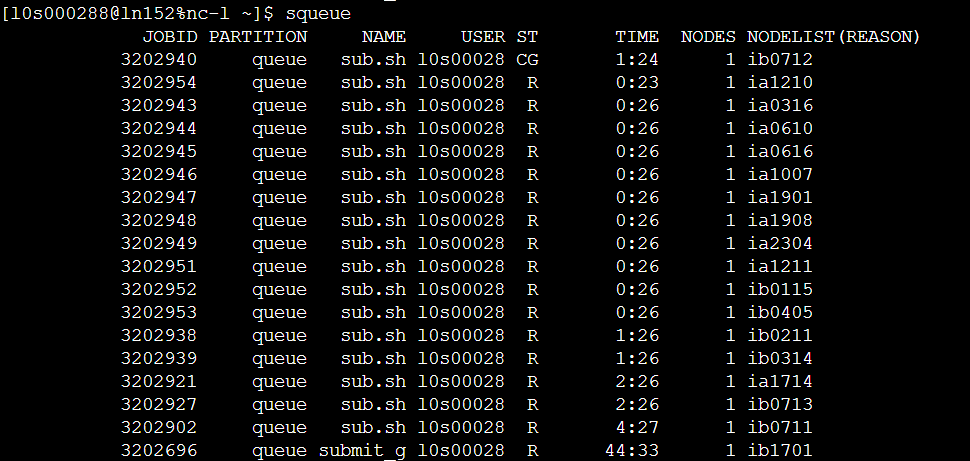

# 服务器操作

这里的经验都是我基于超算中心的服务器写的,也许用本地的服务器会稍微不同一些.一般来说,在shell页面可以执行一些简单的命令,例如我可以执行量子化学计算,运行python程序,但是,这些计算都不能用到超算中心的资源,是相当慢的.

## 提交作业

为了充分利用超算中心的资源,我们需要利用shell脚本提交作业,即.sh文件,一个简单的运行Gaussian的脚本文件为:

```shell
#!/bin/bash
#SBATCH -p queue
#SBATCH -N 1
#SBATCH -n 1
#SBATCH -c 48wsl --install -d Ubuntu
#export PGI_FASTMATH_CPU=sandybridge

export COM_DIR=~/software-l0s000288/g16
export g16root=$COM_DIR
export PATH=$g16root:$PATH
source $g16root/bsd/g16.profile
export GAUSS_SCRDIR=/public1/home/l0s000288/software-l0s000288/gaussian16-test/tmp
export GAUSS_EXEDIR=$g16root

srun g16 $1
```
第一行`#!/bin/bash`告诉系统这是一个脚本文件,系统会用bash解释器来解释这个文件.

下面几行就是配置计算资源,`#SBATCH`是一个特殊命令(但是# ...就代表注释),`-p queue`指定提交的队列,`-N 1`指定使用一个节点,`-n 1`指定使用一个任务,`-c 48`指定使用48个核心.(不满核提交按照满核计费)

下一行就是配置环境,为了告诉系统Gaussian在哪里,方便我们可以调用.

最后一行`srun g16 $1`就是提交作业,`$1`是脚本文件的第一个参数,在bash中我们会运行`sbatch sub.sh a.gjf`来提交作业.a.gjf就会传入到`$1`中.和`srun g16`组合起来，直接使用g16命令也能运行，但是这会导致超算无法正确分配资源。

这就是提交作业的办法,通常我们不能让超算直接运行bash命令,都需要通过脚本提交,否则会出现难以预料的问题.

## 执行批量计算

批量计算的执行可以通过在本地运行shell脚本或者python脚本然后不断提交作业来进行,也可以把这个本地脚本提交到服务器上让他自动提交.

有一个问题是,有的时候管理员没给权限,能提交的任务个数是有限的,一旦超过这个数目,就要报错.

所以就可以间隔一段时间提交,例如,出现提交报错的时候我就让这个脚本休眠多少时间然后反复提交,这样就能解决这个问题.

例如可以在python脚本中写:

```python
if retries < max_retries:
            print(f"Retrying in {retry_interval} seconds...")
            time.sleep(retry_interval)  # 等待一段时间再重试
        else:
            print(f"Max retries reached for {input_file}. Moving to next task.")
```

他会在最大提交次数内不断尝试间隔提交,如果依旧失败就执行下一个文件的计算,这个尝试的时间间隔应该长一点.

当然,如果管理员有给权限的话就可以执行大批量提交了,提交计算的脚本可以直接在shell上运行,不需要额外提交这个脚本(如果有别的耗时的操作,也需要提交这个脚本).

使用`squeue`命令,可以查看当前的作业状态:



可以看到全部都在算，标注为R的即表示正在运行，CG则是正在退出，PD是等待中，往往是超算正在配置资源或者节点不足正在等待中，可以使用`sinfo`命令查看节点的分配情况,显示为`idle`的即为空闲节点.

## 提交作业的脚本

我使用的是python脚本,一个简单的框架就是使用os读取文件夹中的文件,使用os创建文件夹中的文件,使用`subprocess.call`提交(为什么不用`run`,因为超算上的py版本很奇怪,为了稳妥起见就没有用run).

```python
#!/usr/bin/env python3
# -*- coding: utf-8 -*-

import os
import subprocess
import time

# 输入和输出目录
input_dir = 'inputs_opt'
output_dir = 'outputs_opt'


def is_gaussian_completed(output_file):
    """检查Gaussian计算是否已完成"""
    try:
        with open(output_file, 'r') as f:
            content = f.read()
            return "Normal termination of Gaussian" in content
    except:
        return False

# 创建输出目录（如果不存在）
if not os.path.exists(output_dir):
    os.makedirs(output_dir)

# 获取所有的输入文件
input_files = [f for f in os.listdir(input_dir) if f.endswith('.gjf')]

# 处理每个输入文件
for input_file in input_files:
    input_path = os.path.join(input_dir, input_file)
    output_basename = os.path.splitext(input_file)[0]
    output_path = os.path.join(output_dir, output_basename)

    # 创建每个计算的输出目录（如果不存在）
    if not os.path.exists(output_path):
        os.makedirs(output_path)

    # 输出文件的路径（Gaussian 输出文件）
    output_file = os.path.join(output_path, '{}.out'.format(output_basename))

    # 检查输出文件是否存在且计算已完成
    if os.path.exists(output_file) and is_gaussian_completed(output_file):
        continue

    print('We are now processing {}'.format(input_file))

    # 如果文件不存在，创建空文件并设置权限
    if not os.path.exists(output_file):
        with open(output_file, 'w') as f:
            pass
        os.chmod(output_file, 0o666)


    command = "sbatch sub.sh {} {}".format(input_path, output_file)

    try:
        # 使用 subprocess.call() 执行命令
        return_code = subprocess.call(command, shell=True)

        # 检查命令的返回码，0 表示成功
        if return_code != 0:
            print(f"Error: Command failed with return code {return_code}. Retrying...")
        else:
            print(f"Gaussian calculation for {input_file} completed successfully.")
    

    except Exception as e:
        print(f'An unexpected error occurred: {e}')
        

print('All tasks are finished.')
```
