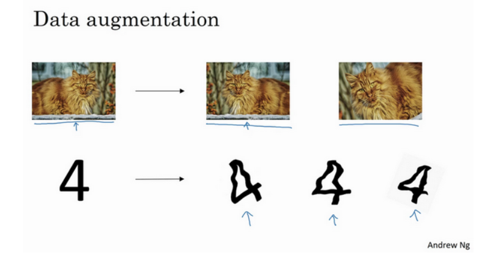
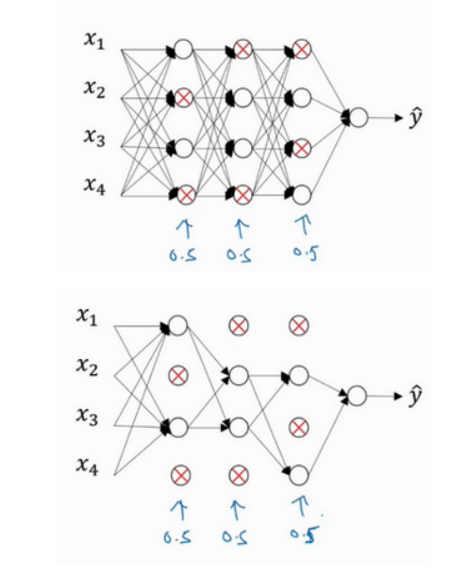

# 减少过拟合的方法

过拟合在绝大多数场景中都会出现并且无法避免,所以我们需要一些技术来缓和过拟合带来的问题,一个很直观的想法就是获取足够多的数据,只要数据足够多足够准确,我们就不用惧怕过拟合带来的影响.

## 数据增强

数据增强技术就是一种扩充数据集的方法,主要应用于图像识别领域.由于卷积神经网络读取的是图片的像素,所以将图片翻转,裁剪,对称,变形,调明暗程度都会生成一张全新的图片,对神经网络来说,这就是一个全新的输入,这样就起到了扩充数据集的作用:



## L1,L2正则化

为了在训练的过程中降低某些无关紧要的参数的影响,可以采用惩罚这个特征前面的系数的方法来实现,这就是正则化.设想你在做一个热力学预测的神经网络,但是别人把你的数据偷偷改了,其中换成了辛普森家庭一年的用水量,显然这个特征和我的标签是毫不相关的,所以该特征前面的系数就应该是0,正则化就可以加速这个惩罚特征,在一定程度上使得某些神经元的w变为一个很接近0的数,起到了简化神经网络的效果.

L2使用的就是2范数,L1使用的就是1范数:

L2正则化:

$$
J(w,b)=\frac{1}{m}\sum_i L(\hat{y_i},y_i)+\frac{\lambda}{2m}\sum \left\| w \right\|_F^2
$$

L1正则化:

$$
J(w,b)=\frac{1}{m}\sum_i L(\hat{y_i},y_i)+\frac{\lambda}{2m}\sum \left\| w \right\|_1
$$

## Droupt out

droupt out就是随机失活技术,这也是一种考虑简化神经网络的技术,复杂的网络拥有更多的参数,更加容易过拟合.

在每一层我们设置一个droupt out概率,然后对于该层的每一个神经元,我们都会以等概率丢弃掉其中的某些神经元:



我们直观的来理解一下,droupt out使得每一个神经元都有一定的概率被清除,这样,每个神经元的存活与否都是受到威胁的,而单个神经元的功能往往是针对特定的特征输入进行响应,而每一次训练中随时有可能被清除就意味着模型会倾向于不去依赖某个特定的特征,从而实现的正则化的效果.

我们可以用python实现这个过程,首先需要指定一个保留概率`keep_prob=0.8`,然后生成随机向量:

```python
d3=np.random.rand(a2.shape[0],a3.shape[1])<keep_prob
```

接着将上一层的输出和这个随机向量逐元素相乘,就完成了对上一层输出的随机失活,但是,要注意的是,20%的元素被随机归为0了,那么向量中所有元素的均值会相应减小,这是不好的,为了满足尺寸一致性和归一性,还需要除掉保留概率以扩大均值:

```python
a3=np.multiply(a3,d3)
a3 /= keep_prob
```

在tensorflow中,可以很方便的实现droupt_out方法,只需要在layer后面加上一行`Droput(0.3)`,就可以以0.3的概率丢弃掉该层神经元的输出了.

## early stopping

early stopping即早停策略,在深度学习实践中,epoch的数量即神经网络浏览整个样本的次数,如果epoch太多,神经网络的迭代次数可能过多,越容易在训练集上过拟合,所以选择合适的epoch是有一定必要的,那么如何选择epoch呢.

一个常见的想法就是将数据集划分成为`traning_set`,`dev_set`,`test_set`然后再训练过程中观察开发集上的损失函数,如果在若干代数内代价函数都没有任何的改进的话,终止训练,并且将权重调整到在开发集上权重最好的一代.最后,再在测试集上做泛化误差的测试.

十分值得注意的是,千万不要在测试集上使用early-stopping,选择最好的epoch的过程就相当于对测试集做了一定的拟合,这是严重的学术不端行为.

```python
# 定义早停策略
early_stopping = EarlyStopping(
    monitor='val_loss',   # 监控的指标
    patience=3,           # 容忍多少个epoch没有改善
    restore_best_weights=True  # 恢复最佳权重
)

# 训练模型，应用早停策略
history = model.fit(
    x_train, y_train,
    validation_data=(x_val, y_val),  # 验证集
    epochs=50,                       # 最大epoch数
    batch_size=32,
    callbacks=[early_stopping]       # 加入早停策略
)
```

经过实践可以发现加了早停的效果通常没有不加早停的结果好看,所以一般我是认为选的epoch而不使用早停.


