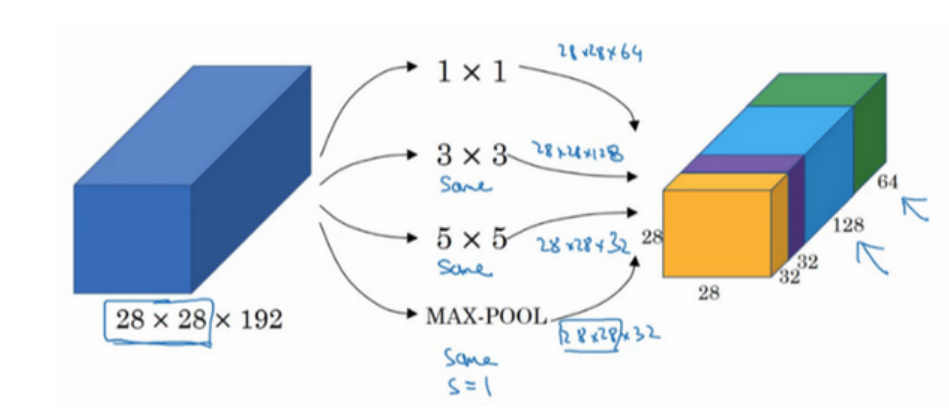
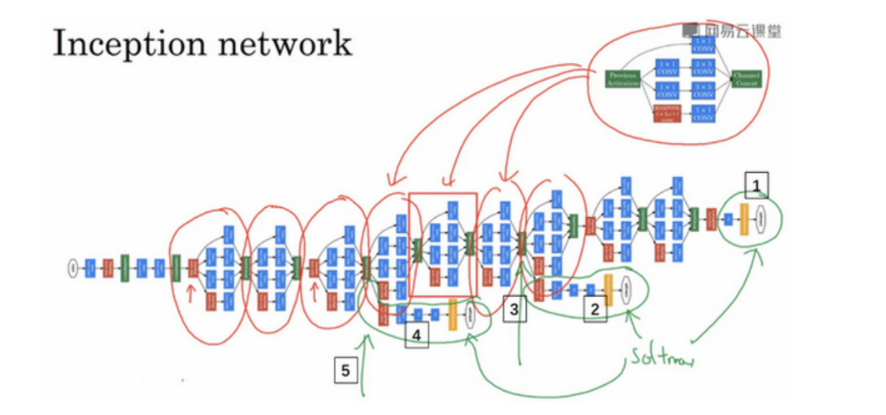
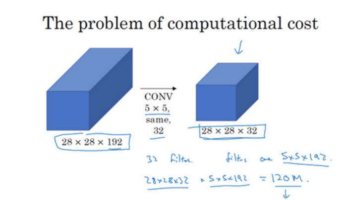
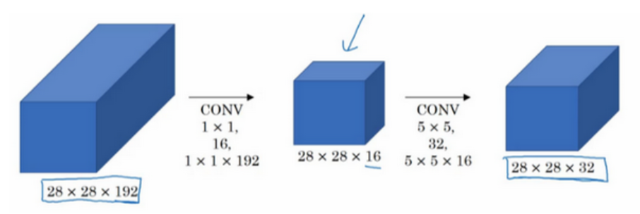

# Inception Network

很多时候我们不知道要用什么规格的过滤器,不知道是用池化还是卷积,但是,不必对此感到担忧,Inception Network就是为这个问题而设计的.

## Inception Layer

Inception Layer即同时在一层中使用多种神经元的网络层,我们可以同时使用多个规格的过滤器和池化层,使用same卷积来维持输出的规格一致,然后将所有模块的输出沿着通道堆叠起来.

Inception网络不需要人为决定使用哪个过滤器或者是否需要池化，而是由网络自行确定这些参数，你可以给网络添加这些参数的所有可能值，然后把这些输出连接起来，让网络自己学习它需要什么样的参数，采用哪些过滤器组合。

将所有这样的模块组合起来,就得到了Inception Network.

## 使用1x1卷积

1x1卷积可以非常有效的减小通道数,从而降低参数的量.

先来看这么一个例子:

如果直接对一个28x28x192的图片使用5x5x192的过滤器进行卷积,假设得到的输出是28x28x32,那么需要计算的乘法的次数就是$28 \times 28 \times 32\times 5 \times 5 \times 192 = 1.2 \times 10^9$次.

这是一个相当庞大的计算次数,但是如果我们在中间加上16个1x1x192的过滤器,再使用5x5x32的过滤器进行same卷积

那么,所需要计算的乘法的次数就只有:

$
28 \times 28 \times 16 \times 192 + 28 \times 28 \times 32 \times 5 \times 5 \times 16 \approx 1204w
$

计算量大约降低了100倍,这可以大大加快网络的训练速度.

