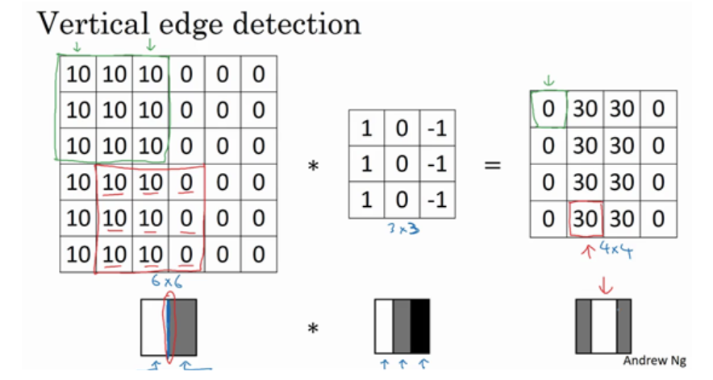
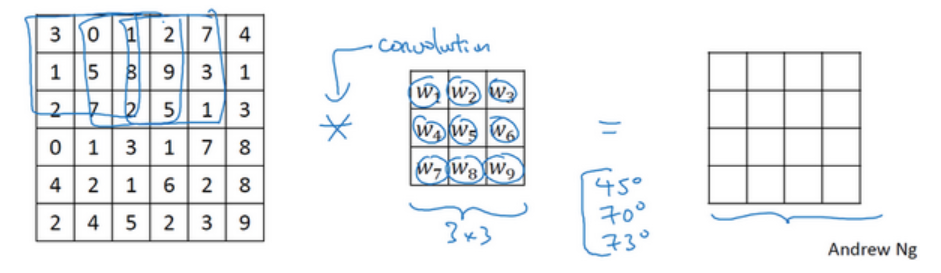
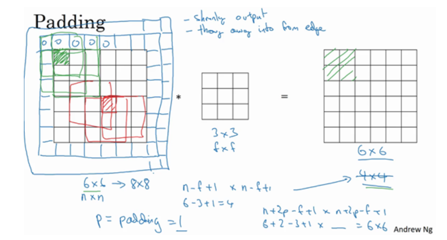
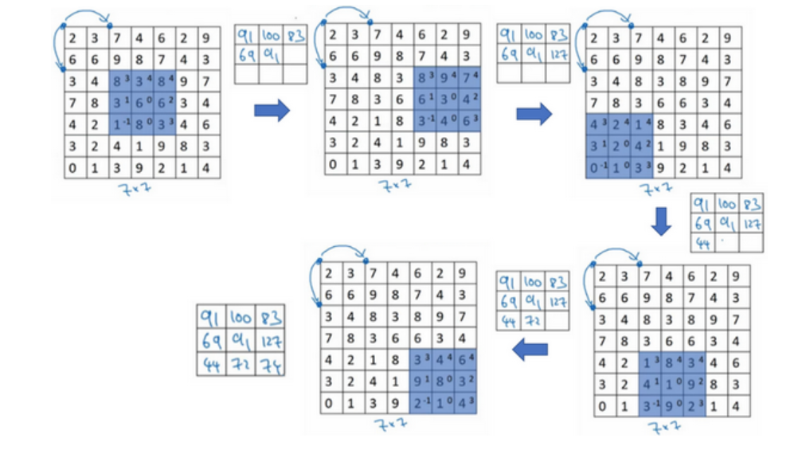
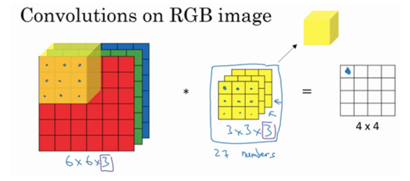
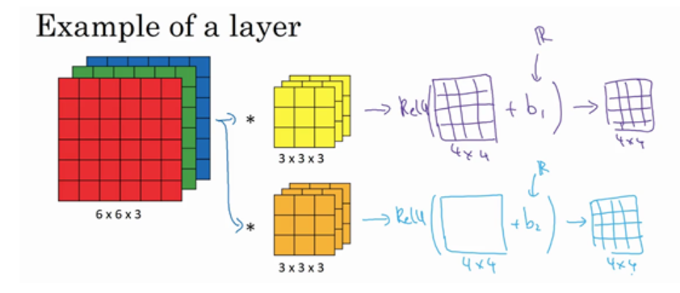
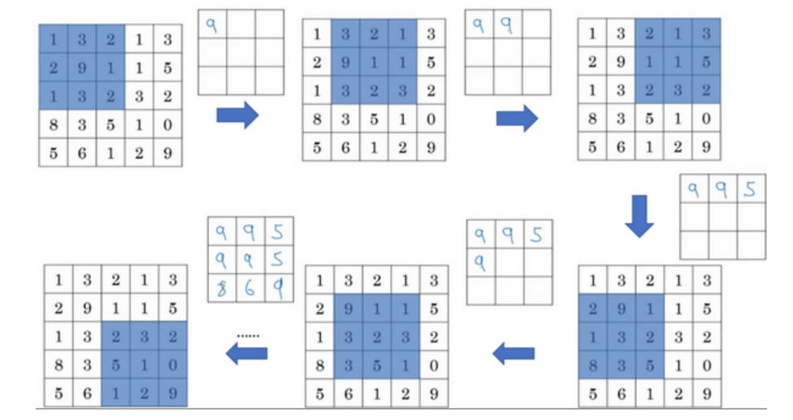
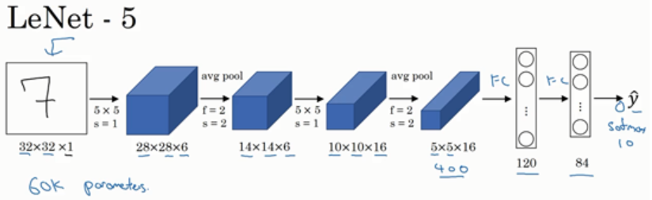
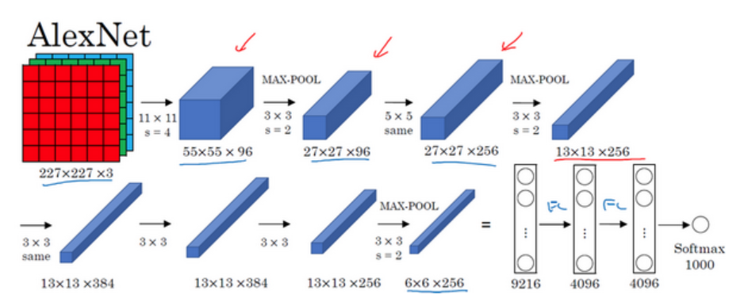
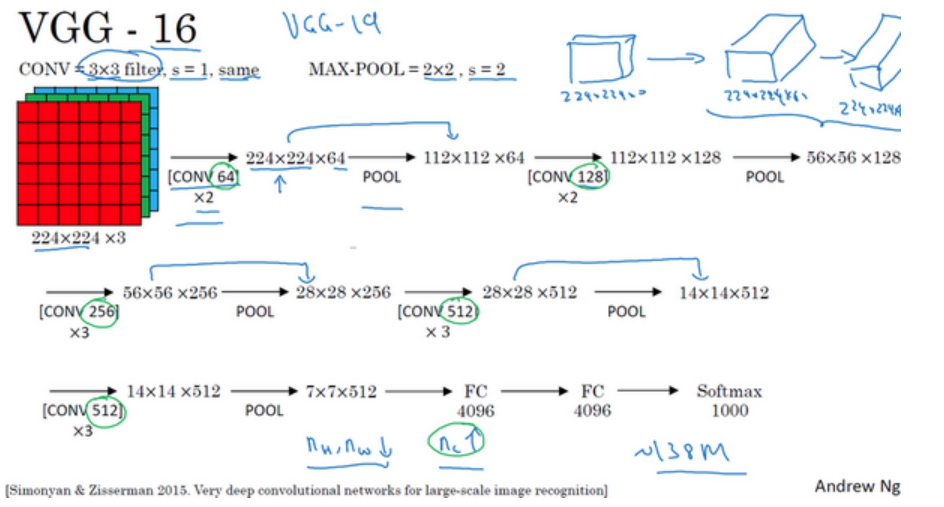

# 卷积神经网络

## 边缘检测示例

卷积核或者说过滤器(filter)是边缘检测的一个强大工具,一个图像通过卷积操作后得到的图可以清楚的展现边缘特征:



具体的操作方式是,将卷积核与图像的每个像素点进行点积运算,得到最后的图的一个像素点,然后滑动卷积核,不断重复这个操作,直到得到最后的图.

这样竖直的卷积核可以检测出垂直的边缘,水平的卷积核可以检测出水平的边缘,使用不同的过滤器可以提取不同的特征.

卷积神经网络的核心思想就是,将过滤器的每个元素的值作为参数进行训练,让网络自己找到应该提取什么参数:



## Padding

Padding即为填充,他是为了解决两个问题而设计的,一个是,我们可以看到,最左上角的像素点只被卷积过一次,而非边缘的像素点参与了多次卷积运算,这会导致边缘信息的丢失.



另一个问题是,经过一次过滤之后,原先图像会变小,这相当于进行了信息压缩,如果网络很深,最后得到的图像会很小,padding可以有效避免这种情况.一般来说,0填充用的比较多.

最后得到的图像的尺寸是$[n+2p-f+1,n+2p-f+1]$

## 卷积步长（Strided convolutions）

卷积核滑动的时候,可以不一格一格的滑动,可以一次跳两格,三格,这就是卷积步长.



最后得到的图像的尺寸是$\left\lfloor \frac{n+2p-f}{s} \right\rfloor +1\times\left\lfloor \frac{n+2p-f}{s} \right\rfloor +1$

## 三维卷积（Convolutions over volumes）

很多彩色图片用一个像素值是不能描述的,需要用RGB三个通道来描述,所以三维卷积就是对三个通道分别进行卷积,然后相加.



## 卷积层

将获得的矩阵逐元素加上偏置b,再逐元素通过激活函数运算,就得到了一个简单的卷积层:



过滤器有点像是MLP中的神经元的一部分,其执行的是系数运算,所以卷积层可以看作是MLP的特殊形式.

## 池化层（Pooling layers）

池化可以看做是某种简单的降维操作,其目的是为了降低计算量,提取显著特征,减少过拟合等.

常见的池化有两种,最大池化(Max Pooling)和平均池化(Average Pooling),一般来说,Max Pooling用的比较多.



池化和卷积类似,都是一个窗口在滑动,最大池化是取窗口内的最大值,平均池化是取窗口内的平均值.

从池化层的逻辑来看,我们显著发现,其没有任何需要学习的参数,不改变通道数,只对图的大小进行特征降维.

## 在tensorflow中搭建一个卷积神经网络

和MLP类似,我们可以使用Sequential构建一个简单的线性网络结构:

```python
model = models.Squential([
    layers.Conv2D(filters=32, kernel_size=(3,3), strides=(1,1), padding='same'),
    layers.MaxPooling2D(pool_size=(2,2), strides=(2,2)),
    layers.Conv2D(filters=64, kernel_size=(3,3), strides=(1,1), padding='same'),
    layers.MaxPooling2D(pool_size=(2,2), strides=(2,2)),
    layers.Flatten(),
    layers.Dense(10, activation='softmax')
])
```

通过`Conv2D`来构建一个卷积层,指定过滤器个数`filters`,卷积核大小`kernel_size`,步长`strides`,填充`padding`.(这样的填充方式只有`same`和`valid`两种,并且均为对称填充).

`strides`可以指定在两个方向上的步长,更加灵活.

那这样获得的图像尺寸实际上是:

$$
\left\lfloor \frac{n_{H}+2p_H-f}{s} \right\rfloor +1\times\left\lfloor \frac{n_{W}+2p_W-f}{s} \right\rfloor +1
$$

在Conv2D后面可以加上卷积层`MaxPooling2D`,指定池化窗口大小`pool_size`,步长`strides`.

最后再展平加上全连接层.

无论是多通道的还是单通道的都是怎么写,无非多通道的时候需要指定输入的形状,之后都会自动计算:

```python
layers.Conv2D(filters=32, kernel_size=(3,3), strides=(1,1), padding='same', input_shape=(224, 224, 3)),
```
## 经典卷积神经网络







一个通用的规律是,随着网络的加深,图像的尺寸会越来越小,通道数会越来越多.