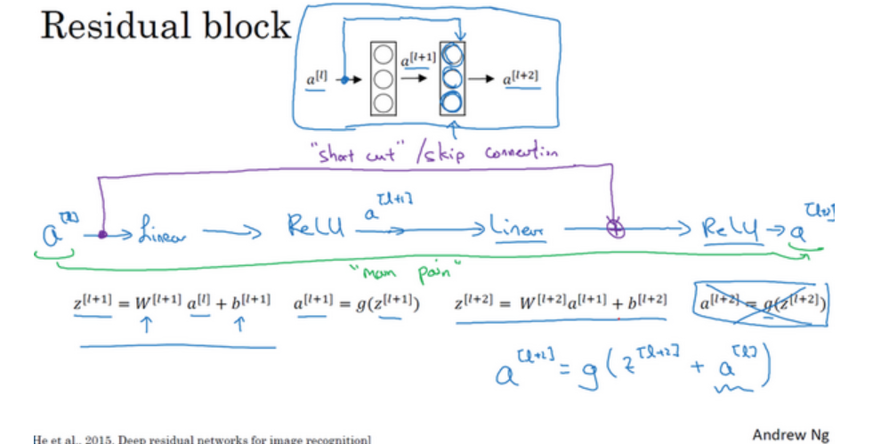
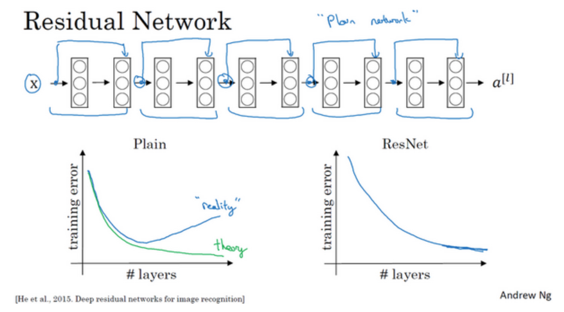
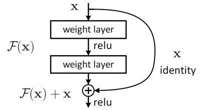

# 残差网络

残差网络是为深度神经网络发明的,当网络足够深的时候,非常容易出现梯度爆炸和梯度消失的问题,通过跳跃连接的办法,它可以从某一层网络层获取激活，然后迅速反馈给另外一层，甚至是神经网络的更深层。这样可以实现梯度信息的有效传递,有利于我们训练更深的网络.

## Residual Block

我们来看一个基本的残差块的运行逻辑是什么样的.

以一个非常简单的前向传播为例:

$$
\begin{aligned}
z^{[l+1]} = w^{[l+1]}a^{[l]} + b^{[l+1]}\\
a^{[l+1]} = g(z^{[l+1]})\\
z^{[l+2]} = w^{[l+2]}a^{[l+1]} + b^{[l+2]}\\
a^{[l+2]} = g(z^{[l+2]})\\
\end{aligned}
$$

我们希望最后一层的输出直接受到第一层输出的影响,所以我们可以引入一个跳跃连接,将第一层的输出直接传递给最后一层.

$$
a^{[l+2]} = g(z^{[l+2]} + a^{[l]})
$$

值得注意的是,由于每层神经元的不同,第一层的输出和最后一层激活函数的输入大概率是维度不匹配的,所以不能直接相加,引入一个权重矩阵$W_s$来调整维度.

$$
a^{[l+2]} = g(z^{[l+2]} + W_s a^{[l]})
$$

这个权重矩阵在CNN中可以是一个矩阵,在MLP中,这其实就是一个多的隐藏层,通过这个隐藏层将其映射到低维(高维).很明显,其是一个可学习参数.

## ResNet

将一个个残差块堆叠起来就得到了残差网络:

他可以使我们训练更大,更深的网络,如果没有ResNet,网络的复杂性会大大提高欠拟合的风险.

## 为什么ResNet有效

来看这样一张图:

中间的这两层是我们新插入的层.假设说,没有这两层的时候,预测的准确率是98%,如果加了两层后,效果要一样好,那么这两层要学到什么样一个关系呢,没错,就是恒等映射:

$$
F(x) = x
$$

然而,想要网络学习到恒等映射不是一件容易的事情,ResNet通过跳跃连接和巧妙的权重初始化就能解决这个问题,将输出直接跳跃输入到两层以后,这样就不需要中间两层去学习恒等映射关系,就可以达到和小网络一样的预测效果,中间的两层只负责学习残差部分,这样就有效降低了学习的困难程度,这是ResNet有效的原因.

