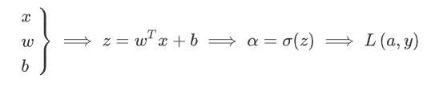

# 反向传播算法

## logistic回归中的反向传播算法

为了直观的理解反向传播,以logistic回归为例:

在神经网络中,w和b是比较深层的参数,而想要根据梯度下降更新w或者b就需要求代价函数对参数的偏导:

$$
w=w-\alpha dw=w-\alpha\frac{\partial \mathcal{L}}{\partial w}
$$

然而,这个导数通常是不好求解的,因为w是一个深层的嵌套的参数,所以考虑使用复合函数求导法则去找到这个导数值,这就是反向传播的核心思路.

以logistic回归为例,我们想要更新w和b,但是其不是损失函数的显式变量,其显式变量是预测值$\hat{y}=a$:

$$
\mathcal{L}(a,y)=\sum_i -y_i\log a_i=-y\log a-(1-y)\log (1-a)
$$

故:

$$
da_i=\frac{\partial L}{\partial a}=-\frac{y}{a}+\frac{1-y}{1-a}
$$

可以比较容易的计算,下一步:

$$
dz=\frac{\partial \mathcal{L}}{\partial z}=\frac{\partial \mathcal{L}}{\partial a}\frac{\partial \mathcal{a}}{\partial z}=g'(z)da
$$

再下一步:

$$
dw=\frac{\partial \mathcal{L}}{\partial w}=\frac{\partial \mathcal{L}}{\partial a}\frac{\partial \mathcal{a}}{\partial z}\frac{\partial \mathcal{z}}{\partial w}=xg'(z)da
$$

这样就通过一种反向传播的手段计算出了w参数的更新量.

## 神经网络中的反向传播

logistic中的梯度下降给了我们一种反向传播的直觉,而神经网络中的BP算法要复杂的多,由于涉及到大量变量,我们往往采用矩阵和向量的形式进行计算.

