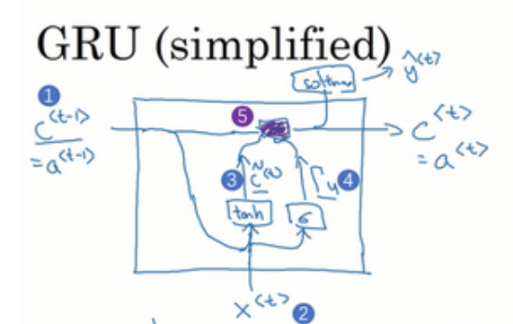

# GRU门控单元

## RNN的困境

由于RNN复用了很多遍相同的神经元,其很容易产生梯度消失或者梯度爆炸的问题,梯度爆炸一定程度上可以用梯度裁剪来缓解,而梯度消失则需要类似残差连接的方式来使得梯度传递到更深的计算图中,即网络可以记住序列之前的信息.

GRU(Gated Recurrent Unit)门控单元就是为了解决梯度消失的问题而提出的,其提供了一种特殊的门控机制,可以选择性地决定哪些信息应该被保留下来,哪些信息应该被忽略掉.

## GRU的结构

为了使得序列前段的信息可以被网络记住,GRU提出了一种特殊的门控机制,通过更新门,网络可以自行决定应该记住多少的老旧信息.

我们可以将初始的激活值a赋予一个变量c,即记忆细胞cell:

$$
c^{<0>}=a^{<0>}
$$

然后使用前一个激活值和当前的输入值贡献候选值:

$$
\widetilde{c}^{<t>}=tanh(W_{c}[c^{<t-1>},x^{<t>}]+b_c)
$$

使用前一个激活值和当前输入值贡献门控值:

$$
\Gamma^{<t>}_u=\sigma(W_{g}[c^{<t-1>},x^{<t>}]+b_u)
$$

然后使用门控制和候选值计算当前的激活值:

$$
c^{<t>}=\Gamma^{<t>}_u\widetilde{c}^{<t>}+(1-\Gamma^{<t>}_u)c^{<t-1>}
$$

这样,网络就可以自主决定保留多少的老旧信息,以达到最佳的预测效果.

更加完整的GRU还包含了一个衡量相关性的门控,其决定候选值和之前的激活值具有多少的相关性,加上这个gate之后,完整的结构为:

$$
\begin{aligned}
&\widetilde{c}^{<t>}=tanh(W_{c}[\Gamma_r^{<t>} c^{<t-1>},x^{<t>}]+b_c)\\
&\Gamma^{<t>}_u=\sigma(W_{g}[c^{<t-1>},x^{<t>}]+b_u)\\
&\Gamma^{<t>}_r=\sigma(W_{r}[c^{<t-1>},x^{<t>}]+b_r)\\
&c^{<t>}=\Gamma^{<t>}_u\widetilde{c}^{<t>}+(1-\Gamma^{<t>}_u)c^{<t-1>}
\end{aligned}
$$