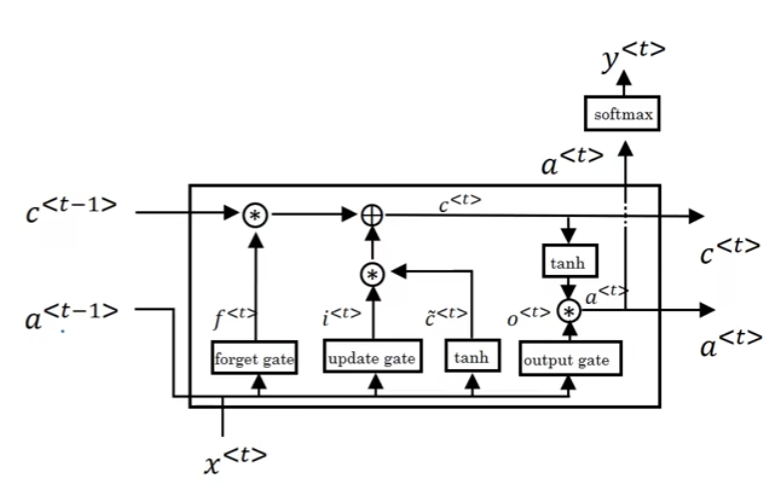
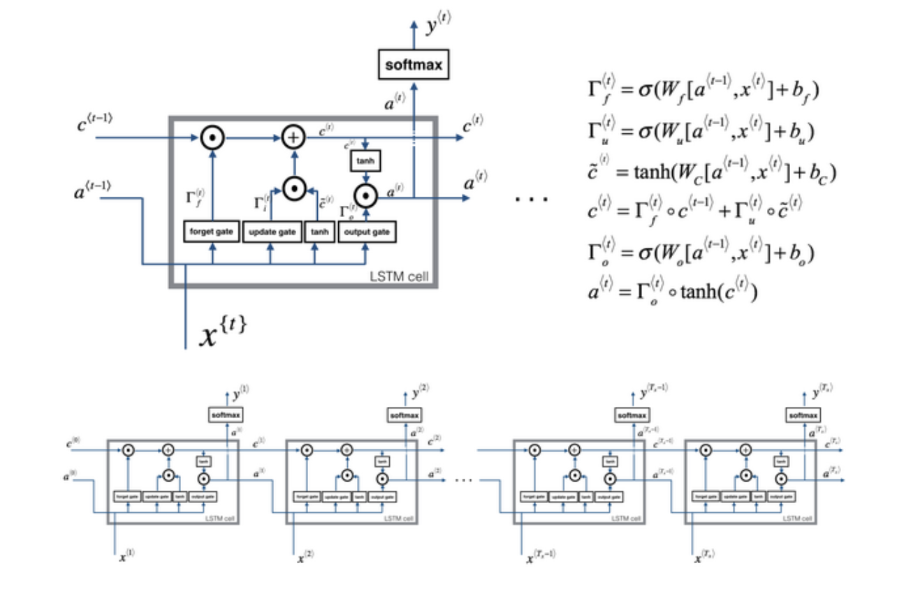

# LSTM

LSTM即Long Short-Term Memory，长短期记忆网络，其和GRU类似,都是为了解决长期依赖问题。

不同于GRU的是,LSTM有3个门,结构更加复杂,但是大体思路是不变的.

## LSTM的结构

LSTM存在3个门,分别是更新门,遗忘门和输出门,并且c这个时候不再代替a的位置,而是作为一个辅助变量存在.

首先,三个门的值都根据当前的输入和上一个激活值计算得到:

$$
\begin{aligned}
\Gamma^{<t>}_u&=\sigma(W_{u}[c^{<t-1>},x^{<t>}]+b_u)\\
\Gamma^{<t>}_f&=\sigma(W_{f}[c^{<t-1>},x^{<t>}]+b_f)\\
\Gamma^{<t>}_o&=\sigma(W_{o}[c^{<t-1>},x^{<t>}]+b_o)
\end{aligned}
$$

候选值的计算和GRU类似,但是,其不再依赖于上一级输入的候选值,而是仅仅只依赖于当前的输入值和上一个激活值:

$$
\widetilde{c}^{<t>}=tanh(W_{c}[c^{<t-1>},x^{<t>}]+b_c)
$$

然后,记忆变量c的更新就可以用更新门,遗忘门和候选值来计算:

$$
c^{<t>}=\Gamma^{<t>}_u\widetilde{c}^{<t>}+\Gamma^{<t>}_f c^{<t-1>}
$$

最后,当前的激活值a就可以使用输出门和c来计算:

$$
a^{<t>}=\Gamma^{<t>}_o tanh(c^{<t>})
$$

**长短期记忆机制**

1. **长期记忆** ：
   - 通过记忆单元 $c^{<t>}$ 实现，它像一条传送带一样贯穿整个序列
   - 遗忘门 $\Gamma^{<t>}_f$ 控制历史信息的保留程度
   - 更新门 $\Gamma^{<t>}_u$ 控制新信息的写入程度
   - 这种设计使得重要的历史信息可以在很长的序列中被保存

2. **短期记忆** ：
   - 通过隐藏状态 $a^{<t>}$ 实现
   - 输出门 $\Gamma^{<t>}_o$ 控制当前时刻需要输出的信息
   - 主要关注当前时刻的任务相关信息

3. **信息流控制** ：
   - 遗忘门：决定丢弃哪些历史信息
   - 更新门：决定添加哪些新信息
   - 输出门：决定输出哪些信息
   - 这种精细的控制机制使得 LSTM 能够在长序列中有选择地记住和遗忘信息

