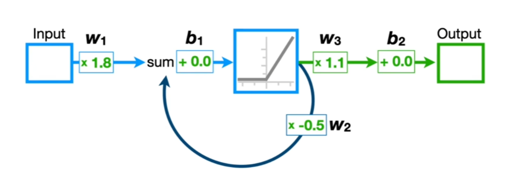
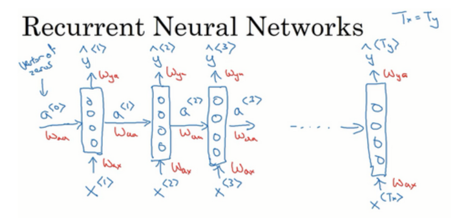
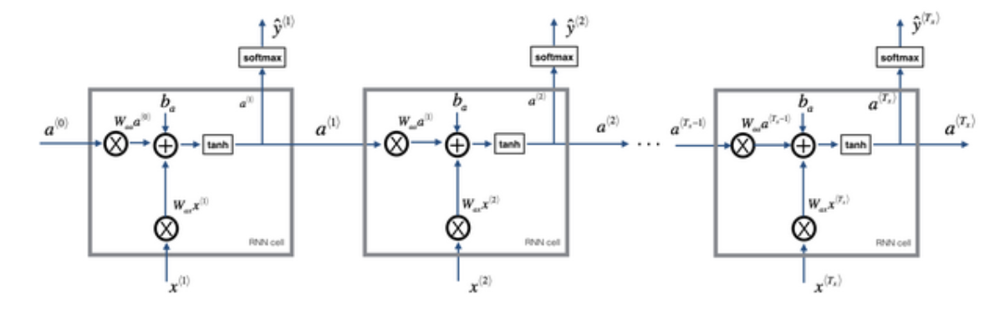
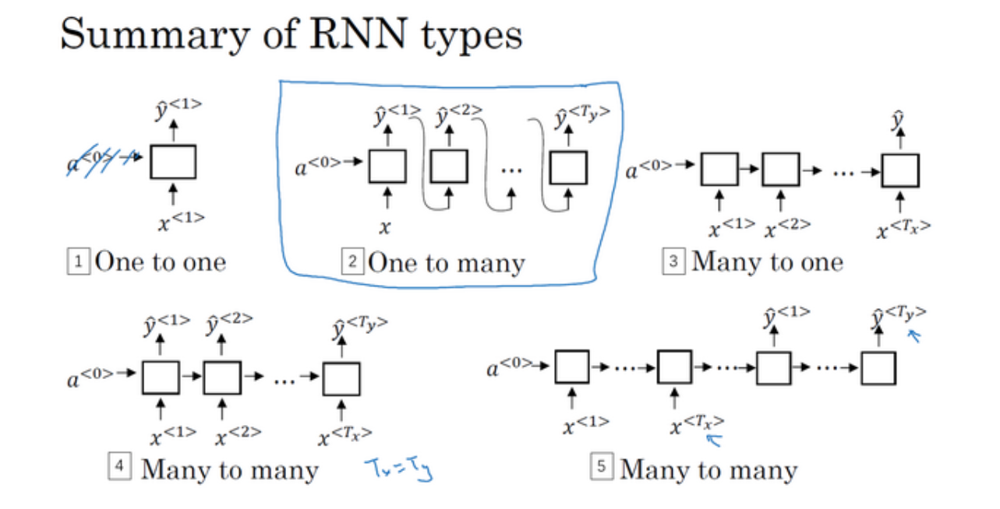
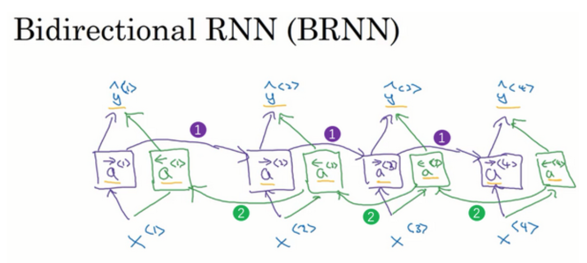
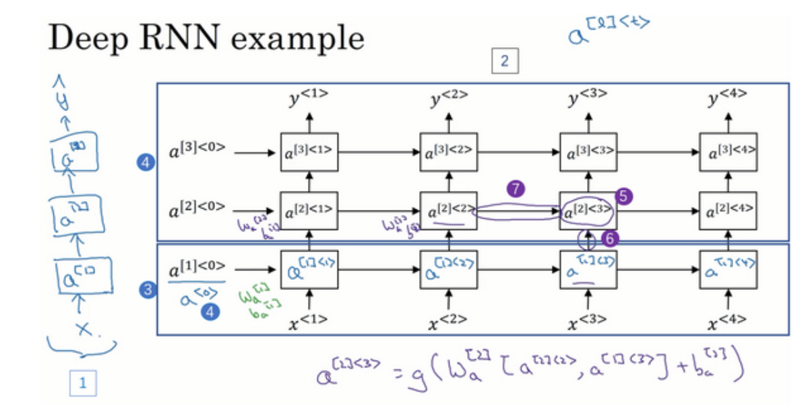

# 循环神经网络

为了更加便捷的处理不等长的序列数据,我们需要引入一种新的神经网络架构--RNN(Recurrent Neural Network).

良好的结构设计可以更好的捕捉序列数据的特征,并且尽可能的节省参数.

## RNN的结构

不同于普通神经网络的是,RNN在激活函数之后加上了一个循环链接,下一个输入的数据会受到上一个输入的激活值的影响,一个序列的所有值被依次输入到同一个神经网络中,他们共享参数,并且通过延迟循环建立序列数据之间的联系,这就是循环神经网络.

很明显可以发现这个神经网络可以无视序列数据的长度,不同的长度仅仅只是循环次数的不同,而共享的都是同一套参数.

RNN更常见的的表现形式是展开的计算图:

循环被拆解为输入到一个全同的神经网络中,并且这个神经网络接受序列数据的第二个值作为输入,同时产生新的激活值输出到下一层.

## 符号说明

在进行下一步之前,我需要做一些符号说明.

我们认为,样本用x表示,上标的 $<j>$ 表示是这个样本的第几个片段,所以,第i个样本的的第j的片段的编码就可以表示为:$x^{(i)<j>}$,这个编码通常是使用词典进行的,而编码方式是one-hot编码,对于一句话,我们会得到一个很长的稀疏的向量,这就是为什么普通的MLP无法处理序列数据的原因,一个是因为过高的维度需要太多的参数,另一个是因为序列数据的长度是不定的,padding会浪费很多的计算资源.

$T_x$代表x序列数据的长度,$T_y$代表输出的特征的长度,$a^{<j>}$是第j个片段的激活值,$y^{<j>}$是第j个片段的输出值.

## 前向传播

我们用数学符号来代表这个前向传播的过程,为了简化起见,假设该神经网络由两个神经元简单的构成,一个用来激活循环值,另一个用来输出.

首先使用上一个激活值和当前的输入值来计算当前的激活值:

$$a^{<t>}=g_1(W_{aa}a^{<t-1>}+W_{ax}x^{<t>}+b_a)$$

然后使用当前的激活值来计算当前的输出值:

$$y^{<t>}=g_2(W_{ya}a^{<t>}+b_y)$$

或者可以简化写成等价的过程,将上一个激活值和当前输入值拼接后再进行激活:

$$
\begin{aligned}
&a^{<t>} = g_1(W_{a}[a^{<t-1>},x^{<t>}]+b_a) \\
&y^{<t>} = g_2(W_{y}a^{<t>}+b_y)
\end{aligned}
$$

反向传播就不管了,只要能写出前向传播就能写出代码.

## 不同类型的循环神经网络

这些神经网络主要用于不同的应用场景：

1. **Many to One** ：
   - 输入是序列，输出是单个值
   - 典型应用：情感分析、文本分类
   - 例如：分析一段文字的情感倾向

2. **One to Many** ：
   - 输入是单个值，输出是序列
   - 典型应用：音乐生成、文本生成
   - 例如：给定一个主题，生成一段文字

3. **Many to Many (同步)** ：
   - 输入序列长度等于输出序列长度
   - 典型应用：命名实体识别、词性标注
   - 例如：为每个输入单词标注词性

4. **Many to Many (异步)** ：
   - 输入序列长度与输出序列长度可以不同
   - 典型应用：机器翻译、语音识别
   - 例如：将一段英文翻译成中文

每种类型的 RNN 结构都针对特定的序列处理任务进行了优化，选择合适的结构对于解决具体问题至关重要。

## 双向循环神经网络

很多时候,判断句中一个词的含义往往需要结合上下文,而普通的RNN只能看到前面的信息,这是因为其只接受来自历史文本的激活值,一个很直白的想法是,如果我们一开始就有了完整的句子,那么我们可以正着读一遍句子,也可以反着读一遍,这样,任何一个词都可以看到前后的信息,这就是双向循环神经网络.

在原先的基础上,输出值不再由正向的激活值决定,而是由正向和反向的激活值共同贡献.

$$
y^{<t>}=g(W_{y}[\overleftarrow{a}^{<t>},\overrightarrow{a}^{<t>}]+b_y)
$$

## 深度循环神经网络

实际上就是把网络加深,然后划分出一个个块加上循环的延时连接,这就构成了深度循环神经网络.

其展开的计算图呈现规则的网格状结构:

