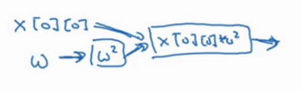

## 使用tensorflow进行优化

tensorflow是常见的深度学习框架,可以非常便利的实现一个深度学习模型

!!! note "文档"

    [官方文档](https://www.tensorflow.org/tutorials?hl=zh-cn)

训练本质上是一个优化的过程,那么tensorflow自然可以执行高效优化的任务,使用tensorflow优化的好处是,其可以利用gpu进行加速,并且该库内部对数据结构进行了优化,使得计算更加高速.

```python
import tensorflow as tf
import numpy as np

# 定义变量
w = tf.Variable(0,dtype=tf.float32)
```
我们需要指定变量的初值和其数据类型.

然后就可以指定代价函数:

```
cost = tf.add(tf.add(w**2,tf.multiply(-10,w)),25) 
# cost = (w-5)**2
```
tensorflow内部是内置了基础的运算符的,第一种写法相当于生成了一个具有多个节点的计算图,而第二种方式会被tensorflow重载为一个计算节点.所谓的计算图,就是将运算像图的结构一样列出来:



也可以这么写,好处是更改代价函数系数的时候不用重载计算图,坏处是性能有一定损失.

```python
# coefficient = np.array([[1.],[-10.],[25.]])
# x= tf.placeholder(tf.float32,[3,1])
# cost = x[0][0]*w**2-10*w+25
```

设置优化求解器:

```python
# 定义优化求解器
# 这个写法在tensorflow2.x中被重构了,优化求解器要从keras中导入
# optimizer = tf.train.GradientDescentOptimizer(0.01).minimize(cost)
optimizer = tf.keras.optimizers.SGD(learning_rate=0.01) # 随机梯度下降
```

在tf.2x版本中,无需显式初始化,变量一被定义就会自动注册,在2.x中,为了实现反向传播的梯度计算,我们需要记录计算图的所有中间值,所以一次完整的梯度下降就可以写成:

```python
def train_step():
    with tf.GradientTape() as tape:
        cost = (w - 5)**2
    gradients = tape.gradient(cost, [w])
    optimizer.apply_gradients(zip(gradients, [w]))
```
GradientTape是一个自动微分工具,记录其作用域内所有可训练变量的运算,可以设置参数`persistent=False`在梯度用完后,立即释放内存.梯度更新需要和变量相匹配,这是zip函数的作用,当有两个变量的时候:

```
grads = tape.gradient(cost,[w1,w2])
```
optimizer需要接受[梯度,变量]组成的列表:

```python
optimizer.apply_gradients(
    zip(grads,[w]) # [(grad_w1,w1),(grad_w2,w2)]
)
```

执行梯度下降,通常采用双重约束,即最大迭代次数和容差约束.抵达最大迭代次数或者梯度收敛即可终止,梯度从train_step函数中获取:

```python
for epoch in range(1000):
    # 执行单个训练步骤
    grad = train_step()
    
    # 打印当前参数值
    current_w = w.numpy()
    print(f"Epoch {epoch+1}: w = {current_w:.2f}")
    if epoch+1 == 300 or np.linalg.norm(grad)<1e-6:
        break
```

