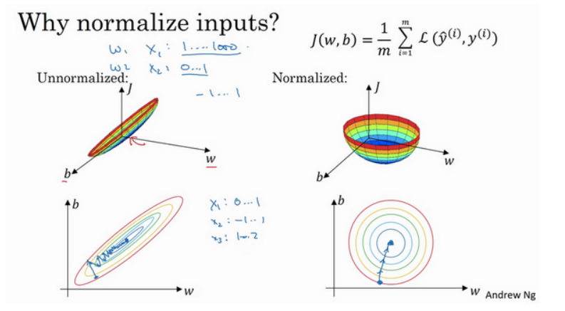
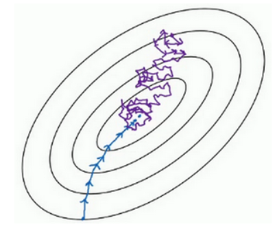
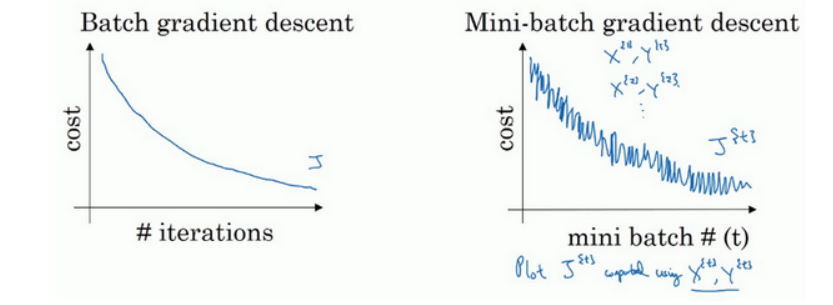
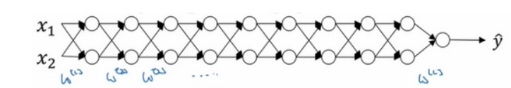
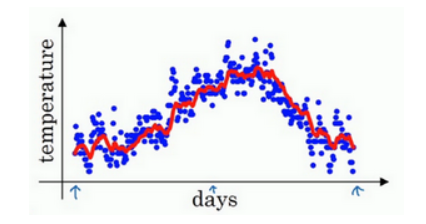
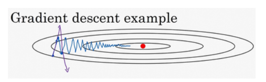
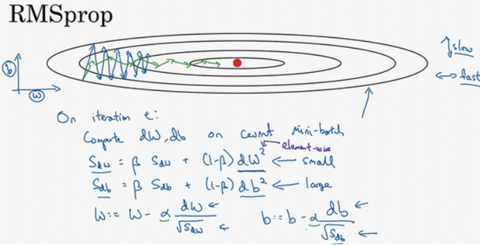

# 加速神经网络的训练

## 归一化

归一化的目的是为了加速梯度下降,通过将数据归一化处理,我们可以很快的收敛到极小值:



$$
\begin{aligned}
x=\frac{x-\mu}{\sigma} \\
\end{aligned}
$$

## mini-batch

mini-batch即小批量梯度下降,在面对几万甚至几百万的样本的时候,执行批量梯度下降是不现实了,因为要进行大量的求和操作,计算变得异常耗时,故可以将样本随机划分为一个个小批次,然后用这些小批次训练神经网络:



训练过程可能更像这个紫色的路径,并且代价函数随着epoch变换的曲线会出现局域的振荡:



## 梯度消失与爆炸



梯度消失和梯度爆炸是深层神经网络训练过程中遇到的一个很特别的问题,包括我自己实践过程中也经常遇到梯度爆炸的问题,从上述这个简单的深层神经网络我们可以来简单的理解一下.

假设每个神经元没有阈值(没有b),并且只有两个参数$w_1,w_2$,同时,激活函数是线性的,那么我们可以考虑数据在其中的正向传播过程:

可以得到神经网络的输出值为:

$$
\hat{y}=w^{[l]}w^{[l-1]}\cdots w^{[2]}w^{[1]}x
$$

这是一个指数型传递的过程,如果说w都长得像:

$$
w=
\begin{bmatrix}
    1.5,0\\
    0,1.5
\end{bmatrix}
$$

那么神经网络的输出将会爆炸,同理,如果网络参数的初始值都比较小,那神经网络的初始输出将会很小,不难发现,改变某些参数形成的梯度也很小,这样就需要花费很长很长的时间才能将参数调整到正确的大小.

梯度过大容易造成我们的搜索点在代价函数上不断振荡,梯度过小会使得训练时间过于漫长.

## 权重参数的初始化

为了解决梯度的消失和爆炸的问题,我们需要合理的设置初始参数的大小.考虑到单个神经元的计算:

$$
z=w_1x_1+w_2x_2+ \cdots +w_nx_n
$$

可以发现,输入的维度越多,z也会相应越大,为了使得z变得不那么大,我们需要将系数w设置为$\frac{1}{n}$这个量级的,这样的初始化方法可以在一定程度上确保数值的稳定性.

```python
w[l]=np.random.rand(...shape)*np.sqrt(1/n[l])
```

对第l层神经元的w矩阵的初始化可以按照上面的代码执行,推荐我们使用的是前一层神经元输出个数的倒数的平方根:$\sqrt{\frac{1}{n^{[l]}}}$,在一些相关的研究论文中,研究者认为,对于Relu激活函数来说,使用$\sqrt{\frac{2}{n^{[l]}}}$可能会更好一点,甚至还有使用当前层和上一层的输出调和平均的初始化方法:$\sqrt{\frac{2}{n^{[l]}+n^{[l-1]}}}$

通过合理的初始化设置技巧,可以有效避免梯度增长太快或者消失太快的问题.

## 梯度检验

反向传播的推导和实现容易出错（如矩阵维度错误、激活函数导数错误等），但梯度直接影响模型参数的更新，微小的错误可能导致模型无法收敛。梯度检验是一种可靠的调试工具，帮助开发者验证梯度计算的正确性。

其办法就是,比较数值梯度的计算值和反向传播过程的计算值:

$$
gd_{numerical}= \frac{J(\theta_i+\varepsilon)-J(\theta_i-\varepsilon)}{2\varepsilon}
$$

然后计算相对误差:

$$
error = \frac{|gd_{numerical}-gd_{analytical}|}{\max\{  gd_{numerical},gd_{analytical}\}}
$$

## 指数加权移动平均

在引入动量梯度下降法之前想要引入指数加权移动平均的概念,视频中用一年中每天的气温举了一个例子,假设说我拥有一年中每天气温的大量的散点数据,但是这些数据不一定准确,我应该怎么样根据大量的数据得到每天相对可靠的真实气温值.

一个方法是构建一个神经网络去拟合数据,但是我们有更简单的方法:平均,考虑一种可以综合前几天气温的平均办法来估算当天的真实气温.

例如,第n天的气温的估计值是$v_n$,那么下一天的气温估计值会在一定程度上依赖于我的时间序列数据和当前的数据:

$$
v_{n+1}=\beta v_n +(1-\beta) t_n
$$

设定$v_0=0$,通过上述递推关系就可以得到指数加权移动平均:



可以使用$\frac{1}{1-\beta}$估算该指数移动平均是过去多少天的平均,例如0.9就是过去10天的平均.

## 动量梯度下降法

如果固定梯度下降的学习率,那么在接近极小值点的时候很有可能因为学习率过大而发生长时间振荡难以收敛,也很有可能因为学习率太小导致计算时间太长,所以,采用一种自适应的办法去更新权重是很重要的.

对于梯度下降方法,我们的W系数矩阵更新的公式为:

$$
W^{[l]}=W^{[l]}-\alpha dW^{[l]}
$$

不妨把$dW^{[l]}$视作矩阵更新的速度,想要让他实现自适应的更新(即在一开始的时候学习率较大,到之后学习率逐渐减慢),我们就可以采用一种类似指数移动平均的软更新方法:

$$
v_{dW}=\beta v_{dW}+(1-\beta)dW
$$

同时定义我们的初始速度为0,故W矩阵的更新公式即为:

$$
W^{[l]}=W^{[l]}-\alpha v_{dW}
$$



用这种手段就可以减少振荡的幅度,实现更加快速的迭代.

## RMSprop

全称叫做root mean square prop算法,和动量梯度下降法类似,只不过更新的对象和公式稍有替换:

$$
\begin{cases} S_{dW}=\beta S_{dW}+(1-\beta)dW^2, &  \\ W=W-\alpha \frac{dW}{\sqrt{S_{dW}}} , &  \end{cases}
$$



## Adam

Adam算法就是将上述两种算法结合起来,得到了自适应矩估计算法(Adaptive Moment Estimation),即同时采用动量梯度下降和RMSprop:

$$
\begin{aligned}
&v_{dW}=\beta_1 v_{dW}+(1-\beta_1)dW \\
&S_{dW}=\beta_2 S_{dW}+(1-\beta_2)dW^2\\
&W=W-\alpha \frac{v_{dW}}{\sqrt{S_{dW}}+\varepsilon}
\end{aligned}
$$

最后加上的一个很小的数$\varepsilon$是为了防止除0错误.

还有一个值得注意的一点是,adam算法往往会对v和S在更新之后进行偏差修正,这是因为,指数加权平均的初始值是比较小的,我们需要适当调整以加速运算:

$$
\begin{cases} v_{dW}=\frac{v_{dW}}{1-\beta}, &  \\S_{dW}=\frac{S_{dW}}{1-\beta} , &  \end{cases}
$$

## 学习率衰减

也可以采用衰减学习率的方法来进行自适应的更新,但是往往没有adam算法来的有效,因为学习率的衰减是和代数机械相关的,并不能根据情况适时调整:

例如:

$$
\alpha=\alpha_0 \frac{1}{1+epoch*decayrate}
$$

或者:

$$
\alpha=\frac{k\alpha_0}{\sqrt{epoch}}
$$

这种

可以根据需要去调整学习率衰减的形式.

## 梯度剪切

梯度剪切是另一种处理梯度爆炸问题的有效方法。当梯度值过大时，我们可以将其"剪切"到一个合理的范围内。主要有两种常用的梯度剪切方式：

1. 按值剪切(Value Clipping)：将梯度限制在一个固定的范围内，比如[-5, 5]
2. 按范数剪切(Norm Clipping)：当梯度的范数超过某个阈值时，将其等比例缩小

在TensorFlow中实现梯度剪切非常简单。以下是几种常见的实现方式：

```python
# 方法1：使用tf.clip_by_value进行按值剪切
optimizer = tf.keras.optimizers.Adam()
gradients = tape.gradient(loss, model.trainable_variables)
clipped_gradients = [tf.clip_by_value(g, -5.0, 5.0) for g in gradients]
optimizer.apply_gradients(zip(clipped_gradients, model.trainable_variables))

# 方法2：使用tf.clip_by_norm进行按范数剪切
gradients = tape.gradient(loss, model.trainable_variables)
clipped_gradients = [tf.clip_by_norm(g, clip_norm=1.0) for g in gradients]
optimizer.apply_gradients(zip(clipped_gradients, model.trainable_variables))

# 方法3：使用tf.clip_by_global_norm进行全局范数剪切
gradients = tape.gradient(loss, model.trainable_variables)
clipped_gradients, _ = tf.clip_by_global_norm(gradients, clip_norm=1.0)
optimizer.apply_gradients(zip(clipped_gradients, model.trainable_variables))
```

梯度剪切在训练RNN等深层网络时特别有用，因为这些网络更容易出现梯度爆炸的问题。通过限制梯度的大小，可以使训练过程更加稳定。

