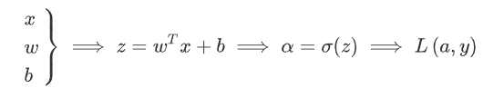

# 反向传播算法

## logistic回归中的反向传播

为了直观的理解反向传播,以logistic回归为例:



在神经网络中,w和b是比较深层的参数,而想要根据梯度下降更新w或者b就需要求代价函数对参数的偏导:

$$
w=w-\alpha dw=w-\alpha\frac{\partial \mathcal{L}}{\partial w}
$$

然而,这个导数通常是不好求解的,因为w是一个深层的嵌套的参数,所以考虑使用复合函数求导法则去找到这个导数值,这就是反向传播的核心思路.

以logistic回归为例,我们想要更新w和b,但是其不是损失函数的显式变量,其显式变量是预测值$\hat{y}=a$:

$$
\mathcal{L}(a,y)=\sum_i -y_i\log a_i=-y\log a-(1-y)\log (1-a)
$$

故:

$$
da_i=\frac{\partial L}{\partial a}=-\frac{y}{a}+\frac{1-y}{1-a}
$$

可以比较容易的计算,下一步:

$$
dz=\frac{\partial \mathcal{L}}{\partial z}=\frac{\partial \mathcal{L}}{\partial a}\frac{\partial \mathcal{a}}{\partial z}=g'(z)da
$$

再下一步:

$$
dw=\frac{\partial \mathcal{L}}{\partial w}=\frac{\partial \mathcal{L}}{\partial a}\frac{\partial \mathcal{a}}{\partial z}\frac{\partial \mathcal{z}}{\partial w}=xg'(z)da
$$

这样就通过一种反向传播的手段计算出了w参数的更新量.

## 神经网络中的反向传播

logistic中的梯度下降给了我们一种反向传播的直觉,而神经网络中的BP算法要复杂的多,由于涉及到大量变量,我们往往采用矩阵和向量的形式进行计算.

对于某一层的参数,我们记作$W^{l},b^l$,我们将最后一层的参数记作$W^L,b^L$,那么一个简单的前向传播过程为:

$$
\begin{aligned}
&Z^l=W^lA^{l-1}+b^l \\
&A^l=g(Z^l)
\end{aligned}
$$

如果想要对某个参数进行更新,需要求得loss对其的偏导数:

$$
\frac{\partial \mathcal{L}}{\partial W^l}=\frac{\partial \mathcal{L}}{\partial Z^l}\frac{\partial Z^l}{\partial W^l}
$$

这里的形状要尤其注意,$W^l$的形状是$(n^l,n^{l-1})$,$A^{l-1}$的形状是$(n^{l-1},m)$,m是样本数,所以$Z$的形状是$(n^l,m)$,$dW,dZ$的形状和其变量的形状应该一致,所以求导的结果应该是:

$$
\frac{\partial \mathcal{L}}{\partial W^l}=\left(\frac{\partial \mathcal{L}}{\partial Z^l}\right){A^{l-1}}^T
$$

下面重点来考察$\frac{\partial \mathcal{L}}{\partial Z^l}$:

$$
\frac{\partial \mathcal{L}}{\partial Z^l}=\frac{\partial \mathcal{L}}{\partial A^l}\frac{\partial A^l}{\partial Z^l}
$$

这里也要注意矩阵维度匹配的问题,activation(z)'的形状应该和Z是一致的,都是$(n^l,m)$,$A^l$的形状是$(n^l,m)$,$\frac{\partial \mathcal{L}}{\partial Z^l}$的形状是$(n^l,m)$,三个矩阵的形状一模一样,这就意味着上述的乘法只能是逐元素相乘,而不是矩阵乘法.

$$
\frac{\partial \mathcal{L}}{\partial Z^l} = \frac{\partial \mathcal{L}}{\partial A^l} \odot g'(Z^l)
$$

为了将反向传播进行下去,我们给出输入的偏导数:

$$
\frac{\partial \mathcal{L}}{\partial A^{l-1}}=\frac{\partial \mathcal{L}}{\partial Z^{l}}\frac{\partial Z^{l}}{\partial A^{l-1}}
$$

$A^{l-1}$的形状是$(n^{l-1},m)$,$Z^l$的形状是$(n^l,m)$,$W^l$的形状是$(n^l,n^{l-1})$,所以上述的反向传播应该写成:

$$
\frac{\partial \mathcal{L}}{\partial A^{l-1}}={W^l}^T\frac{\partial \mathcal{L}}{\partial Z^l}
$$

同理对于b,会有:

$$
\frac{\partial \mathcal{L}}{\partial b^l}=\frac{\partial \mathcal{L}}{\partial Z^l}\frac{\partial Z^l}{\partial b^l}=\frac{\partial \mathcal{L}}{\partial Z^l}
$$

但是这个东西是不可行的,b是向量,而对$Z^l$的导数是矩阵,所以要沿着样本维度求和,得到:

$$
\frac{\partial \mathcal{L}}{\partial b^l}= \frac{\partial \mathcal{L}}{\partial Z^l} \cdot \mathbf{1}_m
$$

那么,只要知道所有参数的值,所有中间计算值以及所有激活函数的具体信息,就能根据反向传播算出所有参数对应的偏导数.

## 手搓神经网络

我们已经熟练掌握了反向传播算法,下面尝试用numpy手搓一个简易神经网络.

首先,要定义所有的激活函数和他们的导数:

```python

def relu(x):
    return np.maximum(0, x)

def relu_derivative(x):
    return np.where(x > 0, 1, 0)

def sigmoid(x):
    return 1 / (1 + np.exp(-x))

def sigmoid_derivative(x):
    return sigmoid(x) * (1 - sigmoid(x))

def tanh(x):
    return np.tanh(x)

def tanh_derivative(x):
    return 1 - np.tanh(x)**2

def linear(x):
    return x

def linear_derivative(x):
    return 1
```

下一步,构建单层隐藏层这个类:

这里我们规定W的形状是$(n^l,n^{l-1})$,b的形状是$(n^l,1)$,Z的形状是$(n^l,m)$,A的形状是$(n^l,m)$,m是样本数,那么代码就按照我们刚才的推导去写:

```python
class DenseLayer:
    def __init__(self,input_dim,output_dim,activation):
        # 根据输入和输出的维度初始化权重和输入输出:
        '''
        W总共有output_dim行,input_dim列,是一个矩阵
        b是一个列向量,长度为output_dim
        Z = WX + b
        A = activation(Z)
        '''
        self.W = np.random.randn(output_dim,input_dim)/np.sqrt(output_dim) # 为了防止梯度爆炸,初始权重需要除以维度
        self.b = np.random.randn(output_dim).reshape(-1,1)
        self.Z= None
        self.A_in = None
        self.A_out = None

        # 选一个激活函数
        if activation == 'relu':
            self.activation = relu
            self.activation_derivative = relu_derivative
        elif activation == 'sigmoid':
            self.activation = sigmoid
            self.activation_derivative = sigmoid_derivative
        elif activation == 'tanh':
            self.activation = tanh
            self.activation_derivative = tanh_derivative
        elif activation == 'linear':
            self.activation = linear
            self.activation_derivative = linear_derivative


    # 定义前向传播函数
    def forward(self,A_in):
        # 目标是返回计算值A
        self.A_in = A_in
        self.Z = self.W@A_in + self.b
        self.A_out = self.activation(self.Z)
        return self.A_out
    
    # 定义反向传播函数
    def backward(self,dA_out):
        # 目标是根据dA计算dW,db,dZ
        # 首先计算dZ
        # dZ = dA * partial A/partial Z= dA * activation'(Z) 
        # 注意这里只能逐元素相乘
        dZ = dA_out * self.activation_derivative(self.Z)
        dW = dZ@ self.A_in.T
        db = np.sum(dZ,axis=1,keepdims=True)
        # 为了方便传播,需要返回dA_in
        # dA_in = dZ*partial Z/partial A_in 
        dA_in = self.W.T @ dZ
        return dA_in,dW,db
    
    # 定义更新参数函数
    def update(self,dW,db,learning_rate):
        self.W -= learning_rate * dW
        self.b -= learning_rate * db
```

定义一个神经网络类,把上面的单层隐藏层串联起来:

```python
class NN:
    def __init__(self,layer_config):
        self.layers = []
        for (input_dim,output_dim,activation) in layer_config:
            layer = DenseLayer(input_dim,output_dim,activation)
            self.layers.append(layer)
        
    # 定义神经网络中的前向传播,反向传播
    def forward(self,X):
        A = X
        for layer in self.layers:
            A = layer.forward(A)
        return A
    
    def backward(self,dA_out):
        dA = dA_out
        grads = []
        for layer in reversed(self.layers):
            dA_in,dW,db = layer.backward(dA)
            # 保留每一层的梯度
            grads.append((dW,db))
            dA = dA_in
        return grads[::-1]
    
    # 定义更新参数函数
    def update(self,grads,learning_rate):
        for layer,grad in zip(self.layers,grads):
            layer.update(grad[0],grad[1],learning_rate)
```

定义代价函数以及其导数(作为反向传播的第一个输入):

```python
def cost_function(y_pred,y_true):
    return np.mean((y_pred-y_true)**2)

def cost_derivative(y_pred,y_true):
    return 2*(y_pred-y_true)/y_true.shape[0] 
```

定义训练流程:

```python

def history(model, X_train, y_train, X_test, y_test, learning_rate, epochs, batch_size):
    train_loss = []
    test_loss = []
    
    for epoch in range(epochs):
        indices = np.random.permutation(X_train.shape[1])
        batch_loss_history = []
        for i in range(0,X_train.shape[1],batch_size):
            batch_indices = indices[i:i+batch_size]
            X_batch = X_train[:,batch_indices]
            y_batch = y_train[batch_indices]
            # 前向传播
            y_pred_batch = model.forward(X_batch)
            cost = cost_function(y_pred_batch,y_batch)
            batch_loss_history.append(cost)
            # 反向传播
            grads = model.backward(cost_derivative(y_pred_batch,y_batch))
            # 更新参数
            model.update(grads,learning_rate)
        loss_history = batch_loss_history
        train_loss.append(np.mean(loss_history))
        
        # 每个epoch后计算测试集损失
        y_test_pred = model.forward(X_test)
        test_cost = cost_fuction(y_test_pred, y_test)
        test_loss.append(test_cost)
        
        if epoch % 10 == 0:
            print(f"Epoch {epoch} | Train Loss: {loss_history[-1]:.4f} | Test Loss: {test_cost:.4f}")

    return train_loss, test_loss
```
