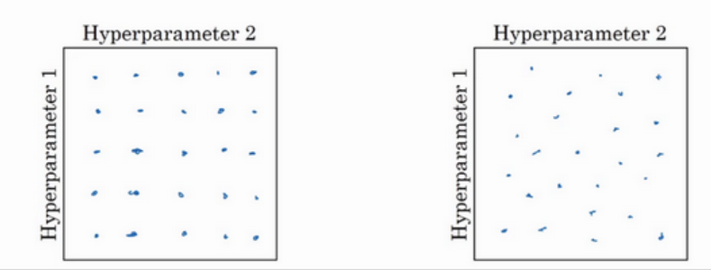
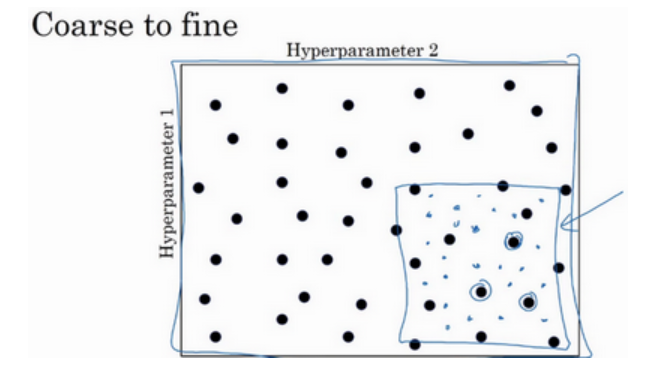
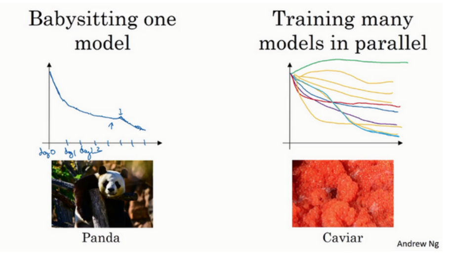

# 调试超参数

## 网格搜索

较为经典的超参数调试方法是网格搜索,以二参数为例,搜索固定步长下的所有可能值,这是网格搜索的名称由来,随着维度的提升,网格失去了其本身的意义,而是一个高维的网格,这是一个相当耗时的操作:



另一种更加推荐的搜索办法是随机搜索,即不按照规整的步长而进行随机投点,这样做的好处是,由于我们事先不知道哪个参数对结果影响更大,同样是25个投点,规整的网格搜索只能找到一个维度的5个可能值,而随机投点可以找到一个维度的25个可能值,这更加容易发现哪个参数对结果影响更大.

## Coarse to fine

一开始采取较少的点数进行随机投点,在效果最好的点附近执行更密集的投点,这样可以一定程度上减少计算量,然而,这显然是一种贪心算法,很容易陷入局部最优.



## 选用合适的尺度进行搜索

在不同的取值区域内,模型对参数的敏感度是不同的,例如学习率,模型在学习率较小的时候对参数变化敏感,因此我们常常采用对数尺度对学习率进行搜索.

```python
r = -4*np.random.rand(0,1)
a = 10**r
```
这样的投点会更加合理,另外,动量梯度下降法的参数beta也可以采用类似的办法,这可以这样理解,beta的数值就决定了更新是以往$\frac{1}{1-\beta}$次的平均,而这个函数在beta接近1的时候增长剧烈,因而非常灵敏:

```python
r = -4*np.random.rand(0,1)
beta =1-10*r
```

## babysitting and parallel

调试超参数有两种不同主流思路,一种是像熊猫抚育幼崽一样,一次只调试一个模型,不断监控模型的损失的变化,并且对超参数进行实时调整,这适用于算力不那么充沛,模型异常复杂,计算成本异常高的情况,当算力足够的时候,我们可以同时尝试大量的超参数组合,并且挑选结果最好的那个,但是往往不用优化算法,因为一次计算的成本很高了,求梯度基本上是很困难的一件事.

