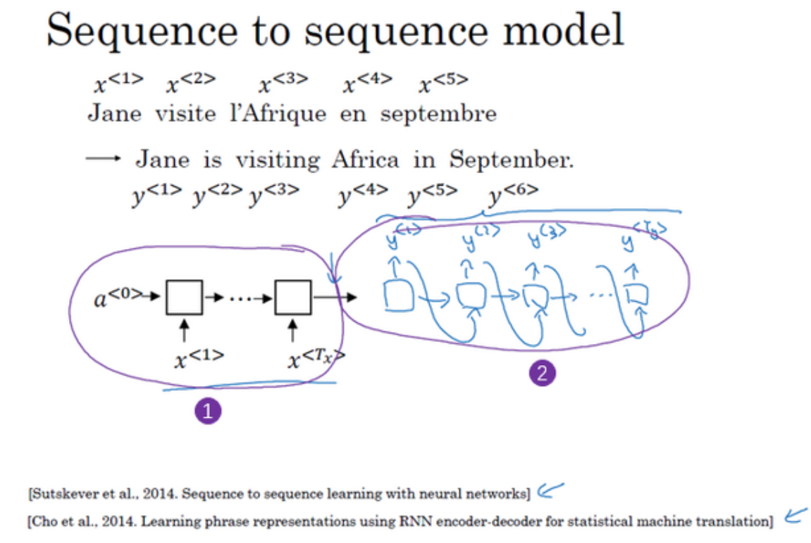
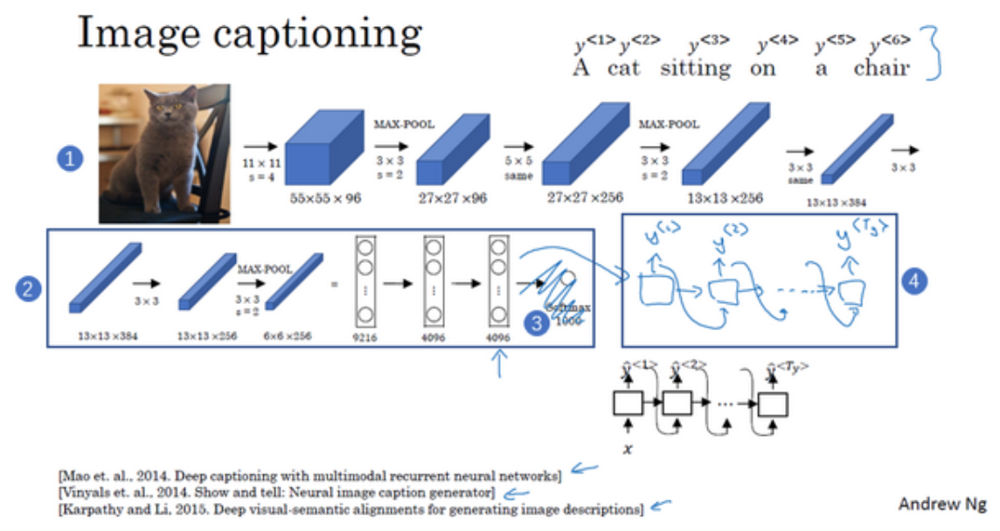

# seq2seq model

seq2seq model通常用在机器翻译上,即读入一个句子,输出翻译的句子,这可以用我们之前的many to many的RNN来实现.

## 编码器-解码器架构

具体来说,seq2seq模型包含一个编码器和一个解码器,编码器将输入序列转换为状态向量,解码器将状态向量转换为输出序列.

编码网络可以是任意的网络,取决于我们处理什么数据,例如对于文本数据,可以用RNN,LSTM,GRU...如果说,任务是看图说话,即图片转文字,那么编码网络可以用CNN.

## 选择最有可能的句子

解码器的输出是句子的一个个概率分布,我们要选择最有可能的句子,一个笨办法是遍历所有可能的句子,然后选择最有可能的句子,但是这样的时间复杂度是$O(n^n)$,当词典很大的时候,这几乎是不可行的,所以很多时候需要执行一些近似算法.

$$
\begin{aligned}
\arg \max _ {y^{<1>}, \ldots y^{<T_{y}>}} p\left(y^{<1>}, \ldots, y^{<T_{y}>} \mid x\right) \\
=\arg \max _ {y^{<1>}, \ldots y^{<T_{y}>}} \prod_{t=1}^{T_{y}} p\left(y^{<t>} \mid x, y^{<1>}, \ldots, y^{<t-1>}\right)
\end{aligned}
$$

### 贪心策略

贪心策略确保一定能找到一个局部最优,在解码器逐个生成y的时候,总是选择当前概率最大的.

$$
\arg \max _ {y^{<t>}} p\left(y^{<t>} \mid x,y^{<1>}, \ldots ,y^{<t-1>}\right)
$$

### Beam Search

Beam Search相较于Greedy Search,他放宽了条件,不再是每次只取使得当前的条件概率最大的,而是取前K个使得当前条件概率最大的,然后再在下一次的搜索中继续只保留前K个概率最大的序列,如此直到生成整个序列.

相较于Greedy Search,Beam Search可以得到更好的结果,但是相应的计算量会增加.

值得注意的是,原始的搜索算法倾向于选择短的句子,因为这样相乘得到的概率会尽可能的大,为了改进这个问题,我们可以除以序列长度,同时,多个小于1的数相乘可能会出现一些数值问题,我们可以通过对概率取对数来避免这个问题.

改进的评价指标为:

$$
\frac{1}{T_{y}^\alpha} \sum_{t=1}^{T} \log p\left(y^{<t>} \mid x, y^{<1>}, \ldots, y^{<t-1>}\right)
$$

$\alpha$是一个可调超参.

有的时候结果不好,我们可以尝试一下比较测试集和预测值的概率评估指标$P(y^* \mid x),P(\hat{y} \mid x)$,如果前者大于后者,那么大概率RNN模型是没有出问题的,这个时候可以调整一下Beam Search的超参,力图找到更好的结果.

