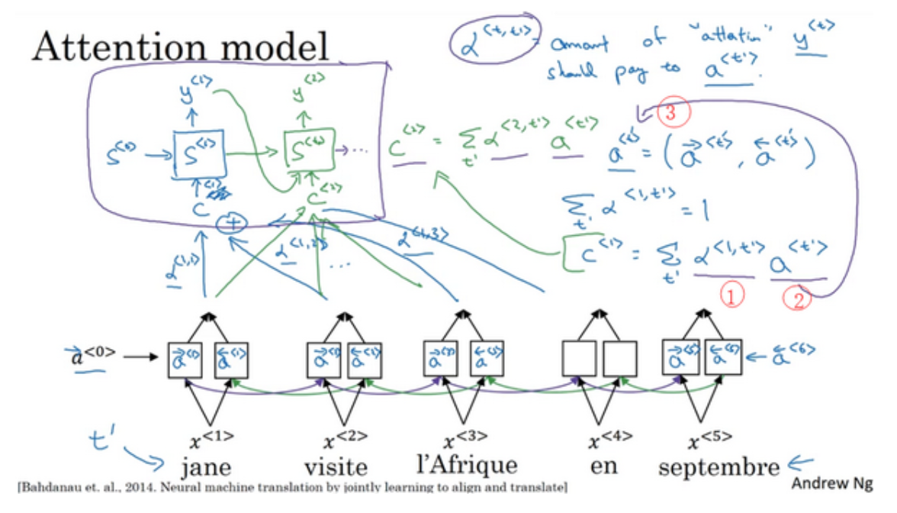

# 注意力机制

人工翻译句子的时候,往往不会一次性直接读入整个长句子或者一大段文本,我们往往习惯专注于文章的某一部分,边读边翻译,这就是说,我们在执行特定片段的翻译任务的时候,对文章的不同片段施加了不同的注意力,注意力机制就是模仿这个过程的一种机制.

于是,编码器在这里由双向循环神经网络代替,解码器依旧是一个单向的循环神经网络,该循环神经网络的每一步都会根据编码器每个时间步计算得到的注意力和之前的隐藏状态来预测当前时间步的输出.

例如,第t'个时间步编码器的激活值为:

$$
a^{<t'>} = (\overrightarrow{a}^{<t'>},\overleftarrow{a}^{<t'>})
$$

此时的注意力应该由上一时间步解码器的激活值和当前时间步编码器的激活值共同决定.

$$
\alpha^{<t,t'>} = \mathbf{softmax}(f(s^{<t-1>},a^{<t'>}))=\frac{\exp{e^{<t,t'>}}}{\sum_{t'=1}^{T_x}\exp{e^{<t,t'>}}}
$$

这里计算注意力的f可以是某种函数,也可以是一个可学习的神经网络.

有了注意力之后,我们就可以计算出当前时间步的上下文向量了.

$$
c^{<t>} = \sum_{t'=1}^{T_x}\alpha^{<t,t'>}a^{<t'>}
$$

接下来,我们将上下文向量和上一时间步的隐藏状态一起输入到解码器中.

$$
s^{<t>} = g(y^{<t>},s^{<t-1>},c^{<t>})
$$

这就是注意力机制的基本原理.