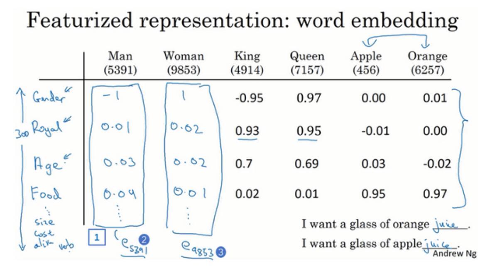
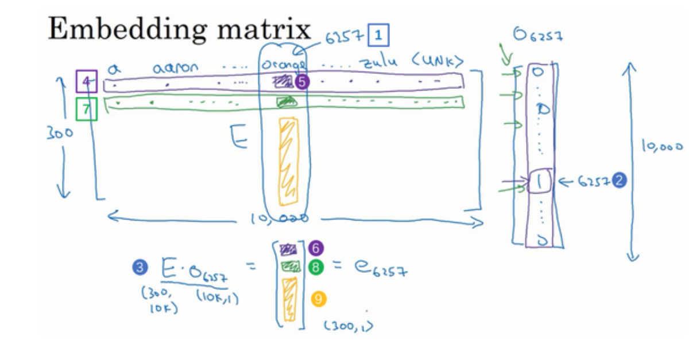
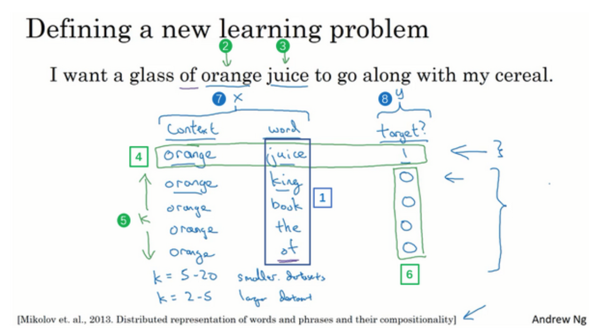

# 词嵌入算法

使用one-hot编码表示词语或者短句是一个不错的想法,但是这有一个问题,一是当词汇表很大的时候,one-hot向量会很长并且很稀疏,二是这样的表示方式忽略的词汇和词汇之间的相似性,例如father和mother,brother和sister,man和woman,这些词语之间的相似性是非常高的,但是one-hot编码不能捕捉这样的关系.

换句话说,在词嵌入向量的高维空间中,相似的词汇应该处于相近的位置,他们的的距离应该更近,基于特征的表示方法或许会更加合理:

## 相似度

一个最简单的相似度衡量方法就是使用余弦函数,如果要判断某个词的对应词,例如man对应woman,king对应qween,而找到qween这个词的过程,其本质就是寻找一个词向量,让其和$e_{king}-e_{man}+e_{woman}$最为相似:

$$
\arg \max_{w} sim (w,e_{king}-e_{man}+e_{woman}) = \arg \max_{w} \frac{w^T(e_{king}-e_{man}+e_{woman})}{\left\| w \right\|\left\| e_{king}-e_{man}+e_{woman} \right\|}
$$

## 学习词嵌入

得到词嵌入向量,可以使用one-hot向量乘以词嵌入矩阵,而这个矩阵就是我们要学习的东西

词嵌入矩阵的大小为[N,N'],N为词汇表大小,N'为词嵌入向量的维度.

建立语言模型是很好的学习词嵌入的方法,我们可以建立具有大量句子的语料库,然后掩盖掉一部分,使用语言模型来预测被掩盖掉的部分.例如,给一个句子:I want a glass of [juice],这个juice就是要预测的部分,我们可以使用一个简单的神经网络来完成这个工作.

首先,将句子的各个词对应的one-hot向量乘以Embedding矩阵,然后将所有词嵌入向量按照顺序拼接,将结果输入到softmax中:

$$
\hat{y} = \operatorname{softmax}(W\cdot E(v_1\oplus v_2 \cdots v_{n-1})+b)
$$

可学习参数为Embedding矩阵和一个简单的线性层(这个线性层将拼接维度映射回字典维度),我们可以通过滑动窗口创造出大量的训练样本,例如,总是每5个词作为一组,用前四个词预测最后一个词.

## Word2Vec

Word2Vac是一类语言模型,其中常用的算法是Skip-Gram和CBOW.

skip-gram是在给定词上下范围k个词内找上下文的随机配对,例如句子I want to eat a glass of juice,当k=1时,我们可以得到如下的训练样本:

- (want,I)
- (want,to)
- (want,a)
...
然后构建一个监督学习任务,使用神经网络来预测上下文词汇,在给定中心词c的情况下,上下文词t的条件概率为:

$$
p(t|c) = \frac{e^{\theta^T_te_c}}{\sum_j e^{\theta^T_je_c}}
$$

其中,$\theta^T_j$为词j的输出参数向量,是一个可以被训练的参数向量.这个参数可以认为是一个词其被当做上下文时候的特征表示,其和词嵌入向量等长,通常情况下,训练完毕过后,我们只取用词嵌入向量,而这些theta参数可以被丢弃,在特殊情况下,这些参数可以被用来做一些其他的任务.

但是,注意到,我们需要计算所有词的条件概率,并且每个词都有独立的参数变量,当词典非常大的时候参数爆炸.一个可能的解决方法是使用分层softmax,即一个二分树,每个叶子节点告诉你这个词处于前面的区间还是后面的区间,这样就直接避免了大量的求和操作.

## 负采样

负采样是一种更加高效学习词嵌入的方法,他舍弃了softmax单元,而是改用大量的二分类任务来训练词嵌入.

例如,orange juice是一个正常的搭配,那么他就是一个正样本,但是我们同时可以从上下文随机选择大量的词汇和orange组合,例如orange I这种没有意义的组合,这些都是负样本.

上下文选择的窗口长度为K,于是就可以构造一个监督学习任务,我们将训练一个分类器,判断他到底是正样本还是负样本.

这样就避免了softmax单元分母上的大量求和操作:

$$
P(\hat{y}=1|c,t) = \sigma(\theta^T_te_c)
$$

## GloVe Word Vectors

GloVe向量是一种更加简单的词嵌入学习算法,但是用的不如上面两个算法多.

Glove算法的核心思想是,词语的共现比例应该只取决于词向量:

$$
F(w_i,w_j,\tilde{w}_k) = \frac{P_{ik}}{P_{jk}}
$$

其中,$w_i,w_j$是i,j的词向量,而$\tilde{w}_k$是k的上下文向量,而$P_{ik}$是i在k的上下文中出现的概率,其可以用i在k的上下文中出现的次数除以k的上下文总词数来得到.

注意到,词向量之间的关系要满足某种加性关系,即我们可以通过向量空间中的差来表示词之间的差异,所以上面的式子改写为:

$$
F(\tilde{w}^T_k(w_i-w_j)) = \frac{P_{ik}}{P_{jk}}
$$

同时,为了化商为差,研究人员假定F是一个指数函数:

$$
\tilde{w}^T_k(w_i-w_j) = \log{P_{ik}}-\log{P_{jk}}
$$

注意到,$P_{ik}$应该只与其词向量有关,所以:

$$
\tilde{w}^T_kw_i = \log{P_{ik}}
$$

最后,由于$P_{ik}$会导致某些对称性问题,即我们期望$\tilde{w}^T_kw_i = \tilde{w}^T_iw_k$,这样的结构是对称且良好的,但是这会导致$P_{ik}=P_{ki}$,这是不能成立的,因为不同词的总上下文长度是大不相同的.

所以我们期望使用$\log X_{ik}$进行建模,为此,上面的式子需要进行修正,增加偏置项来弥补:

$$
\tilde{w}^T_kw_i +b_i + \tilde{b_k}= \log{X_{ik}}
$$

所以,最后就能得到一个简单的损失函数:

$$
J = \sum_{i=1}^N \sum_{k=1}^N f(X_{ik})(\tilde{w}^T_kw_i +b_i + \tilde{b_k} - \log{X_{ik}})^2
$$

其中,$f(X_{ik})$是一个缩放函数,用来控制不同的样本权重,他的设计原则是,对于某些特别高频的词汇,我们不希望给予其过高的权重,而对于一些罕见的词汇,我们希望给予其适当的权重.

一个常用的权重函数为:

$$ 
f(x) = \begin{cases} (x/x_{\max})^\alpha & \text{if } x < x_{\max} \\ 1 & \text{if } x \geq x_{\max} \end{cases} 
$$

