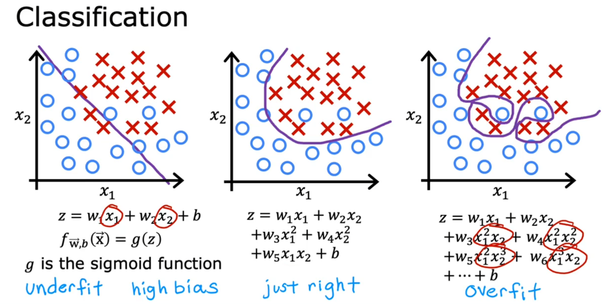
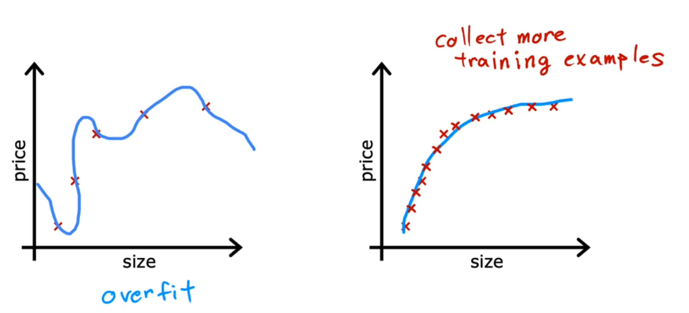
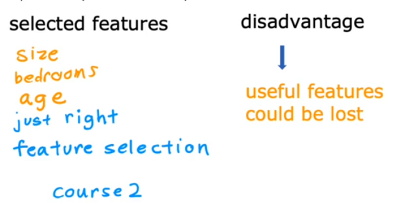

# 过拟合与正则化

## 过拟合与欠拟合

我们知道,如果点的分布不再是那么界限分明,在把输入映射到z的定义域的时候就需要采取一些高阶高维的决策边界:

!!! info "过拟合与欠拟合"

    

图示只是用二维的投影情况简单描述了一下,事实上,决策边界也应该是高维的决策边界.

如果采用的特征参数过少,那么模型就无法正确反映信息,也就是会出现欠拟合的现象.

如果数据量过少,模型过度读取了训练集中的所有特征,那么他就有可能将随机误差等错误信息包含在了模型中,得到的模型虽然和训练集符合的很好,但是往往在测试集上表现不佳,缺少"泛化"能力.

那么,如何解决过拟合呢:

!!! question "如何解决过拟合"

    - 收集更多的数据进行校正
    
    

    - 仅只挑选部分的特征进行拟合
    
    

    缺点是部分信息不能够在模型中体现

    - 正则化(Regularization)*
   
## 正则化

正则化其实是沿用了2的思想,挑选部分特征本质上是把他们这些特征的系数归零,但是,如果不归零,将系数调整到一个很小的值,那么,这些特征在一定程度上可以影响模型,但是影响又是有限的.

那么,如何将可以被限制的系数限制在一个比较小的范围内呢,我们可以将它添加到代价函数中,这样,代价函数在极小化的过程中会一定程度上"惩罚"这个系数:

改进后的代价函数为:

$$
J(w,b)=\frac{1}{2m}\sum_{i=1}^m(f(\vec{x_i})-y_i)^2+\frac{\lambda}{2m}\sum_{j=1}^n w_j^2+\frac{\lambda}{2m}b
$$

对系数$w$和$b$都进行了惩罚,这就被称作正则化操作,$\lambda$是参数

实际上经过实践证明,最后一项对b的惩罚是可有可无的,这就得到我们经常使用的正则化后的代价函数:

$$
J(w,b)=\frac{1}{2m}\sum_{i=1}^m(f(\vec{x_i})-y_i)^2+\frac{\lambda}{2m}\sum_{j=1}^n w_j^2
$$

或者写成更一般的代价函数(用损失函数表示):

$$
J(w,b)=\frac{1}{m}\sum_{i=1}^m L(f(\vec{x_i}),y_i)+\frac{\lambda}{2m}\sum_{j=1}^n w_j^2
$$

以线性回归为例,使用梯度下降对代价函数执行操作,更新系数$w$的时候,会有如下式子:

$$
w_j=w_j(1-\frac{\lambda}{m}\alpha)-\alpha \frac{1}{m}\sum_{i=1}^m (f(\vec{x_i})-y_i)x_{ij}
$$

从中可以清晰的看到,相比于没有正则化的代价函数,正则化之后,参数w在每次执行梯度下降前都要乘以一个小于1的系数.

