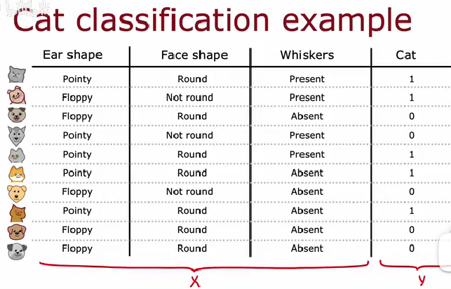
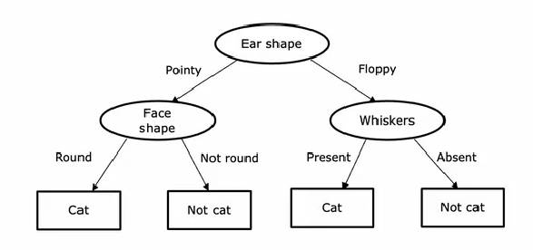
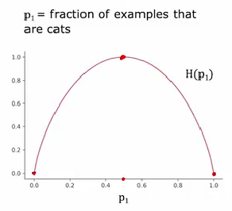
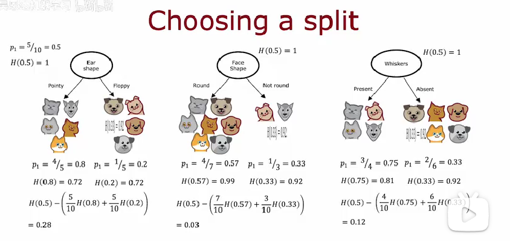
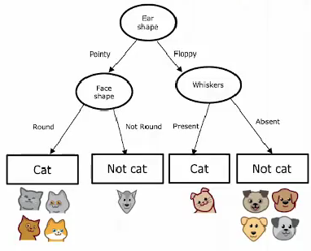
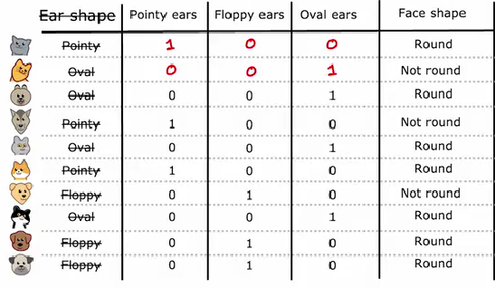
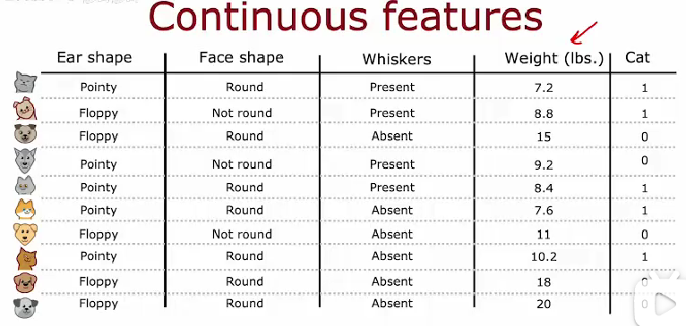
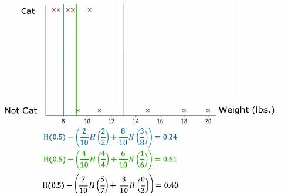
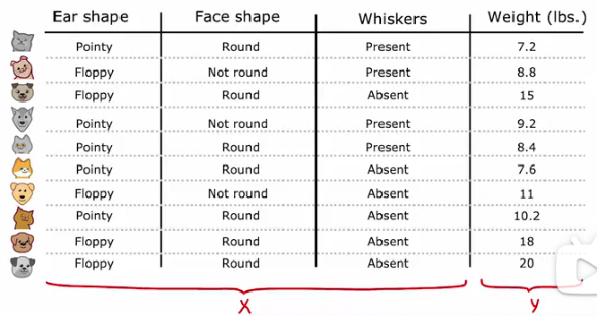
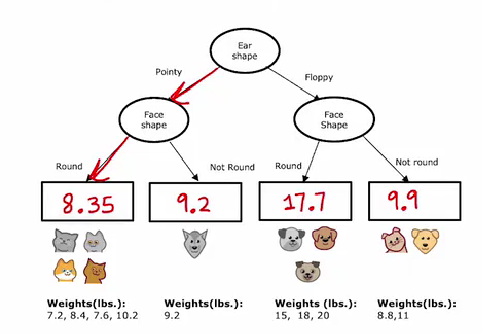

# 决策树

## 基本概念

决策树的思想可以认为起源于分类,如何判断一个动物是不是一只猫,我们首先寻找一个特征,比如耳朵是圆的还是尖的,进行第一步决策,然后再看有没有胡须,进行下一步决策,直到这个动物满足了我们的绝大多数判断,我们就认为他是猫.

这样的一个决策过程可以用树来表示,给定一个有一群猫和一群狗的训练集,第一个判断节点被称为根节点,他将选定第一个特征然后进行判断,形成两个枝,在各个枝的尽头,又会生长出内部节点,这些内部节点会再次选择某一特征然后将训练集进行分枝.

在满足某一些特定条件后,分枝终止,枝的末端生长的节点被称作叶节点,叶节点中存在着被纯化的部分数据集:

这样,一旦一个树被训练好后,给定一个新的特征向量,我们总能沿着树对其中各个特征进行逐级判断,最后给定一个输出.

## 信息熵

什么时候终止分裂,产生叶节点?根节点和内部节点选择特征的依据是什么?这些问题都依赖于熵这个概念.

我们知道,熵是体系混乱度的度量,对于一个二分类体系,体系的熵由下面的式子给定:

如果说,体系中0的数目是a,1的数目是b,那么两者的比例分别为:

$$
\begin{cases} p_1=\frac{a}{a+b}, &  \\p_2=\frac{b}{a+b} , &  \end{cases}
$$

此时体系的熵为:

$$
\begin{aligned}
H(p_1)&=-p_0\log(p_0)-p_1\log(p_1)\\
&=-p_1\log(p_1)-(1-p_1)\log(1-p_1)
\end{aligned}
$$

比如我把猫记做1,那么只要知道猫在其中占据的比例,就能计算出熵值,显然熵值在猫很多和猫很少的时候都很低,只有猫狗参半,体系比较混乱的时候熵值才会很高.

## 信息增益

如果说,我按照我选定的特征去拆分数据集,可以让我的数据集尽可能的纯化,这就是一个比较好的节点特征,那么,如何度量这一过程:用体系熵的减少:

设在初始状态下,我们猫的比例是$p_1^{(0)}$,拆分成两个枝后,每个枝的猫的比例为:$p^{l}_1$和$p^r_1$.

原体系熵不难计算,两个数据集的总熵要使用两个数集的加权算术平均(因为熵是强度性质不是广度性质),设他们在总数据集中的比例分别为$w^l$和$w^r$,那么信息增益定义为:

$$
\Delta H=H(p^{(0)}_1)-w^l H(p^{l}_1)-w^r H(p^r_1)
$$

在选择特征进行分枝的时候,不同的特征会带来不同的信息增益,我们选择信息增益最大的特征作为我们的节点特征,这样可以确保我们枝上的数据集最大可能纯化:

## 什么时候终止?

每一次分枝的进行都是在对训练集做一定的拟合,如果说一直做下去,树会越来越大,但是过拟合的风险也越来越高,所以分枝的次数不能够过多,那么什么时候终止?

对于某一个枝:

1.枝上全是猫或者全不是猫,即数据集100%纯化,熵为0,这个时候分枝没有意义了.因为没有任何的信息增益

2.信息增益小于一定值,这个时候分枝带来的收益已经远远小于计算成本的增加了,此时我们也不应该继续分枝.

3.到达最大深度,可以手动设置一个最大分枝深度,一旦到这个深度后就停止分枝.

4.枝上的数据集个数少于一定值,虽然可以继续往下分,但是会极大提高过拟合的风险.

## 补充操作

如果一个特征具有多个分类怎么办?例如耳朵不只有圆耳朵和尖耳朵,也有可能有椭圆耳朵,那么对这些特征重新编码,输入就会改为是否有圆耳朵,是否有尖耳朵,是否有椭圆耳朵,依旧能够变为二分类问题:

对于一切的离散特征,都可以转化为0-1的逻辑判断特征.这样,再延续我们上面的操作,依旧可以训练得到一颗较好的决策树.

如果是连续变量怎么办?

例如动物的输入特征加入了体重,但是体重是一个连续变量,都不太相同,所以通过设定一个阈值的方式同样可以将体重变为二分类0-1输入,如何选择这个阈值?通常是经过不断的离散的调整,选定信息增益最大的那个阈值.

## 回归树

基于上面的分析,已经可以搭建一个比较成熟的决策树了,但是实际上,我们希望决策树不仅仅可以解决二分类问题,也能够较好的去解决回归的问题,这需要我们去做出一些调整:

考虑较为简单的情况,例如,我们输入的依旧是离散的0-1特征变量,如耳朵的形状是否为圆形,训练集中对应的y这个时候成为了连续的体重.也就是说,我们想要根据输入去预测一个连续量:体重,这就是一个回归问题

那么,在每次分枝的时候,分枝的指标就不再是信息增益了,我们希望最后的输出--叶节点尽可能的准确

在每次分枝的时候,我们考察数据集主要是考察对应的weight,那么,一个枝的weight应该尽可能的集中,这样可以认为我们分枝分的比较好,衡量数据的集中程度应该使用方差,衡量分枝的好坏应该衡量方差的减少程度:

$$
\Delta V=\operatorname{Var}(X)-w_l \operatorname{Var}(X_l)-\operatorname{Var}(X_r)
$$

所以,根据数据的集中增益,我们为每个节点选择特征,以此类推得到一系列的叶.然后我们认为这个叶的输出就是叶上数据的算术平均.

