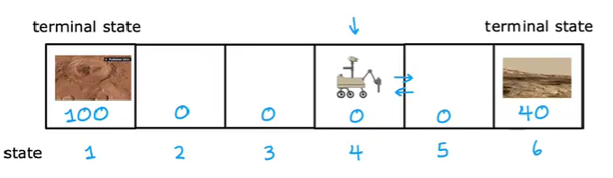
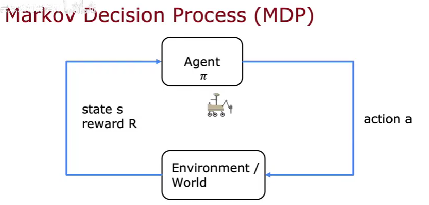
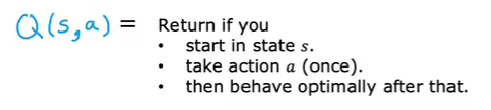
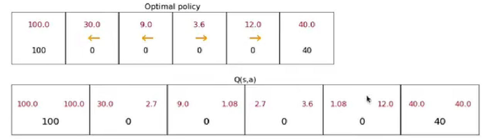

# 强化学习

当我们想要制造一个能够自动驾驶的直升飞机或者探测器的时候,会遇到一些麻烦,我们想要的是,探测器可以根据自己当前所处的状态做出一定的最优或者较优的决策,按照之前所学的知识,监督学习似乎可以办到这一点,但是事实证明,监督学习在解决这一类问题上的表现并不是很出色,因为很难确定当前的状态下给出的最好动作是什么,也就是数据集的标签不明确,这样神经网络的构建就变得比较困难,最好的办法就是让探测器自己根据环境做出一定的决策和调整,这就需要我们引进一些新的技术.

## 基本概念

以一个一维火星探测器为例,它被限制在一定长度的区域内,探测器探测到区域的两端有两个值得探索的地方,我们该如何设计算法,让探测器自动运动起来去到这两个区域进行探索呢?

像训狗一样,我们对每个状态设定一个奖励值,当探测器到达那个状态后,就会获得一定数额的奖励,奖励的大小按照重要程度来确定,对于状态$s$,其奖励记做$R(s)$,探测器的一次运动可以用当前状态和奖励以及下一个状态及其奖励来描述:

$$
(s,R(s),s',R(s'))
$$

例如上面的火星探测器,我们认为左边的探测点更加重要一点,右边的次之,路上都没有什么值得留恋的,奖励全部设置为0.

对于一个完整的决策过程,我们将探测器收获的全部奖励称之为反馈,反馈决定了探测器的全局移动策略,但是,考虑到时间效益,经过更长时间所收获的状态需要进行一定的折扣,所以反馈的表达式有点类似于等比级数:

$$
return=R_1+\gamma R_2+\gamma^2 R_3+ \cdots 
$$

其中,$\gamma$被称作折扣率,它反映了探测器对于得到的奖励不耐烦的程度,实际上就是对时间成本或者距离成本的度量.

反馈值会决定一个全局移动策略$\pi$,对于任意的状态,策略都将给出下一步的移动动作,新的移动动作又给出了新的状态,而下一步的决策只依赖于当前的状态,这被称作一个马尔可夫决策过程:

$$
\pi(s)=a
$$

## 状态动作值函数

我们知道,是反馈决定了决策,那么最优反馈一定对应着最优决策序列,如何定义一个最优反馈,效仿动态规划的思想,我们定义一个状态动作值函数,他是当前状态和某一个动作的函数:

$$
Q(s,a)= best\quad return
$$

它的意思是,采用a移动后,到达下一状态就采取最优移动策略从而获得最佳反馈.

对于不同的初始移动,状态动作值函数会有不同的值,我们把最大的那个值记做最优状态动作值函数,它反应了从当下就采取最优策略所能获得的反馈:

$$
Q^{*}=\max_{a} Q(s,a)
$$

还是以火星探测器为例,上图第一行的箭头表示了在这个状态下的最优移动方向,数字代表了反馈,第二行格子内的左右两个值分别代表向左移动和向右移动的最优状态动作值函数.

## Bellman 方程

既然明确了状态动作值函数的定义,就可以根据动态规划写出状态转移方程:

$$
Q(s,a)=R(s)+\gamma\max_{a'}Q(s',a')
$$

其中,状态$s'$完全由环境和移动决策$a$决定,在环境视作静态的时候完全由移动决策$a$决定.

但是,有的时候环境的影响不能够忽略,例如火星上可能有恶劣天气,探测器在运动过程中很可能被风吹到其他状态去,所以移动后的下一个状态$s'$是不确定的,这个时候你很难知道最优的状态动作值函数是什么,因为在取最大的的时候,我们无法确定该取那些状态动作值函数进行比较.

然而,发生意外的概率是可以估计的,对于一个确定的意外,探测器所处的状态一定也是确定的,那么就可以对所有的状态动作值函数进行比较,然后取最大,只不过,在最终的状态转移方程中,一种意外所能提供的最优状态动作值函数要乘上一个意外发生的概率,从统计学的概念上说,确定的值由一个期望值来代替:

$$
Q(s,a)=R(s)+\gamma E(\max_{a'}Q(s',a'))
$$

## 连续状态空间

上面给出的例子和方程都是适用于一个离散的状态空间,物体只可能有几个分立的状态,所以可以比较轻松地用动态规划解决问题,然而,实际问题中物体的状态很有可能是连续的,例如直升飞机的状态由绝对空间坐标和自身绕轴的三个角度以及相应的速度构成,在牛顿力学中,一个物体的状态就能被完全确定.

$$
\mathbf{x}=
\begin{bmatrix}
    x\\
    y\\
    z\\
    \phi\\
    \theta\\
    \omega\\
    \dot{x}\\
    \dot{y}\\
    \dot{z}\\
    \dot{\phi}\\
    \dot{\theta}\\
    \dot{\omega}
\end{bmatrix}
$$

既然离散的状态能够得到比较好的解决方案,我们只需要把状态空间离散化即可,将状态空间划分为一个个网格,状态的更新实际上就是在网格间的跳跃,如果精度不够,可以在任意两个网格点之间进行插值.

