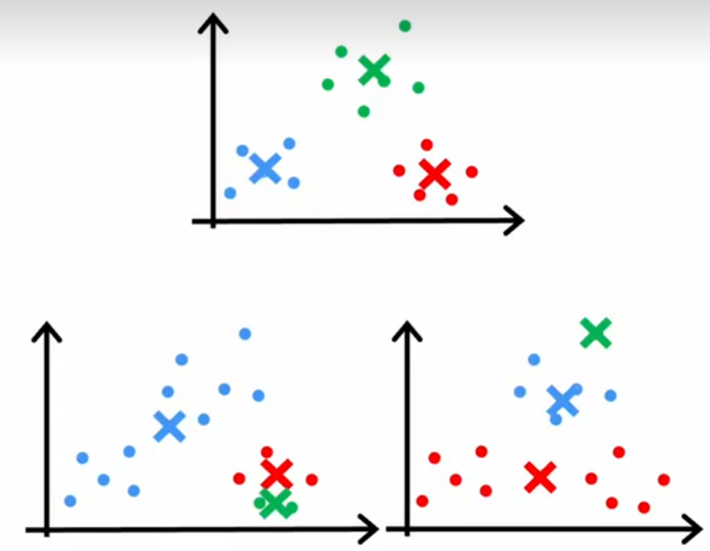
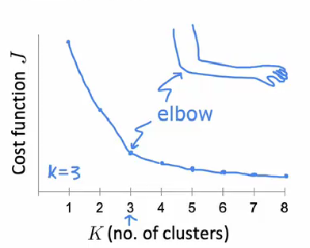
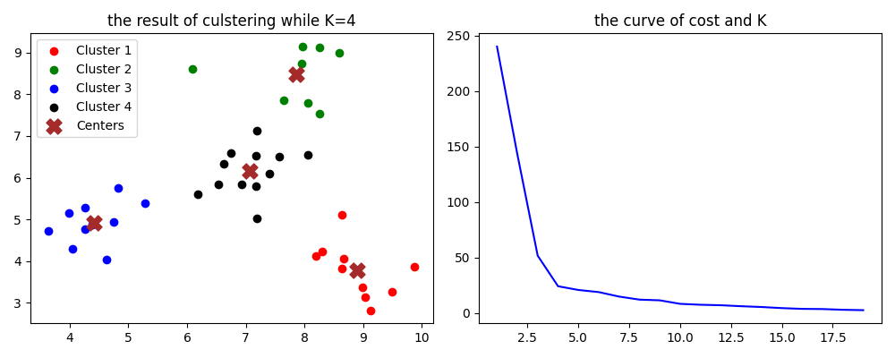

# K-means 聚类算法

K-means聚类算法是一种无监督的聚类算法,即只要给定聚类个数和数据集,该算法就能自动将数据分为一个个簇

## 算法流程

假设我们有数据集 $X = \{\mathbf{x}_1, \mathbf{x}_2, \ldots, \mathbf{x}_n\}$, 其中 $\mathbf{x}_i \in \mathbb{R}^d$。我们的目标是将这些数据点划分为 $K$ 个簇 $C = \{C_1, C_2, \ldots, C_K\}$，并找到每个簇的中心 $\mathbf{\mu}_k$。

**算法步骤:**

1.  **初始化 (Initialization):**
    *   随机选择 $K$ 个数据点作为初始聚类中心 $\mathbf{\mu}_1, \mathbf{\mu}_2, \ldots, \mathbf{\mu}_K$。

2.  **簇分配 (Cluster Assignment):**
    *   对于每个数据点 $\mathbf{x}_i$ ($i=1, \ldots, n$)，计算其与每个聚类中心 $\mathbf{\mu}_k$ ($k=1, \ldots, K$) 的距离（通常是欧氏距离的平方）。
    *   将数据点 $\mathbf{x}_i$ 分配给距离最近的聚类中心所代表的簇 $C_{k^*}$。用 $c_i$ 表示点 $\mathbf{x}_i$ 所属簇的索引：
        $$
        c_i = \mathop{\arg\min}_{k} \| \mathbf{x}_i - \mathbf{\mu}_k \|^2
        $$
    *   更新簇集合 $C_k = \{ \mathbf{x}_i \mid c_i = k \}$。

3.  **中心更新 (Centroid Update):**
    *   对于每个簇 $C_k$ ($k=1, \ldots, K$)，重新计算其聚类中心 $\mathbf{\mu}_k$，使其成为该簇内所有数据点的均值（质心）：
        $$
        \mathbf{\mu}_k = \frac{1}{|C_k|} \sum_{\mathbf{x}_i \in C_k} \mathbf{x}_i
        $$
        其中 $|C_k|$ 是簇 $C_k$ 中数据点的数量。如果某个簇 $C_k$ 为空，则可以重新初始化其中心或将其移除。

4.  **迭代 (Iteration):**
    *   重复步骤 2 (簇分配) 和步骤 3 (中心更新)，直到聚类中心不再发生显著变化（或达到预设的最大迭代次数）。

## 代价函数

这个算法的代价函数显然就是簇内点到聚类中心的距离的平方和的和,假设我们有$K$个类,n个点,第i个特征向量记做$x^{(i)}$,那么这个特征向量所述的簇的编号为$c_i$,代价函数显然就是在不断地调整这些编号,以及聚类中心向量,来达到最小化的目的:

$$
J(c_1,c_2, \ldots ,c_n,\mathbf{\mu_1},\mathbf{\mu_2}, \ldots ,\mathbf{\mu_K})=\sum_{i=1}^n \left\| \mathbf{x_i}-\mathbf{\mu_{c_i}} \right\|^2
$$


## 初始化

初始聚类中心的选择有一定的讲究,不同的初始条件可能会得到不同的结果.由于代价函数是非凸的,所以算法有一定的可能性会陷入到局部最小值当中去,同时初始点选的比较离谱也会增加一定的计算时间.



如图所示,这三种情况都可以使得算法终止迭代,但是肉眼可见的,只有最上面那种的聚类是符合我们要求的,如何避免陷入局部极小值是比较困难的,可能需要一些启发式手段,为了避免复杂化问题,我们只需要大量重复的调用聚类算法,并且每次初始值都不同,取最小的那个就好了,这样还是很容易能够找到全局最小的.


## 选择聚类个数

聚类的个数K的设置也有一定的讲究,通常这个K是我们任务设定好了的,我就要求分成几类,但是也有没有提前设定聚类个数K的情况,这个时候如何选择K就有一些方法:

一个很常用的办法就是一种叫做"肘法"的办法,肘法的意思是,不断改变K值,绘制出代价函数-K曲线,然后在一个看起来像肘部一样的地方选择聚类个数K:



为什么选择这个点呢,这是因为,在这个点之后,再增加聚类的个数,代价函数下降已经不那么明显了,这个时候我们认为分类已经足够好了,再分类下去就没有必要了.

但是,在应用过程中,很可能绘制出来的图像没有一个这么鲜明的转折点,到时候就需要结合问题综合考虑选择哪个K了:

## 实现

现在有比较集成化的库来实现这个基础机器学习算法,我没有必要编写一遍,只要学会怎么调用库就可以了:



这是我们代码运行结果,确实代价函数随K的变化有一个很明显的肘部这个肘部对应K=4

```python
import numpy as np
import matplotlib.pyplot as plt
from sklearn.cluster import KMeans

# 设置随机种子
np.random.seed(42)

# 生成4个簇:
cluster_1 = np.random.normal(loc=[4.5, 5], scale=0.5, size=(10, 2))
cluster_2 = np.random.normal(loc=[9, 4], scale=0.6, size=(10, 2))
cluster_3 = np.random.normal(loc=[7, 6], scale=0.55, size=(10, 2))
cluster_4 = np.random.normal(loc=[8, 8], scale=0.73, size=(10, 2))

# 拼接数据集:
X = np.vstack((cluster_1, cluster_2, cluster_3, cluster_4))

# 设置分类个数
K = 4

# 创建KMeans模型
model = KMeans(n_clusters=K, random_state=42)
model.fit(X)


# 获取聚类中心和数据点的分配
centers = model.cluster_centers_
labels = model.labels_

# 定义颜色列表
colors = ['r', 'g', 'b', 'k','o','y','p']


# 尝试绘制一下代价函数-K曲线

def cost(K):
    model = KMeans(n_clusters=K, random_state=42)
    model.fit(X)
    cost=model.inertia_
    return cost

Cost=np.zeros((19,2))

for k in range(1,20):
    Cost[k-1]=[k,cost(k)]


# 创建一个图窗,左边用来展示K=4的聚类情况,右边用来绘制代价函数曲线

fig, (ax1, ax2) = plt.subplots(1, 2, figsize=(10, 4))

# 绘制数据点
for i in range(K):
    ax1.scatter(X[labels == i][:, 0], X[labels == i][:, 1], c=colors[i], label=f'Cluster {i+1}')

# 绘制聚类中心
ax1.scatter(centers[:, 0], centers[:, 1], c='brown', s=150, marker='X', label='Centers')

ax1.set_title("the result of culstering while K=4")
ax1.legend()

# 绘制折线图
ax2.plot(Cost[:,0],Cost[:,1],color='b')

ax2.set_title("the curve of cost and K")

# 调整布局，使得子图之间没有重叠
plt.tight_layout()

plt.show()

```

