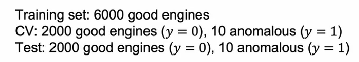
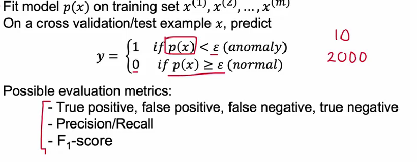
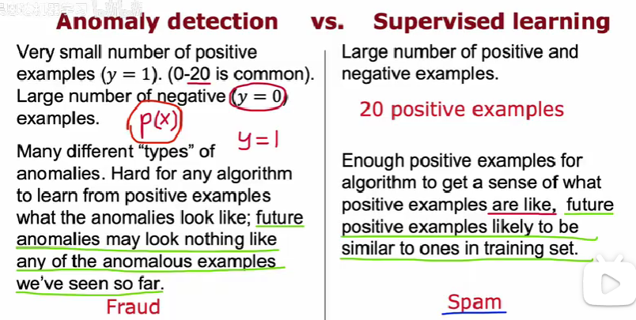
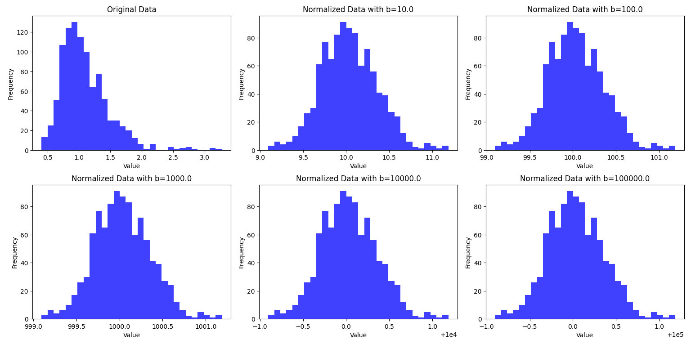

# 异常检测

这也是一个商业应用性非常强的算法,如其名,主要是检测数据集中有没有异常的数据,其实我觉得这个就是一个统计学分析,先根据输入特征拟合出极大似然分布函数,然后对给定的新数据做出判断,如果其对应的概率密度过低,那么就当做异常值处理.

这种给予统计学的分析手段通常需要比较多的数据作为支撑,我们需要收集大量的正面例子来拟合我们的概率模型,同时也要收集一定量的负面例子,来检测我们模型的泛化能力.

## 极大似然估计

假设我们训练使用了m个样本$(x^{(0)},x^{(1)},x^{(2)}, \ldots ,x^{(m)})$,每个特征向量存在n个分量:

$$
x^{(i)}=
\begin{pmatrix}
    x^{(i)}_1\\
    \vdots\\
    x^{(i)}_n
\end{pmatrix}
$$

我们考虑设立随机变量:

$$
\begin{aligned}
X_1,X_2, \ldots ,X_n \\
\end{aligned}
$$

这些随机变量用来描述向量的分量

以及向量随机变量:

$$
\mathbf{X}=
\begin{pmatrix}
    X_1\\
    X_2\\
    \vdots\\
    X_n
\end{pmatrix}
$$

假设每个特征相互独立,并且服从类似的分布(这个分布通常是正态分布),每个随机变量的均值和方差分别为$\mu,\sigma$:

所以其向量的概率密度函数就是联合正态分布:

$$
f(\vec{x})=p(x_1,x_2, \ldots ,x_n)
$$

由于我们上面假设了各个分量独立:

$$
f(\vec{x})=p(x_1)p(x_2)\cdots p(x_n)=\prod_{j=1}^{n}p(x_j) 
$$

我们需要估计的参数是:

$$
(\mu_1,\sigma_1, \ldots ,\mu_n,\sigma_n)
$$

根据极大似然估计的概念,定义似然函数为:

$$
L(\mu,\sigma)=\prod_{i=1}^{m} f(\vec{x}^{(i)}|\mu,\sigma)=\prod_{i=1}^{m}\prod_{j=1}^{n}p(x^{(i)}_j) 
$$

下一步,就是根据似然函数的极小值条件求解$\mu_1,\sigma_1, \ldots \mu_n,\sigma_n$的估计值,通常我们习惯使用对数似然函数去求解极小值条件:

$$
G=\sum_{i=1}^m\sum_{j=1}^n \ln p(x^{(i)}_j) 
$$

$$
\frac{\partial G}{\partial \mu_i}=\sum_{k=1}^m \frac{\partial \ln p(x^{(k)}_i)}{\partial \mu_i}=\sum_{k=1}^m \frac{1}{p(x^{(k)}_i)}\frac{\partial p(x^{(k)}_i) }{\partial \mu_i}
$$

注意到:

$$
p(x^{(k)}_i)=\frac{1}{\sqrt{2\pi}\sigma}\exp{-\frac{(x^{(k)}_i-\mu_i)^2}{2\sigma_i}}
$$

所以:

$$
\frac{\partial p(x^{(k)}_i) }{\partial \mu_i}=\frac{x^{(k)}_i-\mu_i}{\sigma_i}p(x^{(k)}_i)
$$

所以,均值的极值条件即为:

$$
\sum_{k=1}^m \frac{x^{(k)}_i-\mu_i}{\sigma_i}=0
$$

从中可以解出:

$$
\mu_i=\frac{1}{m}\sum_{k=1}^m x_i^{(k)}
$$

再看对方差求导:

$$
\frac{\partial p(x^{(k)}_i) }{\partial \sigma_i}=p(x^{(k)}_i)\frac{(x_i^{(k)}-\mu_i)^2}{2}\frac{1}{\sigma_i^2}-\frac{1}{2\sigma_i} p(x^{(k)}_i) 
$$

所以方差的极值条件为:

$$
\sum_{k=1}^m (\frac{x^{(k)}_i-\mu_i}{\sigma_i})^2-\frac{1}{\sigma_i}=0
$$

得到方差的极大似然估计:

$$
\sigma_i=\frac{1}{m}\sum_{k=1}^m (x^{(k)}_i-\mu_i)^2
$$

## 算法流程

首先给定一个数据集,规模为m,每个特征向量有n个分量,我们可以根据这些数据来估计总体的概率密度函数:

$$
p(x_1,x_2, \ldots ,x_n,\mu_1,\sigma_1, \ldots ,\mu_n,\sigma_n)=p_1(x_1;\mu_1,\sigma_1)\cdots p_n(x_n;\mu_n,\sigma_n)
$$

$p_i$函数是正态分布的概率密度函数,其中参数由极大似然估计给出:

$$
\begin{cases} \displaystyle \sum_{k=1}^m \frac{x^{(k)}_i-\mu_i}{\sigma_i}=0, &  \\ \displaystyle \sigma_i=\frac{1}{m}\sum_{k=1}^m (x^{(k)}_i-\mu_i)^2, &  \end{cases}
$$

但是数据集不能全部用来估计概率密度函数,通常将数据集划分为三个部分,训练集,交叉验证测试集和测试集.

大量的正面案例,例如各项参数在正常范围内的发动机参数向量,这些数据用来训练模型(概率密度函数).

对于负面案例,这通常是一些不能正常工作的发动机,我们将他们均分放在交叉验证测试集和测试集中.

当训练集的模型训练完毕后,我们需要指定一个阈值$\varepsilon$,当样本的:

$$
p(\vec{x})<\varepsilon
$$

我们就认为这个样品存在异常,反之就认为这个样品正常,这个阈值的选择需要再交叉验证集中通过反复的调整,直到他能够判断出交叉验证测试集中绝大多数的异常样品.

最后一步,在测试集上测量泛化误差,将我们的模型和阈值放在测试集上运行,由于是二分类问题,那么可以用precision和recall来作为评价指标,并且计算他们的F-1 Score

## 与监督学习的对比

我们知道,监督学习也可以处理这种带0-1标签的分类问题,那么,异常处理在类似的问题上有什么优点呢?

1.监督学习不仅仅需要大量正面的案例,同时也需要大量负面的案例,这两者都比较多的时候他才能够做出较为准确的预测.

2.如果负面案例中只有有限的错误原因,当一个全新的错误出现的时候,监督学习可能不能很好的识别这个错误,但是异常处理模型依旧可以有效识别这个错误

如果具有足够的错误案例,并且永远只会发生已知或者说已发生的错误,那么监督学习依旧是一个不错的选择.

## 正态化

很多时候,我们考察分量的随机变量的时候,发现他并不是很好的去服从正态分布,这就导致我们的极大似然估计的前提假设不成立,后续计算也没有支撑,所以,可以将这个变量$x_i$用z替换掉,新的随机变量能够较好的服从正态分布,这样我们的模型依旧可以运作.

$$
Z=g(X_i)\sim N(\mu_i,\sigma_i) 
$$

对所有数据的这个分量都做同样的操作,这样依旧是一个不错的正态分布数据集.

常见的正态化方法有取a次方或者取对数:

$$
Z=\log(X+b)
$$

可以调整这个b的系数,让数据尽可能像正态分布:

