# 模型评估

## 划分训练集和测试集

为了测试在训练集上得到的模型的泛化能力,我们需要一个没有被模型拟合过的数据集,这个就是测试集,但是,测试集的数据又不能随便取,最好在获得的初始数据集当中获得,这就要求我们在初始数据集中划分训练集和测试集.

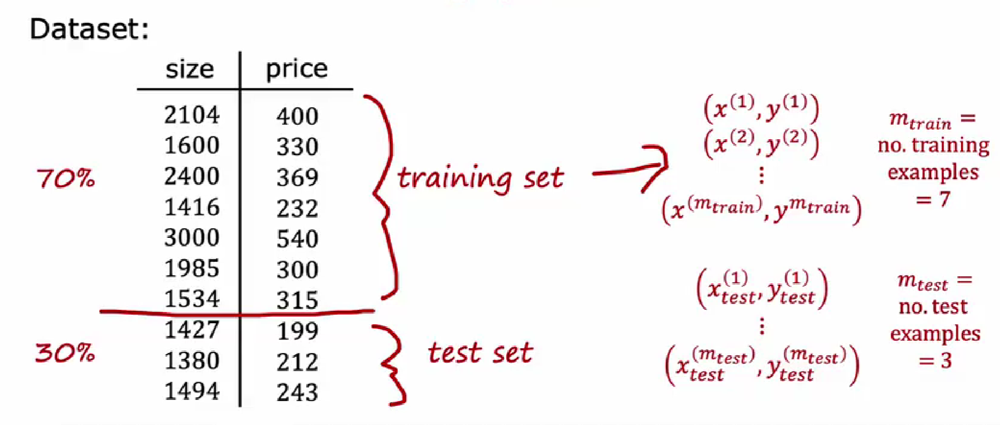

通常来说,训练集的数据量和测试集的数据量是7-3分或者8-2分,这种方法称为**留出法 (Hold-out Method)**。直接将数据集D划分为两个互斥的集合，一个作为训练集S，另一个作为测试集T，即 $D = S \cup T, S \cap T = \emptyset$。

有一些别的划分方法,如下所示:

1.  **k折交叉验证 (k-Fold Cross-validation)** :
    *   将原始数据集D划分为k个大小相似的互斥子集，$D = D_1 \cup D_2 \cup \cdots \cup D_k, D_i \cap D_j = \emptyset (i \neq j)$。
    *   每次用k-1个子集的并集作为训练集，余下的那个子集作为测试集。
    *   这样可以获得k组训练/测试集，从而可进行k次训练和测试。
    *   最终返回的是这k个测试结果的均值。k最常用的取值是10（称为10折交叉验证），其他常用的值有5、20等。
    *   **留一法 (Leave-One-Out Cross-Validation, LOOCV)** : 是k折交叉验证的特例，当k等于样本数m时。每次只留下一个样本作为测试集，其余m-1个样本作为训练集。计算开销较大。

2.  **自助法 (Bootstrapping)** :
    *   以自助采样 (bootstrap sampling) 为基础。给定包含m个样本的数据集D，我们对它进行采样产生数据集D'：每次随机从D中挑选一个样本，将其拷贝放入D'，然后再将该样本放回初始数据集D中，使得该样本在下次采样时仍有可能被采到。
    *   重复执行m次后，我们就得到了包含m个样本的数据集D'。
    *   可以估计出样本在m次采样中始终不被采到的概率大约是 $ (1 - 1/m)^m \approx e^{-1} \approx 0.368 $。
    *   因此，通过自助采样，初始数据集D中约有36.8%的样本未出现在采样数据集D'中。于是我们可将D'用作训练集，D\D'用作测试集。这样的测试结果，亦称为“包外估计” (out-of-bag estimate)。
    *   自助法在数据集较小、难以有效划分训练/测试集时很有用。

以曲线拟合为例,如果输入只有一个特征,我们就可以尝试在二维平面上给我们的数据拟合曲线,但是,在没有机理支持的情况下,我们是不知道多项式函数的次数的,所以,对不同的模型,我们都要尝试进行拟合,然后看这个model在测试集上的表现

通常用$J_{test}$均方误差来表示模型的泛化误差:

$$
J_{test}=\frac{1}{2m}\sum_{i=1}^{m_{test}} (f(\vec{x_i})-y_i)^2
$$

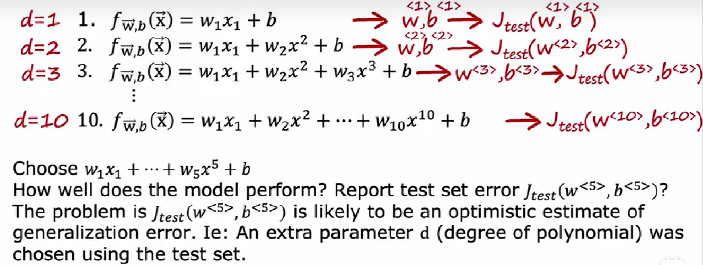

选一个$J_{test}$最小的次数,这样我们就找到了最好的模型.

实际上这样有一个问题,这种方法确实可以找到最好的模型,但是其所估计的泛化误差往往要比实际的泛化误差要来的小.这是因为,挑选最小误差的时候,我们就已经将数据和误差做一定的拟合的,这样的估计往往是过于乐观的.于是,我们需要引入交叉验证集来解决泛化误差不准确这一问题.

## 交叉验证测试集

从训练集和测试集中各拿出总额的百分之10组成交叉验证测试集,这样数据集就被6-2-2分:

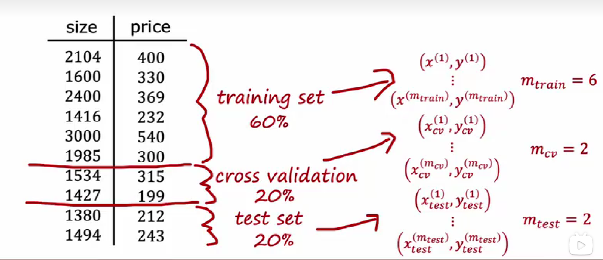

这样,我们利用交叉验证集的均方误差$J_{cv}$来挑选最佳model,然后再在测试集上测试这个model的泛化误差,这样得到的泛化误差就是公平的没有偏差的.

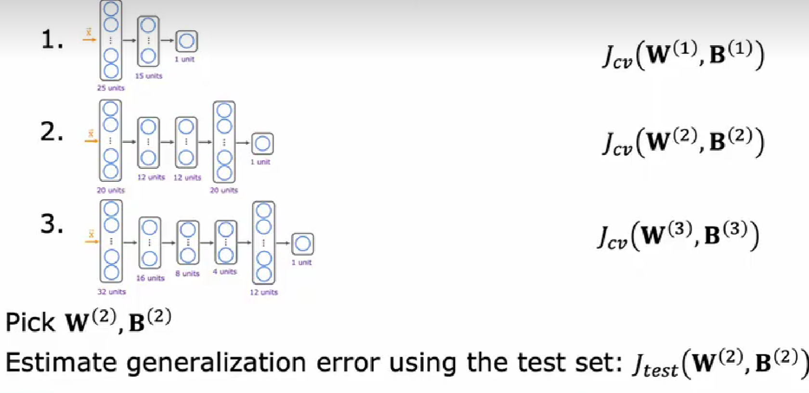

## 方差和偏差

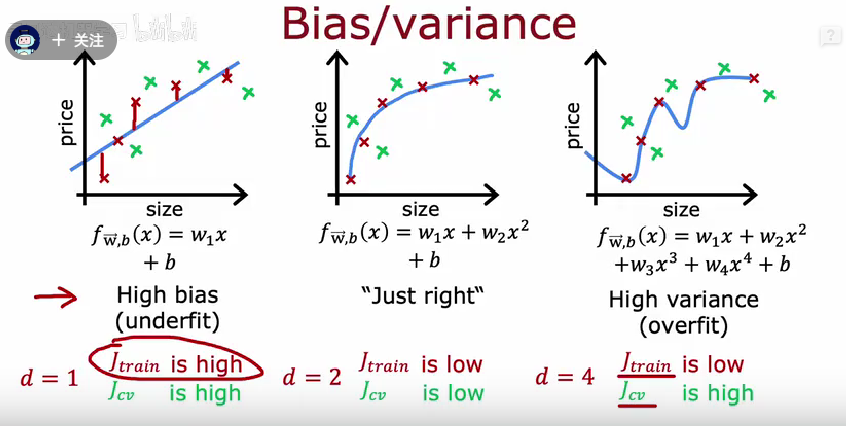

如果我们的模型在训练集上表现的很好,这个时候就意味着他的偏差比较低,如果模型的泛化能力较差,一点点数据的改变就容易造成模型评估的急剧改变,也就是$J_{cv}$较高,那么我们就称这个模型具有较高的方差

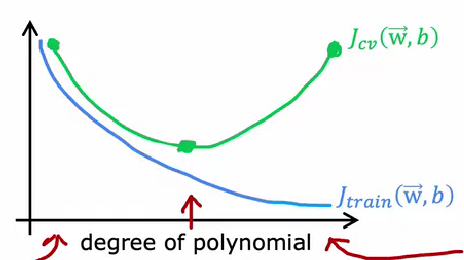

以多项式拟合为例,一个较为优秀的模型应该同时具有较低的偏差和较低的方差,低偏差可以通过最小化代价函数实现,而低方差往往需要我们逐步去调整参数来寻找最优参数.

$$
f(x)=w_0+w_1x+w_2x^2+ \cdots +w_4x^4
$$

不仅仅是多项式的次数会影响模型的泛化能力,多项式的系数往往也会影响,所以我们在前面已经提出过了正则化的办法去解决这样一个问题,通过引入正则化参数和正则项,在最小化代价函数的同时去惩罚系数:

$$
J(w,b)=RMSE+\frac{\lambda}{2m}\sum_{i=1}^4 w_i^2
$$

这个$\lambda$的选择就有一定的讲究,如果$\lambda$取得太大,那么代价函数就会过于重视这个正则项从而使得所有的参数都变得很小,反之,就有可能不能很好的惩罚系数,模型依旧存在过拟合的风险.


所以,手动选择一些系数$\lambda$,然后计算不同参数下的泛化误差,最后得到最好的$\lambda$值

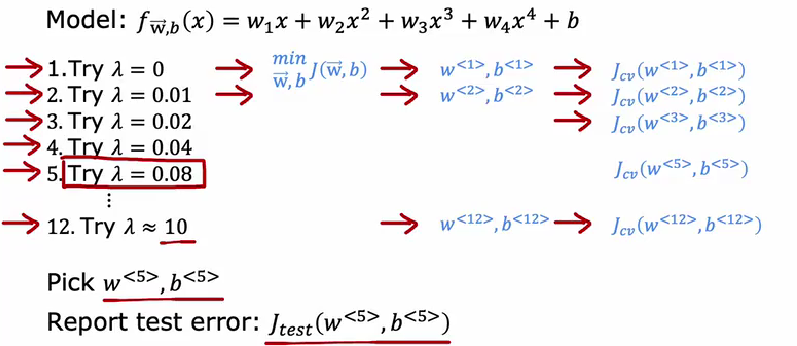

其训练误差和泛化误差的曲线可能是这样的:

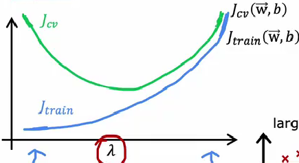

## 表现基准

评价一个模型好坏的时候,我们不仅仅只根据训练误差和泛化误差的绝对值来判断,而是要建立一个表现基准.

以语音识别为例:

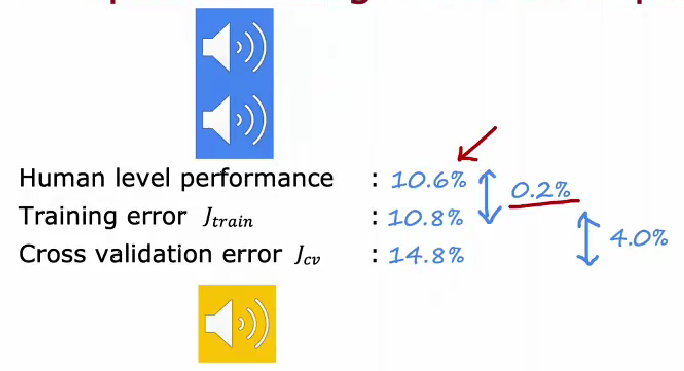

可能模型的训练误差高达百分之十,但是相对于人类来讲,这已经足够低了,因为输入的音频中可能存在大量的噪声,这不再是模型的问题,以人类为表现基准,模型的偏差已经足够小了.

同时,我们用$J_{cv}-J_{train}$来表示这个模型的泛化能力,以及他是否具有高方差.

## 学习曲线

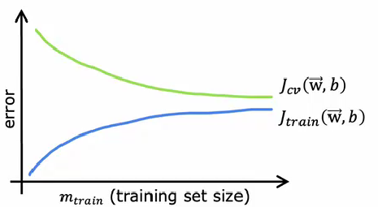

$J_{cv},J_{train}$随着训练集规模变化的曲线被称作学习曲线.

随着训练集规模的增长,难免会引入大量的随机误差,所以训练误差一直在增长,但是,随着数据的增多,模型也会越来越准确,所以泛化误差会一直减小,然而,泛化误差永远会大于训练误差,这就导致两个误差会随着训练集数目的增长趋向于某一个极限.

当我们的模型选定的时候,增大数据集的规模确实会使得某些参数更加准确,但是泛化误差不会永无止境的减少,当减少的量过少的时候,就没有必要再收集更多的数据了.

对于高偏差的体系(离渐近线很远),收集较多的数据还是十分有效的.

## 神经网络的方差和偏差

对于神经网络,大量的实践证明,通过合理的调整参数,规模较大的神经网络的表现往往好于至少不弱于规模较小的神经网络,如果一个神经网络在训练集上表现不够好,通过继续扩大神经网络的方法,我们可以进一步减少偏差,直到他在训练集上表现良好,接着将这个神经网络放到测试集上进行测试,如果表现不够好,那么说明神经网络过拟合了,这个时候只需要增加更多的数据,然后回到前面的循环中,直到模型的方差和偏差都很小,这个算法才终止.

具体的流程如下图所示:

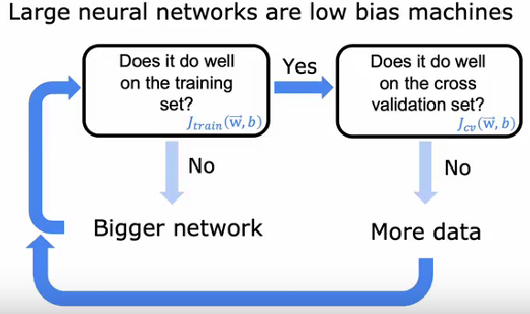

同理,也可以通过在神经网络的层中加入正则化系数来减少过拟合的风险,对应的TensorFlow指令如下:

```python
layer_1=Dense(units=25,activations='relu',kernel_regularizer=L2(0.01))
```

每个层可以指定不同的正则化系数

## 迁移学习

如果你想要训练一个神经网络,那么就需要花费很多时间去收集数据,调整参数,比较麻烦,事实上,有一种手段可以加速这个过程,那就是使用别人训练好的神经网络.

也许这个神经网络是用来识别小猫,小狗,车辆和行人的,而我们想要识别1到9的手写数字.注意到识别小猫小狗的神经网络也是识别图像的分类功能神经网络,所以我们只要把它的输出层9个神经元的输出就可以了,你会惊人的发现,识别小猫小狗的神经网络在识别手写数字上仍然有不错从表现.

当然,不应该直接野蛮的拿来使用.

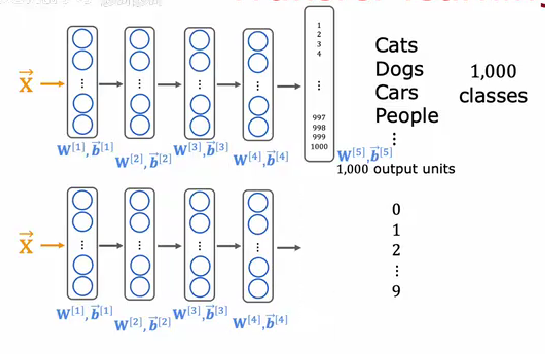

1.我们可以重新对更换的层的系数进行训练,得到时候你的数据的系数

2.如果时间比较充分,可以对整个神经网络的系数重新进行训练,这样得到的结果能够更好描述你的数据集,又因为神经网络是经过预训练的,所以参数的调整的步伐也不会很大.

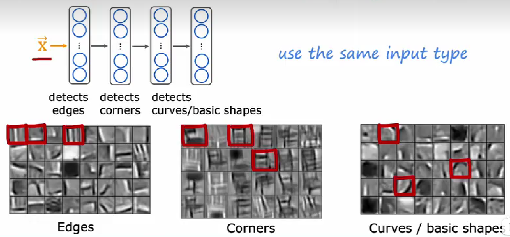

为什么可以迁移,事实上,相同或者类似任务的神经网络具有潜在的不为人知的相同运作机理,例如第一个层的任务是识别一些边缘,第二个层则是识别一些角落,第三个层就开始识别一些曲线和基本图像,这些潜在的相似的作用机理导致了神经网络在不同的数据集上具有类似的效果.


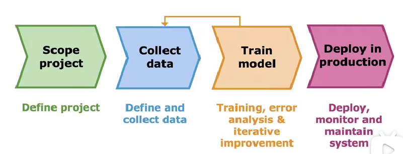