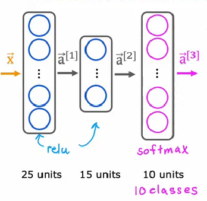

# Softmax

## 改进输出层

依靠logistic模型搭建的神经网络最后会给出一个输出a,用于估计y=1的概率有多少,这实际上也给出了y=1的概率,所以我们认为二分类模型给出了两个输出,现在产生了一个新的问题,我的分类类别不止一个怎么办,这就是所谓的多分类模型.

在二分类神经网络的最后一层输出,我们认为:

$$
P(y=1|\vec{x})=a^{[n]}=\frac{1}{1+e^{-w^{[n]\cdot a^[n-1]+b^{[n]}}}}=\frac{1}{1+e^{-z}}
$$

Softmax算法在最后一层的激活函数上做了改进,假设我们现在有9个类,每个类被编号成为1,2,...,9,那么输入被评估为1号类的概率为:

$$
P(y=1|\vec{x})=\frac{e^{-z_1}}{e^{-z_1}+e^{-z_2}+ \cdots +e^{-z_9}}=a^{[n]}_1
$$

对于被评估为其他类的概率,也和上面的形式类似

$$
a^{[n]}_j=\frac{e^{-z_j^{[n]}}}{\sum_{i=1}^9e^{-z^{[n]}_i}}
$$

$$
z_j^{[n]}=\vec{w}^{[n]}_j\cdot \vec{a}^{[n-1]}+b^{[n]}_j
$$

所以,只需要对输出层做一个小小的改进,一个二分类的神经网络就可以变成多分类的神经网络

## 改进代价函数

我们知道,logistic回归的损失函数是二元交叉熵:

$$
L(f,y_i)=-(1-y_i)\log(1-f(\vec{x_i}))-y_i\log(f(\vec{x_i}))=-(1-y)\log(a_2)-y\log(a_1)
$$

实际上就是:

$$
loss=\begin{cases} -\log(a_1), &y=1  \\ -\log(a_2), &y=0  \end{cases}
$$

所以推广一下就得到分类交叉熵:

$$
loss=\begin{cases} -\log(a_1), &y=1  \\ -\log(a_2), &y=2\\\vdots\\-\log(a_9),&y=9  \end{cases}
$$



## 代码实现

老样子导入TensorFlow库之后设定层数和神经元个数,库就能自动优化参数,不过,由于softmax涉及到的变量比较多,会产生很多的中间变量,于是就在数值计算上存在精度误差

例如,代价函数为:

$$
loss=-\log(a_j^{[n]})=-\log(\frac{e^{-z_j^{[n]}}}{\sum_{i=1}^9e^{-z^{[n]}_i}})
$$

如果将a的表达式代入,TensorFlow就可以重新排列组合去减少浮点数的计算误差,就像这样:

$$
a=(\frac{1}{100000}-1)+(1+\frac{1}{100000})=\frac{2}{100000}
$$

使用化简之后的式子计算能有效减少浮点数运算带来的精度损失.

只需要在model.compile的代价函数添加一个参数:

```python
model.compile(loss=SparseCrossEntropty(from_logits=True))
```
这么做了之后,输出层就不需要再做一次softmax的运算了,所以输出层的激活函数可以改成线性激活函数.

为了提高运算速度,可以将hidden_layer中的sigmoid激活函数换成relu

全部代码如下:

```python
import tensorflow as tf
import pandas as pd
import numpy as np

from tensorflow.keras import Sequential

from tensorflow.keras.layers import Dense 

model = Sequential([
    Dense(units=128,activation='relu'),
    Dense(units=64,activation='relu'),
    Dense(units=32,activation='relu'),
    Dense(units=16,activation='relu'),
    Dense(units=10,activation='linear')
])

# 引入分类交叉熵

from tensorflow.keras.losses import SparseCategoricalCrossentropy

model.compile(loss=SparseCategoricalCrossentropy(from_logits=True))

# 引入数据集

df = pd.read_csv(r'E:\project\my-project\docs\theroy\machine-learning\神经网络模型\multi_class_dataset.csv')

# 训练集
X=np.array(df.drop(columns='target').values)[0:800]

y=np.array(df['target'].values)[0:800]

# 测试集

X_1=np.array(df.drop(columns='target').values)[800:]
y_1=np.array(df['target'].values)[800:]


model.fit(X,y,epochs=100)

logits = model(X_1) # 注意这里神经网络输出的只是z值,我们还要自己加一个softmax

output=np.array(tf.nn.softmax(logits)) # 可以根据这个得到测试集的输出.

# 下一步,选出测试集的每个输出向量中概率最大的那个,然后将它认为是输出

y_final=np.zeros((200))

for i in range(200):
    y_final[i]=np.argmax(output[i])

# 评估误差
s=0

for i in range(200):
    if y_final[i]!=y_1[i]:
        s=s+1

print(f'准确率为:{1-s/200}')

```

预测成功率只有一半,非常感人:

```
准确率为:0.515
```
