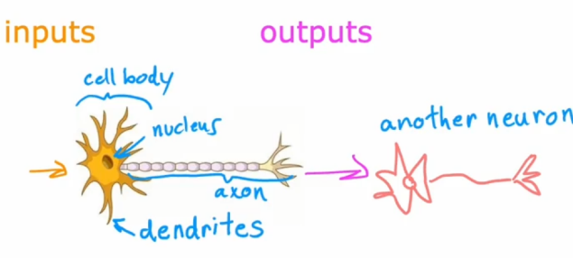
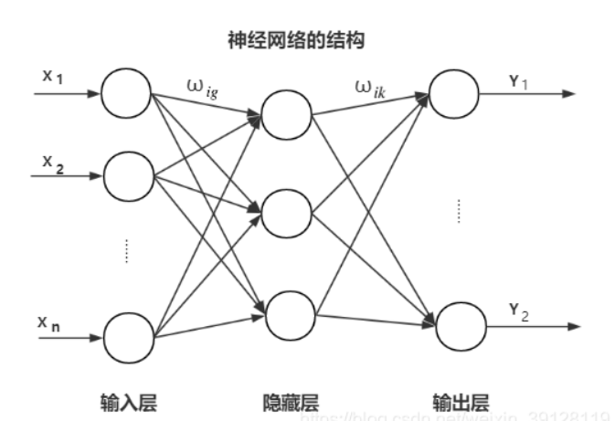
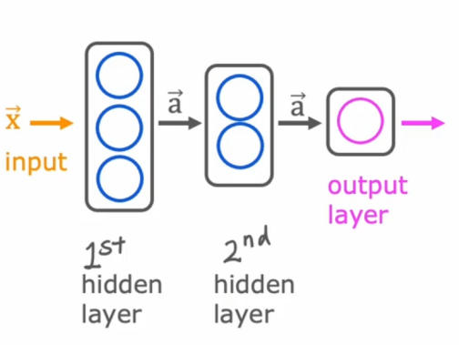
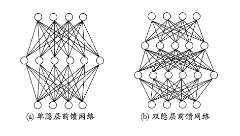
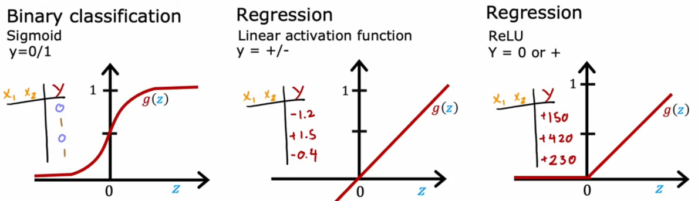
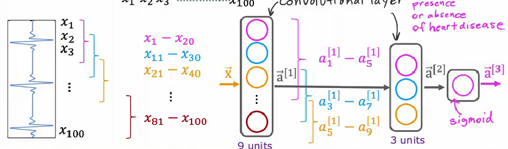

# 神经网络的基本概念

## 神经元

神经网络是仿照人体神经元的运行机制提出的概念,我们知道,人体的神经元包括轴突,胞体和树突,神经元从树突接受化学信号刺激,将它转化为电信号后传导至轴突,最后转化为化学信号传导至下一个神经元,神经网络的设计就仿照了这个思路,其基本单元也叫做神经元,具有最简单的三个功能,接收输入,处理数据,输出数据,一个个神经元就构成了庞大的神经网络,这些不同类型的神经元的不同组合会使得神经网络具有不可思议的功能.



从上面的定义看来,神经元其实就是一个函数,接受变量,处理变量,输出变量,我们通常用g来表示这个函数:

$$
y=g(z)
$$

一个个神经元的链接构成了神经网络,在机器学习中,这些神经网络通常不是随便排布的,而是根据其处理目的和功能的不同分为好几个层(layer),每个层由若干个神经元构成



一个神经网络通常由一个input layer 一个output layer 以及若干个hidden layer组成,这些隐藏层分批处理不同的功能,例如人脸识别,一开始可能只是识别某些边缘线条,到第二层可能就是识别某些五官,再下一层可能就是识别一个个面部.

神经网络的结构有很多,最经典的就是一个前向传播神经网络,这个神经网络的传递是单向的,在一开始的隐藏层中,神经元的数目较多,随着层数的递增,每一层的神经元的个数逐渐减少,最后在输出层中由一个神经元输出.





神经元中的函数被称作激活函数,通常输入要先做一个线性映射到激活函数的定义域,然后再经过激活函数运算后得到输出.

我们知道,二分类问题的回归函数通常是sigmoid函数,他可以将输入变成一个0-1之间的概率值,如果用神经网络来处理二分类问题,它的激活函数也通常是sigmoid函数,假设第一层输入一个m维的向量x,输出一个n维的向量a,那么运算可以这么表示:

首先,对每个神经元:

$$
a^{[1]}_i=g(\vec{w_i}\cdot\vec{x}+b_i)
$$

所以输出为:

$$
\vec{a^{[1]}}=
\begin{bmatrix}
    g(\vec{w_1}\cdot\vec{x}+b_1)\\
    g(\vec{w_i}\cdot\vec{x}+b_2)\\
    \vdots\\
    g(\vec{w_n}\cdot\vec{x}+b_n)
\end{bmatrix}=g\left(
\begin{bmatrix}
    w_{11}&,w_{12}&, \ldots &,w_{1m}\\
    w_{21}&,w_{22}&, \ldots &,w_{2m}\\
    \vdots&,\vdots&, \ddots&,\vdots\\ 
    w_{n1}&,w_{n2}&, \ldots &,w_{nm}\\
\end{bmatrix}
\begin{pmatrix}
    x_1\\
    x_2\\
    \vdots\\
    x_n
\end{pmatrix}+
\begin{bmatrix}
    b_1\\
    b_2\\
    \vdots\\
    b_n
\end{bmatrix}
\right)
$$

对于每一层,都有类似上述关系的输入输出,神经元的个数设计要合理,神经网络的搭建要合理,然后,最后就是调参的任务了,写出要做的任务的代价函数,然后最小化神经网络输出的代价函数来确定这个参数,一个神经网络的搭建工作就完成了,听起来是不是很扯淡,为什么这么多个激活函数的累加输出就能完成一个看起来比较复杂的任务,甚至随着神经网络的规模愈发庞大,其表现有可能会发生突跃.作为一个初学者,我很难从数学上或者逻辑上去解释这件事情,但是我们可以从直观上或者经验上来理解这一客观事实.

## 激活函数

对于不同的任务,神经元中的激活函数也可以大为不同,常见的激活函数有以下三种:



对二分类问题,通常选用的是sigmoid函数作为激活函数,对于回归,我们可以选用线性激活函数和RelU函数,Relu函数的应用更加广泛,不仅可以用于回归,也可以用于分类,并且,从函数形状上来看,用Relu搭建的神经网络的代价函数的梯度会比较大,有利于参数的快速迭代收敛,其运算速度更快:

$$
Relu:g(z)=\max\{0,z  \}
$$

## 构建神经网络

在解决问题的时候需要我们快速构建一个神经网络,这就需要用到一些高度集成化的库,例如Tensorflow,我们不必再费尽心思写出代价函数再去执行梯度下降,Tensorflow有更加高效,快捷的运算方法和特殊的储存数据的结构.

```python
import tensorflow as tf

import numpy as np

import pandas as pd

from tensorflow.keras import Sequential

from tensorflow.keras.layers import Dense 

from tensorflow.keras.losses import BinaryCrossentropy

# 加载数据
data = pd.read_csv(r'E:\project\my-project\docs\theroy\machine-learning\神经网络模型\data.csv')

# 分离特征和标签
X = np.array(data[['Feature1', 'Feature2']].values.tolist() ) # 将特征转换为列表
Y = np.array(data['Label'].tolist() ) # 将标签转换为列表


#创建一个神经网络,Dense是层的类型名称
model = Sequential([
    Dense(units=25,activation='sigmoid'),
    Dense(units=15,activation='sigmoid'),
    Dense(units=1,activation='sigmoid')
])

# 这里使用的损失函数是二元交叉熵,我也不知是啥东东,好像就是logistic回归的代价函数
model.compile(loss=BinaryCrossentropy)

# 最小化损失函数,这一步就相当于确定模型的参数
model.fit(X,Y,epochs=100)

# 迭代次数不能过多,否则会存在过拟合的风险,这和回归的梯度下降迭代还是不太一样.

# 假设 new_data 是一个包含新样本特征的 NumPy 数组，形状与 X 类似
new_data = np.array([[3.5, 2.5], [6.0, 2.0], [1.5, 1.0]])  # 示例数据

# 使用训练好的模型进行预测
predictions = model.predict(new_data)

# 打印预测结果
print(predictions)

```

如果是回归问题,只需要改一下损失函数为均方误差:

```python
model.compile(loss=MeanSquaredError)
```

## Adam算法

我们知道,神经网络参数的训练是基于梯度下降的,所以会有一个学习率的设定.然而,学习率的设置往往并不如人意,要么就是学习率过低导致算法收敛速度过慢,要么就是学习率太高导致接近极小值的时候输出来回震荡难以收敛,所以,如果能够动态调整学习率,就可以在保证收敛速度的同时保证精度

只需要加一个参数项就能调用adam算法

```python
model.comlipe(optimizer=tf.keras.optimizers.Adam(learning_rate=1e-3),...)

# 需要你自己指定一个初始的学习率值
```

## 卷积层

除了Dense layer,神经网络中还有一些其他的层,例如在图像识别中应用非常多的卷积层(Convolutional layer),由卷积层构成的神经网络被称为卷积神经网络.

卷积层中的每个神经元只负责处理图像的一部分区域,他们处理区域的并集就是整个图像,这样处理的好处就是可以提升神经网络的运算速度,需要更少的数据,并且可以有效避免过拟合.



例如上面是一个根据心电图识别是否有心脏疾病的神经网络,每个神经元观察心电曲线的不同部分,这些特征经过综合得到评估结果.

