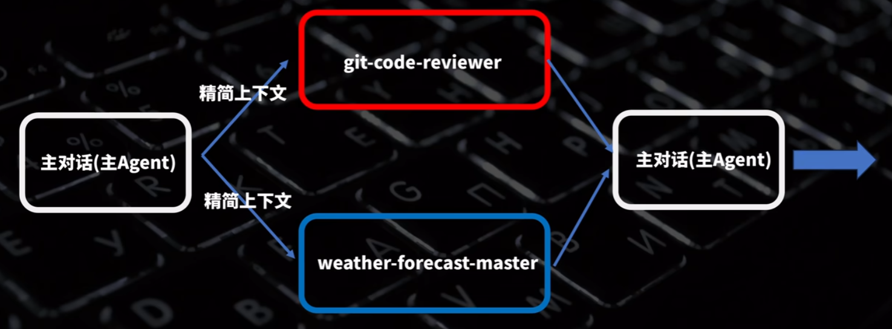

# claude code

## 安装

首先要先安装 Node.js，之后运行命令 `npm install -g @anthropic-ai/claude-code` 即可将 Claude Code 安装到全局环境中，在命令行中使用 `claude` 命令即可启动 Claude Code。

## 启动

直接使用 `claude` 启动软件会跳转到 Claude 的登录界面，通常比较难以拥有一个账号，故往往采用配置 API key 的方式，配置 API key 有三种方式：

1. 对于支持 Claude Code 的模型，可以直接构建环境变量 `ANTHROPIC_BASE_URL`，变量值为模型提供方提供的 base_url，以及 `ANTHROPIC_API_KEY` 变量，变量值为对应的 API key。值得注意的是，如果调用的是海外模型，需要设置网络环境变量，新建 `HTTP_PROXY` 和 `HTTPS_PROXY` 变量，变量值设置为 `http://127.0.0.1:VPN的端口号`
2. 除了直接编辑系统环境变量外，还可以编辑 `settings.json` 文件引入 API。该文件位于 `用户名/.claude` 目录下，以配置智谱的 GLM 模型为例，将 `settings.json` 的内容替换为：

```
# 编辑或新增 Claude Code 配置文件 `~/.claude/settings.json`
# 新增或修改里面的 env 字段
# 注意替换里面的 `your_zhipu_api_key` 为您上一步获取到的 API Key
{
    "env": {
        "ANTHROPIC_AUTH_TOKEN": "your_zhipu_api_key",
        "ANTHROPIC_BASE_URL": "https://open.bigmodel.cn/api/anthropic",
        "API_TIMEOUT_MS": "3000000",     # 最大请求时间
        "CLAUDE_CODE_DISABLE_NONESSENTIAL_TRAFFIC": 1
    }
}
```

Claude Code 中显示的还是 Claude 系列的模型，根据智谱官方的说法，其对应关系如下：


或者可以在 env 中添加环境变量来更改名称：

```
 "ANTHROPIC_DEFAULT_HAIKU_MODEL": "glm-4.5-air",
 "ANTHROPIC_DEFAULT_SONNET_MODEL": "glm-4.7",
 "ANTHROPIC_DEFAULT_OPUS_MODEL": "glm-4.7"
```

3. 对于一些不能直接接入 Claude Code 的模型，可以使用 claude-code-router 进行代理转发，该项目的 GitHub 地址为：`https://github.com/musistudio/claude-code-router`，同样，使用 npm 安装：`npm install -g @musistudio/claude-code-router`。然后在 `username/claude-code-router/config.json` 中进行模型配置。这个文件夹和文件在首次运行 `ccr code` 后被自动创建，也可以手动创建。

一个示例的配置文件为：

```
{
  "Providers": [
    {
      "name": "modelscope",
      "api_base_url": "https://api-inference.modelscope.cn/v1/chat/completions",
      "api_key": "your api-key",
      "models": ["Qwen/Qwen3-Coder-480B-A35B-Instruct", "Qwen/Qwen3-235B-A22B-Thinking-2507"],
      "transformer": {
        "use": [
          [
            "maxtoken",
            {
              "max_tokens": 65536
            }
          ],
          "enhancetool"
        ],
        "Qwen/Qwen3-235B-A22B-Thinking-2507": {
          "use": ["reasoning"]
        }
      }
    }
  ],
  "Router": {
    "default": "modelscope,Qwen/Qwen3-Coder-480B-A35B-Instruct",
    "thinking": "modelscope,Qwen/Qwen3-235B-A22B-Thinking-2507"
  }
}
```
摩搭社区每天提供 2000 次 Qwen-3-coder 模型的免费调用，需要绑定阿里云账号。

在每次更改完毕 config 文件后，建议使用 `ccr stop` 先暂停然后重启确保配置生效，使用 `ccr code` 启动。

## 重要命令

`/init`:

通读当前目录下的所有文件，生成对整个项目的描述文件 CLAUDE.md，该文件将作为上下文一直被添加到对话中，并且可以支持手动修改。

`/compact`: 压缩上下文，减少 tokens 数消耗，指令后可以增加描述来告诉模型如何进行压缩。

`/clear`: 清除该对话的上下文。

`think`, `think hard`, `think harder`, `ultrathink`: 加在提示词之前用于决定模型的思考长度。

`!`: 使用 `!` 暂时进入命令行模式从而可以自主执行命令，命令的执行历史记录会作为对话的上下文被模型感知到。

使用 Esc 命令可以打断当前模型的思考，Ctrl+C 可以退出 Claude Code。

`/ide`: 在 VSCode 中下载 Claude Code 插件后可以使用，打通 IDE 和 Claude Code，使用该命令后软件可以感知到在 IDE 上的文件、文件位置、光标，同时修改也同步反馈在 IDE 中，如果直接在 VSCode 的终端中启动则不需要运行。

## MCP

MCP 即模型上下文协议，该协议可以代替人类帮助模型访问外部工具，实现对计算机软件的便捷操纵。

这里以 Context7 为例展示如何在 Claude Code 中配置 MCP，Context7 是一个帮助模型读取某个库的最新文档的 MCP 工具。

```
claude mcp add context7 -- npx @upstash/context7-mcp
```
这样安装的 MCP 是项目级别的，只在当前目录下生效，增加 `--scope user` 使得 MCP 工具为用户级别：

```
claude mcp add context7 --scope user -- npx @upstash/context7-mcp
```

使用命令 `/mcp` 可以观察和管理已安装的 MCP server，调用 MCP 的时候，只需口头增加一句 use ... mcp 即可。

## 权限控制

`/permissions` 命令可以进行权限控制，这样 Claude Code 在执行某些命令的时候可以选择性地让用户进行审核，总共有 allow、ask、deny 三个级别，workspace 选项可以定义除当前项目目录外的可访问目录。

例如，可以在 allow 中定义终端命令：

```
Bash(mkdir:*)
```

确保每次创建文件夹的时候不需要进行审核。对于 MCP 工具的权限，使用命令 `mcp__mcp_name` 即可。

如果想要一次性开放所有权限，退出 Claude Code 后在终端中使用命令 `claude -dangerously-skip-permissions`。

## 自定义命令

在项目目录或者用户目录下找到 `/.claude` 文件夹，如果没有则手动创建一个，在该文件夹下创建 `commands` 文件夹，书写一个 `command_name.md` 的文件，内部包含你对这个命令的自然语言描述。

例如，我定义了一个语法检查的命令 `grammar_review`：

```
对于这个文件 $ARGUMENTS，检查语法错误并且纠正语法错误
```

使用方法为 `/grammar_review doc_name`，$ARGUMENTS 定义的是传入的参数。

## Hook

Hook 即钩子，它会挂载在 Claude Code 执行任务的过程中，当执行完特殊指令后，会自动执行 Hook 指定的任务，例如，在每次写完代码后就可以使用 Hook 检查书写的代码是否符合格式。

在 `/.claude` 文件夹下创建文件 `settings.json`，在配置文件内部创建 hook：

```json
{
    "hooks":{
        "PostToolUse":[
            {
                "matcher": "Edit|MultiEdit|Writer",
                "hooks": [
                    {
                        "type":"command",
                        "command":"npx prettier --check ."
                    }
                ]
            }
        ]
    }
}
```

定义了 Hook 使用的时机和 Hook 的类型，这里的定义方式是在编辑文件之后，运行命令 `npx prettier --check .`。

同样还可以定义其他的 Hook 类型。

## Sub Agent

使用`/agents`命令可以定义sub agent,当主智能体接受到上下文的时候,他会将任务进行拆解和压缩,然后分发给我的定义的不同的sub agent,实现并行,协同化的高效工作:



## 历史对话

使用`/resume`命令可以找到当前项目下的所有历史对话,切换进历史会话后敲两下Esc即可选择跳转至那一句对话之前,但是只能还原对话,不能撤销claude code对文件的修改.

使用开源项目ccundo可以在撤销对话的同时撤销对应的操作.

项目地址:https://github.com/RonitSachdev/ccundo.

还有一种方式就是使用开源项目claudia,现在改名叫做opcode了,找到这个项目的forks中stars数最高的那个,这个分支提供了安装包,软件提供了claude-code的可视化界面,并且支持保存每个对话的checkpoint,可以直接回退对话和操作内容.
