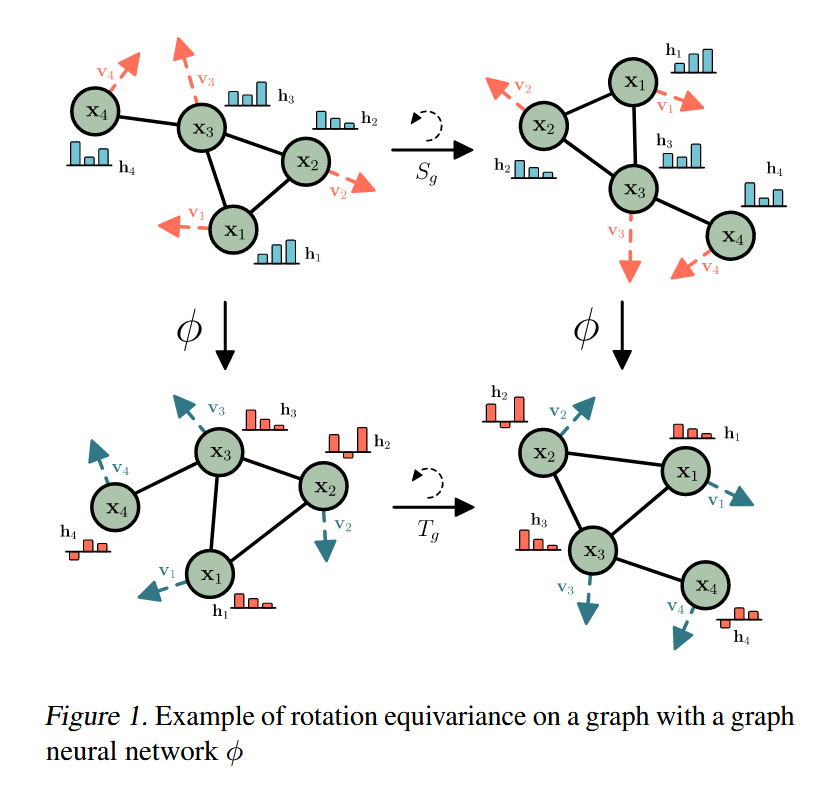
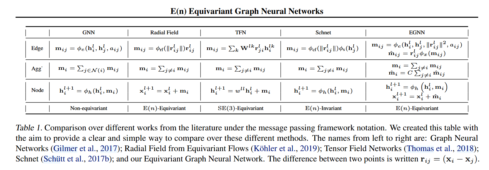
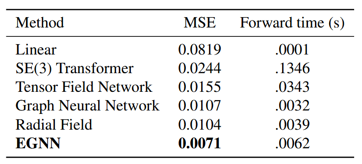
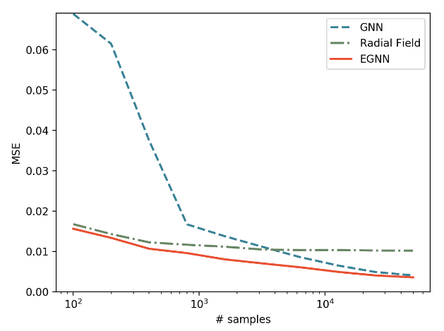
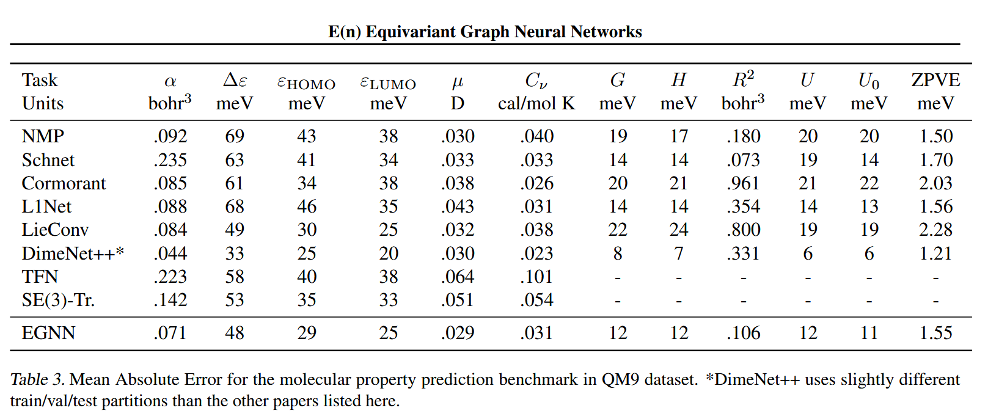

# EGNN

arxiv地址:https://arxiv.org/abs/2102.09844

## Introduction

EGNN是最简单的等变图神经网络,其全称为E(n)等变的神经网络,不仅仅可以应用在三维空间的场景,在更多复杂的场景中也可以适用以提升表达能力.

和先前的等变神经网络很不一样的一点是,EGNN将坐标作为层与层之间的传播变量并且发生变化,而不是使用固定的相对位置矢量,这和其等变性的设计有关,论文的这张图就很清晰的展示了EGNN的作用过程:

## 模型架构

其核心模型公式如下所示,只是在消息传递中插入了坐标的更新以及坐标更新的消息,这是一个非常巧妙和简洁的设计:

$$
\begin{aligned}
\mathbf{m}_{ij} &= \phi_{e}\!\left(h_i^{l},\, h_j^{l},\, \left\lVert \mathbf{x}_i^{l} - \mathbf{x}_j^{l}\right\rVert^{2},\, a_{ij}\right) \\
\mathbf{x}_i^{l+1} &= \mathbf{x}_i^{l} + C \sum_{j \ne i} \left(\mathbf{x}_i^{l} - \mathbf{x}_j^{l}\right)\, \phi_{x}\!\left(\mathbf{m}_{ij}\right) \\
\mathbf{m}_i &= \sum_{j \ne i} \mathbf{m}_{ij} \\
h_i^{l+1} &= \phi_{h}\!\left(h_i^{l},\, \mathbf{m}_i\right)
\end{aligned}
$$

如果说需要对粒子的轨迹进行模拟,需要输入粒子的初速度到模型中,这个时候只需要对消息传递和更新做一些细微的修改,引入中间变量v,当v_init=0的时候,还原为上面的表达式:

$$
\begin{aligned}
\mathbf{v}_i^{l+1} &= \phi_{v}\!\left(h_i^{l}\right)\,\mathbf{v}_i^{\mathrm{init}} + C \sum_{j\ne i} \left(\mathbf{x}_i^{l} - \mathbf{x}_j^{l}\right)\, \phi_{x}\!\left(\mathbf{m}_{ij}\right) \\
\mathbf{x}_i^{l+1} &= \mathbf{x}_i^{l} + \mathbf{v}_i^{l+1}
\end{aligned}
$$

论文中的这张表格对比了不同模型之间的差异:

## 应用

对于N体系统,知道其初始位置初始速度以及相互作用力的方式,就可以预测未来任意一个时刻N体系统各个粒子的位置,现在我们在不同的timestep上用时间网络来还原这个过程:

|||
|:--:|:--:|
|各个模型对多体系统未来位置的预测误差以及前向传播时间|不同模型误差随样本量增长的曲线|

作者也在QM9数据集的物性预测上做了实验:

尽管没有达成SOTA,但是预测效果也是非常好的.