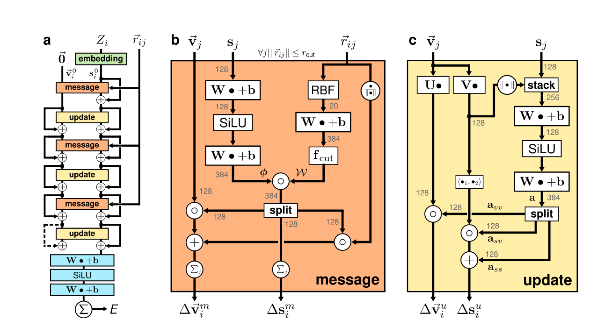
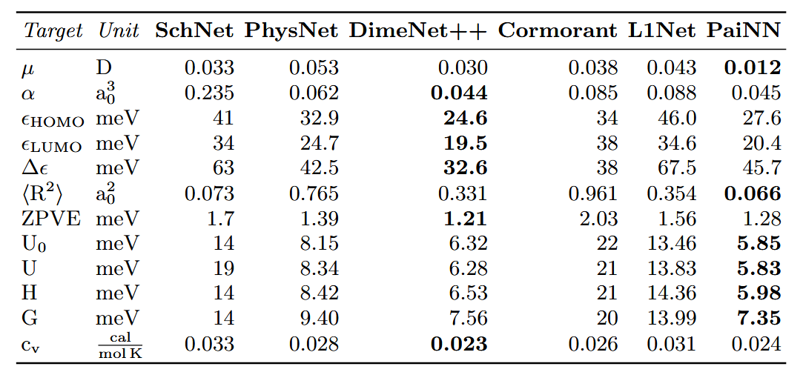
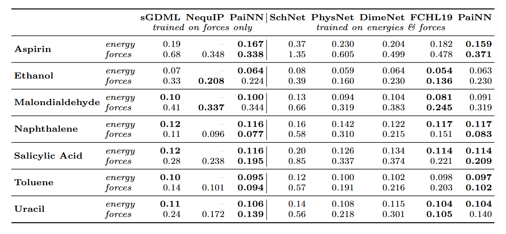
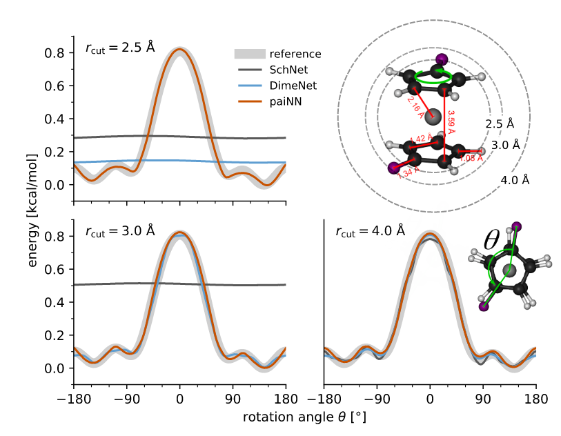
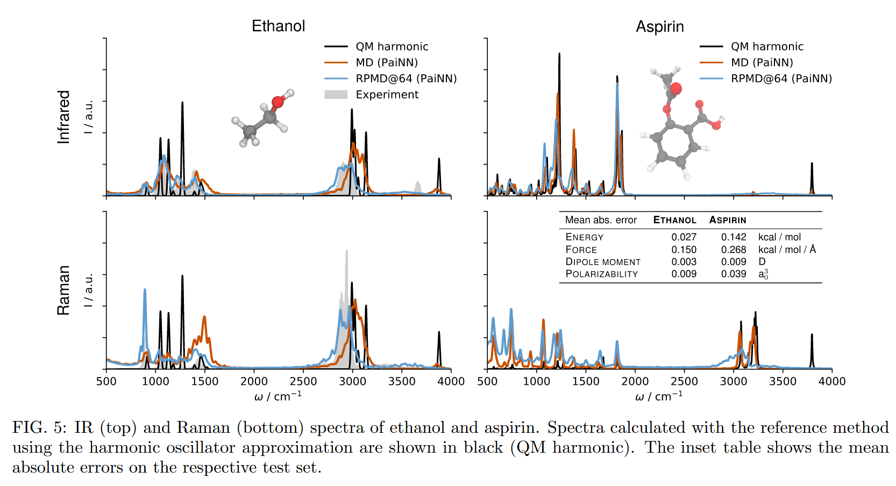

# PaiNN

arxiv地址:https://arxiv.org/abs/2102.03150

## Introduction

PaiNN的全称为POLARIZABLE ATOM INTERACTION NEURAL NETWORK,即极化原子相互作用网络,其核心用途是用来预测高阶张量性质.

painn是一个一阶等变图神经网络,其最高利用了一阶的等变张量信息,是Schütt等人对Schnet的改进,成功捕捉了角向信息,从而更好的描述了分子的性质,在QM9数据集上取得了部分SOTA.

## 模型架构

模型的主要架构如图所示,可以看到,模型主要由两个核心组件构成,即等变消息传递和等变更新

消息传递:

$$
\Delta s_i^m = \sum_j \phi_s(s_j)\circ W_s(\left\| \mathbf r_{ij} \right\|) 
$$

这和SchNet使用了相同的连续滤波卷积消息传递.

对于矢量特征,其由两个部分组成,其一是作用在原本矢量特征上的加权平均,其二是距离方向的单位矢量带来的矢量更新:

$$
\Delta \mathbf v_i^m = \sum_j \mathbf{v}_j \circ \phi_{vv}(s_j) \circ W_{vv}(\left\| r_{ij} \right\|) + \sum_j \phi_{vs}(s_j)\circ W_{vs}(\left\| \mathbf r_{ij} \right\|)\frac{\mathbf{r}_{ij}}{\left\| \mathbf{r}_{ij} \right\|}
$$

这里的hadama积需要进行一定的说明,这不是直接作用在矢量特征的各个分量上的,否则会破坏等变性,而是作用在矢量的不同通道上的, 相当于对不同通道施加了不同的权重.

关于右侧的使用单位方向向量进行更新的部分,也需要进行说明,这里实际上做了一个广播乘法,前面hadma积产生了一个[channels,1]的一个张量,而单位矢量的形状为[1,3],所以最后广播的结果是[channels,3],每个通道的单位矢量经过了不同程度的缩放,然后加到对应通道的更新量之中去.

获得消息传递的更新量后,标量特征被马上更新:

$$
s_i = s_i + \Delta s^m_i
$$

矢量特征在update模块之后再进行更新,整个update模块将矢量和标量信息进行进一步的交互,同时更多的考虑自身的特征.

首先,矢量特征进入update层之后,独立分成两个分支进行通道之间的自交互混合(这不会改变等变性),在论文中的写法就是:$\mathbf U\mathbf v_i,\mathbf{V}\mathbf{v}_i$,其中一个分支取模长后和标量特征拼接起来送入神经网络进行处理,然后输出处理过后的标量值(n+1个通道被扩展到3n个通道),然后切开成3个n通道矢量,分别用于三处更新.

于是就得到,矢量的第二处更新量:

$$
\Delta \mathbf v_i^u = a_{vv}(s_i,\left\| \mathbf V \mathbf v_i \right\|)\mathbf{U} \mathbf{v}_i
$$

标量的第二处更新使用了两个部分,第二个部分考虑了两个自交互向量的内积,在每个通道之间独立进行,这样或许可以获得更多更丰富的信息:

$$
\Delta s_i^u = a_{ss}(s_i,\left\| \mathbf{V}\mathbf{v}_i \right\|) + a_{sv}(s_i,\left\| \mathbf V\mathbf v_i \right\|)\langle\mathbf{U}\mathbf{v}_i \mathbf{V}\mathbf{v}_i\rangle
$$

然后进行更新:

$$
\begin{aligned}
    &s_i = s_i +\Delta s_i^u\\
    &\mathbf{v}_i = \mathbf{v}_i +  \Delta \mathbf v_i^m + \Delta \mathbf v_i^u
\end{aligned}
$$

## 应用

其应用主要有两个方面,其一是高阶张量性质的预测,其二是高精度机器学习势.

以偶极矩和极化率为例,偶极矩的预测可以直接通过标量特征和矢量特征构建:

$$
\vec{\mu} = \sum_{i=1}^N \vec{\mu}_{atom}(\mathbf{v}_i)+q_{atom}(s_i)\mathbf{r}_i
$$

这个公式其实有点问题,第二项在不做任何说明的情况下是依赖于参考系的选择的,而第一项又仅仅依赖于相对坐标矢量,所以这里的原子坐标原点往往要平移化处理,统一移动到质心,这样坐标矢量仅仅与旋转相关.

极化率是一个3x3的矩阵,并且是对称矩阵,所以我们需要对称的构建各个项,标量部分贡献一部分的各向同性的对角元,剩余的部分由两个张量积通过交换顺序加和来贡献:

$$
\mathbf{\alpha} = \sum_{i=1}^N \alpha_0(s_i)I + \vec{\nu}(\mathbf{v}_i) \otimes\mathbf{r}_i + \mathbf{r}_i\otimes\vec{\nu}(\mathbf{v}_i) 
$$

其在QM9数据集上的预测达成了大部分的SOTA

在机器学习势任务上也取得了很大的领先:

作者还对于二茂铁的旋转能垒进行了测试,实验结果表明,在截断半径较小的时候,基于距离,键角,二面角等人工特征的神经网络是无法捕捉到角向信息的,而PaiNN可以,这体现的其等变性的先进设计:

最后,作者等人还使用了高精度机器学习势做了分子动力学模拟来获得高精度的光谱:

可以看到,相较于QM的谐振近似方法,机器学习势跑分子动力学模拟产生的光谱会更加逼近真实的实验光谱,特别是考虑的核量子效应的RPMD@64模拟得到的分子光谱,和实验光谱及其吻合,更重要的一点是,他们提到,使用传统的高精度量子分子动力学模拟得到阿司匹林的实验光谱大约需要25年,而PaiNN将这一过程加速了4-5个数量级,使得原本不可能完成的模拟缩短到了一个小时!