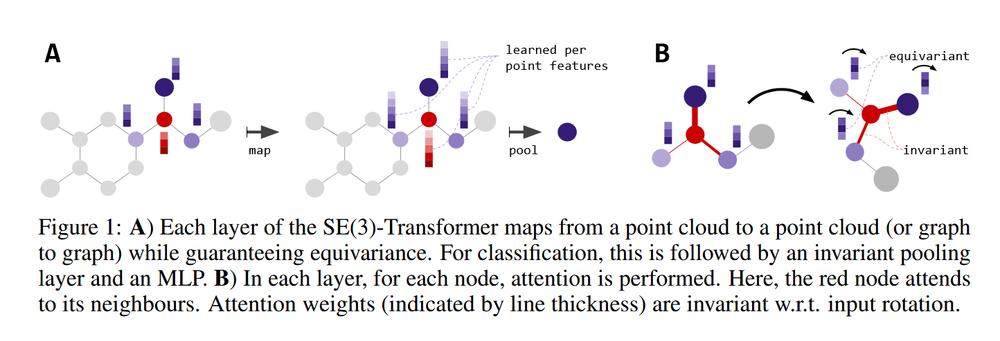
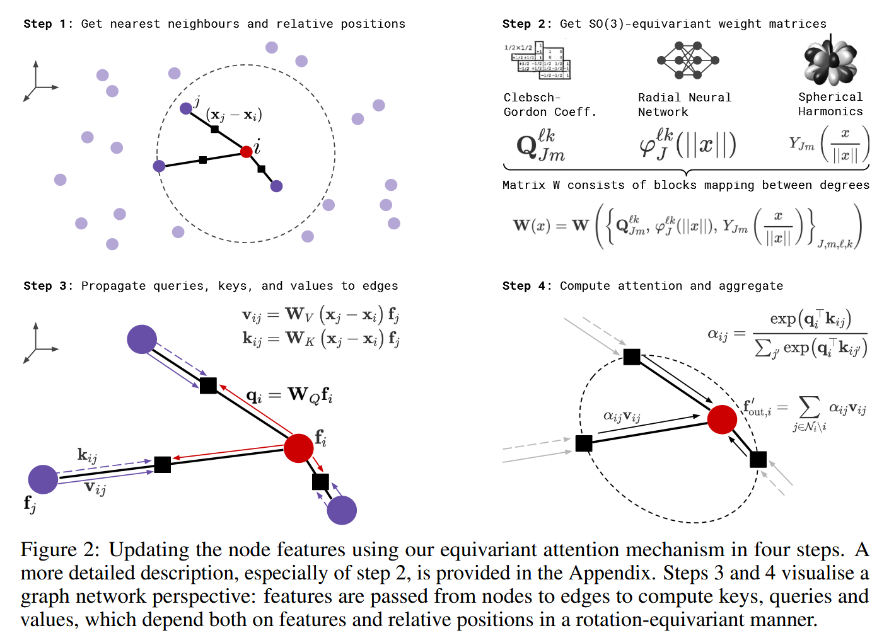
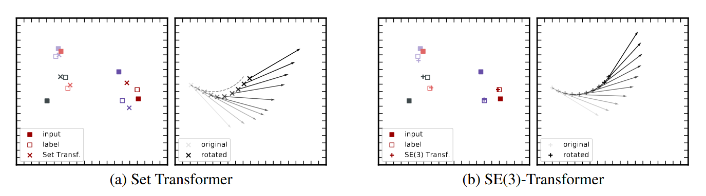
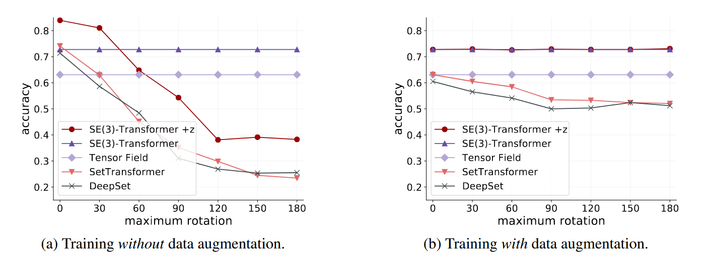
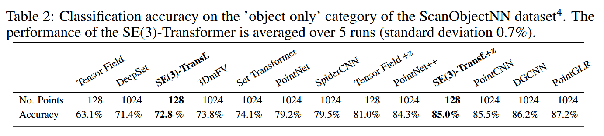
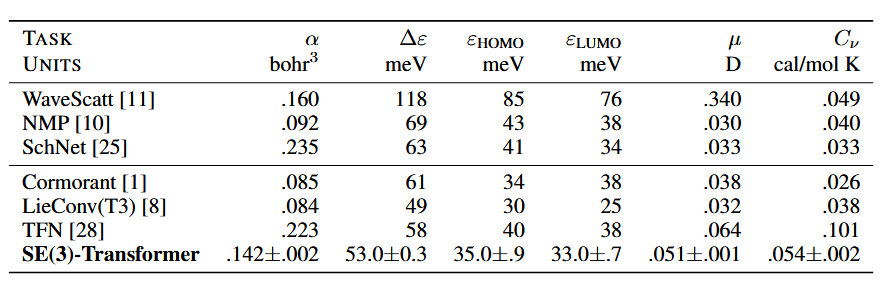

# SE(3)-Transformer

arxiv地址:https://arxiv.org/abs/2006.10503

## Introduction

SE3-Transformer是TFN的改进模型,其使用了等变的消息消息传递和不变性注意力计算用于消息聚合,相较于TFN最大的改进就是引入了注意力机制.

首先,为了方便展现之后的思路,该论文先以一种方式重写了TFN的消息传递机制.

即自交互压缩后的原始张量特征加上消息传递得到的张量特征:

\[
f^{\ell}_{\mathrm{out}, i}=\underbrace{w^{\ell\ell} f^{\ell}_{\mathrm{in}, i}}_{\text{self-interaction}}+ \sum_{k \ge 0} \sum_{\substack{j=1 \\ j \ne i}}^{n}\mathbf{W}^{\ell k}\!\big(\mathbf{x}_j - \mathbf{x}_i\big)\,f^{k}_{\mathrm{in}, j},
\]

$\mathbf{W}^{\ell k}\!\big(\mathbf{x}_j - \mathbf{x}_i\big)$代表消息传递函数,其读入相对矢量作为输入,输出一个矩阵作用在源节点张量特征上,从而得到消息传递后的张量特征,其表达形式由下式给出:

\[
\mathbf{W}^{\ell k}(\mathbf{x})
=\sum_{J=\lvert k-\ell\rvert}^{k+\ell}\varphi_{J}^{\ell k}\!\big(\lVert\mathbf{x}\rVert\big)\,
\mathbf{W}_{J}^{\ell k}(\mathbf{x}),\\
\text{where}\quad\mathbf{W}_{J}^{\ell k}(\mathbf{x})=\sum_{m=-J}^{J}
Y_{Jm}\!\big(\mathbf{x}/\lVert\mathbf{x}\rVert\big)\,
\mathbf{Q}_{Jm}^{\ell k}.
\]

这里,消息传递函数被写成核的线性组合,线性组合系数由相对距离的RBF特征映射而来,而核则是Clebsch-Gordan系数矩阵和球谐函数的乘积,这和我们之前在TFN中写出的公式是一致的,他们实现了相同的功能.

## Method

SE3-Transformer在上述机制的改进策略仅仅是引入了一个注意力系数,还有一点就是使用邻域截断,避免增长过快的时间复杂度:

\[
f^{\ell}_{\mathrm{out}, i}=\underbrace{\mathbf{W}^{\ell\ell}_{V}\, f^{\ell}_{\mathrm{in}, i}}_{\text{③ self-interaction}}+\sum_{k \ge 0}\sum_{\substack{j \in \mathcal{N}_i \\ j \ne i}}\underbrace{\alpha_{ij}}_{\text{① attention}}
\underbrace{\mathbf{W}^{\ell k}_{V}\!\big(\mathbf{x}_j - \mathbf{x}_i\big)\, f^{k}_{\mathrm{in}, j}}_{\text{② value message}}
\,
\]

注意力权重由两个等变张量的点积计算而来,而等变张量的卷积具有几何不变性,故注意力权重对分子姿态是不变的.

键值对可以由同一个消息通过不同的等变线性层投影得到,查询则是由原子等变特征通过等变线性层得到

\[
\alpha_{ij}
=\frac{\exp\!\big(\mathbf{q}_i^{\top}\mathbf{k}_{ij}\big)}
{\displaystyle \sum_{j' \in \mathcal{N}_i \setminus i}
\exp\!\big(\mathbf{q}_i^{\top}\mathbf{k}_{ij'}\big)}
,\\
\mathbf{q}_i=\bigoplus\limits_{\substack{\ell \ge 0}}\sum_{k \ge 0}\mathbf{W}^{\ell k}_{Q}\, f^{k}_{\mathrm{in}, i},\\
\mathbf{k}_{ij}=\bigoplus\limits_{\substack{\ell \ge 0}}\sum_{k \ge 0}\mathbf{W}^{\ell k}_{K}\!\big(\mathbf{x}_j - \mathbf{x}_i\big)\,f^{k}_{\mathrm{in}, j}\, .
\]

等变线性层对不同阶数的张量单独作用,完了之后将他们拼接起来得到一个大的向量,得到注意力机制的q,k,v, 下图展示了该等变注意力机制的各个计算步骤:

## Application

论文作者测试了SE3-Transformer在多种任务上的表现能力.

在多体运动预测任务上,SE3-Transformer严格满足了等变性,对初始状态的旋转做出了完美的响应,而Set-transformer往往随着角度的旋转,其预测逐渐失真,即使其可以通过数据增强一定程度学到等变性,其可靠性依旧不能保持:

针对点云的分类任务,无等变性内嵌的网络在物体旋转后其判断准确率显著下滑,而SE3-Transformer和TFN其准确率始终严格保持不变

最后,作者也在基准数据集QM9上进行了物性预测任务,以充分证明SE3-Transformer捕捉到了原子之间的角向特征:

