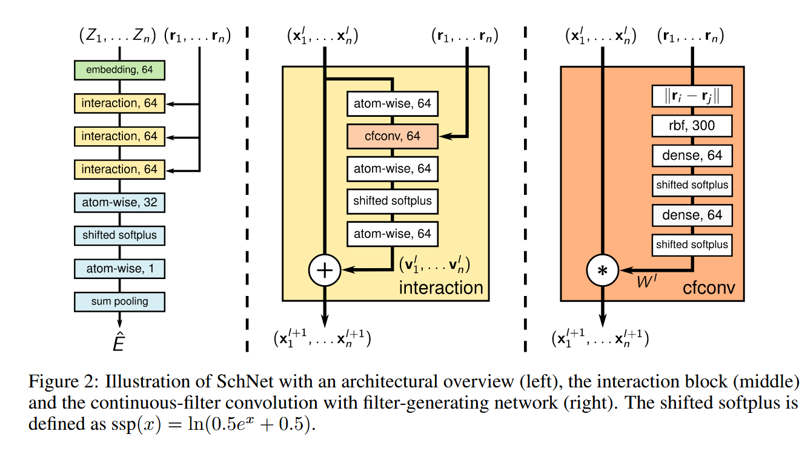

# SchNet

arxiv地址:https://arxiv.org/abs/1706.08566

## Introduction

SchNet是一种最早的类图神经网络,其创新之处在于提出了连续滤波卷积并且将其成功的应用在了机器学习势问题上

这张图展示了SchNet的模型架构,首先原子电荷数被嵌入到高维空间中,然后经过三个交互层捕捉原子的化学环境,然后再对原子特征进行读出,最后完成预测任务.

交互层的核心组件为连续滤波卷积,实际上就是距离特征和原子特征的逐元素hadama积,Schutt等人的实践证明,这有助于捕捉更加复杂的非线性关系,从而提升模型的表现能力.

事实上,SchNet只利用了径向信息,这会丢失分子的角向信息特征,该网络是一个传统的不变性神经网络,有一定的局限性.

## Continuous Filter Convolution

首先经过RBF编码对距离特征进行拓展:

$$
e_k(\mathbf{r}_{i} - \mathbf{r}_{j}) = \exp(-\gamma{({d}_{ij} - \mu_k)^2})
$$

这样距离信息被编码为一个300维的向量,然后通过两层神经网络处理之后和原子特征逐元素相乘:

$$
\mathbf x_i^{l+1} = \mathbf x_i^l \circ \text{MLP}(e(\mathbf{r}_{i} - \mathbf{r}_{j}))
$$

这就是连续滤波卷积的所有内容了,可以看到,这是一个非常简单的操作.

然后考虑完整的交互层,整个消息更行就可以写成:

$$
\mathbf x_i^{l+1} =  \mathbf x^l_i + \text{MLP}(W\mathbf x_i^l \circ \text{MLP}(e(\mathbf{r}_{i} - \mathbf{r}_{j})))  
$$

最后,为了使得体系对能量的预测可以以线性尺度拓展,SchNet引入了一个全局池化层,将所有原子的特征池化到一个向量中,然后通过一个全连接层预测能量.能量和力必须一起训练以保证势能面的光滑性.

$$
L(\mathbf E, \mathbf F,\hat{\mathbf E},\hat{\mathbf F}) = \frac{1}{N} \sum_{i=1}^N (\hat{\mathbf E}_i - \mathbf E_i)^2 + \frac{1}{N} \sum_{i=1}^N (\frac{\partial \hat{\mathbf{E}}}{\partial \mathbf{r}_i} - \mathbf F_i)^2
$$

偏导数可以通过计算图的反向传播来计算,该导数是解析而快速的.

