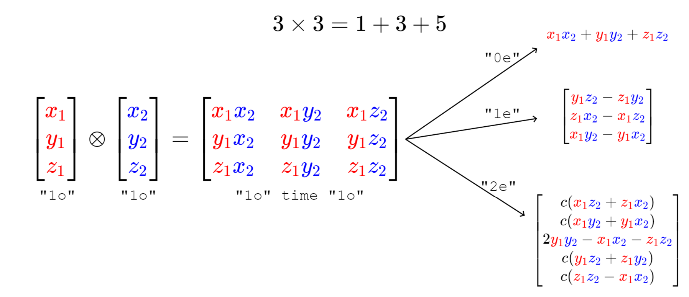
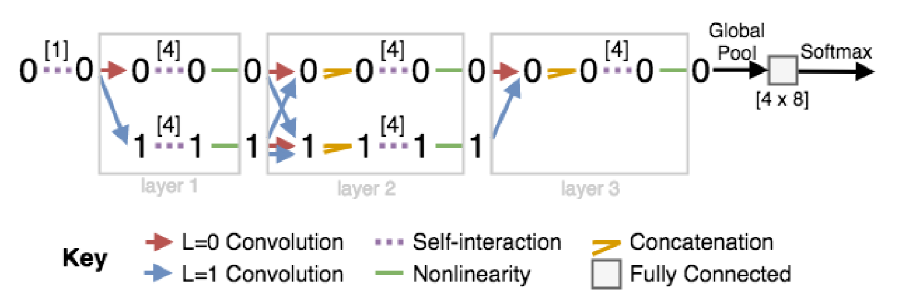
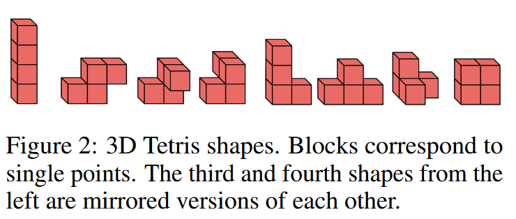

# TFN

TensorField Network 简称TFN,是一种等变的图神经网络,这是一种基于高阶信息的神经网络,可以处理复杂的图结构并且可以学习到高阶的特征表示.

论文地址: arxiv:https://arxiv.org/abs/1802.08219

## 等变性

等变是图论当中的一个概念,将等变引入神经网络是为了让其更加容易捕获空间相对信息,理解旋转,平移或者反射对称性.

分子任务中的等变性最终都是为了不变性服务,即希望网络学习到旋转,平移,反射等对称性.而传统的不变性建模基于不变性特征,如键长,键角,二面角等等,但是特征的建模终归只是一种信息压缩,并且需要大量的先验知识.

我的理解是,通过构造等变性神经网络,可以将对称性嵌入到网络当中,最后再进行不变性的池化,这样就自然而然得到不变性的神经网络,以图和特征图的映射为例,在等变网络中,图的旋转会使得中间层的特征图也同步旋转,但是特征图的特征是相对不变的,因而对图进行全局池化后,得到的就是不变性的特征.而普通的不变性神经网络则要求不管图如何旋转,中间的特征图都要保持不变,要达成这样的要求,要么需要大量的不变性建模手段,要么通过海量的数据增强让网络自己学习.

群是一堆元素和一个二元运算的集合,我们的旋转,平移,反射等操作都是群的元素,这些操作在不同的空间中存在不同的表示手段,如三维空间中的旋转就是一个三维矩阵.等变性的意思就是说,先对x进行变换再映射与先进行映射再对y进行变换的效果是一样的.

注意,x和y是不同的向量空间,所以相同的变换的表示是不同的,但是本质上都是一种变换:

$$
\mathcal{L}(D^{\chi}(g)x) = D^{y}(g)\mathcal{L}(x)
$$

这里的$D^{\chi}(g)$代表g变化在x向量空间中的表现形式,如果$g\in G$,那么就称呼$D^{\chi}(g)$为群$G$的表示

## 球谐函数与WignerD矩阵

球谐函数就是具有3D空间中旋转等变性的一类函数,球谐函数通常表示为$Y^m_l$,也可以简写为态矢量的形式$|l,m\rangle$.根据相关数学定理,当一个旋转算符作用于球谐函数的时候,得到的新的球谐函数可以用原球谐函数不同角动量的线性组合表示:

$$
R|l,m\rangle = \sum_{m'}|l,m'\rangle \langle l,m'|R|l,m\rangle
$$

其中,WignerD矩阵定义为:

$$
D_{m,m'}^{(l)} = \langle l,m'|R|l,m\rangle
$$

$m'$和$m$的取值范围均一致,为$[-l,l]$

可以写成更加清晰的形式:

$$
Y^m_l(R(g)\hat{r})=\sum_{m'}D_{m,m'}^{(l)}Y^{m'}_l(\hat{r})
$$

目前的形式和我们上面的等变性表述似乎不太一致,这是因为,我们处理球谐函数张量的时候,是将同阶所有$m$拼起来的向量一起考虑的,也就是说,考虑一个$l$阶的球谐函数张量,上述的公式可以等价为:

$$
\mathbf{Y^{(l)}}(R\hat{r}) = \mathbf{D} \mathbf{Y^{(l)}}
$$

或者展开成更加清晰的形式:

$$
\begin{pmatrix}
    Y^{-l}_l(R\hat{r}) \\
    Y^{-l+1}_l(R\hat{r}) \\
    \vdots \\
    Y^l_l(R\hat{r}) \\
\end{pmatrix} = 
\begin{pmatrix}
    &D_{-l,-l}^{(l)}, &D_{-l,-l+1}^{(l)}, &\ldots, &D_{-l,l}^{(l)}\\
    &D_{-l+1,-l}^{(l)}, &D_{-l+1,-l+1}^{(l)}, &\ldots, &D_{-l+1,l}^{(l)}\\
    &\vdots&\vdots&\ddots&\vdots\\
    &D_{l,-l}^{(l)}, &D_{l,-l+1}^{(l)}, &\ldots, &D_{l,l}^{(l)}\\
\end{pmatrix}\begin{pmatrix}
    Y^{-l}_l(\hat{r}) \\
    Y^{-l+1}_l(\hat{r}) \\
    \vdots \\
    Y^l_l(\hat{r}) \\
\end{pmatrix}
$$

## 张量积与不可约表示

张量积运算就是将两个张量空间进行合并的运算:

$$
D^x \otimes D^y = D^{x\otimes y}
$$

这里对应量子力学中的角动量耦合.两个不同旋转阶数的张量的张量积满足等变性,然而两个向量做张量积之后,其会张成一个大矩阵,这不利于我们继续处理,所以我们要对张量积进行分解,把他分解成不可约表示.

以两个坐标矢量的张量积为例,其结果是一个3x3的矩阵,这个矩阵是某个更加高阶的张量空间中的成员,数学家告诉我们,这个张量空间中的元素的变换行为可以叠加为一些简单子空间中元素变换行为的总和.

如图所示,这个3*3的矩阵的旋转行为就会被拆解成一个标量,一个向量和一个五维矢量的旋转行为,这三个低级的矢量就是所谓的不可约表示.

上述的过程可以简写为:

$$
1o \otimes 1o = 0e \oplus 1e \oplus 2e
$$

对于任意两个向量的张量积,其产生的不可约表示的各个元素的值由下面这个公式确定:

$$
(u \otimes v)^m_l = \sum_{m_1=-l_1}^{l_1}\sum_{m_2=-l_2}^{l_2}C_{(l_1,m_1)(l_2,m_2)}^{(l,m)}u^m_{l_1}v^m_{l_2}
$$

o和e被称为奇宇称和偶宇称,这个概念不影响我们的讨论.

$C^{(l,m)}_{(l_1,m_1)(l_2,m_2)}$被称作 **Clebsch-Gordan系数** ,他决定了哪一些分量应该被置零.

l的取值范围为$|l_1-l_2|, \ldots ,l_1+l_2$,这些旋转阶数的张量均会生成.

## TFN

### 点卷积

原子的高阶特征表示来源于他的化学环境,对于一个原子,我们可以把他的电荷作为标量特征输入,而高阶特征先通通置零,这些高阶特征会在交互中由张量积产生.

首先我们在边上定义卷积核:

$$
F_{cm}^{(l_f,l_i)}(\vec{r}) = R_c^{(l_f,l_i)}(r) Y_m^{l_f}(\hat{r})
$$

这里的下标c是通道数,表示同一阶张量的不同通道,例如,原子可以有很多标量特征,比如电荷,极化率,...等等,同阶张量会具有很多通道,这样丰富了特征表示,我们可以为这些不同的通道定义不同的卷积核,卷积核会单独作用在每个阶数的每个通道上,互不影响.

然后,将卷积核与特征节点做张量积,这就实现了边的信息和节点信息的交互,结果就是我们的message:

$$
\mathcal{L}_{acm_o}^{(l_o)}\left(\vec{r}_a, V_{acm_i}^{(l_i)}\right) =\sum_{b \in S} \sum_{m_f, m_i} C_{(l_f, m_f)(l_i, m_i)}^{(l_o, m_o)}  F_{cm_f}^{(l_f, l_i)}\left(\vec{r}_{ab}\right) V_{bcm_i}^{(l_i)}
$$

b是和a节点相连的所有节点.

下一步就是更新,事实上由于张量积的不可约表示会产生更多的通道,所以我们往往先将message先通过自相互作用层压缩之后再加到节点特征上,如果要对输出通道做一定变换,V也需要经过自相互作用层.

### 自相互作用

节点特征和卷积核进行相互作用之后,往往会获得非常多的通道个数,这时候就需要自相互作用层,将不同通道的特征进行融合,这就实现了通道数的压缩.

$$
V^{(l)}_{acm}=\sum_{c'} W_{cc'}^{(l)} V_{ac'm}^{(l)}
$$

经过自相互作用层之后,通道数发生了改变,实现了更加彻底的信息交互.

### 非线性层

下一步,还需要对获得的特征进行非线性处理,这就是最后非线性层的作用.

为了维持等变性,对于高阶张量,我们只能改变他的模长,所以:

$$
V_i^{(L)} = \sigma(\left\|V^{(l)}_i  \right\|_2+b^{(l)}_i)V^{(l)}_i
$$

将模长非线性化,进一步提升网络的表达能力,同时也保证了等变性.

经过这么一系列操作后,我们可以取零阶张量进行全局池化(融合所有节点的信息),从[N,c,2l+1]到[1,c*N,2l+1],之后就可以输入到神经网络中进行回归或者分类任务了.

原文中提供了俄罗斯方块的一个例子:

俄罗斯方框总共有八种类型,类型显然是旋转和平移等变的,所以可以输入不同俄罗斯方块的点的位置和类型,让网络学会辨认当前的俄罗斯方块,然后再灌输大量的经过平移和旋转的俄罗斯方块点群进行测试,结果表明,TFN的识别成功率为100%,说明网络成功的捕捉到了对称性,而这仅仅只用了8个数据的训练集.

### 资料

原论文仓库地址:https://github.com/tensorfieldnetworks/tensorfieldnetworks

pytorch版实现仓库地址:https://github.com/semodi/tensorfield-torch
