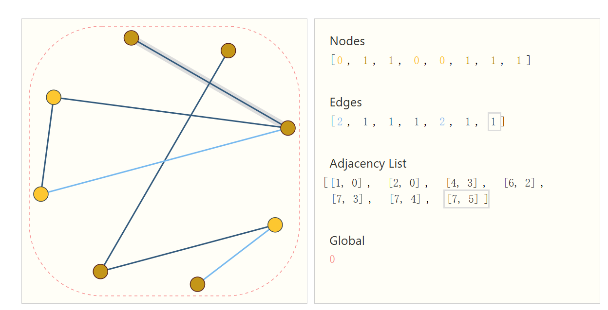
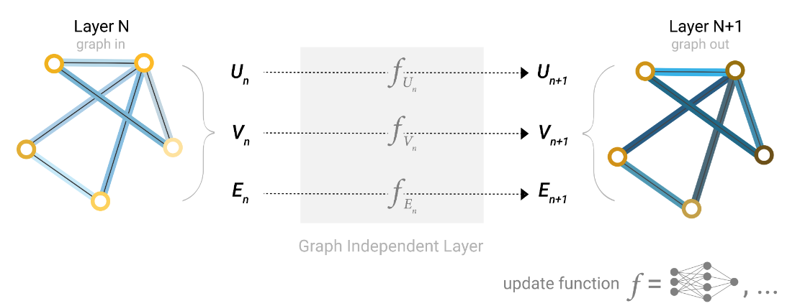
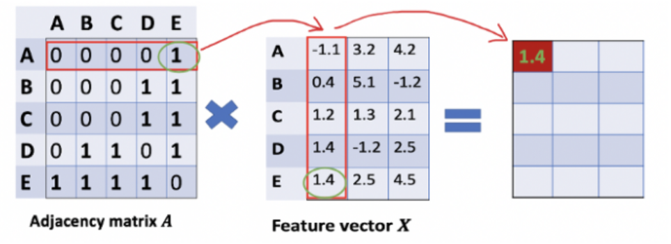
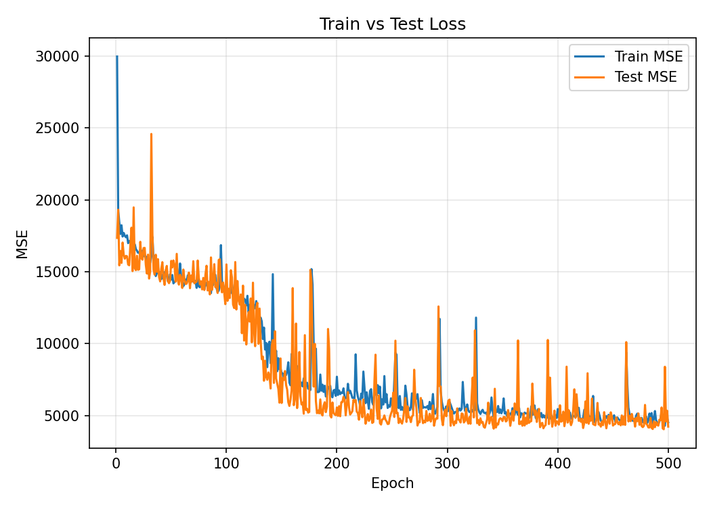

# 图神经网络

图神经网络是提取分子底层特征的一种强大方法,基于消息传递的机制可以充分捕捉每个原子周围的化学环境,从而实现对分子性质的预测和理解。

图神经网络可以参考网站 https://distill.pub/2021/gnn-intro/ ,里面给出了详细的介绍和说明,并且制作了大量精美的交互图.

## 图表示

每个原子都是一个节点,原子之间的键作为边,构建一个图,同时图还存有全局信息,全局信息也是一个向量.每个节点和边都有对应的特征,这些特征可以表示为向量.

连通性信息往往由邻接矩阵表示,而对于比较大的矩阵,如何存储和运算是一个问题,所以我们保存连通性信息的时候,往往保留一条边的两个顶点.



## 简单的图神经网络

如果不考虑图的各个结构之间的信息传递,我们可以给出一个简单的图神经网络:



$$
\begin{aligned}
U_n^k = MLP(U_n^{k-1}) \\
V_n^k = MLP(V_n^{k-1}) \\
E_n^k = MLP(E_n^{k-1}) \\
\end{aligned}
$$

就像是普通的并联的三个神经网络一样,三者之间没有任何的交汇,也许在最后的时候,我们把所有的向量展平,然后接上一个全连接层,用于预测物质结构信息,但是这样并没有利用到图的结构信息.

于是,为了充分的让图的各个部分进行交互,我们要引入消息传递机制.

## 图卷积神经网络

让我们简化问题,假设我们不考虑边的特征和全局信息,所谓的图只保留节点特征和连通性信息,那么消息传递就是在节点之间进行.

即,每一次节点的特征的更新都要依赖于本次节点的特征和他的邻居的节点的特征.

消息传递的第一阶段被称作聚合,即将邻居信息聚合到本节点上,第二部,再利用本节点的特征和邻居的特征进行更新.

**值得注意的是,消息聚合的一个简单原则是,不能破坏图的对称性,即排列不变性,对不同节点信息聚合的先后不应该改变聚合结果**

我们将聚合方法称作池化(Pooling),常见的聚合方式有三种

1. 平均池化
2. 最大池化
3. 求和池化
4. 加权求和池化

下面以求和池化为例,节点信息更新的公式就为:

$$
h_v^{(k)} = \sigma(W_k(h_v^{(k-1)} + \sum_{u \in N(v)}  h_u^{(k-1)})+b_k)
$$

其中,$\sigma$是激活函数,$N(v)$表示节点$v$的邻居节点.

更进一步,我们可以引入权重矩阵$W_v^{(k)}$来对邻居节点的信息进行加权:

$$
h_v^{(k)} = \sigma(W_k(h_v^{(k-1)} + \sum_{u \in N(v)}  W_u^{(k)} h_u^{(k-1)})+b_k)
$$

权重矩阵可以是人为指定的,也可以是可学习参数.

还有一种情况是,消息聚合来的信息不直接加到已有节点的信息上,而是和他拼接起来:

$$
h_v^{(k)} = \sigma(W_k[h_v^{(k-1)}, \sum_{u \in N(v)}  h_u^{(k-1)}]+b_k)
$$

具体使用哪种要视具体情况而定.

通过维度变换,节点的特征在一层一层的GNN中被传播,压缩,最后,我们需要进行全局池化,将所有节点特征变成一个节点特征,然后接上一个全连接层,用于预测物质结构信息. **这样做的好处是无视了分子图的大小,如果节点数目不同,最后依旧可以用同一个网络训练**

全局求和池化:

$$
h_G^{(k)} = \sum_{v \in V} h_v^{(k)}
$$

接个MLP:

$$
\hat{y} = \mathrm{MLP}(h_G^{(k)})
$$

下面我们使用torch来实现一个简单的GNN:

单层GNN,接受消息传递后的聚合信息,输出更新后的节点信息:

```python
# 定义一个简单的GNN层
class simple_gnn_layer(nn.Module):
    def __init__(self,input_dim,output_dim):
        super(simple_gnn_layer,self).__init__()
        # 定义消息聚合和更新所需要用到的方法
        # 线性变换
        self.linear = nn.Linear(input_dim,output_dim)
        # 激活函数
        self.activation = nn.ReLU()
    
    # 定义消息聚合
    def message_passing(self,h,adj):
        '''
        h:节点特征矩阵 [num_nodes,input_dim]
        adj:邻接矩阵 [num_nodes,num_nodes]
        '''
        h_prime = torch.matmul(adj,h) # [num_nodes,num_nodes] * [num_nodes,input_dim] -> [num_nodes,input_dim]
        # 邻接矩阵不包含自环,所以上述得到的是聚合到各个节点的特征
        return h_prime
    
    def update(self,h_prime,h):
        combined  = h+ h_prime
        combined = self.linear(combined)
        combined = self.activation(combined)
        return combined
    
    def forward(self,h,adj):
        h_prime = self.message_passing(h,adj)
        h_new = self.update(h_prime,h)
        return h_new
```

这里,消息聚合的办法采用邻接矩阵和特征矩阵相乘的形式,即:

$$
\mathrm{message\_passing} = adj \times h
$$



如果增加自环,即将邻接矩阵的对角元变成1,那么就不需要把消息加到本节点上,矩阵乘法的结果直接就是MLP的输入.

然后我们把GNN层堆叠起来,就得到了一个GNN模型.最后要做物性预测,所以还需要池化之后接一个MLP.

```python
# 把层拼成GNN:
class simple_gnn(nn.Module):
    def __init__(self,model_config_gnn,model_config_mlp):
        super(simple_gnn,self).__init__()
        self.layers = nn.ModuleList([simple_gnn_layer(model_config_gnn[i][0],model_config_gnn[i][1]) for i in range(len(model_config_gnn))])
        
        # 在初始化时就创建MLP层
        mlp_layers = []
        for i in range(len(model_config_mlp)):
            if i == len(model_config_mlp)-1:
                mlp_layers.append(nn.Linear(model_config_mlp[i][0],model_config_mlp[i][1]))
            else:
                mlp_layers.append(nn.Linear(model_config_mlp[i][0],model_config_mlp[i][1]))
                mlp_layers.append(nn.ReLU())
        self.mlp_layers = nn.Sequential(*mlp_layers)

    # 全局池化
    def global_pooling(self,h):
        return torch.mean(h,dim=0)
        
    def forward(self,h,adj):
        for layer in self.layers:
            h = layer(h,adj)
        # 全局池化
        h = self.global_pooling(h)
        # 接一个多层感知机
        h = self.mlp_layers(h)
        return h
```

值得注意的是,torch中存在一些书写规范,`nn.ModuleList()`会自动将各层的可学习参数注册到模型中,如果使用普通的python列表则不能使得各层的参数被自动识别,在前向传播的时候,可以直接使用`h=layer(h,adj)`来实现层的前向传播,隐式调用了layer的`forward`方法,会自动触发pytorch的前向传播计算图的构建,自动触发hooks和自动梯度计算.

## 节点填充批处理

要想修改成批处理的模型,必须要对节点进行填充,将节点特征矩阵和邻接矩阵统一为:[batch_size,num_nodes,input_dim]和[batch_size,num_nodes,num_nodes]

```python   
# 定义一个支持批处理的GNN层
class simple_gnn_layer(nn.Module):
    def __init__(self,input_dim,output_dim):
        super().__init__()
        self.linear = nn.Linear(input_dim,output_dim)
        self.activation = nn.ReLU()
    
    def message_passing(self,h,adj):
        '''
        h: 节点特征矩阵 [batch_size, num_nodes, input_dim]
        adj: 邻接矩阵 [batch_size, num_nodes, num_nodes]
        '''
        h_prime = torch.bmm(adj, h)  # 使用批量矩阵乘法
        return h_prime
    
    def update(self,h_prime,h):
        combined  = h + h_prime
        combined = self.linear(combined)
        return self.activation(combined)
    
    def forward(self,h,adj):
        h_prime = self.message_passing(h,adj)
        return self.update(h_prime,h)

class simple_gnn(nn.Module):
    def __init__(self,model_config_gnn,model_config_mlp):
        super().__init__()
        self.layers = nn.ModuleList([simple_gnn_layer(input_dim, output_dim) for input_dim, output_dim in model_config_gnn])
        mlp_layers = []
        for i in range(len(model_config_mlp)):
            if i == len(model_config_mlp)-1:
                mlp_layers.append(nn.Linear(model_config_mlp[i][0],model_config_mlp[i][1]))
            else:
                mlp_layers.append(nn.Linear(model_config_mlp[i][0],model_config_mlp[i][1]))
                mlp_layers.append(nn.ReLU())
        self.mlp_layers = nn.Sequential(*mlp_layers)
    
    # 修改全局池化方法
    def global_pooling(self,h):
        # h形状: [batch_size, num_nodes, features]
        return torch.mean(h, dim=1)  # 在节点维度做平均池化
        
    def forward(self,h,adj):
        # h形状: [batch_size, num_nodes, input_dim]
        # adj形状: [batch_size, num_nodes, num_nodes]
        for layer in self.layers:
            h = layer(h,adj)
        h = self.global_pooling(h)  # 输出形状 [batch_size, features]
        return self.mlp_layers(h)
```
我们要写一个打包函数,将一批数据打包成形状为[batch_size, num_nodes, input_dim]的张量:

```python
def collate_fn(batch):
    """
    将一批图数据处理成批量格式
    """
    x_batch = []
    adj_batch = []
    y_batch = []
    
    for data in batch:
        x, adj, y = process_data(data)
        x_batch.append(x)
        adj_batch.append(adj)
        y_batch.append(y)
    
    # 添加填充和转换张量的步骤
    max_nodes = max([x.shape[0] for x in x_batch]) # x: [num_nodes, features]
    x_padded = [torch.nn.functional.pad(x, (0,0,0,max_nodes-x.shape[0])) for x in x_batch]
    adj_padded = [torch.nn.functional.pad(adj, (0,max_nodes-adj.shape[1],0,max_nodes-adj.shape[0])) for adj in adj_batch]
    
    return torch.stack(x_padded).to(device), torch.stack(adj_padded).to(device), torch.stack(y_batch).to(device)
```

`torch.nn.functional.pad(x, (0,0,0,max_nodes-x.shape[0]))`是torch内置的填充函数,其四个变量分别表示(left,right,top,bottom),即在x的四个方向上填充0,填充的数目为max_nodes-x.shape[0],即填充到和最大节点数相同,这样,每个批次的数据就具有相同的形状,可以进行批量处理.

然后再创建数据加载器的时候应用上述的打包函数,数据集就会变成一个个batch的形式:

```python
# 创建数据加载器
batch_size = 256
train_loader = DataLoader(train_dataset, batch_size=batch_size, shuffle=True, collate_fn=collate_fn) #在这里应用刚刚定义的打包函数
test_loader = DataLoader(test_dataset, batch_size=batch_size, shuffle=False, collate_fn=collate_fn)
```
## 引入边信息

更加先进的模型应该考虑节点和边的信息聚合

在实际应用场景中,通常采用先用节点信息更新边信息,再用边信息更新节点信息,这样可以使得消息传递更加迅速且深入.

边使用节点信息进行更新

$$
e^k_{ij} = \phi^k_e(h_i^{k-1},h_j^{k-1},e^{k-1}_{ij})
$$

节点信息更新:

$$
h^k_i = \phi^k_n(h^{k-1}_i,\{h^{k-1}_j,e^{k}_{ij}\})
$$

亦或者只使用边的信息更新节点:

$$
h^k_i = \phi^k_n(h^{k-1}_i,e^{k}_{ij})
$$

使用多层GNN后就可以完成长程的节点,边信息交互.

上述的$\phi^k_n,\phi^k_e$都是MLP,如果我们采用直接相加的聚合方式,为了使得维度匹配,信息聚合的时候要加上一个转换层进行维度映射,所以完整写出来就是:

$$
\begin{aligned}
&e^k_{ij} = \phi^k_e(\sigma(W^k_1(h_i^{k-1})+b^k_1)+\sigma(W^k_2(h_j^{k-1})+b^k_2)+e^{k-1}_{ij})\\
&h^k_i = \phi^k_n(h^{k-1}_i+\sum_j\sigma(W^ke^{k}_{ij}+b^k))
\end{aligned}
$$

另一种方式是特征拼接,强制压缩到同一维度会不可避免的损失掉很多信息,所以可以在消息传递后更新的时候把消息特征向量和原本的特征向量拼接起来:

$$
\begin{aligned}
e^k_{ij} &= \phi^k_e(h_i^{k-1} \oplus h_j^{k-1} \oplus e^{k-1}_{ij})\\
h^k_i &= \phi^k_n(h^{k-1}_i \oplus \sum_j e^{k}_{ij})
\end{aligned}
$$

我们以特征拼接的方式为例子,去实现一个简单的GNN层,我们需要更加先进的批处理方法去实现,由于引入了边的信息,我们需要直接在连接的边的水平上进行操作来提升计算速度.一旦采取这种方式,填充节点的批处理方式就变得不可行了,因为即使将两个分子的节点个数填充到相同,两个分子的边数差异也会巨大,故强行进行填充会造成计算资源的大量浪费,故需要引入图批处理的方式.

## 图批处理

图批处理的核心思想是将多个独立的图合并成一个大的断开图(disconnected graph)，这样可以在保持各个子图独立性的同时，实现并行计算。

将多个图的节点进行重新编号，确保每个节点在批次中有唯一的索引：

```
假设我们有两个图
图1：节点 [0, 1, 2]，边 [(0,1), (1,2)]
图2：节点 [0, 1, 2, 3]，边 [(0,1), (1,2), (2,3)]

批处理后的节点编号
图1：节点 [0, 1, 2]
图2：节点 [3, 4, 5, 6]  # 偏移量为3
```

使用边列表(edge list)而不是邻接矩阵来表示图的连接关系：

```python
# 原始边表示
graph1_edges = [(0, 1), (1, 2)]
graph2_edges = [(0, 1), (1, 2), (2, 3)]

# 批处理后的边表示
batched_edges = [(0, 1), (1, 2), (3, 4), (4, 5), (5, 6)]
```

使用batch索引记录每个节点属于哪个图：

```python
batch = [0, 0, 0, 1, 1, 1, 1]  # 前3个节点属于图0，后4个节点属于图1
```

假设数据已经组织好了,我们来实现一个简单的批处理GNN层:

```python
# 支持图批处理的GNN层
class GraphBatchGNNLayer(nn.Module):
    def __init__(self, node_dim, edge_dim, hidden_dim):
        super().__init__()
        
        # 边更新网络
        self.edge_mlp = nn.Sequential(
            nn.Linear(2 * node_dim + edge_dim, hidden_dim),
            nn.ReLU(),
            nn.Linear(hidden_dim, edge_dim)
        )
        
        # 节点更新网络
        self.node_mlp = nn.Sequential(
            nn.Linear(node_dim + edge_dim, hidden_dim),
            nn.ReLU(),
            nn.Linear(hidden_dim, node_dim)
        )
    
    def forward(self, h, edge_index, edge_attr):
        """
        h: 节点特征 [total_nodes, node_dim]
        edge_index: 边索引 [2, total_edges]
        edge_attr: 边特征 [total_edges, edge_dim]
        """
        row, col = edge_index
        
        # 更新边特征
        edge_input = torch.cat([h[row], h[col], edge_attr], dim=1)
        edge_attr_new = self.edge_mlp(edge_input)
        
        # 聚合边信息到节点
        # 使用scatter操作进行高效聚合
        from torch_scatter import scatter_add
        
        node_messages = scatter_add(edge_attr_new, col, dim=0, dim_size=h.size(0))
        
        # 更新节点特征
        node_input = torch.cat([h, node_messages], dim=1)
        h_new = self.node_mlp(node_input)
        
        return h_new, edge_attr_new
```

我们可以发现,GNN层其实不需要batch信息,处理一个大图和处理一个个图对于GNN层来说没有区别,真正要用到batch信息的是全局池化的部分,我们需要根据batch索引对不同的节点进行池化.

与上述还有一点不同的是,我们使用边的消息的时候,使用的是[num_edges,edge_dim]这种格式,而不是类似写成距离矩阵的[num_nodes,num_nodes,edge_dim]这种格式,一方面,新格式相较于旧格式更加高效,占据的内存更少,另一方面,如果我们需要对边消息进行复杂的计算,新格式相较于距离矩阵的格式,其计算量会大大降低.

值得注意的是,我使用了`scatter_add`这个函数,这是`torch-scatter`库中消息聚合的高效实现,它可以根据边的索引,将边的消息聚合到对应的节点上,很多时候由于缺少编译工具,`torch-scatter`不能直接用pip下载,从该网址https://pytorch-geometric.com/whl/ 可以下载到对应的whl文件,然后用`pip install 文件路径`安装.

其操作为`out[index[i]] += src[i]`,各个输入为`scatter_add(src,index,dim,out,dim_size)`,src即为边上的消息,index是目标节点的索引,dim会指定沿着哪个维度进行聚合,out是预分配的输出张量,即节点特征相同尺寸的张量,不指定默认创建全0张量,最后的dim_size指定out的尺寸,不写则默认为index.max()+1.

在主模型中,会使用到batch索引这个张量用于执行高效的聚合:

```python
class GNN(nn.Module):
    def __init__(self, node_dim, edge_dim, hidden_dim, num_layers):
        super().__init__()
        self.layers = nn.ModuleList([
            GraphBatchGNNLayer(node_dim, edge_dim, hidden_dim)
            for _ in range(num_layers)
        ])
        self.readout = nn.Sequential(
            nn.Linear(hidden_dim, hidden_dim),
            nn.ReLU(),
            nn.Linear(hidden_dim, 1)
        )
    def forward(self,h,x,edge_index,edge_attr,batch):
        for layer in self.layers:
            h,edge_attr = layer(h,edge_index,edge_attr)
        
        # 使用batch索引进行全局池化
        # 这里使用scatter_mean进行全局池化,也可以使用其他池化方法
        from torch_scatter import scatter_mean
        h_graph = scatter_mean(h, batch, dim=0)
        
        # 全局池化后的特征用于预测
        return self.readout(h_graph).squeeze()
        
```

或者,更一般的,我们不直接使用`scatter_mean`进行全局池化,可以使用两步`scatter_add`完成:

```python
num_graphs = int(batch.max().item()) + 1
center_sum = scatter_add(x, batch, dim=0, dim_size=num_graphs) # [num_graphs,node_dim]

# 然后创建一个全1张量:
ones = torch.ones((x.shape[0], 1), device=x.device)
counts = scatter_add(ones, batch, dim=0, dim_size=num_graphs) # [num_graphs, 1]
h_graph = center_sum / counts.clamp(min=1) # [num_graphs, node_dim]
```

模型部分已经完全构建好了,接下来就是数据预处理部分,我们以qm7数据集为例,使用上述模型搭建一个简单的雾化能预测流程.

我们需要把数据处理成图,然后再打包成大图:

```python
def load_qm7(mat_path):
    """
    R [num_mols , num_atoms, 3]
    Z [num_mols , num_atoms]
    T [num_mols]
    """
    data = loadmat(mat_path)
    R = data['R']
    Z = data['Z']
    T = data['T'].reshape(-1)
    return R, Z, T


def molecule_to_graph(R, Z, cutoff=4.0):
    # 有效原子（Z>0）
    mask = Z > 0
    idx = np.where(mask)[0]

    R_valid = R[idx, :]
    Z_valid = Z[idx].astype(np.int64)
    n = Z_valid.shape[0]

    # 计算两两距离 [n, n]
    diff = R_valid[:, None, :] - R_valid[None, :, :]
    dist = np.linalg.norm(diff, axis=-1)

    src, dst, attr = [], [], []
    for i in range(n):
        for j in range(n):
            if i == j:
                continue
            d = dist[i, j]
            if d <= cutoff:
                src.append(i)
                dst.append(j)
                attr.append([float(d)])  # 距离作为边特征

    edge_index = torch.tensor([src, dst], dtype=torch.long)
    edge_attr = torch.tensor(attr, dtype=torch.float32)
    h = torch.tensor(Z_valid, dtype=torch.float32)
    x = torch.tensor(R_valid, dtype=torch.float32)
    return h, x, edge_index, edge_attr

def build_dataset(R, Z, T, train_ratio=0.8, seed=42, cutoff=4.0):
    random.seed(seed)
    np.random.seed(seed)

    M = T.shape[0]
    idxs = list(range(M))
    random.shuffle(idxs)

    graphs = []
    for k in idxs:
        h,x,edge_index, edge_attr = molecule_to_graph(R[k], Z[k], cutoff=cutoff)
        graphs.append({
            'h': h,
            'x': x,
            'edge_index': edge_index,
            'edge_attr': edge_attr,
            'y': float(T[k])
        })

    split = int(len(graphs) * train_ratio)
    train_graphs = graphs[:split]
    test_graphs = graphs[split:]
    y_train = np.array([g['y'] for g in train_graphs], dtype=np.float32)
    y_test = np.array([g['y'] for g in test_graphs], dtype=np.float32)
    return train_graphs, test_graphs, y_train, y_test

def collate_graphs(graphs):
    z_all = []
    x = []
    edge_indices = []
    edge_attrs = []
    batch = []
    y = []

    node_offset = 0
    for g_id, g in enumerate(graphs):
        n = g['h'].size(0)
        z_all.append(g['h'])
        x.append(g['x'])
        y.append(g['y'])
        batch.append(torch.full((n,), g_id, dtype=torch.long))

        # 边索引偏移
        edge_idx = g['edge_index'] + node_offset
        edge_indices.append(edge_idx)
        edge_attrs.append(g['edge_attr'])

        node_offset += n

    z_all = torch.cat(z_all, dim=0) 
    x = torch.cat(x, dim=0)
    edge_index_all = torch.cat(edge_indices, dim=1)
    edge_attr_all = torch.cat(edge_attrs, dim=0) 
    batch = torch.cat(batch, dim=0) 
    y = torch.tensor(y, dtype=torch.float32)

    h = z_all
    return h, x, edge_index_all, edge_attr_all, batch, y
```

接着写一个简单的训练流程处理数据即可,训练损失如图所示:



## 引入全局特征

不仅仅只有边和节点的特征,我们还可以引入全局特征,即图的特征,比如分子的性质,分子的类型等.

这些全局特征参与边和节点的每一次更新,并且在边和节点更新后使用全局池化的边和节点特征来更新他自己:

$$
\begin{aligned}
&e^k_{ij} = \phi^k_e(h_i^{k-1},h_j^{k-1},e^{k-1}_{ij},g^{k-1})\\
&h^k_i = \phi^k_n(h^{k-1}_i,e^{k}_{ij},g^{k-1})\\
&g^k = \phi^k_g(h^k,e^k,g^{k-1})
\end{aligned}
$$


