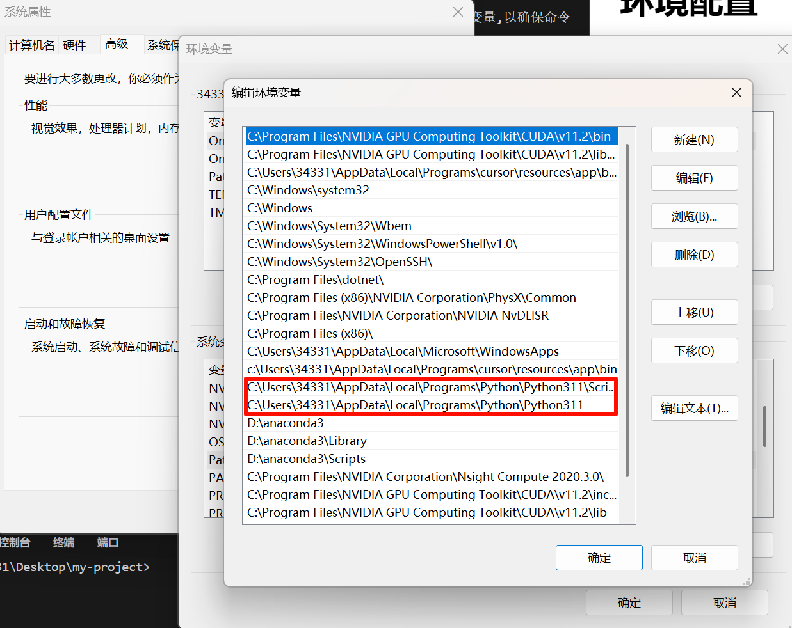

# 环境配置

## 环境变量

安装python之后,很多时候我们需要在任何地方都能使用python命令,所以就需要设定环境变量,以确保命令`python`可以被全局调用.

在开始菜单输入编辑系统的环境变量,然后点击环境变量,在系统变量中找到`Path`,然后点击编辑,在变量值中添加python的安装路径,例如`C:\Users\Administrator\AppData\Local\Programs\Python\Python312`,然后点击确定,这样就可以在任何地方使用python命令了.



这两行具体为:

```
C:\Users\34331\AppData\Local\Programs\Python\Python311\Scripts
C:\Users\34331\AppData\Local\Programs\Python\Python311
```

把他换成你的安装路径就好了.

## 安装包

可以使用包管理器`pip`或者`conda`来安装包,两种包管理器安装包的形式略有不同.

安装包的时候,有时候会非常慢,这个时候可以使用国内的镜像源,例如,使用清华源:

```
pip install your-package_name -i https://pypi.tuna.tsinghua.edu.cn/simple 
```

## 配置虚拟环境

很多时候,不同包之间会出现版本不兼容的问题,有一些库只有老版本才有对应的功能,这个时候又不想全部卸载新版本再重装一边,就可以使用虚拟环境隔离不同版本的包来解决这个问题,在虚拟环境中,可以安装实现特定功能特定版本的包,这样可以实现特定的目的,换一个功能的时候,只需要切换虚拟环境就好了.

为了方便的创建虚拟环境,首先去下载一个anaconda,`conda`是python的包管理器,可以用来创建、删除、管理虚拟环境.

下载完毕后,记得加上这几条配置环境变量(具体路径根据你安装的anaconda路径而定):

```
D:anaconda3
D:\anaconda3\Library
D:\anaconda3\Scripts
```

然后在开始菜单中找到`anaconda prompt`,执行相关指令:

```shell
# 创建新的虚拟环境
conda create -n env_name python=3.8  # 创建一个Python 3.8的环境,名称为env_name

# 激活环境
conda activate env_name

# 退出当前环境
conda deactivate

# 删除环境
conda remove -n env_name --all

# 查看所有环境
conda env list

# 在当前环境中安装包
conda install package_name

# 查看当前环境安装的包
conda list

# 更新包
conda update package_name

# 删除包
conda remove package_name
```

然后在你使用的IDE中切换成刚刚创建好的虚拟环境,就可以工作了.例如,在vsc里使用快捷键`ctrl+shift+p`,然后输入`python:select interpreter`,选择你刚刚创建好的虚拟环境.

通常来说,在anaconda prompt中可以很方便的进入虚拟环境,如果需要在任何地方的命令行进入虚拟环境,首先要使用`conda init`初始化conda,然后使用`conda activate env_name`进入虚拟环境.

## tensorflow

为了使我们的深度学习代码可以充分调用gpu加速,我们需要对tensorflow进行一定的配置,新版本的tensor没有gpu版本(windows版本没有,linux有),这个时候我们需要进行版本降级,而python版本也要降级才能适配低版本的tensor,所以必须要使用虚拟环境.

查询得到的gpu版本以及相应的软件支持如下图所示:


去nvidia官网下载对应版本的CUDA和cuDNN,然后配置环境变量,加上这几行(换成你自己的路径):

```
C:\Program Files\NVIDIA GPU Computing Toolkit\CUDA\v11.2\include
C:\Program Files\NVIDIA GPU Computing Toolkit\CUDA\v11.2\lib
C:\Program Files\NVIDIA GPU Computing Toolkit\CUDA\v11.2\extras\CUPTI\lib64
```

把cuDNN的文件夹的内容直接复制到CUDA的文件夹中,这样CUDA就配置好了,这可以让tensorflow将处理图像的gpu用于科学计算.

然后创建虚拟环境(注意python版本),使用`pip install tensorflow-gpu==2.12.0`,还有numpy版本要注意一下,别的正常安装就好了,最后运行

```python
import tensorflow as tf
print(tf.config.list_physical_devices('GPU'))
```

如果输出`PhysicalDevice(name='/physical_device:GPU:0', device_type='GPU')`,就说明配置成功了.

## pytorch

cuda支持在一个电脑上安装多个版本,可以参考[这个网站](https://www.cnblogs.com/yuyingblogs/p/16323438.html),等到要使用的时候,更改CUDA_PATH为对应版本即可.

pytorch的gpu版本和cuda绑定,直接pip下载来的是cpu版本,gou版本在包列表中显示为:

```
torch                   2.6.0+cu126
```

可以参考[这个网站](https://pytorch.org/get-started/locally/)获取不同系统,不同cuda版本对应的安装命令.

以windows的cuda126为例,使用`pip3 install torch torchvision torchaudio --index-url https://download.pytorch.org/whl/cu126`安装gpu版本以及对应支撑包

然后使用`torch.cuda.is_available()`检查是否成功.

