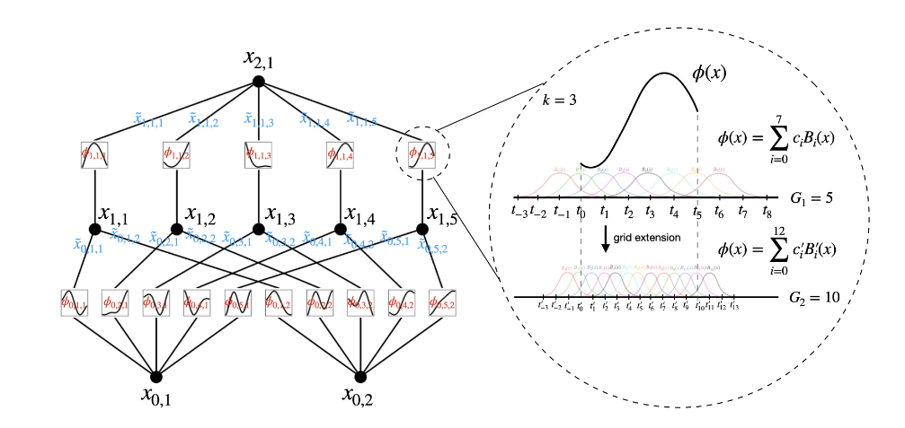
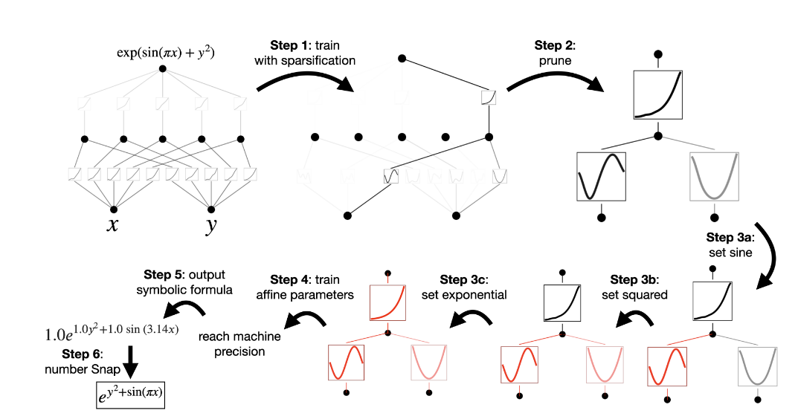
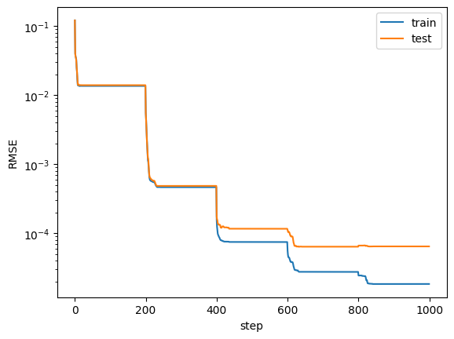

# Kolmogorov-Arnold Networks

Kolmogorov–Arnold Networks是一种基于Kolmogorov–Arnold 表示定理新型神经网络.

KAN的原论文地址:https://arxiv.org/abs/2404.19756

## Kolmogorov–Arnold 表示定理

Kolmogorov等人提出,任何一个函数都可以分解成若干单变量函数的如下组合方式:

$$
f(x)=f(x_1,x_2,...,x_n)=\sum_{q=1}^{2n+1}\Phi_q\left(\sum_{p=1}^n \phi_{q,p}(x_p)\right)
$$

值得注意的是,虽然有这样的表示方法,这些函数有可能是极其抽象且难以表示的,这个定理只保证了存在性,而不保证可行性.

## KAN

Liu等人提出了KAN,将KAN视为一个广义的Kolmogorov–Arnold 表示定理,将其推广到了任意宽度和任意深度,前后两层的节点个数并不一定要满足2n+1的要求,随着层数的深化,我们更有可能用人类可以理解的合理的激活函数去逼近目标函数,而不是局限于KA定理的抽象表示.



### 数学表示

KAN的形状由整数数组表示：

$$[n_0, n_1, \cdots, n_L],$$

其中 $n_i$ 是计算图中第 $i^{th}$ 层的节点数量。我们用 $(l,i)$ 表示第 $l$ 层的第 $i$ 个神经元，用 $x_{l,i}$ 表示 $(l,i)$ 神经元的激活值。在第 $l$ 层和第 $l+1$ 层之间，有 $n_l n_{l+1}$ 个激活函数：连接 $(l,i)$ 和 $(l+1,j)$ 的激活函数表示为

$$\phi_{l,j,i}, \quad l=0,\cdots,L-1, \quad i=1,\cdots,n_l, \quad j=1,\cdots,n_{l+1}.$$

$\phi_{l,j,i}$ 的预激活就是 $x_{l,i}$；$\phi_{l,j,i}$ 的后激活表示为 $\tilde{x}_{l,j,i} \equiv \phi_{l,j,i}(x_{l,i})$。$(l+1,j)$ 神经元的激活值就是所有传入后激活的总和：

$$x_{l+1,j} = \sum_{i=1}^{n_l} \tilde{x}_{l,j,i} = \sum_{i=1}^{n_l} \phi_{l,j,i}(x_{l,i}), \quad j=1,\cdots,n_{l+1}.$$

用矩阵形式表示为：

$$\mathbf{x}_{l+1} = \begin{pmatrix} 
\phi_{l,1,1}(\cdot) & \phi_{l,1,2}(\cdot) & \cdots & \phi_{l,1,n_l}(\cdot) \\
\phi_{l,2,1}(\cdot) & \phi_{l,2,2}(\cdot) & \cdots & \phi_{l,2,n_l}(\cdot) \\
\vdots & \vdots & \ddots & \vdots \\
\phi_{l,n_{l+1},1}(\cdot) & \phi_{l,n_{l+1},2}(\cdot) & \cdots & \phi_{l,n_{l+1},n_l}(\cdot)
\end{pmatrix} \mathbf{x}_l = \Phi_l \mathbf{x}_l$$

### B样条基函数

与传统神经网络使用固定的激活函数（如ReLU）不同，KAN的核心思想是让边上的激活函数 $\phi(x)$ 成为可学习的参数。为了实现这一点，KAN通常使用**B样条 (B-splines)** 来参数化这些一维函数。

**B样条基函数 (B-spline Basis Functions)**

B样条是一种分段多项式函数，具有良好的局部控制性和光滑性。一个 $p$ 次 B样条基函数 $B_{i,p}(x)$ 由一个称为**节点向量 (knot vector)** 的非递减序列 $t = (t_0, t_1, \dots, t_{m})$ 定义。

B样条基函数可以通过 **Cox-de Boor 递归公式** 定义：

1.  **0次 (p=0):**
    $$
    B_{i,0}(x) = \begin{cases} 1 & \text{if } t_i \le x < t_{i+1} \\ 0 & \text{otherwise} \end{cases}
    $$

2.  **p > 0 次:**
    $$
    B_{i,p}(x) = \frac{x - t_i}{t_{i+p} - t_i} B_{i,p-1}(x) + \frac{t_{i+p+1} - x}{t_{i+p+1} - t_{i+1}} B_{i+1,p-1}(x)
    $$
    (约定 $\frac{0}{0} = 0$)


在KAN中，每个边上的激活函数 $\phi(x)$ (即 $\phi_{l,j,i}(x)$) 被表示为一系列预定义的 B样条基函数的线性组合：

$$
\phi(x) = \sum_{k=1}^{K} c_k B_{k,p}(x)
$$

这里的：

*   $B_{k,p}(x)$ 是预先根据选定的节点向量和次数 $p$ （例如 $p=3$）计算好的**B样条基函数**。节点通常在激活函数的输入范围（例如 $[-2, 2]$）内均匀分布。基函数的数量 $K$ 由节点数量和次数决定。
*   $c_k$ 是 **可学习的系数** 。在训练过程中，神经网络通过反向传播学习这些系数 $c_k$ 的最优值。

通过学习这些系数 $c_k$，KAN可以让每个激活函数 $\phi(x)$ 灵活地拟合出各种复杂的一维函数形状，而不是局限于少数几种固定的非线性形式。这赋予了KAN强大的函数表达能力和更好的可解释性（因为可以单独分析每个学习到的 $\phi(x)$）。

### 可解释性与稀疏化

KAN 的一个关键优势在于其潜在的可解释性。通过结合正则化、剪枝和符号化等技术，可以从训练好的 KAN 中提取出更易于理解的数学公式。正则化是实现稀疏性的第一步。

#### 正则化

为了鼓励 KAN 学习稀疏的结构（即许多激活函数接近于零或线性），论文作者在训练目标中引入了 L1 正则化和熵正则化。

1.  **激活函数的 L1 范数**:
    定义单个激活函数 $\phi$ 在一批 $N_p$ 个输入样本 $x^{(s)}$ 上的 L1 范数为其输出的平均绝对值：

    $$
    |\phi|_1 = \frac{1}{N_p} \sum_{s=1}^{N_p} |\phi(x^{(s)})| \quad 
    $$

2.  **KAN 层的 L1 范数**:
    对于一个 KAN 层 $\Phi_l$（包含 $n_{in}$ 个输入和 $n_{out}$ 个输出，共 $n_{in} \times n_{out}$ 个激活函数 $\phi_{l,j,i}$），其 L1 范数定义为该层所有激活函数 L1 范数的总和：

    $$
    |\Phi_l|_1 = \sum_{i=1}^{n_{in}} \sum_{j=1}^{n_{out}} |\phi_{l,j,i}|_1 \quad 
    $$

    最小化这个项会鼓励层中所有激活函数的幅度变小。

3.  **KAN 层的熵**:
    为了进一步促进稀疏性（即让少数激活函数主导，多数接近零），引入了熵正则化项：

    $$
    S(\Phi_l) = - \sum_{i=1}^{n_{in}} \sum_{j=1}^{n_{out}} p_{l,j,i} \log(p_{l,j,i}), \quad \text{其中 } p_{l,j,i} = \frac{|\phi_{l,j,i}|_1}{|\Phi_l|_1} \quad (2.19)
    $$

    $p_{l,j,i}$ 代表了激活函数 $\phi_{l,j,i}$ 的相对重要性。最小化熵会使得 $p_{l,j,i}$ 的分布更加集中，即只有少数激活函数具有显著的 L1 范数。

4.  **总训练目标**:
    总的训练损失函数是预测损失 $\ell_{pred}$ 加上所有层的正则化项：

    $$
    \ell_{total} = \ell_{pred} + \lambda \left( \mu_1 \sum_{l=0}^{L-1} |\Phi_l|_1 + \mu_2 \sum_{l=0}^{L-1} S(\Phi_l) \right) \quad (2.20)
    $$
    
    其中 $\lambda, \mu_1, \mu_2$ 是控制正则化强度的超参数。通过最小化 $\ell_{total}$，KAN 被引导学习稀疏且可能更简单的函数表示。

#### 剪枝与符号化 

在通过正则化获得稀疏的 KAN 后，可以进行：

*   **剪枝 (Pruning)**: 移除 L1 范数非常小的激活函数（对应的连接）。
*   **符号化 (Symbolic Regression)**: 尝试将剩余的、学习到的激活函数（B样条曲线）拟合为已知的简单数学函数（如 $x^2$, $\sin(x)$, $\exp(x)$ 等）。

符号化可以通过窗口进行观察,也可以在KAN的符号库中加入许多你认为可能的符号,使用KAN的建议功能可以给出在指定区间范围内拟合的符号函数和KAN激活函数的R^2值等.



## 如何使用

目前,论文作者提供的库为pyKAN,通过pip下载即可.

```python
from pyKAN import *
kan_model = KAN(
    width=[2,1,1], 
    grid=5, 
    k=3, 
    seed=2, 
    device=device
)
```

grid即节点向量的数量,即网格点个数,k是B样条的阶数.

然后使用.fit()方法即可训练,

```python
model.fit(dataset, opt="LBFGS", steps=20)
```

这个方法只能根据MSE训练,不能指定损失函数,并且默认是开了正则化并且关闭符号分支的,所以速度很快.

如果要使用自定义的损失函数,需要自己编写一个训练循环.

值得注意的是,如果使用自己编写的训练循环,需要记得关闭符号分支,因为符号分支没有实现并行化,开启会极大拖慢运行速度.

### 格点精细化

十分特殊的是,KAN允许你先试用较为粗糙的格点拟合出函数的大致形状,然后再对格点进行精细化调整:

```python
# 假设已经训练好一个KAN了
grids = [10,50,100]
for grid in grids:
    model.refine(grid)
    moldel.fit(dataset,steps=20)
```
这样可以用更少的时间成本得到一个更好的拟合结果.



### 剪枝和符号化

剪枝的前提通常是你的损失函数中包含了正则化,这样,某些通路的激活函数值会被压缩到很小:

```python
model = model.prune(edge_th=1e-2)
```

这样就会剪去哪些激活函数值很小的边,模型有可能达到更好的泛化能力.

剪枝之后,通常需要再训练一遍,确保少量的激活函数的形式更加精确.

在完成剪枝之后,可以进行符号化,使用:

```python
model.fix_symbolic(0,0,0,'x')
model.fix_symbolic(0,0,1,'x')
model.fix_symbolic(0,1,0,'x')
```

去指定激活函数为固定的符号函数,其中第一个参数是层号,第二个参数是输入节点号,第三个参数是第几个激活函数,最后一个参数是符号函数的形式.

我们也可以自己向符号库中添加符号函数:

```python
add_symbolic('J0', torch.special.bessel_j0, c=1)
```

如果看不出来要用哪个,KAN还提供了内置的建议方法,并且支持自定义拟合范围:

```python
model.suggest_symbolic(0,0,0,a_range=(-40,40))
```
```
  function  fitting r2   r2 loss  complexity  complexity loss  total loss
0        0    0.000000  0.000014           0                0    0.000003
1       J0    0.199128 -0.320338           1                1    0.735932
2        x    0.001754 -0.002518           1                1    0.799496
3      cos    0.162484 -0.255794           2                2    1.548841
4      sin    0.162484 -0.255794           2                2    1.548841
```

符号化完成之后,可以使用

```
formula = model.symbolic_formula()[0][0]
ex_round(formula,6)
```

圆整成我们想要的符号表达式.

### 求解PDE

KAN的小型化,更快的神经缩放定律,更强的可解释性,注定了其在求解PDE上具有更好的表现能力.

PDE的损失函数通常包含偏微分方程损失项,所以必须要使用自定义的训练循环,并且需要关闭符号分支.

pytorch提供了强大的自动微分功能来帮助我们求解PDE:

```python
def batch_jacobian(func, model, x, create_graph=False):
    # x in shape (Batch, Length)
    def _func_sum(x):  
        return func(model, x).sum(dim=0)
    return autograd.functional.jacobian(_func_sum, x, create_graph=create_graph).permute(1,0,2)

def new_output(model, x):
    """计算模型的输出"""
    r = torch.sqrt(torch.sum(x**2, dim=1, keepdim=True))
    return model(x) * torch.exp(-r)

def laplacian(model, x):
    """计算拉普拉斯算子"""
    def sol_D1_fun(model,x):
        return batch_jacobian(new_output, model, x, create_graph=True)[:,0,:]
    
    sol_D2 = batch_jacobian(sol_D1_fun, model, x, create_graph=True)[:,:,:] 
    lap = torch.sum(torch.diagonal(sol_D2, dim1=1, dim2=2), dim=1, keepdim=True)
    return lap
```

通过自动微分库可以较为方便的计算拉普拉斯算子.

然后损失函数需要我们额外定义一个类去混合多种损失函数,通常正则化损失是必不可少的,幸运的是,KAN这个类提供了非常方便计算正则化损失的方法.reg(),只需要指定各个正则化的系数即可.

```python
class PhysicsInformedLoss(nn.Module):
    def __init__(self, lambda_data=1.0, lambda_pde=0.1, lambda_reg=0.001, device='cuda'):
        super().__init__()
        self.lambda_data = lambda_data
        self.lambda_pde = lambda_pde
        self.reg = lambda_reg
        self.mse = nn.MSELoss()
        self.device = device
        
    def forward(self, pred, target, x=None, model=None):
        # 数据驱动损失
        data_loss = self.mse(pred, target)
        
        # 物理约束损失
        pde_loss = torch.mean(schrodinger_residual(model, x)**2)
        
        # 正则化损失
        reg_term = model.reg('edge_forward_spline_n', lamb_l1=1.0, lamb_entropy=2.0, lamb_coef=0.1, lamb_coefdiff=0.1)

        # 总损失
        total_loss = self.lambda_data * data_loss + self.lambda_pde * pde_loss +self.reg * reg_term
        
        return total_loss
```

训练循环,这个训练循环实现了Adam优化器和LFBGS优化器的分段训练,根据要求修改即可.

```python
def train_kan_pinn(model, dataset, adam_steps=10, lbfgs_steps=5, batch_size=32): # 添加 batch_size 参数
    model.train()

    x_train = dataset['train_input']
    y_train = dataset['train_label']
    x_test = dataset['test_input']
    y_test = dataset['test_label']

    # --- 为 Adam 创建 DataLoader ---
    train_dataset = torch.utils.data.TensorDataset(x_train, y_train)
    train_loader = torch.utils.data.DataLoader(train_dataset, batch_size=batch_size, shuffle=True)

    # 创建损失函数
    criterion = PhysicsInformedLoss(lambda_data=1, lambda_pde=1,lambda_reg=0.00001)


    best_loss = float('inf')
    best_model_state = None

    total_steps = adam_steps + lbfgs_steps

    # 进度条
    from tqdm import tqdm

    # --- Adam 优化阶段 (批量训练) ---
    optimizer_adam = torch.optim.Adam(model.parameters(), lr=0.1) 
    scheduler_adam = lr_scheduler.StepLR(optimizer_adam, step_size=1, gamma=0.9)
    print("--- 开始 Adam 批量训练 ---")
    # 定义梯度裁剪阈值
    clip_value = 0.0000000001 # 可以调整这个值

    for step in range(adam_steps):

        model.train()
        epoch_loss = 0.0
        num_batches = 0
        # 使用 tqdm 包装 train_loader 以显示批次进度
        batch_pbar = tqdm(train_loader, desc=f'Adam 训练 (Epoch {step+1}/{adam_steps})', leave=False, ncols=100)
        for x_batch, y_batch in batch_pbar:
            optimizer_adam.zero_grad()
            x_batch.requires_grad_(True)
            r_batch = torch.norm(x_batch, dim=1)
            outputs = model(x_batch)*torch.exp(-r_batch)
            loss = criterion(outputs, y_batch, x_batch, model)
            loss.backward()

            # --- 添加梯度裁剪 ---
            torch.nn.utils.clip_grad_norm_(model.parameters(), clip_value)
            # 或者使用 clip_grad_value_
            # torch.nn.utils.clip_grad_value_(model.parameters(), clip_value)

            optimizer_adam.step()
            epoch_loss += loss.item()
            num_batches += 1
            # 获取当前学习率并显示
            current_lr = optimizer_adam.param_groups[0]['lr']
            batch_pbar.set_postfix({'Batch Loss': f"{loss.item():.6f}", 'LR': f"{current_lr:.6f}"}) # 显示当前批次损失和学习率

        # 在每个 Adam epoch (step) 结束后更新学习率
        scheduler_adam.step()

        avg_epoch_loss = epoch_loss / num_batches # 计算平均 epoch 损失 (可选，主要用于观察)

        # --- 每个 Adam epoch 后进行评估 ---
        model.eval()
        # 训练集损失 (在整个训练集上评估)
        x_train_eval = x_train.detach().requires_grad_(True) # 评估需要梯度以计算 PDE loss
        r_train_eval = torch.norm(x_train_eval, dim=1)
        train_pred = model(x_train_eval)*torch.exp(-r_train_eval)
        current_train_loss = criterion(train_pred, y_train, x_train_eval, model).item()
        train_losses.append(current_train_loss)

        # 测试集损失 (在整个测试集上评估)
        x_test_eval = x_test.detach().requires_grad_(True) # 评估需要梯度以计算 PDE loss
        r_test_eval = torch.norm(x_test_eval, dim=1)
        test_pred = model(x_test_eval)*torch.exp(-r_test_eval)
        current_test_loss = criterion(test_pred, y_test, x_test_eval, model).item()
        test_losses.append(current_test_loss)

        # 测试集损失评估后，更新最佳模型状态
        if current_test_loss < best_loss:
            best_loss = current_test_loss
            best_model_state = {k: v.cpu().clone() for k, v in model.state_dict().items()}
        print(
            f"Adam 训练 (Epoch {step+1}/{adam_steps}) - 训练损失: {current_train_loss:.6f}, 测试损失: {current_test_loss:.6f}"
        )

    print("--- 开始 LBFGS 微调 ---")
    for grid in [5,10,20]:
        if grid == 5:
            pass
        else:
            model.refine(grid)
        optimizer_lbfgs = LBFGS(model.parameters(), lr=1, history_size=10, line_search_fn="strong_wolfe", tolerance_grad=1e-32, tolerance_change=1e-32, tolerance_ys=1e-32)
        lbfgs_pbar = tqdm(range(lbfgs_steps), desc='LBFGS 微调', ncols=100) # LBFGS 的进度条
        for step in range(lbfgs_steps):
            current_total_step = adam_steps + step
            lbfgs_pbar.set_description(f'LBFGS 微调 (Step {step+1}/{lbfgs_steps})')
            model.train()

            def closure():
                optimizer_lbfgs.zero_grad()
                x_train.requires_grad_(True)
                r_train = torch.norm(x_train, dim=1)
                outputs = model(x_train)*torch.exp(-r_train)
                loss = criterion(outputs, y_train, x_train, model)
                loss.backward()
                return loss

            optimizer_lbfgs.step(closure)

            # --- 每个 LBFGS step 后进行评估 ---
            model.eval()

            # 训练集损失
            x_train_eval = x_train.detach().requires_grad_(True)
            r_train_eval = torch.norm(x_train_eval, dim=1)
            train_pred = model(x_train_eval)*torch.exp(-r_train_eval)
            current_train_loss = criterion(train_pred, y_train, x_train_eval, model).item()
            train_losses.append(current_train_loss)

            # 测试集损失
            x_test_eval = x_test.detach().requires_grad_(True)
            r_test_eval = torch.norm(x_test_eval, dim=1)
            test_pred = model(x_test_eval)*torch.exp(-r_test_eval)
            current_test_loss = criterion(test_pred, y_test, x_test_eval, model).item()
            test_losses.append(current_test_loss)

            # 测试集损失评估后，更新最佳模型状态
            if current_test_loss < best_loss:
                best_loss = current_test_loss
                best_model_state = {k: v.cpu().clone() for k, v in model.state_dict().items()}
            
            if step%1==0:
                model.update_grid_from_samples(x_train_eval)

            # 更新 LBFGS 进度条
            lbfgs_pbar.set_postfix({
                '训练损失': f"{current_train_loss:.6f}",
                '测试损失': f"{current_test_loss:.6f}",
            })
            lbfgs_pbar.update(1)
        lbfgs_pbar.close()
        print("--- LBFGS 微调结束 ---")


    
    # --- 保存最佳模型 ---
    if best_model_state is not None:
        save_path = 'your_path'
        torch.save(best_model_state, save_path)


    # 返回训练结果
    results = {
        'train_loss': train_losses,
        'test_loss': test_losses,
        'best_loss': best_loss if best_model_state is not None else float('inf'), 
    }

    return results
```

值得注意的是,非常建议在训练过程中每隔几步就更新一下格点的分布,这样可以使得整个模型的拟合效果更好.

```python
if step % 1==0:
    model.update_grid_from_samples(x_train_eval)
```

同时,求解PDE要非常注重数值稳定性,所以要适当添加梯度裁剪,防止出现梯度爆炸,数值溢出等等问题,这并不是一个很容易解决的问题.


