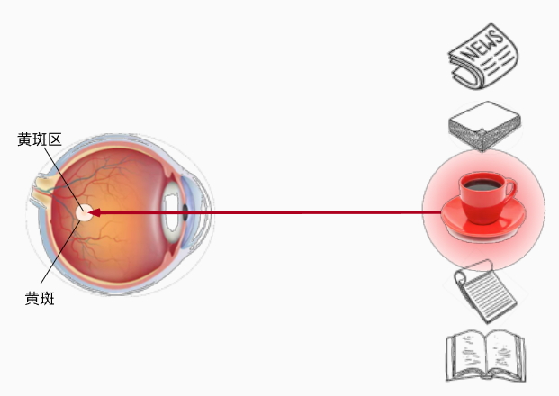
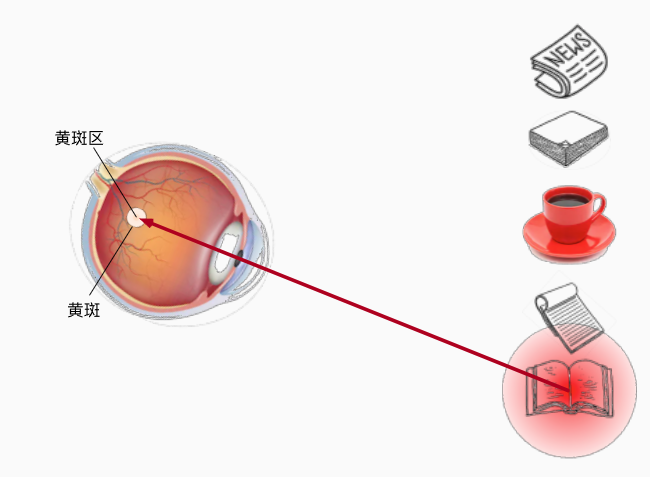

# 注意力机制

!!! note "参考资料"
    
    本笔记参考'动手学深度学习系列'的注意力机制章节[🔗](https://zh-v2.d2l.ai/chapter_attention-mechanisms/index.html)

## 查询,键,值

|||
|---|---|

生活中人类在处理信息的时候,总是先根据显式的线索基于不同的注意力,例如咖啡杯的颜色是红色的,那么他会更加醒目,我们往往能第一时间注意到咖啡杯,这些信息被称作keys,人喝了咖啡之后,他的专注力提升了,于是他就会想读书,于是注意力就转移到书上.

由此可以定义三个变量query , key , value. query是人的意志线索,key是物品本身的线索,二者共同作用将感官输入引导到value

## Nadaraya-Watson 核回归

Nadaraya-Watson 核回归是一种非参数化的回归方法,它的基本思想是将每个查询点的预测值设为所有键值对的加权平均值,其中权重由查询点与键点之间的相似度函数确定.

Nadaraya-Watson 核回归的数学表达式如下:

$$
f(x) = \frac{1}{n} \sum_{i=1}^n w(x, x_i) y_i = \frac{1}{n} \sum_{i=1}^n \frac{K(x, x_i)}{\sum_{j=1}^n K(x, x_j)} y_i
$$

其中, $w(x, x_i)$ 是查询点 $x$ 与键点 $x_i$ 之间的相似度函数, $y_i$ 是对应的值, K被称为核函数,往往使用高斯核函数完成相应的任务.

进一步的,可以在核函数中增加参数来提升回归能力:

$$
y = \frac{1}{n} \sum_{i=1}^n \frac{K(x, x_i ,\lambda)}{\sum_{j=1}^n K(x, x_j,\lambda)} y_i
$$

## 注意力评分函数

将上述的N-W回归用高斯核展开就是:

$$
y = \frac{1}{n} \sum_{i=1}^n \frac{\exp(-\frac{1}{2} (x - x_i)^2)}{\sum_{j=1}^n \exp(-\frac{1}{2} (x - x_j)^2)} y_i = \sum_{i=1}^n \mathbf {softmax}(-\frac{1}{2}(x - x_i)^2) y_i = \sum_{i=1}^n \mathbf {softmax} \ a(\mathbf q, \mathbf k_i)\mathbf v_i
$$

其中的指数部分就被称作注意力评分函数,显然,这里的注意力评分是使用输入与键点之间的距离来计算的,而softmax函数则将这些评分归一化到[0,1]区间,从而得到每个键点的注意力权重.


### 加性注意力

$$
a(\mathbf q, \mathbf k) = \mathbf w_v^\top \text{tanh}(\mathbf W_q\mathbf q + \mathbf W_k \mathbf k) \in \mathbb{R},
$$

查询和键分别通过一个线性层处理之后再相加,线性层的偏置项被禁用,这是因为之后要经过softmax层,即使加了偏置也会上下抵消,不会产生任何作用.

```python
class AdditiveAttention(nn.Module):
    def __init__(self, quary_size, key_size, dropout, **kwargs):
        super(AdditiveAttention, self).__init__(**kwargs)
        self.W_k = nn.Linear(key_size, num_hiddens, bias=False)
        self.W_q = nn.Linear(quary_size, num_hiddens, bias=False)
        self.w_v = nn.Linear(num_hiddens, 1, bias=False)
    
    def forward(self, queries, keys, values):
        # key [batch_size , key_num , key_size]
        # query [batch_size , query_num , query_size]
        # value [batch_size , key_num , value_size]
        features = self.W_k(keys).unsqueeze(1) + self.W_q(queries).unsqueeze(2)  # [batch_size , query_num , key_num , num_hiddens] 
        # 在这里获取的所有q-k对的加性注意力分数
        features = torch.tanh(features) # [batch_size , query_num , key_num , 1]
        scores = self.w_v(features).squeeze(-1) # [batch_size , query_num , key_num]

        # softmax 是在key_num维度上进行的,也就是说,对于某一个query,我们计算所有key与其的注意力分数并将其归一化
        attention_weights = torch.softmax(scores, dim=-1) # [batch_size , query_num , key_num]
        return torch.bmm(attention_weights, values) # [batch_size , query_num , value_size] 
        # 使用批量矩阵乘法对所有value进行加权求和,给出一个查询点下应该出现的值
```

### 缩放点积注意力

缩放点积注意力是现在主流模型更加青睐的选择,他没有额外的参数需要学习,只需要进行一次矩阵乘法,就可以得到所有查询点与键点之间的注意力分数.

点积注意力来源于这样一个事实,两个向量之间的点积衡量了他们之间的相似度(这要求query,key是等长的),但是容易产生大值,所以我们需要除以向量的维度来进行适当的缩放,假设查询和键的所有元素都是独立的随机变量， 并且都满足零均值和单位方差， 那么两个向量的点积的均值为0,方程为d(向量的长度),为了使得点积满足单位方差,即需要除以$\sqrt{d}$.

$$
a(\mathbf q, \mathbf k) = \mathbf{q}^\top \mathbf{k}  /\sqrt{d}.
$$

于是,我们就得到了大名鼎鼎的缩放点积注意力:

$$
\mathrm{softmax}\left(\frac{\mathbf Q \mathbf K^\top }{\sqrt{d}}\right) \mathbf V \in \mathbb{R}^{n\times v}.
$$

```python
#@save
class DotProductAttention(nn.Module):
    def __init__(self, query_size , key_size, num_hiddens):
        super(DotProductAttention, self).__init__()
        self.W_q = nn.Linear(query_size,num_hiddens)
        self.W_k = nn.Linear(key_size,num_hiddens)
    def forward(self, queries, keys , values):
        # queries [batch_size , num_queries , query_size]
        # keys [batch_size , num_keys , key_size]
        # values [batch_size , num_keys , value_size]
        queries = self.W_q(queries) # [batch_size , num_queries , num_hiddens]
        keys = self.W_k(keys) # [batch_size , num_keys , num_hiddens]

        # 将k的最后两个维度进行交换,代表转置
        scores = torch.bmm(queries, keys.transpose(1,2)) / math.sqrt(num_hiddens) # [batch_size , num_queries , num_keys]
        attention_weights = torch.softmax(scores, dim=-1) # [batch_size , num_queries , num_keys]
        return torch.bmm(attention_weights, values) # [batch_size , num_queries , value_size]
```

## 多头注意力


多头注意力机制是将缩放点积注意力机制进行了并行化,从而提高了模型的表示能力,首先通过几个线性层获得查询,键,值的投影,然后将它们分别输入到缩放点积注意力机制中,最后将所有头的输出拼接起来,再通过一个线性层进行投影,得到最终的输出.

这种方式允许模型在不同的子空间中学习不同的表示,专注于模型的不同部分,从而提高了模型的表示能力.

```python
class MultiHeadAttention(nn.Module):
    def __init__(self, num_heads ,num_hiddens , query_size , key_size , value_size):
        super(MultiHeadAttention, self).__init__()
        self.num_heads = num_heads
        self.W_q = nn.Linear(query_size,num_hiddens)
        self.W_k = nn.Linear(key_size,num_hiddens)
        self.W_v = nn.Linear(value_size,num_hiddens)
        self.W_o = nn.Linear(num_hiddens,num_hiddens)
        self.attention = DotProductAttention(query_size, key_size, num_hiddens//num_heads)
    
    def transpose_qkv(self,X):
        # 这个函数的作用是将q,k,v都拆分成多个头的独立输入
        # X [batch_size , num_queries or num_keys , num_hiddens]
        # 首先重塑X,增加一个num_heads的维度
        X = X.reshape(X.shape[0],X.shape[1],self.num_heads,-1) # [batch_size , num_queries or num_keys , num_heads , num_hiddens/num_heads]
        # 然后交换num_queries or num_keys 和 num_heads 的维度
        X = X.transpose(1,2) # [batch_size , num_heads , num_queries or num_keys , num_hiddens/num_heads]

        # 为了适配DotProductAttention的输入
        # 也为了减少计算的复杂程度
        # 四维张量可以被处理成batch_size * num_heads 个 2D 张量并行处理
        X = X.reshape(-1,X.shape[2],X.shape[3]) # [batch_size * num_heads , num_queries or num_keys , num_hiddens/num_heads]
        return X

    def transpose_output(self, X):
        # 和上面相反的操作,我们需要还原回到[batch_size , num_keys , num_hiddens]的形状
        # X [batch_size * num_heads , num_keys , num_hiddens/num_heads]
        X = X.reshape(-1 , self.num_heads, X.shape[1], X.shape[2]) # [batch_size , num_heads , num_keys , num_hiddens/num_heads]
        # 然后交换num_heads 和 num_keys 的维度
        X = X.transpose(1,2) # [batch_size , num_keys , num_heads , num_hiddens/num_heads]
        # 最后将num_heads 和 num_hiddens 维度合并
        return X.reshape(X.shape[0],X.shape[1],-1) # [batch_size , num_keys , num_hiddens]
    
    def forward(self, queries, keys, values):
        queries = self.W_q(queries) # [batch_size , num_queries , num_hiddens]
        keys = self.W_k(keys) # [batch_size , num_keys , num_hiddens]
        values = self.W_v(values) # [batch_size , num_keys , num_hiddens]
        # 然后将q,k,v分别输入到transpose_qkv函数中,得到多个头的独立输入
        queries = self.transpose_qkv(queries) # [batch_size * num_heads , num_queries , num_hiddens/num_heads]
        keys = self.transpose_qkv(keys) # [batch_size * num_heads , num_keys , num_hiddens/num_heads]
        values = self.transpose_qkv(values) # [batch_size * num_heads , num_keys , num_hiddens/num_heads]
        # 并行计算注意力
        outputs = self.attention(queries, keys, values) # [batch_size * num_heads , num_queries , num_hiddens/num_heads]
        # 然后将多个头的输出拼接起来
        outputs = self.transpose_output(outputs) # [batch_size , num_queries , num_hiddens]
        # 最后通过一个线性层进行投影
        return self.W_o(outputs) # [batch_size , num_queries , num_hiddens]
```

## 自注意力和位置编码

自注意力其实就是query,key ,value都来自于同一个序列,例如在Transformer中,自注意力机制用于对输入序列进行编码,其中query,key,value都是输入序列的表示.


这张图展示了不同的建模方式对序列数据的处理方法,循环神经网络由于是顺序操作,并行化差,运行速度慢, 1D卷积核自注意力方法都可以并行化,但是卷积方法难以捕获长距离依赖.

然而,由于并行化操作,自注意力方法失去了对序列中元素的顺序信息,故我们需要进行补充编码,也就是位置编码,位置编码由三角函数实现,并且直接加到词嵌入矩阵上去:$\mathbf P + \mathbf X$,对于第i个词的第j和j+1维度的位置编码,其公式为:

$$
\begin{split}\begin{aligned} p_{i, 2j} &= \sin\left(\frac{i}{10000^{2j/d}}\right),\\p_{i, 2j+1} &= \cos\left(\frac{i}{10000^{2j/d}}\right).\end{aligned}\end{split}
$$

首先,分母这个10000就是模拟一个大数,确保周期足够长,一个序列中每个词的位置编码不会重复, 而三角函数部分是对二进制编码的一种模拟:

```
0的二进制是：000
1的二进制是：001
2的二进制是：010
3的二进制是：011
4的二进制是：100
5的二进制是：101
6的二进制是：110
7的二进制是：111
```
对于二进制,低位数字更新的频率远高于高位数字,故位置编码通过j来控制不同维度的更新频率,当j较大的时候,位置编码的随位置变化的更新频率就会降低.


从P矩阵的热图中可以发现,较大维度的位置编码几乎不怎么更新.

