# 反应器的设计
<!-- 
## purpose

反应器的设计目标为以下三个：

- 反应器类型
- 反应器尺寸
- 操作方式
  
工业上确定反应器尺寸常常按照如下经验公式进行：

对于间歇操作反应器:

$$
V_R=\frac{Gt}{7200 \rho w y}
$$

这些物理量的含义如下所示:

- G:生产能力
- t:一个反应周期的时间
- w:反应产物在反应液中的含量
- y:分离纯化的收率
- 7200:年生产时间,通常为小时

连续操作反应器的生产时间要更久一点:

$$
V_R=\frac{Gt}{8000 \rho w y}
$$

## general types of reactor

主要按照操作方式分为三大类:

- 间歇操作反应器
- 连续操作反应器
- 半间歇操作反应器

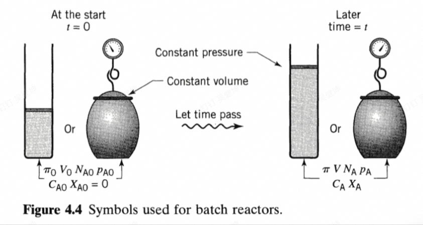

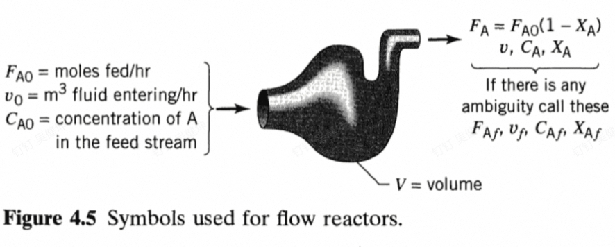

其中,连续操作反应器按照是否进行稳态流动分为:

- 稳态连续操作反应器
- 非稳态连续操作反应器

## ideal reactors

类似于其他理想模型的确立,我们也有理想反应器.

所谓的理想反应器,就是在反应过程中反应物混合均匀,不考虑热损失和传质阻力的反应器.

常见的理想反应器有:

- 简单的间歇操作反应器
- 平推流反应器
- 全混流反应器

### ideal batch reactor

对于理想间歇操作反应器,其输入和输出均不存在于反应进程中.

考虑如下物料守恒关系:

$$
input = output +disapperance +accumulation
$$

物料的输入等于输出加上由于反应消失的物质和累计在反应器中的物质.

对间歇操作就是:

$$
disappearance=-accumulation
$$

事实上也就是我们熟知的:

$$
-r_A V= -\frac{d N_A}{dt}
$$

### steady-state mixed flow reactor

这个就是稳态全混流反应器,不断加料,不断搅拌不断出料,忽略其中的不均匀性和传质过程,全混流反应就是一个点操作.设进入反应器的反应物的摩尔浓度流量为$F_{A0}$(就是流量乘上其进入的反应物浓度):

$$
\begin{aligned}
input=F_{A 0} \\
output=F_{A 0}(1-X_A)
\end{aligned}
$$

对于全混流反应器,其容器内没有物质累积,所以:

$$
F_{A 0}X_A =(-r_A)V
$$

我们给出空时和空速的定义,空时即处理反应器体积的物质所需要的时间,空速定义为空时的倒数:设体积流量为$v_0$:

$$
\tau=\frac{1}{s}=\frac{V}{v_0}=\frac{VC_{A0}}{F_{A 0}}
$$

然后将速率方程代入到上面的定义式中就得到:

$$
\tau=\frac{C_{A 0}X_A}{-r_A}
$$

由于全混流反应器一瞬间就混合均匀然后出料了,所以容器内的浓度应该等于出口反应物的浓度,换句话说,容器内的反应速率等于出口的反应速率:

所以就得到:

$$
\tau=\frac{C_{A 0}\Delta X_A}{(-r_A)_f}
$$

这里改成了$\Delta X_A$意思是进料之前就可以是初步反应的反应物.然后这个$(-r_A)_f$就可以用一级反应二级反应的速率方程套进去,以变体积的一级反应为例:

$$
\tau=\frac{C_{A 0}X_A}{kC_{A}}=\frac{\frac{n_{A 0}}{V_0}X_A}{k \frac{n_{A 0}(1-X_A)}{V}}=\frac{(1+\varepsilon_AX_A)X_A}{k(1-X_A)}
$$

这样,空时就可以用转化率和速率常数来表示了,其他反应也类似,如果是恒容反应,只需要令$\varepsilon_A=0$即可

### Plug_flow reactor(平推流反应器)

平推流反应器与间歇操作反应器有很多类似的地方,相当于以空间去换时间

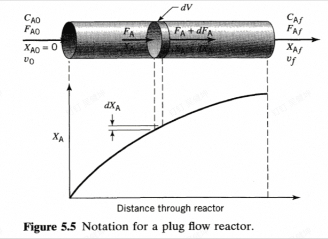

其中的每个小微元相当于一个全混流反应器,所以可以预见,全混流反应器只要串联的足够多,应该和平推流反应器会有类似的性质.

$$
F_{A}=F_A+dF_A-r_AdV
$$

得到:

$$
dF_A=dF_{A 0}(1-X_A)=-F_{A 0}dX_A=r_AdV
$$

如果延续前面全混流反应器的空时的定义,即处理反应器体积的反应物所需要的时间.

$$
\tau=\frac{C_{A 0}V}{F_{A 0}}=C_{A 0}\int_0^V\frac{dV}{F_{A 0}}=C_{A 0}\int_{X_i}^{X_f}\frac{dX_A}{-r_A}
$$

为了证明其和间歇操作反应器的类似性,我们考虑对间歇操作反应器的速率方程进行积分:

$$
t=\int\frac{-dN_A}{-r_AV}=C_{A 0}\int_0^{X_A} \frac{dX_A}{r_A(1+\varepsilon_AX_A)}
$$

如果是恒容体系,我们发现反应时间的表达式和平推流空时的表达式一模一样,这论证了以空间换时间的说法.

## Design for Single reaction

我们可以对不同反应器的空时进行比较,假设反应为n级反应:

对于全混流反应器:

$$
\tau_m=\frac{C_{A 0}\Delta X_A}{(-r_A)_f}=\frac{C_{A 0}X_A}{kC_A^n}
$$

注意到:

$$
\frac{C_{A 0}}{C_A}=\frac{1+\varepsilon_AX_A}{1-X_A}
$$

所以得到:

$$
\tau_mC_{A 0}^{n-1}=\frac{X_A(1+\varepsilon_AX_A)^n}{k(1-X_A)^n}
$$

对于平推流反应器:

$$
\tau_p=C_{A 0}\int_{0}^{X_f}\frac{dX_A}{kC_A^n}=\frac{1}{C_{A 0}^{n-1}}\int_0^{X_{f}}\frac{(1+\varepsilon_AX_A)^n}{k(1-X_A)^n}dX_A
$$

单纯从肉眼上难以直接看出那个的空时更短一点,但是书上给出的图说明了平推流反应器的空时应该是更短一点,这也符合我们的直觉,也就是说,同等进料条件和转化率要求下,全混流反应器需要更大的体积才能达到和平推流反应器相同的效果

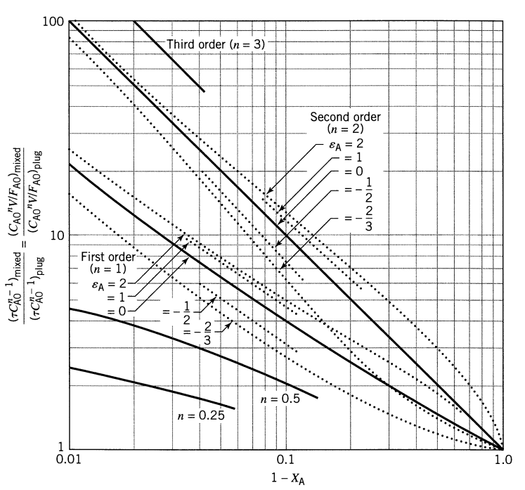

### 平推流反应器的串联

十分显然的,平推流反应器的串联就是一个更大的平推流反应器.

### 全混流反应器的串联

串联全混流反应器有i个体积,所以就有i个空时,对于第i个全混流反应器,其空时为:

$$
\tau_i=\frac{V_iC_0}{F_0}
$$

对进口出口进行物料衡算:

$$
F_0(1-X_{i-1})-F_0(1-X_i)=-r_AV_i
$$

所以就得到:

$$
\frac{V_i}{F_0}=\frac{X_i-X_{i-1}}{-r_A}
$$

所以:

$$
\tau_i=C_0\frac{X_i-X_{i-1}}{-r_A}
$$

对所有的空时进行累加得到总空时,如果考虑一级反应:

$$
\tau_i=\frac{C_{i-1}-C_i}{kC_i}=\frac{1}{k}(\frac{C_{i-1}}{C_i}-1)
$$

再假设每个全混流反应器的体积都是一致的,那么其空时也会一致,所以就得到:

$$
\tau_{nmixture}=N\tau_i=\frac{N}{k}[(\frac{C_0}{C_N})^{\frac{1}{N}}-1]
$$

这个时候,我们再考虑平推流反应的一级反应空时表达式:

$$
\tau_p=C_{A 0}\int_{0}^{X_f}\frac{dX_A}{-r_A}=\frac{1}{k}\ln \frac{C}{C_0}
$$

不难发现,这就是N串联全混流反应器当N趋于正无穷时候的极限值.

由于全混流反应器是一个点操作反应器,所以要想达到和平推流反应器相同的转化率,需要更大的体积.
然而,我们可以通过串联的办法解决这一问题,多个全混流反应器串联,其会更加接近平推流反应器,空间利用率更高:

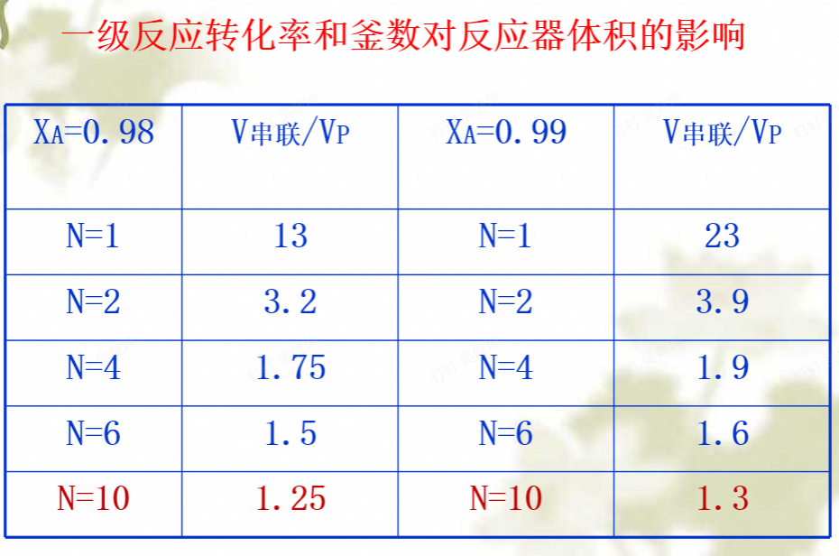

从图中可以看到,随着串联釜数的增加,其所需体积越来越小,直至接近平推流反应器.

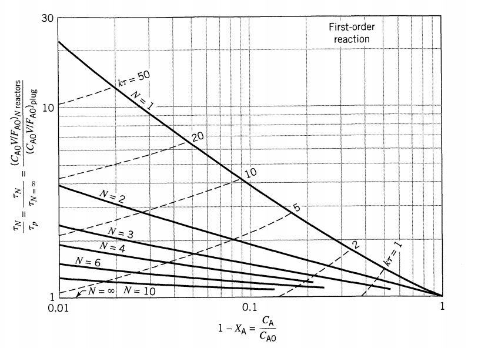

### Mixed Flow Reactors of Different Size in Series

不同体积的全混流反应器串联起来,当然可以像之前一样使用公式去直接求解各个空时然后求总空时:

$$
\tau_i=C_0\frac{X_i-X_{i-1}}{-r_i}=\frac{C_{i-1}-C_i}{-r_{i}}
$$

书上给出了一种用图解的办法求解各个空时的方法:

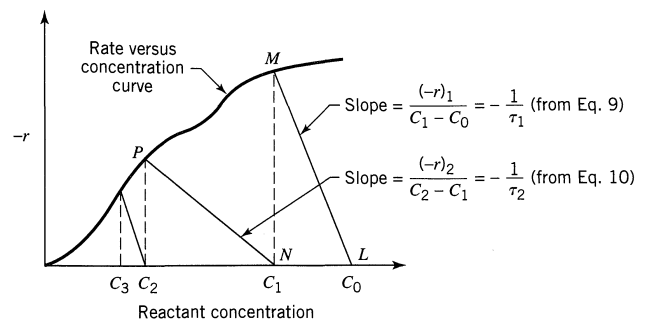

或者在$\frac{1}{r}-X$图上也可以用矩形面积来表示:

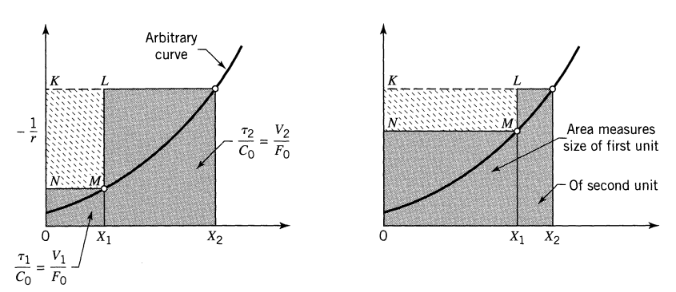

总空时就是两个灰色的面积之和,要使得总空时尽可能的小,只需要使得白色部分的面积尽可能的大,临界条件即为在M点切线的斜率等于矩形对角线的斜率:

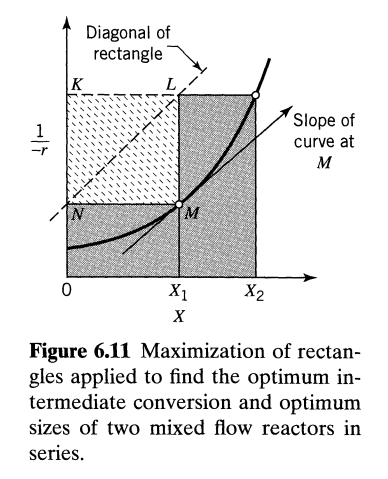

这样就给出了串联全混流反应器前后两个釜的体积大小.通过这种可视化建模的办法,原先看似无从下手的问题也变得迎刃而解了.

### Reactors of Different Types in Series 

除了同种反应器的串联,还可以将不同种类的反应器串联在一起,例如两个全混流和一个平推流:

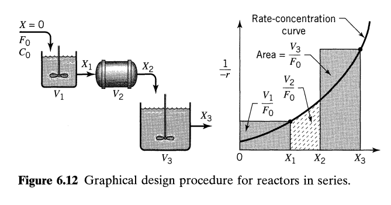

这个的最优数学处理比较复杂,设计到的变量很多,所以在精度要求不是很高的场合,我们不进行数学处理,而是采取一些经验准则:

如果我想要使得反应器的空时尽可能小:

- 对于任意的n>0的n阶反应,反应器应该串联
  - 当速率浓度曲线下凸(n>1)时,应该使得反应物浓度尽可能高
  - 当速率浓度曲线上凸时(n<1)时,应该使得反应物浓度尽可能低
  - n>1时,反应器的排列顺序应该为:平推流,小全混流,大全混流,当n>1时则反过来,使用大全混流,小全混流,平推流.
- 如果速率曲线存在最大值或者最小值,则没有合适的规律可以提出 -->

## RECYCLE REACTOR

循环反应器是平推流反应器的一个改版,他将产出的液体分一部分出来回流到进料出再次进行反应

定义回流比为循环体积流量比上从体系离开的体积流量,不妨设离开体系的体积流量为$v_f$,那么循环流量就是$Rv_f$:

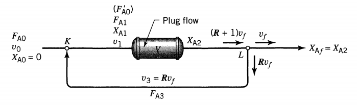

首先考虑一个质量衡算,进去的等于出来的加上反应掉的:

$$
F_{A 0}+RC_fv_f=(1+R)C_fv_f+F_{A 0}X_{A f}
$$

于是我们就得到:$F_{A 0}(1-X_{Af})=C_fv_f=F_{A 3}/R$

于是进入反应器的浓度流量就为:$(1+R)F_{A 0}$.

如果要计算空时或者反应器的体积,我们需要知道进出口的转化率:

$$
\frac{V}{(1+R)F_{A 0}}=\int_{X_{A 1}}^{X_{A f}}\frac{dX_A}{-r_A}
$$

出口的转化率是我们根据要求设定的,只需要求出进口的转化率即可,即我们需要求出进口处的浓度:

$$
C_{A 1}=\frac{F_{A 0}+RF_{A 0}(1-X_{A f})}{v_0+Rv_f}=\frac{F_{A 0}+RF_{A 0}(1-X_{A f})}{v_0+Rv_0(1+\varepsilon_AX_{Af})}=C_{A_0}\frac{1+R-RX_{Af}}{1+R+R\varepsilon_AX_{Af}}
$$

然后考虑$X_{A_1}$的表达式:

$$
X_{A1}=\frac{C_{A 0}V_0-C_{A 1}V_1}{C_{A 0}V_0}=\frac{C_{A 0}V_0-C_{A 1}V_0(1+\varepsilon_AX_{A1})}{C_{A 0}V_0}
$$

得到:

$$
X_{A1}=\frac{1-\frac{C_{A 1}}{C_{A 0}}}{1+\varepsilon_A \frac{C_{A 1}}{C_{A 0}}}=\frac{R}{1+R}X_{Af}
$$

最终我们可以确定反应器体积:

$$
\frac{V}{(1+R)F_{A 0}}=\int_{\frac{R}{1+R}X_{Af}}^{X_{A f}}\frac{dX_A}{-r_A}
$$

可视化结果即为:

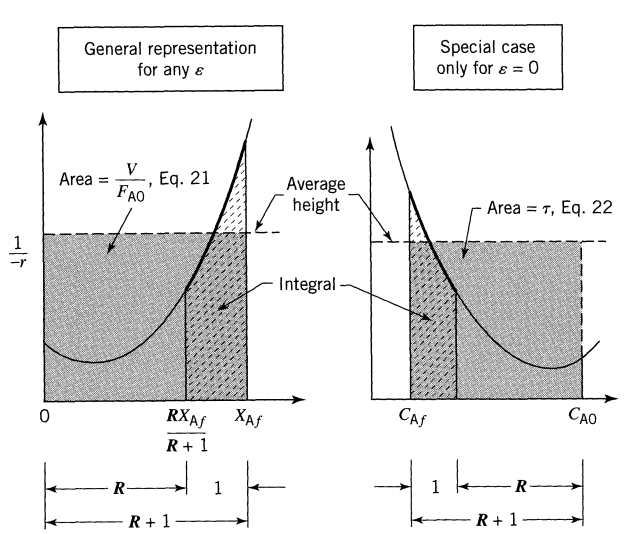

也可以根据我们的表达式看到循环比决定反应器更加接近平推流还是全混流:

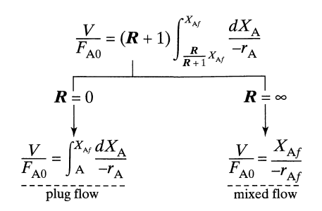

##  AUTOCATALYTIC REACTIONS 

这里的自催化反应的重心集中在反应器的设计中,我们知道,由于产物具有催化作用,所以反应的反应速率在整个过程中一定是先增大后减小的.

那么,也就是说,速率-转化率曲线存在最大最小值,那么,不同的阶段最佳的反应器也会不同,从下面这张图可以直观的看出来:

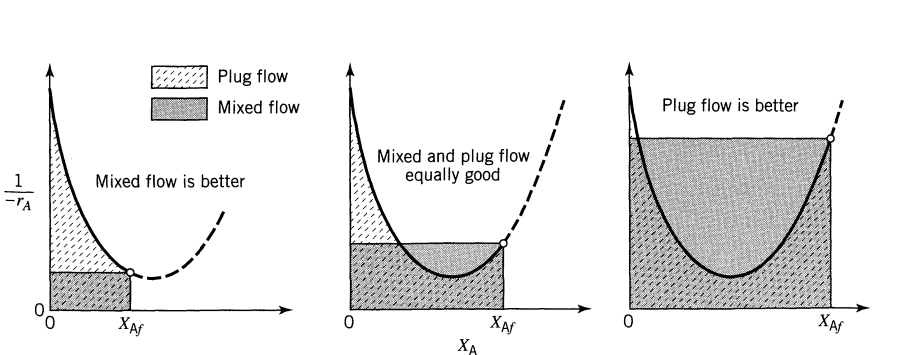

在反应进行的初期阶段,平推流需要的空时远远大于全混流,只有当反应进行的比较彻底的时候,才适合使用平推流反应器.这和我们之前讨论的正级数反应的规律是很不相同的.

我们不能反应到一定阶段后就直接把反应物取出来然后换个反应器,所以,选用一种在整个反应阶段都还凑合的过去的反应器就至关重要.

也就是说,这样的反应器既要有全混流反应器的性质,也要有平推流反应器的性质,前面的多釜串联是一个例子,有循环比的平推流反应器也是一个例子.

那么,就必然存在一个最佳的循环比,使得反应器的空时尽可能的小:

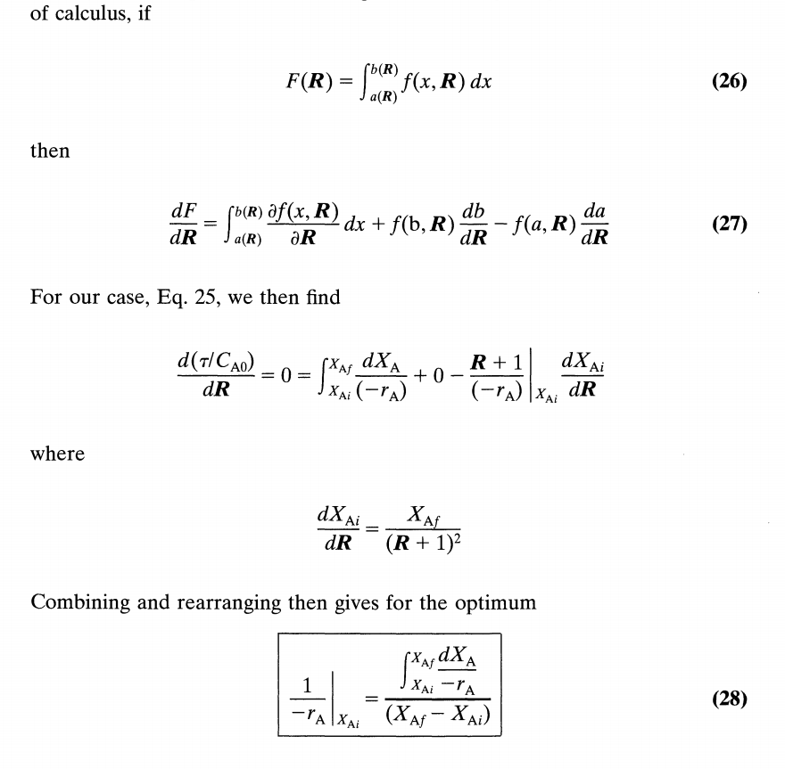

这个结果表明,在$\frac{1}{r}-X$图上,恰好找到一个点,其纵坐标等于其横坐标到$X_{A f}$范围内的积分平均值:

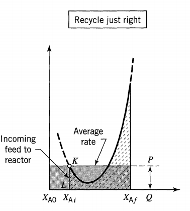

这刚好就是最佳循环比的位置.

### Reactor Combinations 

如果对于自催化反应,允许我们使用组合反应器,那么最佳的条件就是在达到最优反应浓度之前,使用全混流反应器,在达到最优反应浓度之后,使用平推流反应器:

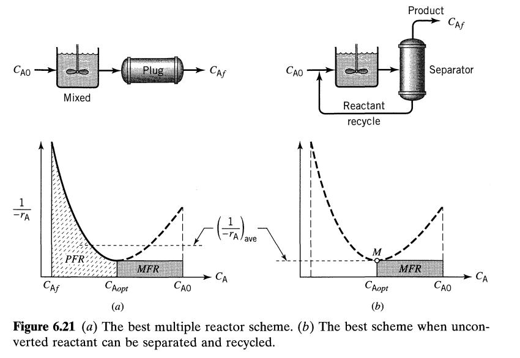

左边这张图对应着最佳反应方案,右边这张图对应着最佳分离回收方案.

## Design for parallel reactions

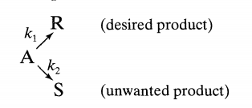

在平行反应发生的时候,我们通常不关心反应的速率问题,更多的是关心反应的收率或者选择性,所以我们将两个速率方程相除:

$$
\frac{r_1}{r_2}=\frac{k_1}{k_2}C_A^{a-b}
$$

假设说我要使得R尽可能的多,我就需要根据幂次的正负去调整A的浓度来达成我的目的.除此之外,我们可以通过改变温度和活化能(催化剂)来调整速率常数以达到我们的目的.

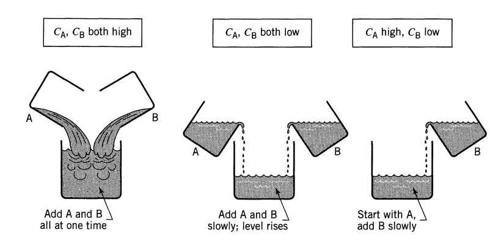

为了定量描述我们的需求,定义瞬时产品收率和总产品收率:

$$
\begin{aligned}
\varphi=\frac{dC_R}{dC_A} \\
\varPhi=\frac{\Delta C_R}{\Delta C_A}
\end{aligned}
$$

对于全混流反应器,总收率就等于料液出口处的产品收率,而对于平推流反应器,二者之间存在一个积分关系:

$$
\Phi=\frac{1}{\Delta C_A}\int_{C_{A 0}}^{C_{A f}}dC_R=\frac{1}{\Delta C_A}\int_{C_{A 0}}^{C_{A f}}\varphi dC_A
$$

对于N-串联全混流反应器,做一个物料衡算:

$$
\Phi(C_{A 0}-C_{A N})=\varphi_1(C_{A 0}-C_{A 1})+ \cdots +\varphi_N(C_{A N-1}-C_{A N})=C_{Rf}
$$

得到其中收率和各个收率以及最终浓度之间的关系.

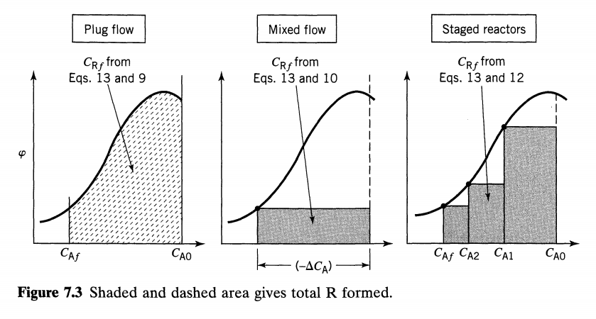

从这张图中可以看出,不同反应器的总收率是不同的,对于全混流反应器,可以通过调整出口浓度来改变梯形的面积从而得到最佳收率.

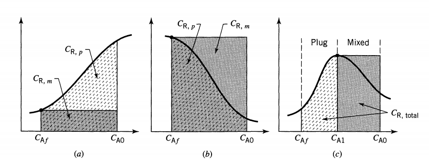

这张图给出了不同反应不同反应器的收率情况,我们要根据反应条件动态选择反应器从而使我们的总收率达到最大.

另一个常见的概念是选择性,即我们期望的产物与我们不期望的产物之比,但是在某些场景下会难以使用,所以更加被广泛使用的还是收率:

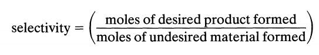

