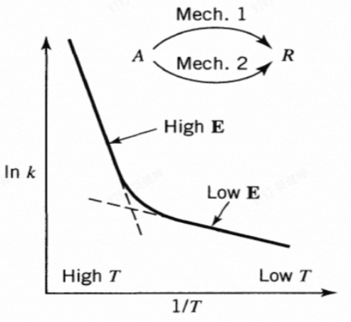
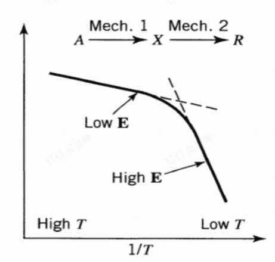
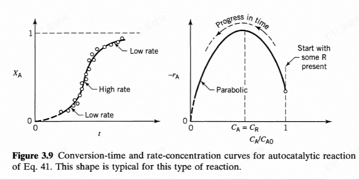
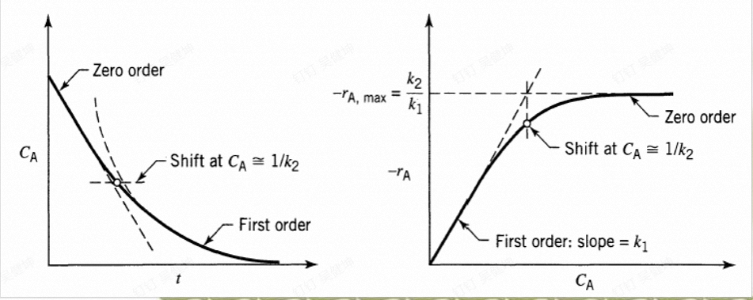

# 均相反应动力学

均相反应即反应发生在单相中,常见的均相反应分为单一反应和复合反应,其中复合反应又可以展开成为其他的反应:

- 单一反应
- 复合反应
  - 串联反应
  - 平行反应
  - 奇奇怪怪的反应
  
这些反应的反应速率通常用浓度随时间的变化率来描述,化学反应的反应速率只取决于当前状态的反应浓度和反应温度,可以写出反应速率方程:

$$
r_1=f_1(temperature)f_2(composition_1)f_3(composition_3)\cdots
$$

效仿无量纲数群的定义,上述表达式可以用幂函数去近似,通常温度的影响用反应速率常数$k$来代替:

$$
r_1=k_1C_1^\alpha C_2^\beta\cdots
$$

其中,幂被称作反应级数

## Elementary reactions and Nonelementary reactions

基元反应的反应级数与其化学计量数一一对应,而非纪元反应就没有这样的关系

## Rate Constant k

物理化学中推导的速率常数k的表达式如下所示:

$$
k=k_1T^m \exp(-\frac{E}{RT})
$$

也就是速率常数随温度的升高而递增,其中E被称作反应活化能(activation energy),可以用来度量反应发生的难易程度,温度升高,通常活化能较大的反应其速率常数增大的会更快,也就是对温度更加敏感.

所以活化能不仅决定了反应速率,也决定了反应对温度的敏感程度

通常在工业应用上对速率常数的表达式做出简化,将温度对速率常数的影响全部归并到指数项之中:

$$
k=k_0'\exp(-\frac{E}{RT})
$$

$k_0'$被称作频率因子或者指前因子(frequency or pre-exponential factor)

## Useful Clues for recation mechanism

计量方程和速率方程的结合可以为我们带来反应机理的信息,即反应是单一反应,平行反应,亦或者是串联反应.

考虑计量方程对应的速率方程:

$$
r_A=k[A]^\alpha[B]^\beta=k_0[A]^\alpha[B]^\beta exp(-\frac{E}{RT})
$$

在恒定温度下观察反应物的浓度变化可以得到速率方程的指数幂,比较其与我们写出的化学方程式的计量数可以得知我们写出的反应是否是基元反应.

在相同浓度,不同温度下测定反应速率(通常可以连续测量然后使用差分代替导数),上式可以化简为:

$$
r_A=k'\exp(-\frac{E}{RT})
$$

取对数就是:

$$
\ln r_A=\ln k'-\frac{E}{R}\frac{1}{T}
$$

假设存在两个反应,两个反应的活化能不同,做$\ln r_A-\frac{1}{T}$图,如果单独考虑两个反应,活化能较高的反应斜率大,反之则斜率小.

如果是平行反应,则测得的曲线为:

如果是串联反应,则曲线为:

## Rate Equation for constant volume

速率和转化率:

速率的初始定义(通常是溶液和气相)为:

$$
r_A=-\frac{1}{V}\frac{dN_A}{dt}
$$

在其体积被限定的情况下,可以用浓度的变化率来表示,但是反应速率方程是不会变的,无论其体积改变与否

$$
\begin{aligned}
-r_A=\frac{1}{V}\frac{d N_A}{dt}=\frac{dC_A}{dt} \\
-X_A=\frac{C_A-C_0}{C_0}
\end{aligned}
$$

### Irreversible reaction

首先考虑不可逆反应,因为其速率方程相对较为简单

$$
A \to B
$$

#### zero-order reaction

$$
-\frac{d C_A}{dt}=k
$$

#### first-order reaction

$$
-\frac{d C_A}{dt}=k[A]
$$

或者，更为广义的来说，只要反应级数之和为1就是一级反应，以二元反应为例：

$$
-\frac{dC_A}{dt}=k[A]^\alpha[B]\beta
$$

其中$\alpha+\beta=1$

#### second-order reaction

其化学反应方程为:

$$
A+B \to products
$$

所以其速率方程为:

$$
-\frac{dC_A}{dt}=k[A][B]
$$

然后根据物料平衡关系把其中一个变量干掉然后积分即可,值得注意的是:

即使是方程:

$$
A+2B\to C
$$

其速率方程也为上面所示,只不过,把B干掉的时候,和A的定量转化关系要发生改变.

#### third-order reaction

反应方程为:

$$
A+B+C \to products
$$

速率方程为:

$$
-r_A=k[A][B][C]
$$

#### n-th-order reaction 

同理也会有n级反应,最简单的速率方程形式为:

$$
-r_A=k[A]^n
$$

对于n不等于1的体系,积分结果为:

$$
[A]^{1-n}-[A_0]^{1-n}=(n-1)kt
$$

#### half-life

半衰期即为反应物反应到一半的时候对应的时间,代入上面的n级反应的浓度-时间方程中得到:

$$
t_{\frac{1}{2}}=\frac{(0.5^{1-n}-1)[A_0]^{1-n}}{k(n-1)}
$$

### reversible reaction

对于可逆反应,速率方程要发生轻微的改变,因为产物也会变成生成物,所以会多出一项和一个速率常数

$$
A \rightleftharpoons R
$$

$$
\frac{dC_A}{dt}=k_1[A]-k_2[B]
$$

### homogeneous catalyzed reactions(均相催化反应)

体系中存在两个反应路径,一个是自发反应,另一个是由催化剂催化的反应:

$$
\begin{cases} A \to B, &  \\ A+C\to B+C, &  \end{cases}
$$

所以动力学方程由两项贡献:

$$
-\frac{dC_A}{dt}=k_1[A]+k_2[A][C]=(k_2[C]+k_1)[A]=k'[A]
$$

等价速率常数和催化剂浓度有关

### autocatalysed reactions(自催化反应)

自己催化自己的反应:

$$
A+R\to R+R
$$

这个满足不可逆二阶动力学方程的方程关系,又满足一阶的定量关系,假设初态A的浓度为$C_{A0}$,总浓度为$C_0$

由于物料平衡关系,A会转化成为R,但是总物质的浓度保持不变:

$$
C_A+C_R=C_0
$$

$$
-\frac{dC_A}{dt}=kC_AC_R=kC_A(C_{0}-C_A)
$$

$$
\frac{dC_A}{(C_A-\frac{1}{2}C_{0})^2-(\frac{1}{2}C_{0})^2}=kdt
$$

得到浓度随时间变化的关系:

$$
\frac{1}{C_{0}}\ln{\frac{C_A-C_{0}}{C_A}}/ \frac{C_{A 0}-C_0}{C_{A 0}}=kt
$$

从这里我们可以发现,==初态的时候R的浓度一定不能为0,否则分母部分就会出现0,积分出现发散的情况==

整理一下得到:

$$
\ln \frac{C_{A 0}(C_A-C_{0})}{C_A(C_{A 0}-C_0)}=C_0kt
$$

### irreversible mutiple reactions

这个意思是不可逆符合反应,通常包括三个部分,平行反应,串联反应以及变级数反应:

### parallel reactions

$$
\begin{cases} A \to R, &  \\ A\to S , &  \end{cases}
$$

A的消耗由两部分贡献,最终得到:

$$
-\frac{dC_A}{dt}=k_1[A]+k_2[A]
$$

### series reactions

$$
A\to B\to C
$$

首先先解决最简单的A的反应:

$$
\frac{d[A]}{dt}=-k_1[A]
$$

得到:

$$
[A]=[A_0]\exp(-k_1 t)
$$

然后写出中间产物B的动力学方程:

$$
\frac{d[B]}{dt}=k_1[A]-k_2[B]
$$

代入[A]的方程得到:

$$
\frac{d[B]}{dt}+k_2[B]=k_1[A_0]\exp(-k_1t)
$$

使用瞪眼法一眼看出可以用通解特解法求解,对应齐次方程的通解为:

$$
[B]_1=C\exp[-k_2t]
$$

然后要找一个非齐次方程的特解,猜测其特解具有$C'\exp{-k_1t}$的形式,代进去:

$$
-k_1C'+k_2C'=k_1[A_0]
$$

得到一个特解为:

$$
[B]_1=\frac{k_1[A_0]}{k_2-k_1}\exp[-k_2t]
$$

所以B的通解为(代入初值条件[B_0]=0):

$$
[B]=\frac{k_1[A_0]}{k_2-k_1}(\exp(-k_1t)-\exp(-k_2t))
$$

最后一个物质C就可以根据物料守恒推断出来:

$$
C_0=C_A+C_B+C_C
$$

### Reactions of Shifting Order　

$$
-\frac{d[A]}{dt}=\frac{k_1[A]}{1+k_2[A]}=\frac{k_1}{\frac{1}{[A]}+k_2}
$$

我也不知道为什么长这鸟样,显然当[A]比较多的时候,右边近似是一个常数,所以是从零级反应开始,当[A]越来越少的时候,反应会接近一级反应.

### varying-volume reaction

就是变体积反应的意思,通常发生在气相体系当中,==体系的总压是恒定的==,那么其体积随着反应进度会有着线性的变化

不妨看一个简单的反应:

$$
A\to aB
$$

设初态总共有$n_0$个A,然后体积为$V_0$,反应一段时间后,A的量为$n$,那么此时体系的总物质的量为:$n+a(n_0-n)$,所以体积的变化率为:

$$
\frac{V_0-V}{V_0}=\frac{n_0-n-a(n_0-n)}{n_0}=1-a+(a-1)\frac{n}{n_0}=1-a+(a-1)(1-X_A)=-(a-1)X_A
$$

然后定义体积的膨胀系数为:

$$
\varepsilon_A=\frac{V_{X_A=1}-V_{X_A=0}}{V_{X_A=0}}=a-1
$$

然后代入到上式中得到:

$$
V=V_0(1+\varepsilon_AX_A)
$$

等价变形一下就是转化率的变体积定义：

$$
X_A=\frac{V-V_0}{V_0 \varepsilon_A}
$$

然后再考察变体积情况下的反应动力学方程,动力学方程的基本形式不会发生改变,只会适当的进行变形:

$$
-r_A=\frac{1}{V}\frac{dN_A}{dt}=-\frac{N_{A0}}{V_0(1+\varepsilon_AX_A)}\frac{d X_A}{dt}= -\frac{C_{A0}}{V_0(1+\varepsilon_AX_A)}\frac{d X_A}{dt}
$$

或者写成体积变化的形式:

$$
r_A=\frac{N_{A0}}{V}\frac{d X_A}{dt}=\frac{C_{A0}}{V\varepsilon_A} \frac{dV}{dt}=\frac{C_{A0}}{\varepsilon_A} \frac{d \ln V}{dt}
$$

然后根据这个变体积的式子可以得到不同反应级数的动力学方程:

#### zero-order

$$
\frac{C_{A 0}}{\varepsilon_A} \frac{d \ln V}{dt}=k
$$

#### first-order

$$
\frac{C_{A 0}}{\varepsilon_A} \frac{d \ln V}{dt}=kC_A
$$

其中:

$$
C_A= \frac{N_A}{V}=\frac{1}{V} N_{A0}(1-X_A)=\frac{N_{A0}}{V}(1-\frac{V-V_0}{V_0 \varepsilon_A})=C_{A 0} \frac{V_0(\varepsilon_A-1)-V}{V \varepsilon_A}
$$

然后代回到上面积分一下得到:

$$
-\ln(1- \frac{\Delta V}{\varepsilon_A V_0})=kt
$$

#### second-order

\[
\begin{equation}
-r_A = \frac{C_{A0}}{\varepsilon_A} \frac{d \ln V}{dt} = kC_A^2 = kC_{A0}^2 \left( \frac{1 - X_A}{1 + \varepsilon_A X_A} \right)^2
\end{equation}
\]

$$
\begin{equation}
\frac{(1 + \varepsilon_A) \Delta V}{V_0 \varepsilon_A - \Delta V} + \varepsilon_A \ln \left(1 - \frac{\Delta V}{V_0 \varepsilon_A} \right) = kC_{A0}t
\end{equation}
$$

