# 复合反应概述

虽然说,复合反应的关系往往非常复杂,但是,十分幸运的是,我们可以将他们归纳拆分成为平行反应和串联反应,以此进行可靠的分析.

## 串联反应

先从最简单的串联反应开始讨论:

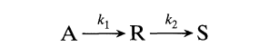

其速率方程为:

$$
\begin{aligned}
&r_A=-k_1C_A \\
&r_R=k_1C_A-k_2C_R\\
&r_S=k_2C_R
\end{aligned}
$$

求解上述微分方程组得到(在第一个文档已经解过了):

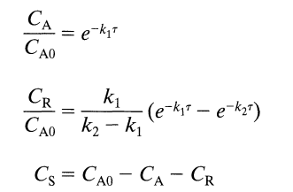

但是这是间歇反应器或者平推流反应器的结果(只需要把t改成空时),浓度变化结果如下图所示:

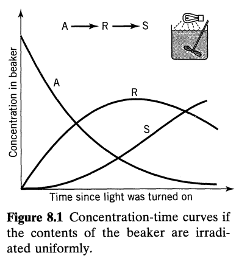

如果我们考虑把料液抽出一小部分的涓涓细流,然后用同等强度的光去辐射,那么单位体积的光强会大大提升,也就是说,反应会迅速进行,从A直接反应到S,然后将这股涓涓细流引导回到反应釜中,这样,两种不同阶段的液体就被混合了,中间体R的浓度在反应釜中被大大减少,几乎看不见了.

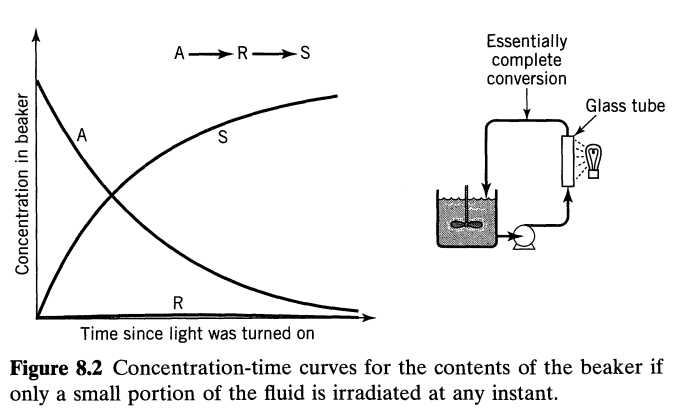

这两种情况刚好对应了最大可能的R和最少的R,那么可以从中总结出一个规律,如果不允许混合不同阶段的反应液体,反应液的组成随时间均匀变化,那么这对应获得最大中间体的情况,反之,在反应途中混合了不同阶段的料液,则会使得R的最大浓度减小.

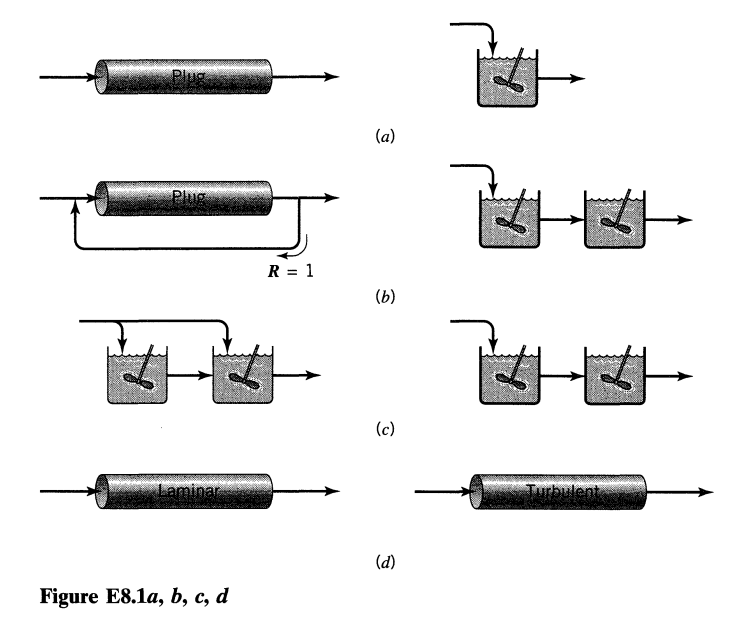

根据这一原则,可以对上述四种情况做出定性判断(目标是使R尽可能多)

- (a)平推流的混合最少,因此是最好的
- (b)循环比等于1的平推流比串联的全混流要更加接近平推流,因此左边这个更好
- (c)显然右边这个更好
- (d)湍流各个组成的料液混合会更少,这似乎有一点反直觉,事实上,料液的分布和位置有关,而位置实际上和速度分布有关,我们知道,层流的速度分布是抛物线形的,而湍流的分布相较于层流会更加平缓,所以在一个反应器界面上,速度相同的会较多,也就是同一个反应阶段的料液较多,也就是不同阶段的混合减少了,故R会更多.

### plug or bitch

对于平推流或者间歇反应器,最大浓度和最佳时间(空时)出现在极值点处:

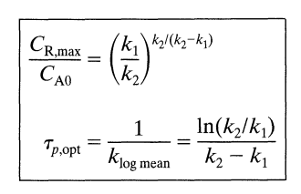

### mixed-flow

对于全混流,其浓度规律肯定和上面的不太一样,变量依旧是空时:

首先注意到对A的物料衡算(考虑一阶反应):

$$
vC_{A 0}=vC_A+k_1C_AV
$$

两边除掉体积流量并且用空时来代替:

$$
\frac{C_A}{C_{A 0}}=\frac{1}{1+k_1\tau_m}
$$

然后考虑对R的物料衡算:

$$
vC_R=vC_{R 0}+(k_1C_A-k_2C_R)V
$$

如果初始没有R的话就得到:

$$
\frac{C_R}{C_{A 0}}=\frac{k_1\tau_mC_A}{k_2\tau_m+1}=\frac{k_1\tau_m}{(1+k_1\tau_m)(1+k_2\tau_m)}
$$

根据物料守恒能得到S的浓度关系式,对R的表达式求导可以得到最大浓度和最优空时:

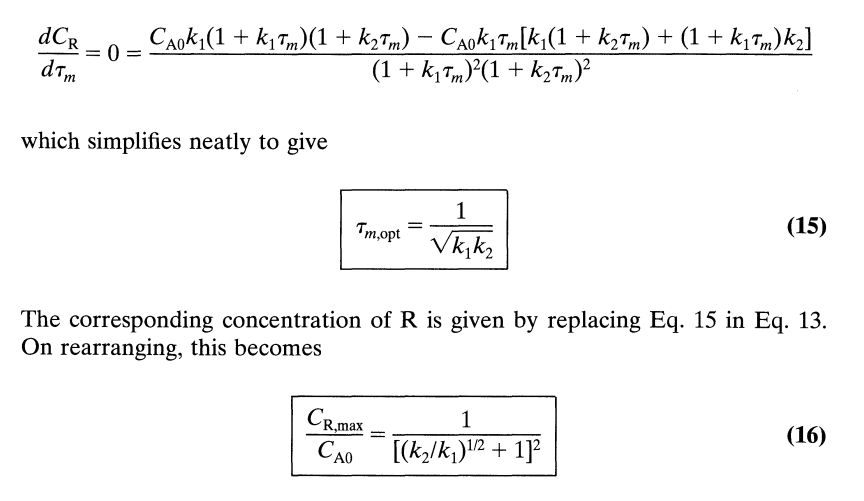

根据不等式关系,我们可以得到,平推流出现最优R的空时是要小于等于全混流出现最优R的空时的,也就是:

$$
\tau_{p,opt}\le \tau_{m,opt}
$$

### 其中一个是零级反应

微分方程组的求解会变得更加的简单,这里不进行求解,只贴几个图:

#### $n_2=0$:

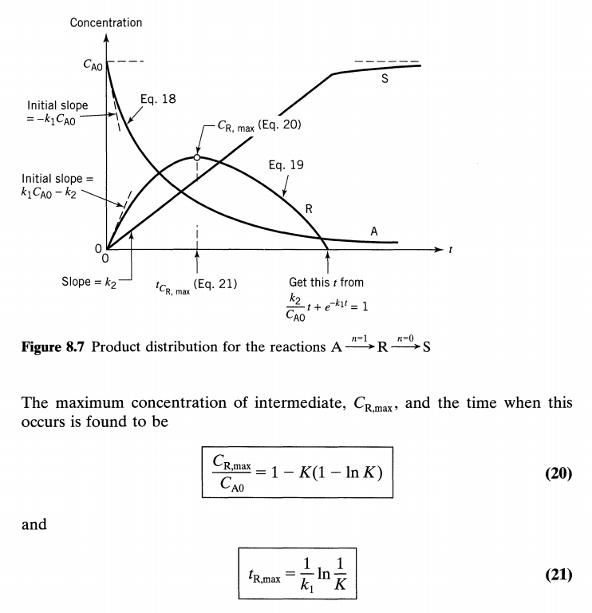

#### $n_1=0$:

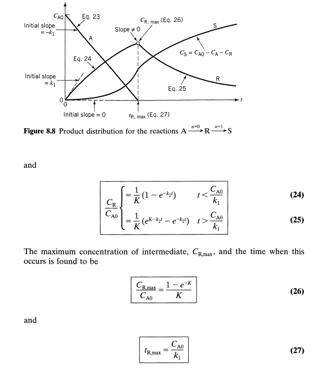

## 可逆反应的情况

通过上面的分析,我们知道了串联不可逆反应总是会出现R的极大值,那么能否根据R是否出现最大值来判定是否是串联反应呢,答案是否定的,事实上,由于可逆这个条件的加入,平行反应也有可能使得中间体的浓度出现最大值,这可以从下面的图中看出,最好的判定方法就是观察另一个产物S的速率曲线,看看其在t=0时刻会不会产生斜率.

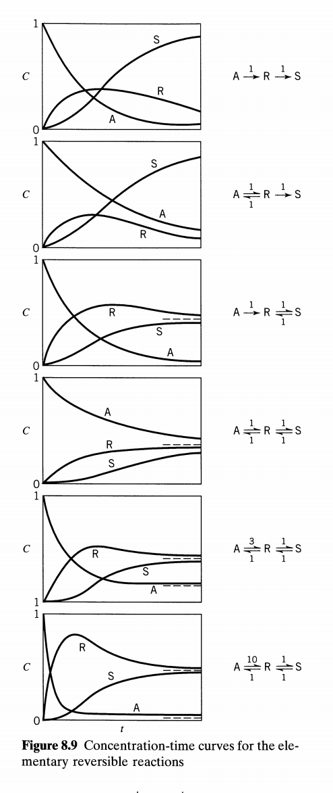

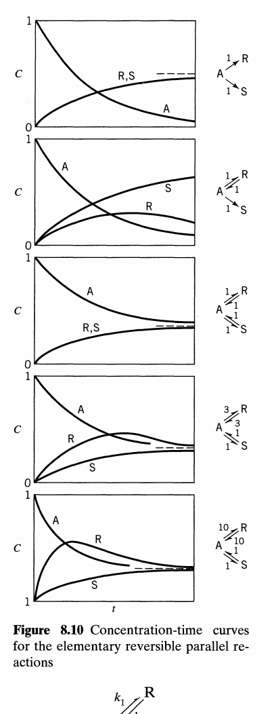

## Irreversible Series-Parallel Reactions 

不可逆串联平行反应的表现形式一般为:

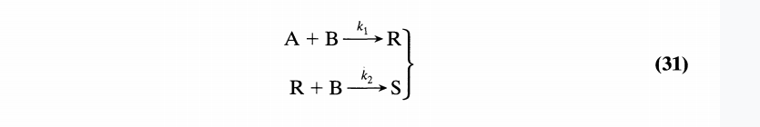

这个反应过程看起来相当复杂,下面分定性和定量两种情况对它展开讨论:

###  Qualitative

首先考虑三个定性过程:

1. 向A中缓慢滴加B
2. 向B中缓慢滴加A
3. 快速混合A和B

在第一种情况,A和B反应会生成R,但是R不会被进一步反应,因为没有B了,只有当R的量积累到一定程度后才有能力和A竞争B,于是显而易见的R的浓度会出现最大值.

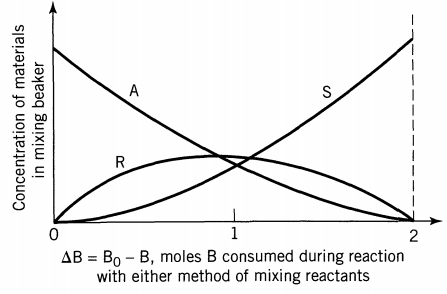

那么,可以预见的是,第三种情况和第一种情况相似,R会与A竞争B,自然就会产生最大值.

而第二种情况,在过量的B中滴加A,由于B的浓度很大,所有的R都会被转化成为S,B一直在减小,S一直在增大,直到B的量不够了,S的浓度达到最大值.A也开始积累:

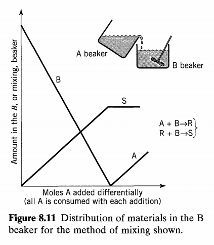

这种情况相当于不断地加入新鲜的A到没有A的液体中,不同阶段的反应液被充分混合,于是R的浓度一直维持在一个低水平.

观察我们上面定性分析的规律,可以发现,要使得R的浓度最大,不允许不同阶段的反应液被混合,这与串联反应的规律一致,换句话说,不可逆串联平行反应可以视作串联反应:

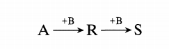

同时,我们注意到,B的浓度不会对我们的产品分布造成很大的影响,这与平行反应的规律一致,因为平行反应产物的微分方程组中并没有B的浓度:

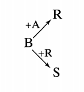

从这个角度上看,不可逆串联平行反应又可以视作平行反应.

所以,可以分别利用串联反应和并联反应的规律来研究组分串并联反应.

### Quantitative

### plug flow or batch

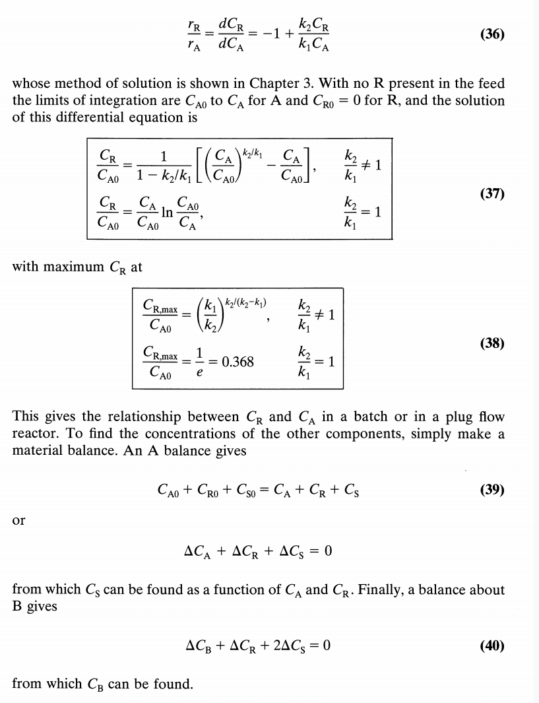

### mixed flow

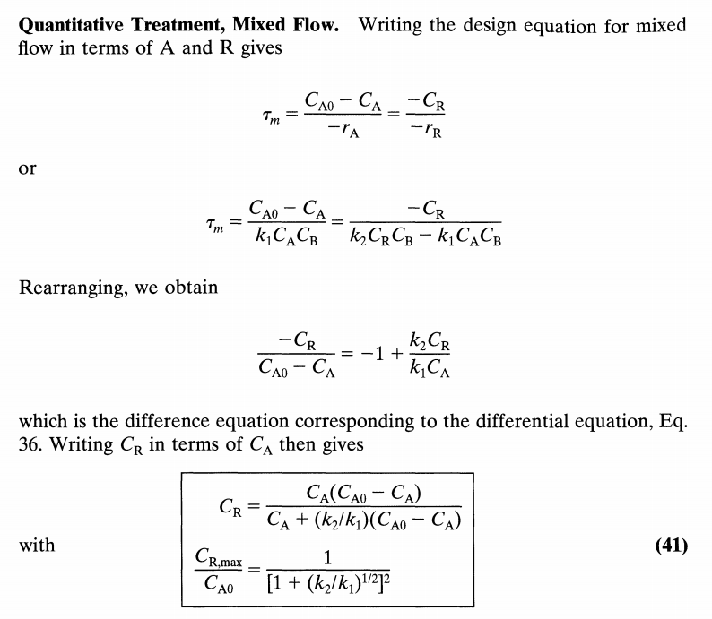

## DENBIGH REACTIONS

登拜反应可以看做是我们想要研究的反应的统一代表,经由登拜反应的化简,我们可以得到所有我们之前研究过的反应:

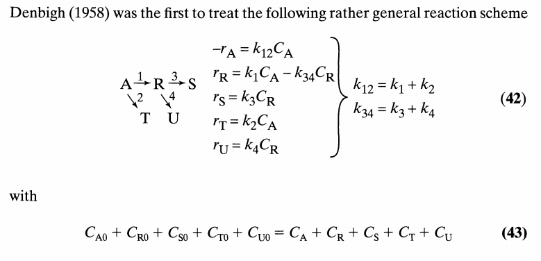

其动力学方程组虽然都只是一阶微分方程组,但是求解还是比较麻烦的,下面直接贴出他的解析解:

### plug or batch

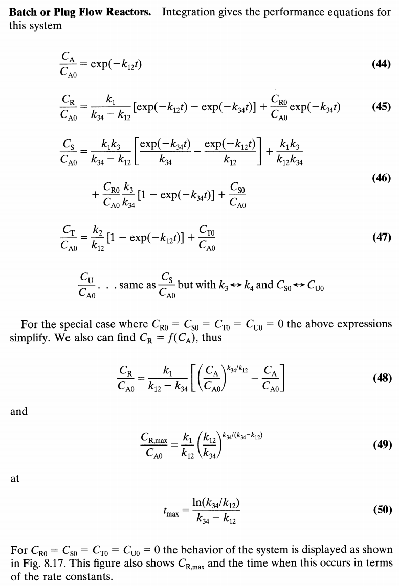

### mixed flow

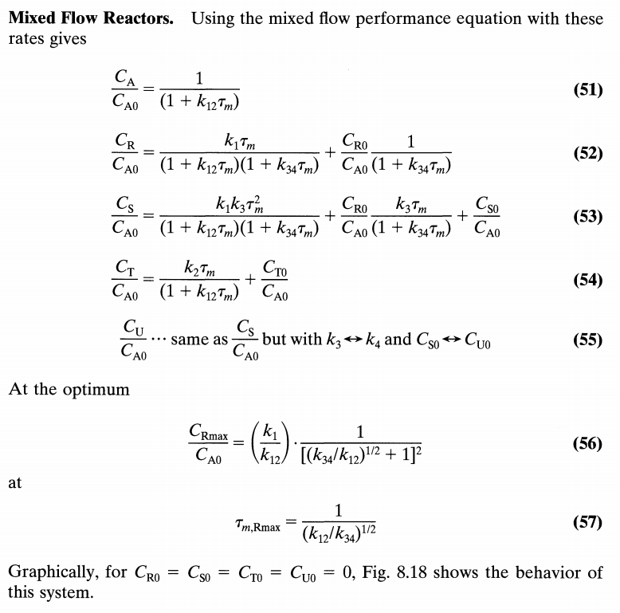
