# 温度和压力效应

## 平衡常数

考虑一个简单反应$A+B\to R+S$,设其平衡常数为K,那么列出速率方程

$$
-r_A=k_1[A][B]-k_{-1}[R][S]=0=k_{10}\exp(\frac{-E_a}{RT})[A][B]-k_{-10}\exp(\frac{-E_b}{RT})[R][S]=0
$$

得到平衡常数为:

$$
K=\frac{k_{10}}{k_{-10}}=\exp(\frac{E_b-E_a}{RT})\frac{[R][S]}{[A][B]}
$$

可以看到,反应的平衡常数和活化能垒以及温度有关,这里的活化能垒通常指的是焓垒,即可以在等压条件下视作0K时的反应热.

## 不同温度下的反应热

反应热也就是反应焓变(等压)在不同温度下略有不同,这个增量可以通过等压摩尔热容变对时间的积分得到.

考虑一个反应$A+B\to R+S$,其在温度T1条件下的反应热为$\Delta H_{T_1}$,那么在T2条件下的反应热为$\Delta H_{T_2}$.纯生成物和反应物在这两个温度下的焓变为$\Delta H_3$和$\Delta H_4$,那么根据焓是状态函数这一特性,得到:

$$
\Delta H_2+\Delta H_3=\Delta H_1+\Delta H_4
$$

也就是:

$$
\Delta H_{T_2}=\Delta H_{T_1}+\int_{T_1}^{T_2}(\frac{\partial \Delta H}{\partial T})_pdT=\Delta H_{T_1}+\int_{T_1}^{T_2}\Delta C_pdT
$$

## 平衡转化率

平衡转化率在一定程度上可以用平衡常数来度量,前面我们得到一级反应条件下平衡转化率随温度变化的关系,现在来推导更加普适的关系:

考虑反应平衡时吉布斯自由能变为0:

$$
\Delta G=-RT\ln K=\Delta H-T\Delta S=0
$$

得到:

$$
\ln K=-(\frac{\Delta H}{RT}-\frac{\Delta S}{R})
$$

上式左右两边同时对温度求导,假设反应焓和反应熵随温度变化不大:

$$
\frac{d\ln K}{dT}=-\frac{\Delta H}{RT^2}
$$

那两边分离变量积分回来就得到:

$$
\ln \frac{K_2}{K_1}=\frac{\Delta H}{R}(\frac{1}{T_1}-\frac{1}{T_2})
$$

可以严格的得到平衡常数和反应焓变以及温度的关系.

## 通用图解设计过程

所谓通用图解设计过程就是根据反应图像进行描点最后确定反应器尺寸的过程,首先我们知道转化率和反应速率以及温度有关,确定了反应速率和温度就能唯一确定一个转化率,以一级不可逆反应为例:

$$
-r_A=k_{10}\exp(\frac{-E_a}{RT})[A]=k_{10}\exp(\frac{-E_a}{RT})C_{A_0}(1-X_A)
$$

如果限定r,那么就可以绘制出X-T曲线,不同的反应速率就会得到不同的等速率曲线,由于X-T这两个物理量是我们比较好测量的,所以在X-T平面内可以绘制出反应路径,从而得到反应路径上的一系列速率值,通过描点法得到$-\frac{1}{r_A}-X_A$曲线,从而得到反应器体积.

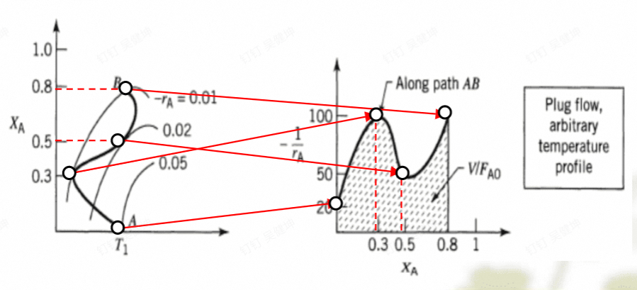

## 最佳操作温度

经过绘图发现,反应转化率-温度等速率曲线往往呈现先升高后降低的趋势,在等速率曲线中存在最大值,即过点(0,X_A)做一条水平线,与某一条等速率曲线必定会相切,沿着切点往左或者往右运动,反应速率都会降低,故切点处对应的温度即为最佳操作温度.

一系列最佳操作温度点连起来就是最佳操作曲线,我们设计反应进程的时候要尽可能使反应沿着这条线进行,然而,在实际操作中,最佳操作温度存在一个上限,这个上限由催化剂的耐热性,反应釜的强度,操作的成本等因素共同决定,是一个操作性问题.

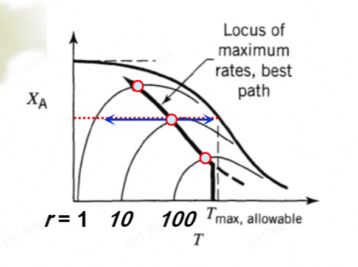

对于可逆吸热反应或者不可逆反应,反应速率和转化率都随温度的升高而升高,因此不存在最佳操作线,我们只需要使得反应尽可能子啊最佳操作温度下进行即可.
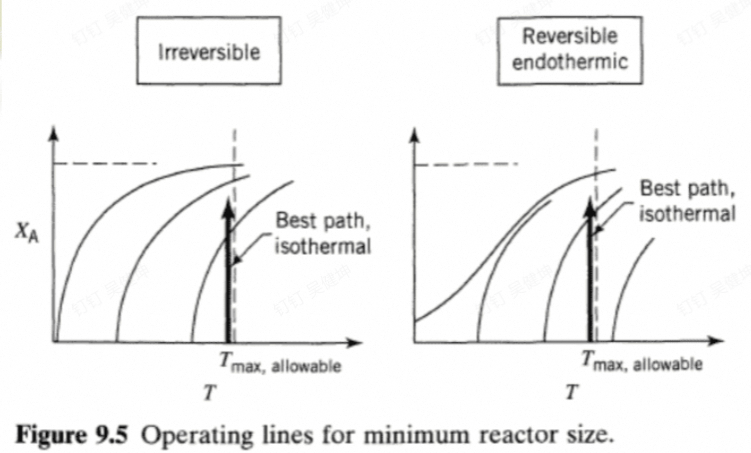

## 绝热操作

如题,即反应是一个绝热过程,我们考虑进行热量衡算,设反应物的热容为$C_p'$,生成物的热容为$C_p''$,那么就会有:

$$
-\Delta H_rX_A=C_p'(T_2-T_1)(1-X_A)+C_p''(T_2-T_1)X_A
$$

把X_A整理出来:

$$
X_A=\frac{C_p'(T_2-T_1)}{-\Delta H_r-C_p''(T_2-T_1)}=\frac{C_p'\Delta T}{-\Delta H_r'}
$$

即绝热操作的反应转化率与温度变化成正比,这样我们就能很好的在X-T平面上绘制出反应路径,从而完成对反应器体积的设计.

为了完成对反应器的最佳设计,进入反应器的其实温度有一个最佳值,这被我们称作绝热操作最佳点,如图所示:

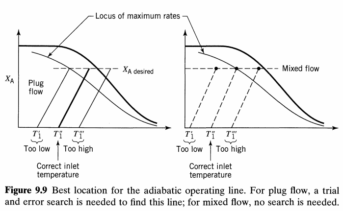

对于全混流(右边这个图),反应器内的反应速率等于操作线末端(反应出口)的反应速率,那么只需要让出口位于我们所需要转化率所对应的最佳操作点上即可.

对于平推流,直接让末端处于最佳操作点上显然是不合理的,反应器内的反应速率随转化率不断变化,所以要不断试验才能找到一个相对较好的进口温度,也就是左图中的情况.

以及,对于不同的热效应体系,存在适用的不同的最佳反应器:

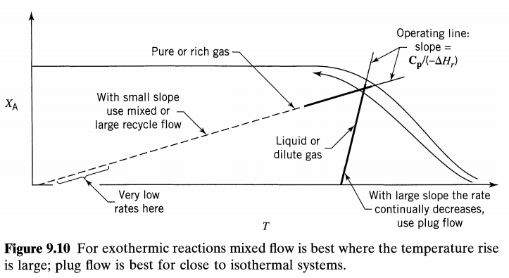

当反应的热效应较好的时候,我们可以使用平推流,因为其进口出口的温度都比较高,反应速率快,但是却可以比全混流节省很多的反应体积,然而,当反应的热效应较低的时候,平推流在反应初期温度较低,反应速率慢,但是如果使用全混流,全混流内的反应速率只与出口的反应速率有关,所以可以保证一个比较高的速率,如图所示,我们也可以增加循环,让平推流反应器更加接近全混流,获得更高的进口温度,从而提高低热效应体系下的反应速率.

## 非绝热操作

热量衡算的时候加上体系对环境的放热量:

$$
-\Delta H_rX_A+Q=C_p'(T_2-T_1)(1-X_A)+C_p''(T_2-T_1)X_A
$$

对于换热器,我们知道,其换热量通常与体系温度和环境温度的温差有关,如果我们控制反应的起始温度和环境温度一致,那么X_A的操作线相对于绝热操作,就只是旋转了一定的角度.:

$$
X_A=\frac{C_p'\Delta T-Q}{-\Delta H_r'}
$$

当然,实际处理过程的非绝热操作线往往没有那么简单,但是,我们都可以通过设计,让整个过程的反应路径沿着最佳温度操作线进行,这样反应速率会始终维持在一个较高的水准.

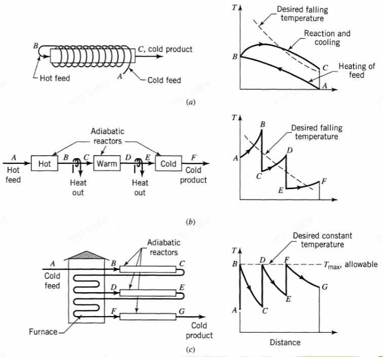

## 全混流反应器中的放热反应操作稳定性问题

对于一个全混流反应器,其空时的表达式为:

$$
\tau=\frac{V}{v_0}=\frac{C_{A_0}x_A}{-r_A}=\frac{C_{A_0}}{k_{0}\exp(\frac{-E_a}{RT})C_{A_0}(1-X_A)}
$$

整理一下就得到转化率,空时,温度三者之间的关系:

$$
x_A=\frac{k_{0}\exp(\frac{-E_a}{RT})\tau}{1+k_{0}\exp(\frac{-E_a}{RT})\tau}
$$

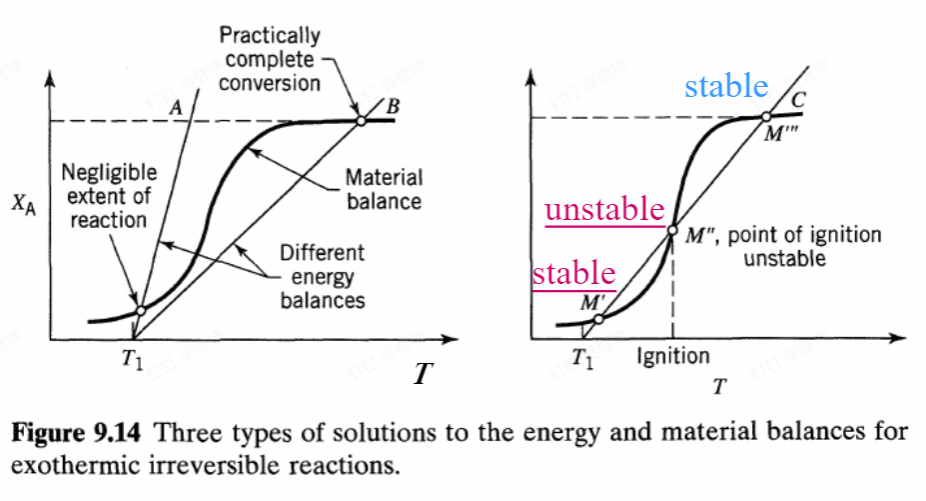

可以绘制出等空时下的x-T曲线,然后我们考虑绝热操作,使用绝热操作线与该等空时曲线相交,交点即为操作点,即如果反应器是绝热的,并且这个操作点是稳定的,那么X和T会维持在这个点上,具体的原因可以从下图中看出

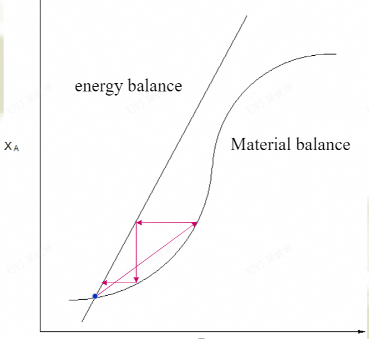

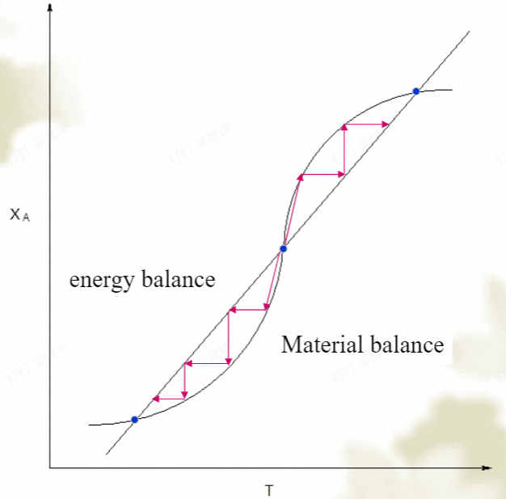

我们希望我们的操作点尽可能靠近平衡线,这样反应物出来的转化率最大,并且维持在较高的速率下可以保证较快的反应速率.

## 复合反应转化率随温度变化的关系

对于符合反应,只需要考虑平行反应和串联反应

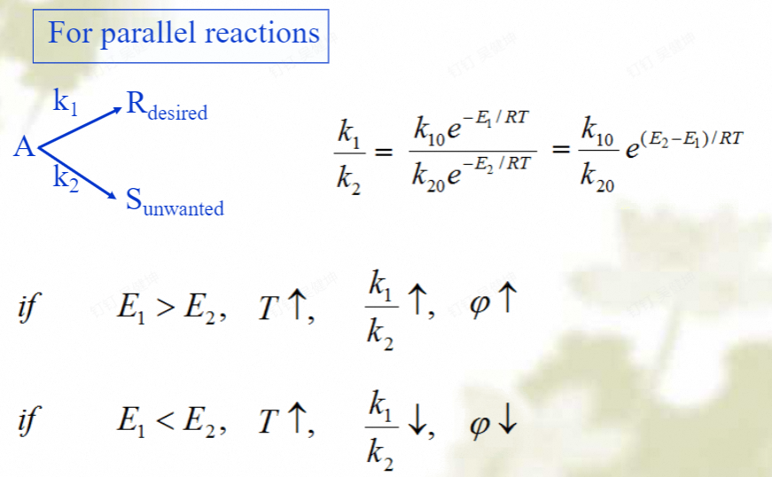

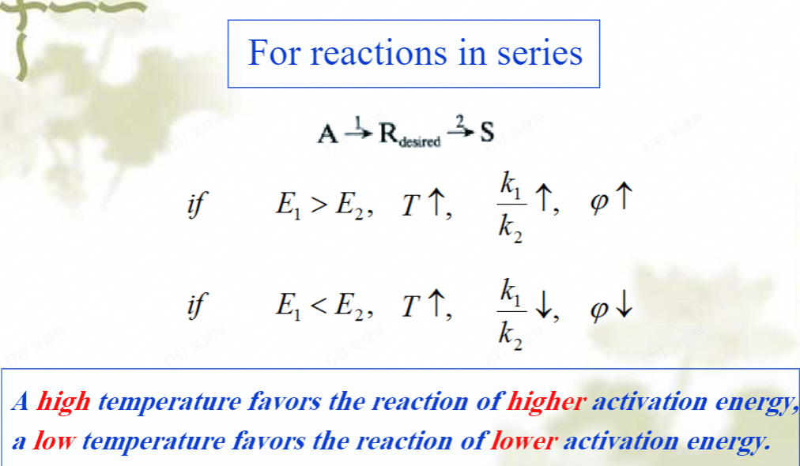

