# 生化反应

## 酶催化反应

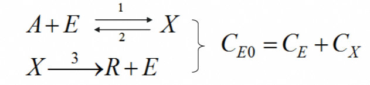

具体的反应形式长上面这样,为了研究这个反应,我们需要引入稳态假定,即反应的中间体的变化速率为0:

$$
\frac{dX}{dt} = k_1[A][E]-k_2[X]-k_3[X]\approx 0
$$

以及物料守恒方程:

$$
[E_0]=[E]+[X]
$$

就可以得到X的浓度:

$$
[X]=\frac{k_1[A][E_0]}{k_2+k_3+k_1[A]}
$$

接下来,如何确定这些系数是我们要做的任务,考虑A的消耗速率或者R的生成速率:

$$
-r_A=r_R=k_3[X]=\frac{k_1k_3[A][E_0]}{k_2+k_3+k_1[A]}
$$

然后我们上下同除以$k_1$,定义一个等效浓度为$[M]$:

$$
-r_A=r_R=k_3[X]=\frac{k_1k_3[A][E_0]}{k_2+k_3+k_1[A]}=\frac{k_3[A][E_0]}{[M]+[A]}
$$

从这个表达式也可以看出酶催化反应的反应速率是有一个上限的,当$[A]$远大于$[M]$时,反应速率趋于一个定值.并且当A的浓度等于M的时候,反应速率恰好是最大速率的一半,中间体的浓度为[E_0]的一半.

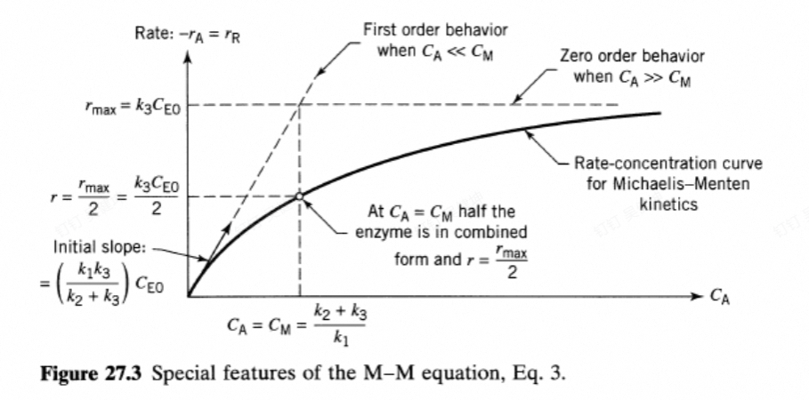

### batch or plug

求解关于A的微分方程可以得到完整的A随时间变化的关系:

$$
\frac{C_{A_0}-C_A}{\ln \frac{C_{A_0}}{C_A}}=-C_M +k_3C_{E_0}\frac{t}{\ln \frac{C_{A_0}}{C_A}}
$$

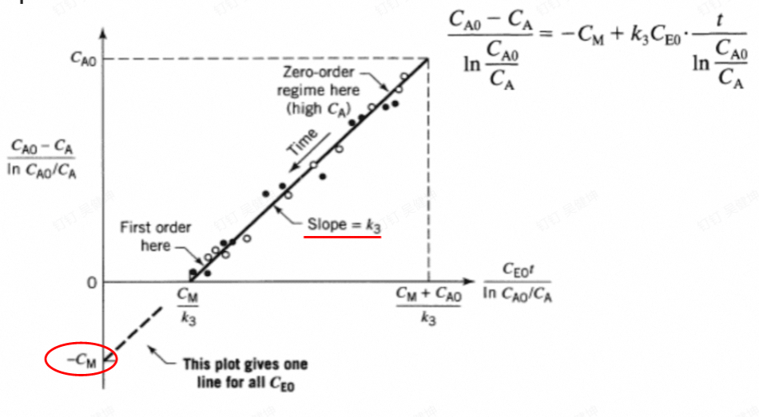

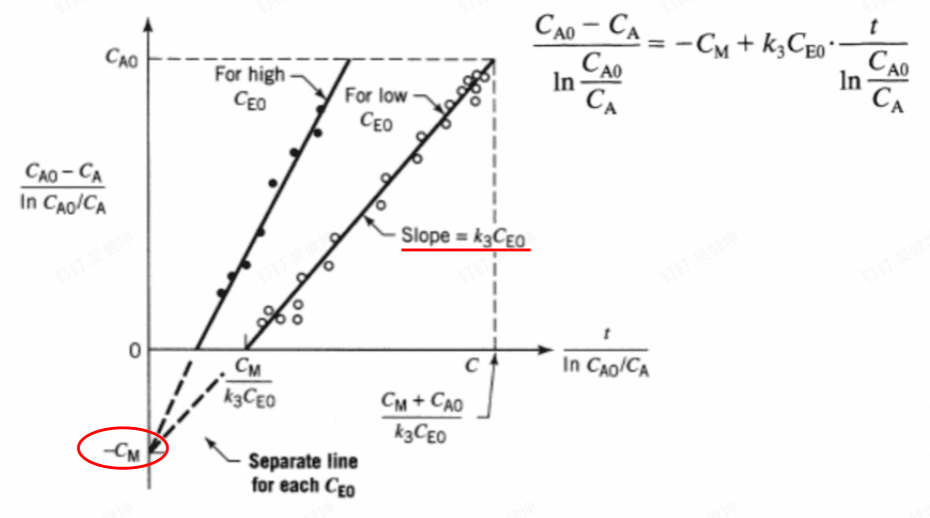

通过大量数据点的线性拟合可以得到待求的常数$k_3$和$C_M$.不同的反应初始浓度会带来不同的斜率,但是截距都是一样的.

### mixed flow

对于全混流,由于是点操作,所以我们不需要解微分方程,只需要对方程做一定的变形:

$$
\tau=\frac{C_{A_0}-C_A}{-r_A}=\frac{C_{A_0}-C_A}{\frac{k_3C_AC_{E_0}}{C_M+C_A}}=\frac{(C_{A_0}-C_A)(C_M+C_A)}{k_3C_AC_{E_0}}
$$

将上式变形得到:

$$
C_A = k_3 \frac{C_{E0}\tau C_A}{C_{A0} - C_A} - C_M
$$

然后依旧可以通过数据点拟合直线的方法得到我们的待定参数:

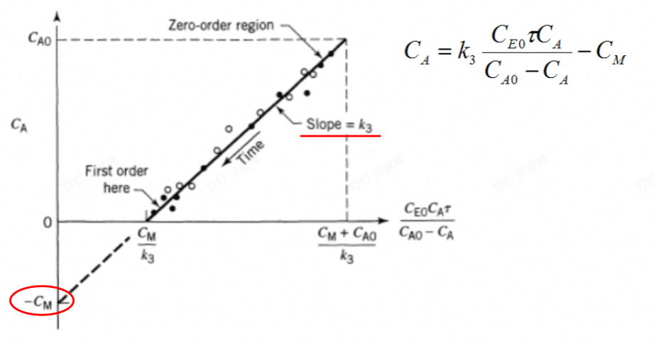

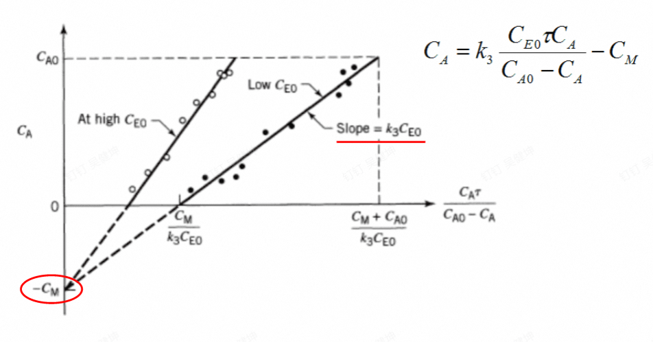

### 异物抑制

异物抑制在酶催化反应中非常常见,主要表现为竞争和非竞争性抑制,视我们的需求,我们决定要增强或者减弱异物抑制现象:

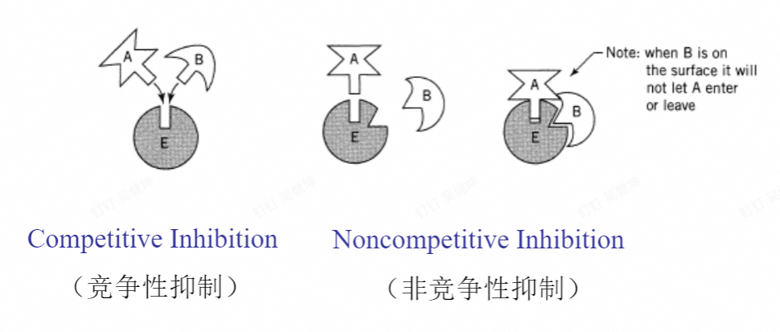

#### 竞争性抑制

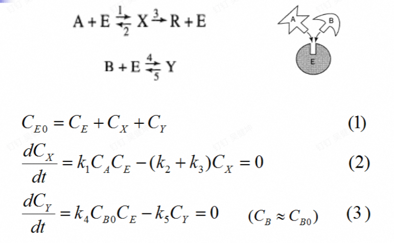

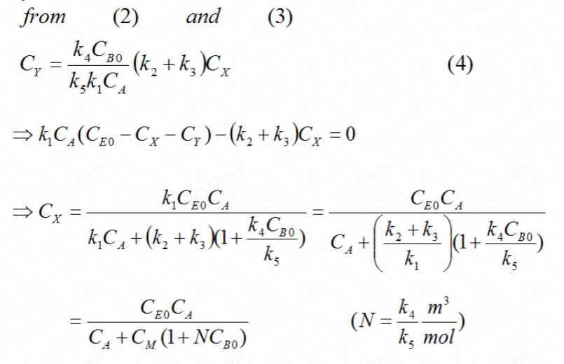

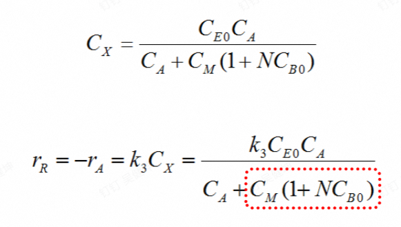

#### 非竞争性抑制

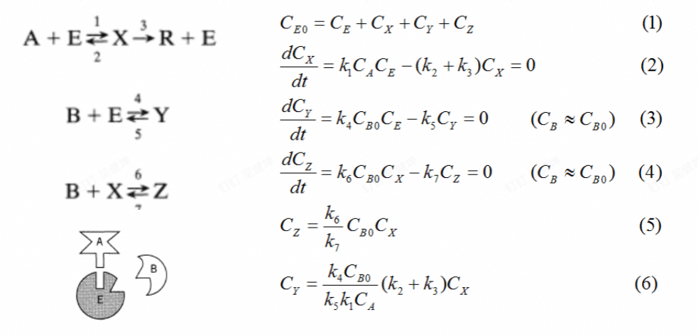

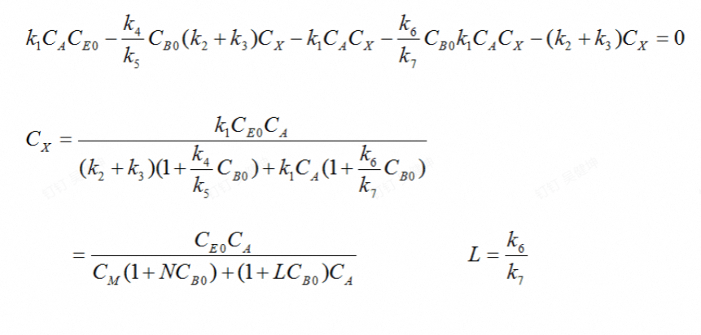

上述这些情况的微分方程求解比较麻烦,下面直接贴出结论:

竞争性抑制的直线方程斜率随着竞争物浓度的增加不太变化,非竞争性抑制的直线方程随着竞争物浓度的增加会减小,无论是平推流还是全混流都适用于这一特点:

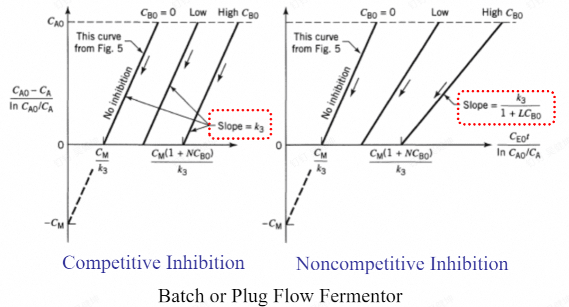

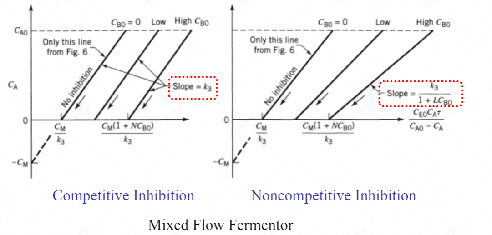

## 微生物催化反应

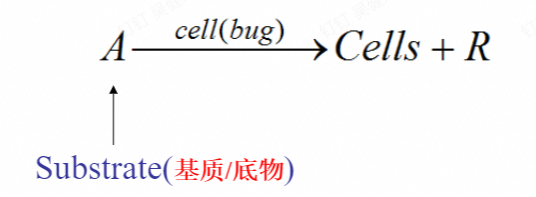

虽然微生物催化本质上是酶催化,但是和酶催化不同的是,微生物催化一开始的微生物量是很少的,随着反应的进行,微生物会增殖,进而加速催化反应的进行,所以,微生物催化往往有一个诱导期,过了诱导期之后会有一个快速增长期,然后趋于稳定,如果资源无限,微生物可以一直增殖,但是实际上,由于接触抑制和底物浓度的限制,微生物在增长到一定程度后就会进入消亡期,种群数量开始减少,直至底物消耗完毕,微生物完全死亡.

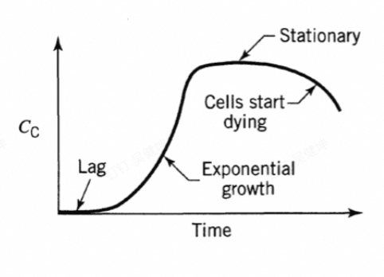

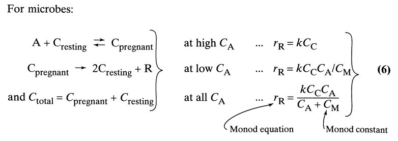

根据前面酶的公式的推导,我们也可以类比得到微生物发酵的速率方程:

$$
r_C=\frac{k_3[A][C]}{[M]+[A]}
$$

其大致的增殖曲线为:

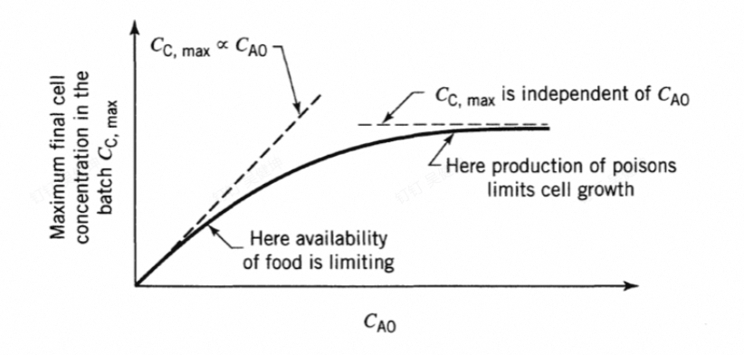

如果说,考虑到底物消耗,或者微生物生长繁殖过程中的毒物产生(毒物有可能是产物(例如发酵过程的酒精)也有可能是副产物(例如发酵过程的乳酸)),我们可以将k乘上一个衰减因子来更好的表达:

$$
r_C=k_{obs}\frac{[A][C]}{[M]+[A]}
$$

其中:

$$
k_{obs}=k(1-\frac{C_R}{C_R^*})^n
$$

其中$C_R^*$是所有生命活动停止时的产物浓度.

### 底物限制微生物发酵

如果说,我们限定消耗单位A生成C的收率是固定的,那么也就有:

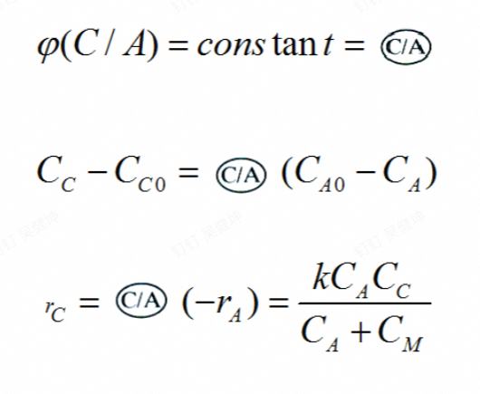

考虑求解反应速率最快的点,对r_C求[A]的导数,可以得到最大速率时候对应的底物的浓度:

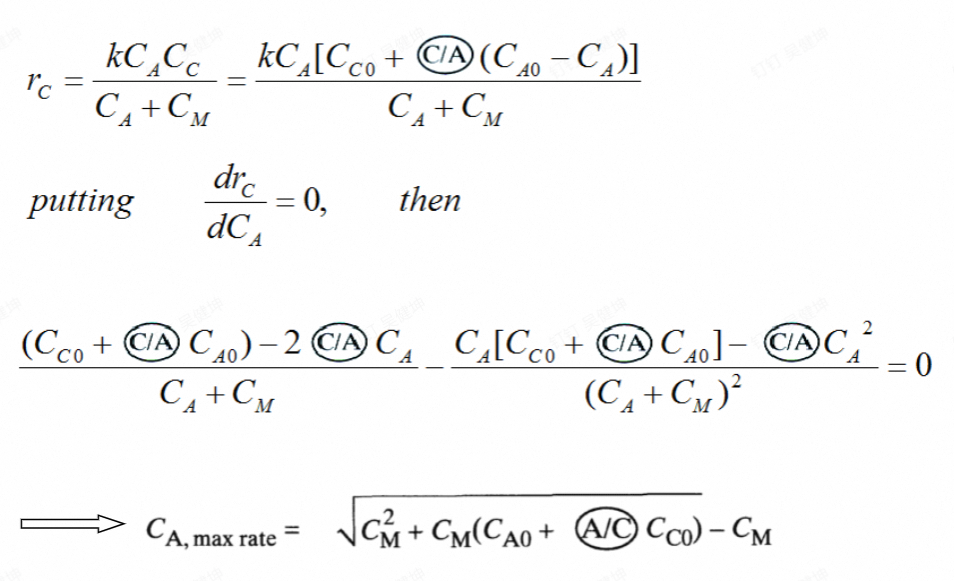

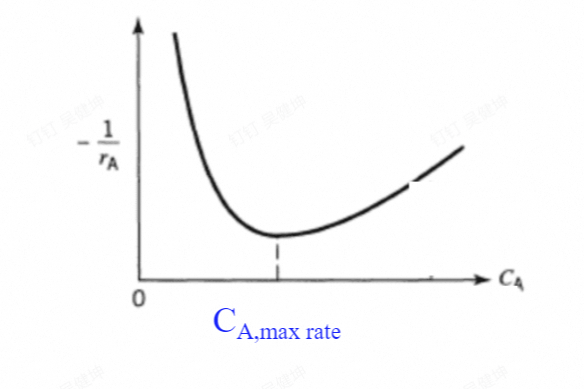

由此可以设计生物发酵反应器,在C大于最优速率浓度的时候使用全混流,当C小于最优速率浓度的时候开始改用平推流,PFR+MFR可以获得最小的反应器体积

然而，当反应器体积确定的时候，这个时候最佳反应器的指标就不是反应器体积了，而是反应速率，即我怎么让我这个反应器单位时间内处理更多的反应物。考虑上面这张图，显然，反应器内的浓度越接近最佳速率浓度，自然这个反应器会更好，而平推流反应器往往无法控制浓度，所以全混流一般来说是首选。

第一种情况，考虑出口浓度$C_{A,OPT}<C_A<C_{0}$，那么，反应器内的浓度自然是接近出口浓度最好，对于流速过慢的反应器，我们只能选择全混流，出口浓度就是$C_A$,而对于流量大的体系，我们可以通过增加旁路的方式，将反应器内的浓度控制在$C_{A,OPT}$附近，从而获得最佳反应速率。

第二种情况，考虑出口浓度$C_A>C_{A,OPT}$，那么自然采用全混流串联平推流是最好的，前一个全混流将反应器内的浓度控制在$C_{A,OPT}$附近，后一个平推流可以在前半部分获得接近最佳速率的反应速率。

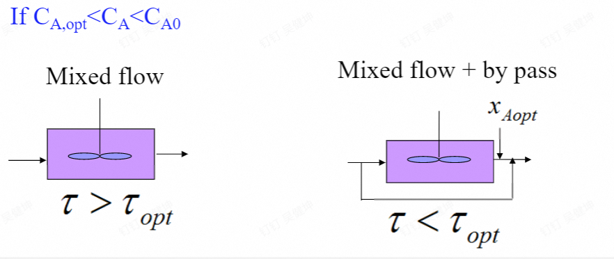

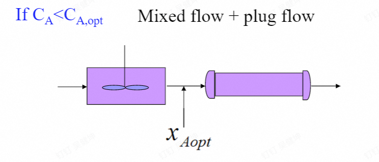

#### 全混流反应器

如果考虑全部使用全混流反应器对我们上述收率不变的情况进行生产:

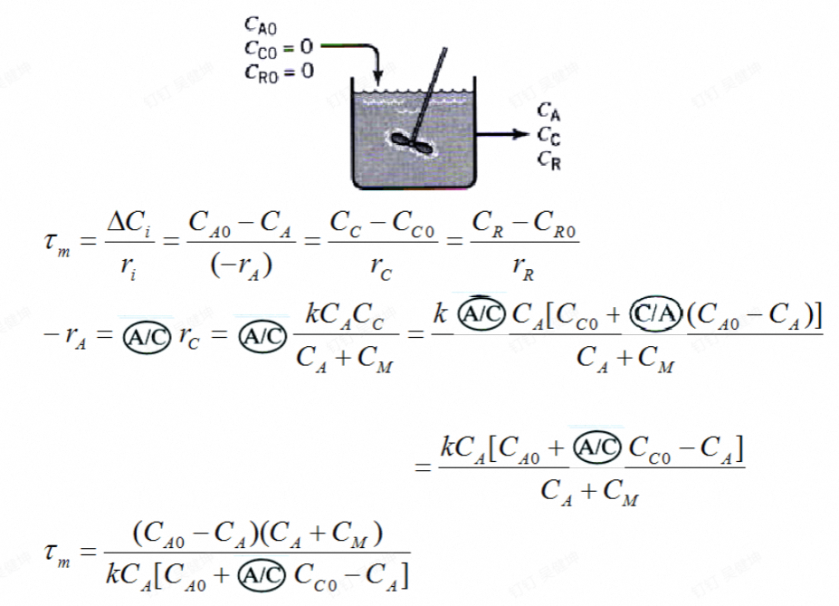

然后我们简化初值条件,认为初始的情况微生物和产物的量都近似等于0:

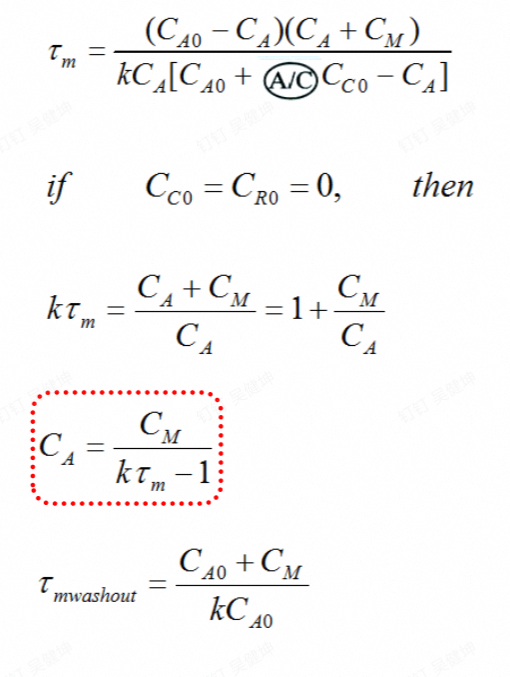

考虑$C_A\le C_{A_0}$,可以得到洗出时间,即微生物生长的速率小于其流出的速率,反应器内不会有任何微生物累积，以没有任何反应效果.

考虑之前的在间歇反应器中速率最大的最佳底物浓度,如果我们可以控制全混流的出口浓度维持在最佳速率浓度,那么我们的反应器就可以获得最佳反应速率,即单位时间内处理尽可能多的底物.所以定义常数:

$$
N=\sqrt{1+\frac{C_{A_0}}{C_M}}
$$

那么最佳反应浓度即为:

$$
C_{A_{opt}}=\sqrt{C_M^2+C_MC_{A_0}}-C_M=C_M(\sqrt{1+\frac{C_{A_0}}{C_M}}-1)=C_M(N-1)
$$

根据刚刚推导的空时的表达式(初始情况微生物为0,产物为0),得到:

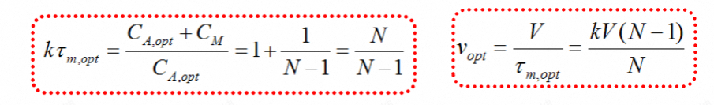

只与N和速率常数k有关.

这个时候我们注意到,最佳A浓度的表达式里面出现了一个我们不知道的M的浓度,我们想尽量减少未知量的个数,所以进行恒等变形:

$$
C_M=\frac{C_{A_0}}{N^2-1}
$$

这样就减少了未知量的个数,从而我们可以表示更多的量:

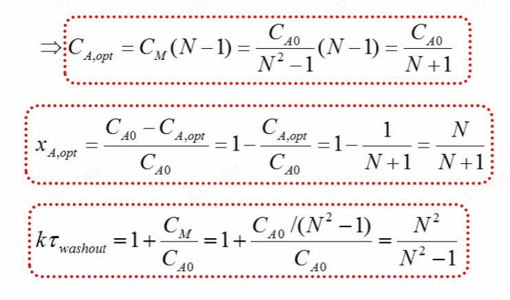

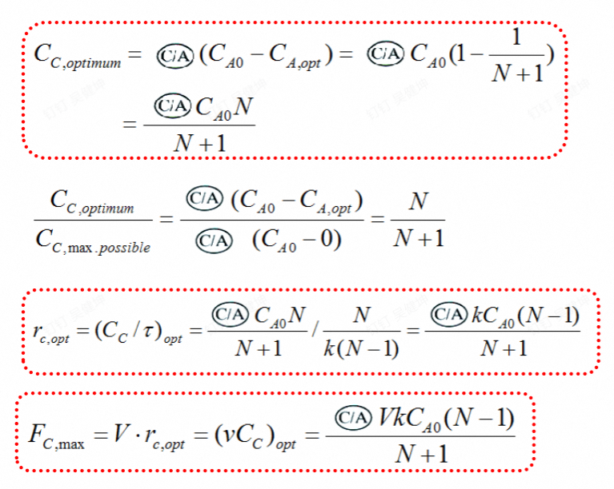

从下面这张空时-浓度曲线也可以看出来,当C_C曲线上的点与原点的连线斜率最大的时候,反应速率最快,同时对应着A消耗最快的点

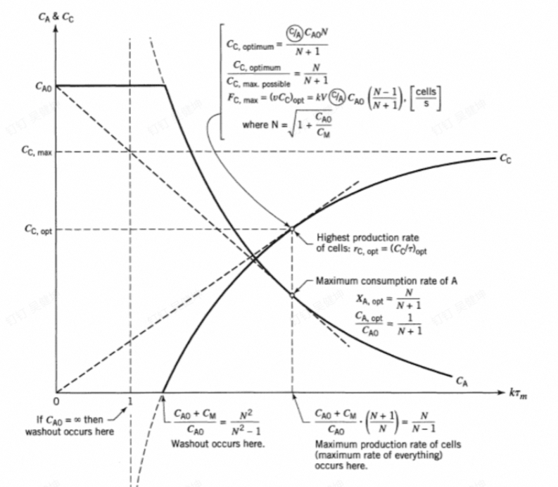

### 产物限制微生物发酵

产物限制微生物发酵就是产物对微生物的毒害，例如酵母菌产生的酒精，乳酸菌产生的乳酸等等。

其速率方程为：

$$
r_C=\varphi(\frac{C}{R})k(1-\frac{C_R}{C_R^*})^nC_C
$$

可以发现,和普通的速率方程相比,其多了一个速率常数的修正,代表产物对微生物的毒害作用.

考虑一级毒害作用,可以得到反应速率的最大时候对应的产物浓度:

#### plug or batch

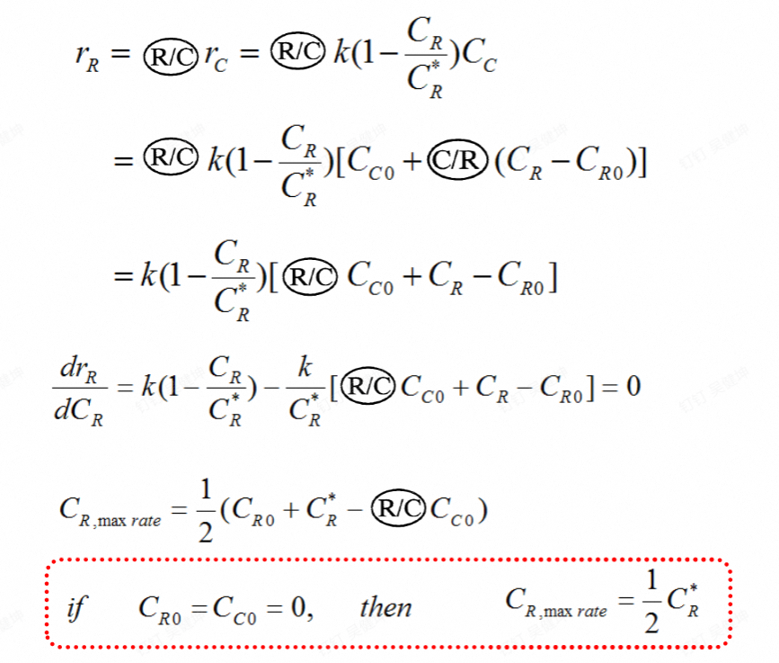

#### mixed flow

对于全混流反应器,还存在一个洗出时间:

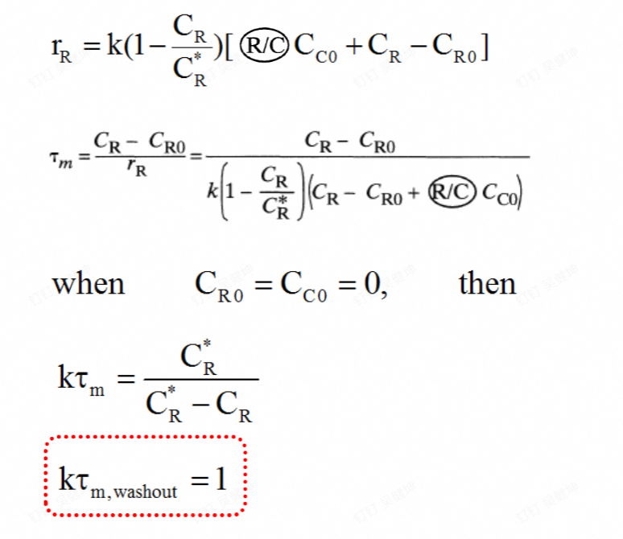

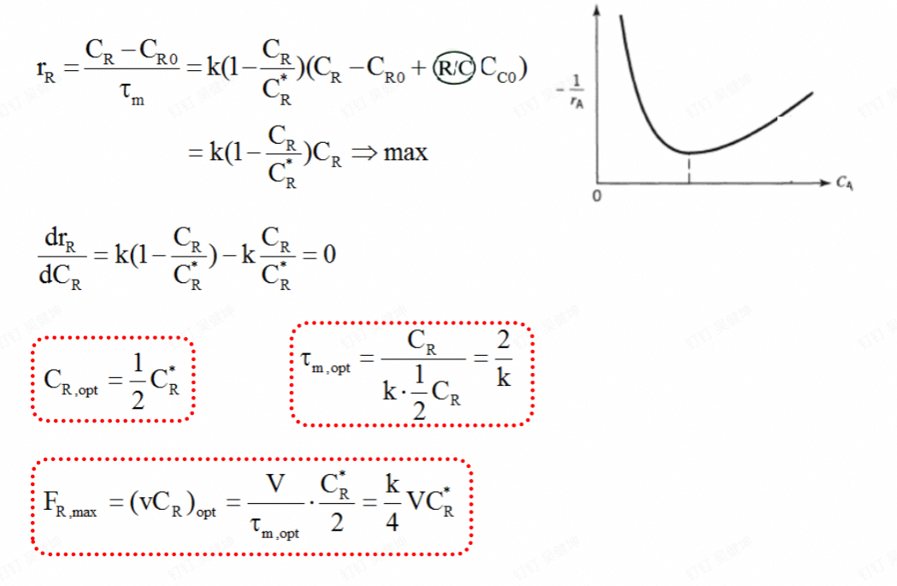

