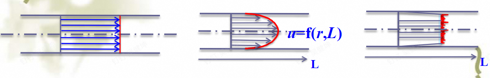
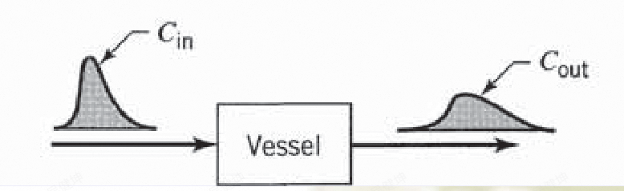
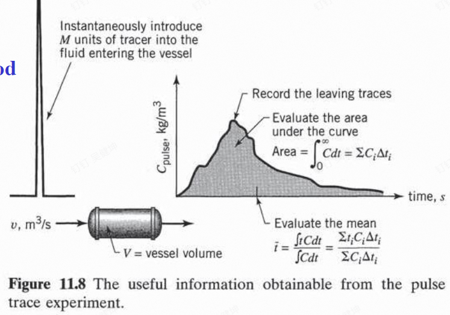
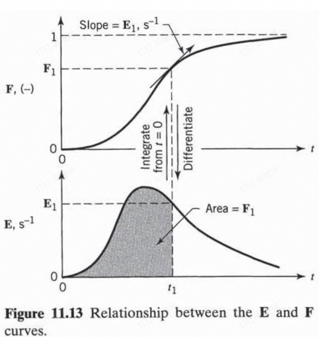
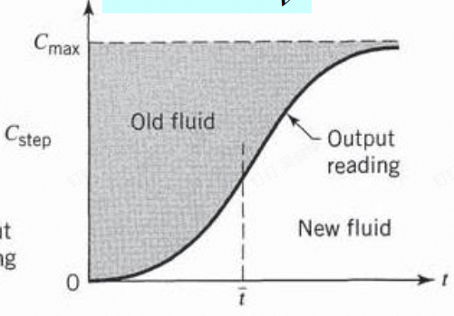
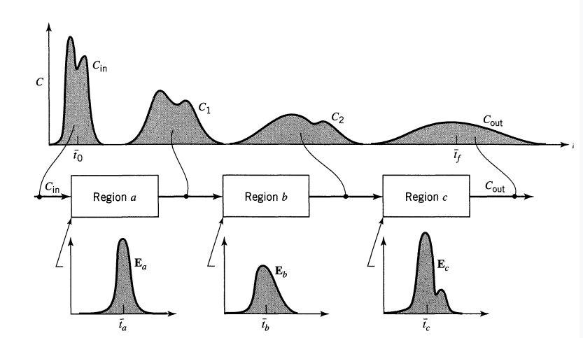
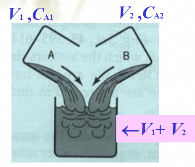

# 非理想流动

前面的讨论都是基于理想反应器进行的,我们不考虑物料的流动状态,不考虑反应的混合状态,局部热效应等等因素.然而,实际的反应器往往是介于平推流和全混流之间,并且由于各种因素,存在着一定的流动死区.流动的边界层会造成速度分布进而导致产物的分布.最终会产生停留时间分布.

## 停留时间分布

### 激发响应实验

通过同位素示踪的办法,将示踪剂注入反应器中,通过检测出口的示踪剂浓度随时间的变化,来确定反应器的停留时间分布.这相当于给予了反应器一个信号,然后观察其响应信号.

常见的激发方式有两种,一种是脉冲输入,一种是阶跃输入:

#### 脉冲输入

在反应器端口一次性注入所有的反应原料,然后观察出口的示踪剂浓度随时间的变化.浓度高说明示踪剂在这个停留时间下分布的数量较多,因此,浓度可以作为停留时间分布的概率密度的指标.

下一步就是将浓度-时间曲线归一化,得到概率密度函数,进而描述我们的停留时间分布.

$$
E(t) = \frac{C(t)}{\displaystyle \int_{0}^{\infty} C(t) dt }
$$

E(t)即表示t时刻的停留时间下,单位停留时间内具有该停留时间的同位素粒子占总粒子数的比例.

通过求概率分布的期望可以得到平均停留时间,通过求方差可以得到停留时间分布的分散程度:

$$
\bar{t} = \int_{0}^{\infty} t E(t) dt
$$

$$
\sigma^2 = \int_{0}^{\infty} (t - \bar{t})^2 E(t) dt
$$

得到平均停留时间后,我们可以将变量无量纲化,得到更加普适的停留时间分布:

定义:

$$
\theta=\frac{t}{\bar{t}}
$$

得到:

$$
\int_{0}^{\infty} E(\theta) d\theta = \int_{0}^{\infty} \frac{E(\theta)}{\bar{t}} dt = 1
$$

所以:

$$
E(\theta) = \bar{t}E(t)
$$

同理对方差做如上操作:

$$
\sigma_\theta=\int_{0}^{\infty} (\theta - 1)^2 E(\theta) d\theta=\int_{0}^{\infty} \frac{(\frac{t}{\bar{t}} - 1)^2 \bar{t}E(t)}{\bar{t}} dt=\int_{0}^{\infty} \frac{(t - \bar{t})^2 E(t)}{\bar{t}^2} dt=\frac{\sigma_t^2}{\bar{t}^2}
$$

对密度函数进行积分得到分布函数:

$$
F(t) = \int_{0}^{t} E(t) dt
$$

#### 阶跃输入

上述的脉冲输入得到的是密度函数,而阶跃输入得到的是分布函数.其意思是在t时刻,我突然加入恒定浓度的示踪剂,并且保持这个操作不变,然后观察出口的示踪剂浓度随时间的变化.

假设我注入的示踪剂的摩尔流量为$\dot{m}$,那么出口的最大浓度为:

$$
C_{max} = \frac{\dot{m}}{v}
$$

这个时候,t时刻的出口浓度就可以代表停留时间<=t的所有示踪剂占总体的比例(因为液体被不断地注入,所以t时刻从出口出来的示踪剂有可能是最早注入的一批中停留时间为t的,也有可能是后注入的停留时间小于t的),所以此刻的浓度恰好可以表征分布函数,下一步,将浓度归一化即可得到分布函数:

$$
F(t) = \frac{C(t)}{C_{max}}=\frac{C(t)}{\frac{\dot{m}}{v}}
$$

### 平推流的停留时间分布

由于平推流任意阶段之间的物料都不会混合,所以示踪剂同步进去同步出来,平推流的停留时间分布上是狄拉克函数:

$$
E(t) = \delta(t - \bar{t})
$$

显然其方差为0

### 全混流的停留时间分布

全混流也有停留时间分布,这是我没想到的,出口处的示踪剂浓度就是反应釜内的示踪剂浓度,反应釜内示踪剂浓度的变化率显然和出口的浓度成正比

$$
\frac{dC}{dt} = \frac{C(t)v}{V}
$$

解这个微分方程得到浓度即为指数型分布:

$$
C(t) = C_0\exp(-\frac{v}{V}t)
$$

归一化之后得到:

$$
E(t) = \frac{v}{V}\exp(-\frac{v}{V}t)=\frac{1}{\tau}\exp(-\frac{t}{\tau})
$$

其方差为1,而任何反应器均介于平推流和全混流之间,所以其方差必然介于0和1之间.

### 卷积

如果说,我们输入的信号不是脉冲信号或者阶跃信号,而是其他奇奇怪怪的信号,这个时候就需要使用卷积进行处理.

考虑一个输出的激发信号$C_{out}(t)$,如果我们已经知道了反应器的类型,即得知了反应器对脉冲信号的停留时间分布$E(t)$,那么对t时刻的$C_{out}$有所贡献的是在$t-\tau$时刻的输入信号$C_{in}(t-\tau)$和对应的分布$E(\tau)$,这样,其恰好能对t时刻的信号有所贡献,考虑遍历所有的$\tau$值,即得到卷积:

$$
C_{out}(t) = \int_{0}^{t} C_{in}(t-\tau)E(\tau)d\tau
$$

输出信号由输入信号和具体的分布类型卷积而成.

## 宏观流体和微观流体

微观流体即在微观层面混合均匀的流体,通常是几相互溶的流体,混合均匀,性质均一.

宏观流体即在宏观层面混合均匀的流体,通常是互不溶的流体,混合不均匀,性质不均一.

然而,并不是混合的越均匀越好,下面这个例子恰好可以说明宏观流体的优越性:

考虑将等体积的1和2两种反应物流体进行混合,如果1,2互溶,且可以和B发生同样的反应,那么对于微观流体:

$$
-r_A=kC_A^n=k(\frac{C_{1A}+C_{2A}}{2})^n
$$

而对于宏观流体,两者不能互溶,反应物在溶液中呈现乳液的状态,反应速率由二者分别贡献,但是由于其竞争同一个反应物,所以各自的反应速率减半:

$$
-r_A=\frac{1}{2}kC_{1A}^n+\frac{1}{2}kC_{2A}^n
$$

根据不等式关系可以得到宏观流体的反应速率显然要大于微观流体.

