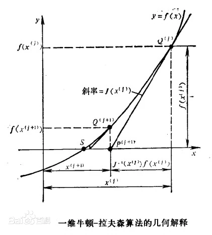
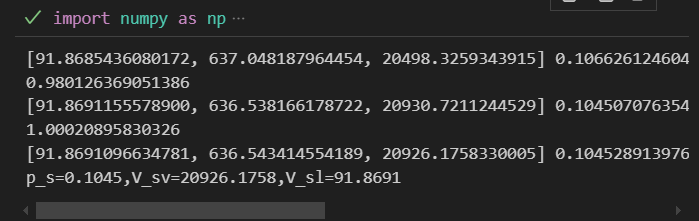

# 2.均相封闭系统
## Maxwell关系式
所谓均相封闭,也就是不与外界有物质和能量交换的均相体系,体系由一些状态函数控制:

!!! note
    $$
    \begin{aligned}
    &H=U+pV\\
    &A=U-TS\\ 
    &G=H-TS
    \end{aligned}
    $$

考虑一个可逆过程,根据热力学第二定律有:

$$\delta Q=TdS$$

然后根据热力学第一定律有:

$$dU=\delta Q+dW=TdS-pdV$$

注意到,U是一个状态函数,变化量和变化途径无关,而右侧又是一些状态函数的变化量,也与路径无关,综上所述,无论是可逆过程还是不可逆过程,内能的变化都可以用上式表示,当然,前提是体系只做体积功
于是有:

!!! note
    $$
    \begin{aligned}
    &dU=TdS-pdV\\
    &dH=TdS+Vdp\\
    &dA=-SdT-pdV\\
    &dG=-SdT+Vdp
    \end{aligned}
    $$

根据偏导数关系就可以导出麦克斯韦关系式,先是一阶导数,以吉布斯自由能为例:

$$
\begin{aligned}
  (\frac{\partial G}{\partial T})_p&=-S\\
  \\
  (\frac{\partial G}{\partial p})_T&=V
\end{aligned}
$$

然后更为重要的是二阶导数,如果一个函数的二阶混合偏导数存在,那么偏导数的值和求导顺序无关,就能得到以下的关系式:

!!! Maxwell关系式
      $$
      (\frac{\partial T}{\partial V})_S=-(\frac{\partial p}{\partial S})_V\\
      $$

      $$
      (\frac{\partial T}{\partial p})_S=(\frac{\partial V}{\partial S})_p\\
      $$

      $$
      (\frac{\partial S}{\partial V})_T=(\frac{\partial p}{\partial T})_V\\
      $$

      $$
      (\frac{\partial S}{\partial p})_T=-(\frac{\partial V}{\partial T})_p\\
      $$

与热容相关的表达式
恒压摩尔热容:

$$
\frac{dH}{dT}=T\frac{dS}{dT}+V\frac{dp}{dT}
$$

$$
C_p=(\frac{\partial H}{\partial T})_p=T(\frac{\partial S}{\partial T})_p
$$

这个式子似乎不能继续化简了,同理我们也可以得到定容摩尔热容

$$
C_V=T(\frac{\partial S}{\partial T})_V
$$

但是,继续对上面两个热容求导,然后再交换求导顺序,可以得到:

$$(\frac{\partial C_p}{\partial p})_T=T(\frac{\partial^2 S}{\partial T\partial p})=T(\frac{\partial (\frac{\partial S}{\partial p})_T}{\partial T})_p$$

然后再代入Maxwell关系式
得到

$$(\frac{\partial C_p}{\partial p})_T=-T(\frac{\partial^2V}{\partial T^2})_p$$

同理会有:

$$(\frac{\partial C_V}{\partial V})_T=T(\frac{\partial^2 p}{\partial T^2})_V$$

同时,之后的积分还会用到的:
1.等温条件下压力对焓的影响
2.等温条件下,体积对内能的影响
以焓为例:

$$\frac{dH}{dp}=T\frac{dS}{dp}+V\frac{dp}{dp}$$

$$(\frac{\partial H}{\partial p})_T=V-(\frac{\partial V}{\partial T})_p$$

那么积分的时候就可以用到:

$$\Delta H=\int_{p_1}^{p_2}V-(\frac{\partial V}{\partial T})_p dp$$

同理也会有:

$$
(\frac{\partial U}{\partial V})_T=T(\frac{\partial p}{\partial T})_V-p
$$


两个热容之差也可以用p,V之类的偏导数来表示
根据我们刚刚得到的式子

$$
\begin{aligned}
C_p-C_V&= T \left( \left( \frac{\partial S}{\partial T} \right)_p -\left( \frac{\partial S}{\partial T} \right)_V \right) \\
\left( \frac{\partial S}{\partial T} \right)_p &= \left( \frac{\partial S}{\partial T} \right)_V + \left( \frac{\partial S}{\partial V} \right)_T \left( \frac{\partial V}{\partial T} \right)_p \\
\end{aligned}
$$

再根据麦克斯韦关系式可以得到:

$$
C_p-C_V=T(\frac{\partial V}{\partial T})_p(\frac{\partial p}{\partial T})_V
$$

## 偏离函数

绝大多数热力学函数的绝对数值对我们没有意义,我们更加关心的是热力学函数在某一个过程发生的时候的变化量,所以,对于任意一个状态函数,我们可以任意设置它的零点,只要确保代数形式的等价就行,这个就是偏离函数的由来
设存在某一个热力学性质$M$,显然,$M$可以被不同的状态函数描述,考虑到测量和计算的简便性,我们一般使用以$(T,p)$和以$(T,V)$为显函数的表达式

### 以$(T,p)$为独立变量

通常采取的是与待计算状态同温的理想气体参考态,需要注意的是,我们下面默认一个事实:总能够找到一条路径,在任意两个热力学状态之间变化.
例如,连接实际气体和理想气体的桥梁就是极稀的状态:

理想气体$(T,p_0)$  ---->  p趋向于0 ------> 实际气体$(T,p)$

于是就有积分路径:

$$
\begin{aligned}
\int dG=\int Vdp &=\int_{p_0}^0\frac{RT}{p}dp+\int_{0}^{p}Vdp\\
&=\int_{p_0}^{p}\frac{RT}{p}dp+\int_{0}^{p}(V-\frac{RT}{p})dp\\
&=RTln\frac{p}{p_0}+\int_0^{p}(V-\frac{RT}{p})dp
\end{aligned}
$$

所以会有偏离函数:

$$
G(T,p)-G^{ig}(T,p_0)=RTln\frac{p}{p_0}+\int_0^{p}(V-\frac{RT}{p})dp
$$

这个时候就可以考察吉氏函数随温度的变化情况,我们都知道有:

$$
\frac{\partial G}{\partial T}_p=-S
$$

熵总是大于0的,所以吉氏函数总是随着温度下降的,我们可以用偏离函数来检验这一点:

$$
\begin{aligned}
  G(T_2,p)-G(T_1,p)=R(T_2-T_1)ln\frac{p}{p_0}+G^{ig}(T_2,p_0)-G^{ig}(T_1,p_0)\\
  =R(T_2-T_1)ln\frac{p}{p_0}-(\int_{T_1}^{T_2}SdT)_p
\end{aligned}
$$

注意到:

$$
C_p=(\frac{\partial H}{\partial T})_p=T(\frac{\partial S}{\partial T})_p
$$

对理想气体的$C_p$有经验公式:

$$
C_p^{ig}=a+bT+cT^2+dT^3
$$

其中各个系数均可以通过查询表格得知,但是这个公式有适用条件,对温度有限制.

所以:

$$
\begin{aligned}
  S-S_0&=(\int_{T_0}^{T}C_p^{ig}/T\ dT)_p=\int_{T_0}^{T}\frac{a}{T}+b+cT+dT^2\ dT\\
  &=aln\frac{T}{T_0}+b(T-T_0)+\frac{c}{2}(T^2-T_0^2)+\frac{d}{3}(T^3-T_0^3)
\end{aligned}
$$

其中$S_0$是适用范围内该压力下某一温度的熵值

整理一下就得到:

$$
S=alnT+bT+\frac{c}{2}T^2+\frac{d}{3}T^3+S_0-(alnT_0+bT_0+\frac{c}{2}T_0^2+\frac{d}{3}T_0^3)
$$

把后面的一大堆常数记做$C$

!!!tip
    $$
    \begin{aligned}
      G(T_2,p)-G(T_1,p)&=(Rln\frac{p}{p_0}-b-C)(T_2-T_1)\\
      &-a(T_2lnT_2-T_1lnT_1)-\frac{c}{2}(T_2^2-T_1^2)-\frac{d}{3}(T_2^3-T_1^3)
    \end{aligned}
    $$

直觉告诉我们,这个C是大于0的,例如,水的标准摩尔熵是198.34$Jmol^{-1}K^{-1}$,水的对应系数为:

$$
a=32.24,b=1.908\times10^{-3},c=1.057\times10^{-5},d=-3.602\times10^{-9}
$$

我们选定的温度为标准状态$T_0=273.15K$

计算得到此时的$C=16.58Jmol^{-1}K^{-1}$

不难发现$p<p_0$,查询表格可知,水的a,b,c,的系数都是大于0的,d小于0但是d很小,所以恒压下吉布斯自由能是随温度的升高而下降的,上面给出了变化量的计算公式,但是需要一个特定点的温度的熵值,温度范围在250K-1500K,一般选择的温度都是标准状态,选定的熵值是标准摩尔熵,这个值可以很方便的在表格中查询到.

吉氏函数的偏离函数标准化后的形式:

$$
\begin{equation}
\frac{G - G_0^{\text{ig}}}{RT} - \ln \frac{p}{p_0} = \frac{1}{RT} \int_{0}^{\hat{p}} \left( V - \frac{RT}{p} \right) dp
\end{equation}
$$

根据热力学关系:

$$
\frac{\partial G}{\partial T}_p=-S
$$

可以得到偏离熵为

$$
\begin{equation}
\frac{S - S_0^{\text{ig}}}{R} + \ln \frac{p}{p_0} = \frac{1}{R} \int_{0}^{\hat{p}} \left[ \frac{R}{p} - \left( \frac{\partial V}{\partial T} \right)_p \right] dp
\end{equation}
$$

有了四个热力学变量p,T,S,G,其他热力学变量都可以被描述了:

$$
\begin{equation}
\frac{H - H^{\text{ig}}}{RT} = \frac{1}{RT} \int_{0}^{\hat{p}} \left[ V - T \left( \frac{\partial V}{\partial T} \right)_p \right] dp
\end{equation}
$$

$$
\begin{equation}
\frac{U - U^{\text{ig}}}{RT} = 1 - Z + \frac{1}{RT} \int_{0}^{\hat{p}} \left[ V - T \left( \frac{\partial V}{\partial T} \right)_p \right] dp
\end{equation}
$$

$$
\begin{equation}
\frac{A - A_0^{\text{ig}}}{RT} - \ln \frac{p}{p_0} = 1 - Z + \frac{1}{RT} \int_{0}^{\hat{p}} \left( V - \frac{RT}{p} \right) dp
\end{equation}
$$

### 以$(T,V)$为独立变量

仿照上面的过程,对亥姆霍兹能展开讨论,最后可以得到下面的结果:

!!!tip

    $$
    \begin{equation}
    \begin{aligned}
    \frac{A - A_0^{\text{ig}}}{RT} - \ln \frac{p}{p_0} &= - \ln Z + \frac{1}{RT} \int_{\infty}^{V} \left( \frac{RT}{V} - p \right) dV \\
    \frac{S - S_0^{\text{ig}}}{R} + \ln \frac{p}{p_0} &= \ln Z + \frac{1}{R} \int_{\infty}^{V} \left[ \left( \frac{\partial p}{\partial T} \right)_V - \frac{R}{V} \right] dV \\
    \frac{U - U^{\text{ig}}}{RT} &= \frac{1}{RT} \int_{\infty}^{V} \left[ T \left( \frac{\partial p}{\partial T} \right)_V - p \right] dV \\
    \frac{H - H^{\text{ig}}}{RT} &= Z - 1 + \frac{1}{RT} \int_{\infty}^{V} \left[ T \left( \frac{\partial p}{\partial T} \right)_V - p \right] dV \\
    \frac{G - G_0^{\text{ig}}}{RT} - \ln \frac{p}{p_0} &= Z - 1 - \ln Z + \frac{1}{RT} \int_{\infty}^{V} \left( \frac{RT}{V} - p \right) dV
    \end{aligned}
    \end{equation}
    $$

## 逸度与逸度系数
注意到理想气体在恒温条件下有:

$$
dG^{ig}=V^{ig}dp=RT/p\ dp=RTdlnp
$$

而对于实际气体,就不能进行这样的操作,所以我们引入一个等价函数逸度,为了使得实际气体的吉布斯自由能变也能写成如上形式:

$$
dG=RTdlnf
$$

这样,实际气体在吉布斯自由能变上就有了和理想气体等价的地位,剩下的目标就是要研究引入的新函数逸度$f$,我们把逸度和刚刚得到的偏离函数联系起来:

注意到有状态变化路径:

$$
(T,p_0)^{ig}\rightarrow(T,p)
$$

所以偏离函数:

$$
G(T,p)-G^{ig}(T,p_0)=RTln\frac{f}{p_0}
$$

标准化之后就是:

$$
lnf=\frac{G(T,p)-G^{ig}(T,p_0)}{RT}+lnp_0
$$
这里取的参考态和研究态的压力是相同的,为了简化,又引入了一个无量纲数---逸度系数,只有当参考态和研究态同压力即偏离性质就是残余性质的时候,逸度系数才能被定义:

$$
\varphi=\frac{f}{p}
$$

可以衡量研究态偏离参考态的程度

代入偏离函数的相关表达式得到逸度系数的用状态参数表示的表达式:

$$
\begin{aligned}
\ln \varphi = \ln \frac{f}{p} &= \frac{1}{RT} \int_{0}^{\hat{p}} \left( V - \frac{RT}{p} \right) dp
\end{aligned}
$$

也有用T,V的

$$
\begin{aligned}
\ln \varphi = \ln \frac{f}{p} &= Z - 1 - \ln Z + \frac{1}{RT} \int_{\infty}^{V} \left( \frac{RT}{V} - p \right) dV
\end{aligned}
$$

根据公式$(\frac{\partial G}{\partial p})_T=V$

可以得到:

$$
(\frac{\partial G}{\partial p})_T=RT(\frac{\partial lnf}{\partial p})_T=V
$$

即:

$$
(\frac{\partial lnf}{\partial p})_T=\frac{V}{RT}
$$

通过对这个式子积分也可以计算逸度

另一个导数就是对T求导:

$$
(\frac{\partial lnf}{\partial T})_p=(\frac{\partial\frac{G(T,p)-G^{ig}(T,p_0)}{RT}+lnp_0 }{\partial T})_p=\frac{1}{R}(\frac{\partial G(T,p)/T}{\partial T}-\frac{\partial G^{ig}(T,p_0)/T}{\partial T})_p
$$

根据吉布斯亥姆霍兹方程有:

$$
(\frac{\partial G/T}{\partial T})_p=-\frac{H}{T^2}
$$

!!!证明

    $$
    (\frac{\partial G/T}{\partial T})_p=\frac{1}{T}(\frac{\partial G}{\partial T})_p-\frac{G}{T^2}=\frac{-TS-G}{T^2}=-\frac{H}{T^2}
    $$

所以原式变为:

$$
-\frac{1}{R}(\frac{H(T,p)-H^{ig}(T,p_0)}{T^2})
$$

!!!理想气体的焓值和压力无关

    $$
    (\frac{\partial H}{\partial p})_T=V-T(\frac{\partial V}{\partial T})_p=V-\frac{RT}{p}=0
    $$

综上可得:

$$
(\frac{\partial lnf}{\partial T})_p=-\frac{H(T,p)-H^{ig}(T)}{RT^2}
$$

与参考态的压力无关

同时还不难得到:

$$
\begin{aligned}
    &(\frac{\partial ln\varphi}{\partial p})_T=\frac{V}{RT}-\frac{1}{p}\\
    &(\frac{\partial ln\varphi}{\partial T})_p=-\frac{H(T,p)-H^{ig}(T)}{RT^2}
\end{aligned}
$$

## 饱和性质的计算
根据相平衡条件:

$$
G^{sl}=G^{sv}
$$

得到:

$$
f^{sl}=f^{sv}
$$

也就是:

$$
\varphi^{sl}=\varphi^{sv}
$$

这里我们计算饱和物性的前提是能够找到一个同时适用于该物质气液两相的状态方程,前面我们使用了Maxwell等面积规则去尝试求解饱和物性,但是失败了,求解的精度和迭代的条件都不是很合适,现在我们建立了逸度和逸度系数这个数学模型,它能够简化我们的求解.

这里采用PR方程来进行计算,两相均满足PR方程且两相有相平衡条件,所以有三个方程,待求解的未知量有饱和蒸气压$p^s$,饱和液相体积$V^{sl}$,饱和气相体积$V^{sv}$,该体系拥有唯一解(这是为什么)

如何判断体系逐渐逼近相平衡条件?使用自由能判据也就是逸度系数判据,平衡时有:

$$
\ln\frac{\varphi^{sv}}{\varphi^{sl}}=0
$$

由于解的唯一性,我们可以使用牛顿迭代法去更新饱和蒸气压再求解相应的逸度系数
具体的求解流程如下:

!!!流程图
    $$
    \begin{aligned}
    &给定相关参数确定物质\\
    &\downarrow\\
    &输入温度计算方程常数\\
    &\downarrow\\
    &给出饱和蒸气压初值\\
    &\downarrow\\
    &计算逸度系数\\
    &\downarrow\\
    &判断是否满足终止条件, 如果否, 更新饱和蒸气压回到第四步计算\\
    &\downarrow\\
    &输出结果
    \end{aligned}
    $$

迭代条件：
我们使用牛顿迭代法逐步逼近根

!!!newton-raphson迭代法
    

    要求解根的方程为:$y=F(x)$,不妨设根为$x_0$,在$x_0$处进行泰勒展开:

    $$
    F(x)=F(x_0)+F^{'}(x_0)(x-x_0)+\frac{F^{''}(x_0)}{2}(x-x_0)^2+...
    $$

    略去二阶及以上的小量,写成迭代的形式可以得到:

    $$
    F(x_{n})=F^{'}(x_n)(x_{n}-x_{n+1})
    $$

    于是就有:

    $$
    x_{n+1}=x_n-\frac{F(x_n)}{F^{'}(x_n)}
    $$

    于是饱和蒸气压的迭代条件有:

    $$
    p_{n+1}=p_n-\ln\frac{\varphi^{sv}}{\varphi^{sl}}/(\frac{\partial \ln\frac{\varphi^{sv}}{\varphi^{sl}}}{\partial p})_T
    $$

    注意到:

    $$
    (\frac{\partial \ln\frac{\varphi^{sv}}{\varphi^{sl}}}{\partial p})_T=\frac{V^{sv}-V^{sl}}{RT}
    $$

    于是:

    $$
    p_{n+1}=p_n-\frac{RT\ln\frac{\varphi^{sv}}{\varphi^{sl}}}{V^{sv}-V^{sl}}=p_n(1-\frac{\ln\frac{\varphi^{sv}}{\varphi^{sl}}}{Z^{sv}-Z^{sl}})
    $$

    对数逸度系数的表达式可以通过一个简单的积分得出:

    $$
    ln\varphi=Z-1-ln\frac{p(V-b)}{RT}+\frac{a}{2\sqrt{2}bRT}ln\frac{V+(1-\sqrt{2}b)}{V+(1+\sqrt{2}b)}
    $$


如何估计饱和蒸气压的初值?

可以根据安托万方程:

$$
lnp^s=A-\frac{B}{C+T}
$$

这些系数可以查表得到,那表里面没有怎么办?先把上面的公式做如下简化:

$$
lnp^s=A-B/T
$$

这样就只有两个参数,我们代入临界数据$p_c,T_c$

$$
lnp_c=A-B/T_c
$$

根据偏心因子的定义有:

$$
\omega=-1-\lg p_r^s|_{T_r=0.7}
$$

即当$T=0.7T_r$的时候,对应的饱和蒸气压为$p_c\times 10^{\omega+1}$

可以解出参数分别为:

$$
\begin{aligned}
    &A=\lg p_c+\frac{7}{3}(\omega+1)\\
    &B=\frac{7(\omega+1)}{3}T_c
\end{aligned}
$$

所以初值的估计为:

$$
p^s=p_c\times 10^{\frac{7(1+\omega)}{3}(1-\frac{T_c}{T})}
$$

下面是相应的代码:
``` python
import numpy as np
import sympy as sp
from math import log
from math import sqrt

#定义相关常数
R=8.3145

p_c,T_c,w=map(float,input('请依次输入临界压力,临界温度和偏心因子').split())


T=float(input('请输入温度'))

#计算方程常数
a_c=0.457235*(R*T_c)**2/p_c
b=0.077796*R*T_c/p_c
a_0=(1+(1-(T/T_c)**0.5)*(0.37646+1.54226*w-0.26992*w**2))**2
a=a_c*a_0


#给定一个饱和蒸气压的初值
p_s=p_c*10**(7*(1+w)/3*(1-T_c/T))

#求解体积根
V=sp.symbols('V')

#定义PR方程
pr=R*T/(V-b)-a/(V*(V+b)+b*(V-b))

while True:
    f=pr-p_s
    root=sp.solve(f,V)
    root_1 = [abs(i.evalf()) for i in root]

    
    #根据求解得到的体积根计算相关参数
    V_sv=max(root_1)
    V_sl=min(root_1)

    Z_sv=p_s*V_sv/(R*T)
    Z_sl=p_s*V_sl/(R*T)

    ln_phi_sv=Z_sv-1-log(p_s*(V_sv-b)/(R*T))-a/(2**1.5*b*R*T)*log((V_sv+(sqrt(2)+1)*b)/(V_sv-(sqrt(2)-1)*b))
    ln_phi_sl=Z_sl-1-log(p_s*(V_sl-b)/(R*T))-a/(2**1.5*b*R*T)*log((V_sl+(sqrt(2)+1)*b)/(V_sl-(sqrt(2)-1)*b))

    print(root_1,p_s,Z_sv,Z_sl,ln_phi_sv,ln_phi_sl)
    #终止条件
    if abs(ln_phi_sv-ln_phi_sl)<1e-5:
        print(f'p_s={p_s:.2f},V_sv={V_sv:.2f},V_sl={V_sl:.2f}')
        break
    else:
        C=(1-(ln_phi_sv-ln_phi_sl)/(Z_sv-Z_sl))
        print(C)
        p_s=p_s*C
   
```

用书上正丁烷和二氧化碳那个例子验证过是正确的

!!!正丁醇的运行结果
    

这样就得到了饱和属性$p^s,V^{sv},V^{sl}$,偏离函数也可以根据这些饱和属性求出(懒得写了,要用到的时候再写).

这章的主体内容就差不多这么些,一些关于混合物的内容留到后面几章详细讨论.