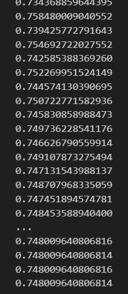

# 3.均相敞开系统
这一章的重点在于研究相平衡,将每一相视作一个均相敞开系统,并且主要研究对象是混合物,物质在各相之间不断地进行交换,引入了化学势的概念,引入了活度和活度系数的概念,拓展了我们计算液相的热力学性质的能力.

## 基本热力学关系

均相敞开系统的每一相均由N个组分构成,所以每一相的内能均可以表示为:

$$
U_t=U_t(S_t,V_t,n_1,n_2,...,n_N)
$$

下标t代表total

所以会有微分关系式:

$$
dU_t=TdS_t+V_tdp+\sum_i (\frac{\partial U_t}{\partial n_i})_{S_t,V_t,\{n\}}dn_i
$$

我们定义化学势为:

$$
\mu_i=(\frac{\partial U_t}{\partial n_i})_{S_t,V_t,\{n\}}
$$

为偏摩尔内能,而别的地方通常定义化学势为偏摩尔吉布斯自由能,事实上,这些定义方法是等价的:

例如:$G=H-TS=U+pV-TS$

所以

$$
dG-dU=pdV+Vdp-TdS-SdT=-(TdS-pdV)+(Vdp-SdT)
$$

移项得到

$$
\sum_i (\frac{\partial G_t}{\partial n_i})_{p,T,\{n\}}dn_i=\sum_i (\frac{\partial U_t}{\partial n_i})_{S_t,V_t,\{n\}}dn_i
$$

各变量几乎相互独立,所以有:

$$
(\frac{\partial G_t}{\partial n_i})_{p,T,\{n\}}=(\frac{\partial U_t}{\partial n_i})_{S_t,V_t,\{n\}}
$$

对于任意两个广度性质,这些定义方法是等价的,甚至对$pV$

注意到均相封闭体系有:

$$
d(pV)=TdS-dU+Vdp
$$

所以会有一些看起来比较好笑的式子:

$$
dH-d(pV)=dU=(TdS-Vdp)-(TdS-Vdp-dU)
$$

故:

$$
dH-(TdS-Vdp)=d(pV)-(TdS-dU+Vdp)
$$

得到:

$$
(\frac{\partial H}{\partial n_i})_{\{n\},T,S_t}=(\frac{\partial pV}{\partial n_i})_{\{n\},p,S_t,U}=p(\frac{\partial V}{\partial n_i})_{\{n\},p,S_t,U}
$$

同理,考虑类似的量$TS$,也会有:

$$
(\frac{\partial H}{\partial n_i})_{\{n\},T,S_t}=(\frac{\partial(TS)}{\partial n_i})_{G,p,S_t,\{n\}}
$$

对$dU_t$两边做变分得到:

$$
\delta dU_t=\delta TdS_t+\delta V_tdp+\sum_i \delta (\frac{\partial U_t}{\partial n_i})_{S_t,V_t,\{n\}}dn_i
$$

得到相平衡条件:

$$
\begin{cases}
    \delta T=0\\
    \delta V_m=0\\
    \delta \mu_i=0
\end{cases}
$$

## 偏摩尔性质
刚刚得到的化学势就是一种偏摩尔性质,除此之外,还可以定义一些偏摩尔性质,如偏摩尔体积,组分逸度的对数等等,总的来说有以下形式:

$$
\overline{M_i}=(\frac{\partial M_t}{\partial n_i})_{T,p,\{n\}}
$$

注意到,系统的总广度性质和各物质的物质的量分别成正比,也就是说有如下线性关系:

$$
M_t=a_1n_1+a_2n_2+...+a_Nn_N
$$

不难发现系数就是偏摩尔性质,所以:

$$
M_t=\sum_i n_i\overline{M_i}
$$

两边同除以$n$得到:

$$
M=\sum_i x_i\overline{M_i}
$$

那么,能否得到$\frac{\partial M}{\partial x_i}=\overline{M_i}=a_i$?

好像是不行的,因为变量$x_1,x_2,...x_N$之间不再是独立的,他们存在约束关系:

$$
x_1+x_2+...+x_N=1
$$

对偏摩尔性质:

$$
a_i=\overline{M_i}=\frac{\partial nM}{\partial n_i}=M+n\frac{\partial M}{\partial n_i}
$$

根据链式法则
$$
\frac{\partial M}{\partial n_i}=\frac{\partial M}{\partial x_i}\frac{\partial x_i}{\partial n_i}
$$

而$x_i=\frac{n_i}{n},n=f(n_1,n_2,...,n_N)=\sum_i n_i$

所以:

$$
\frac{\partial M}{\partial x_i}\frac{\partial x_i}{\partial n_i}=\frac{\partial M}{\partial x_i}\frac{\partial n_i/n}{\partial n_i}=\frac{\partial M}{\partial x_i}(\frac{1}{n}-\frac{n_i}{n^2})
$$

可以得到关系式:

$$
a_i=\overline{M_i}=M+\frac{\partial M}{\partial x_i}(1-x_i)
$$

显然不等于$\frac{\partial M}{\partial x_i}$

### 吉布斯-杜亥姆方程

!!!note 吉布斯杜亥姆
    $$
    M_t=M_t(T,p,n_1,n_2,...,n_N)
    $$

    两边全微分得到:

    $$
    dM_t=n(\frac{\partial M}{\partial T})_{p,\{n\}}+n(\frac{\partial M}{\partial p})_{T,\{n\}}+\sum_i \overline{M_i}dn_i
    $$

    两边除掉n得到:

    $$
    dM=(\frac{\partial M}{\partial T})_{p,\{n\}}+(\frac{\partial M}{\partial p})_{T,\{n\}}+\sum_i \overline{M_i}dx_i
    $$

    注意到:

    $$
    dM=\sum_i \overline{M_i}dx_i+\sum_i x_id\overline{M_i}
    $$

    所以有:

    $$
    (\frac{\partial M}{\partial T})_{p,\{n\}}+(\frac{\partial M}{\partial p})_{T,\{n\}}-\sum_i x_id\overline{M_i}=0
    $$

    这就是吉布斯杜亥姆方程.

恒温恒压时候得到一个应用较多的式子:

$$
\sum_ix_i\overline{M_i}=0
$$

## 混合过程的性质变化

当物质独立作用的时候,显示出来的是摩尔性质,但是混合之后,会受到其他例子的相互作用,进而会对自身的性质产生一定的干扰,显示出来的就是偏摩尔性质.所以混合过程的性质变化就是用混合后的总摩尔性质减去混合前的各个摩尔性质的加权和:

下面混合过程全部在等温等压条件下进行

$$
\Delta M=M-\sum_{i=1}^Ny_iM_i=\sum_{i=1}^Ny_i(\overline{M_i}-M_i)
$$

定义:

$$
\overline{\Delta M_i}=\overline{M_i}-M_i
$$

为$\Delta M$的偏摩尔性质,所以,之前得到的摩尔性质的公式和偏摩尔性质的公式都能套用在这上面.

下面我们考虑理想气体的混合过程的性质变化,通过刚刚的分析,我们知道,混合过程的性质变化是受分子间相互作用影响的,由于介入了新的分子间相互作用,所以会使得摩尔性质发生偏移.

很自然的想到,理想气体没有分子间相互作用,那么理想气体的性质中,与相互作用有关的量混合之后都不会变化,首当其冲的就是内能,内能等于动能加势能,势能为0,所以摩尔内能根本不会变化:

$$
\Delta U^{ig}=0
$$

接着就是根据内能定义的焓:$H=U+pV$,依旧不包含任意和相互作用以及状态有关的项,所以:

$$
\Delta H^{ig}=0
$$

同理,根据内能和焓定义的等压摩尔热容以及等容摩尔热容也不会发生任何变化

然而,有一个量会直观地改变,那就是熵,熵代表了体系的混乱程度,注意到有:

$$
S=klnW
$$

体系的微观状态数越多,熵的值越大,混合后的微观状态数显然要更加多,所以熵是增大的.

!!!note 混合熵

    $$
    \Delta S^{ig}=y_1\Delta S^{ig}_1+y_2\Delta S^{ig}_2
    $$

    而对于两者独立的混合性质变化,可以不考虑相互作用带来的影响,仅仅考察为均相封闭体系的性质变化,如1号物质,压力从$p$变成了$p_1=py_1$,在等温过程发生了压力变化:

    $$
    \Delta S^{ig}_1=\int_{p}^{p{y_1}}(\frac{\partial S^{ig}}{\partial p})_TdT=-\int_{p}^{py_1}(\frac{\partial V}{\partial T})_pdp=-Rlny_1
    $$

    所以混合熵为:

    $$
    \Delta S^{ig}=-R\sum_{i=1}^{N}y_ilny_i
    $$

同样,根据定义就能得到混合吉布斯自由能和混合亥姆霍兹能:

$$
\begin{aligned}
    \Delta G^{ig}=\Delta H^{ig}-T\Delta S^{ig}=RT\sum_{i=1}^{N}y_ilny_i\\
    \Delta A^{ig}=\Delta U^{ig}-T\Delta S^{ig}=RT\sum_{i=1}^{N}y_ilny_i
\end{aligned}
$$

## 组分逸度与组分逸度系数

对偏摩尔吉布斯自由能,定义:

$$
d\overline{G_i}=RTdln\hat{f}_i
$$

同时不难知道:

$$
\lim_{p\to 0}\hat{f}_i=py_i
$$

我们考虑一个过程,总的气体从理想气体逐步变为非理想气体,那么偏摩尔吉布斯自由能的变化为:

$$
\overline{G}_i(T,p,\{y\})-\overline{G}_i^{ig}(T,p,\{y\})=\int_{\overline{G}_i(T,p,\{y\})}^{\overline{G}_i^{ig}(T,p,\{y\}}dG=RTln\frac{\hat{f}_i}{py_i}
$$

根据这个式子我们定义组分逸度系数:

$$
\hat{\varphi}_i=\frac{\hat{f}_i}{py_i}
$$

以及:

$$
\lim_{p\to 0}\hat{\varphi}_i=1
$$

显然,存在一条路径,可以让摩尔吉布斯自由能变成偏摩尔吉布斯自由能(逐渐把$y_i$从1开始减小到$y_i$),于是就会有:

$$
\overline{G_i}(T,p,\{y\})-G_i(T,p)=RTln\frac{\hat{f_i}}{f_i}
$$

如果气体是理想气体的话:

$$
\overline{G_i}(T,p,\{y\})-G_i^{ig}(T,p)=RTln\frac{\hat{f_i}}{p}
$$

恒温恒压下,理想气体这个参考态为一个定值,而每一相中的化学势(偏摩尔吉布斯自由能)相等,所以每一相的组分逸度也相等:

$$
\delta \hat{f_i}=0
$$

就像之前探讨的逸度的性质一样,组分逸度的性质和逸度差不多,均可以通过基础的热力学关系推导出来

!!!tip 组分逸度的性质

    $$
    (\frac{\partial ln\hat{f_i}}{\partial p})_T=\frac{\overline{V}_i}{RT}
    $$

    $$
    (\frac{\partial ln\hat{f}}{\partial T})_p=-\frac{\overline{H_i}-H_i^{ig}}{RT^2}
    $$

    那么,组分逸度是由偏摩尔吉布斯自由能导出的,那么,它或者它的变式又是谁的偏摩尔量呢?

    注意到

    $$
    RTlnf=G(T,p)-G^{ig}(T,p_0=1)=\sum_{i=1}^N y_i(\overline{G_i}-\overline{G^{ig}_i}(p_0=1))=\sum_{i=1}^N y_i(RTln\frac{\hat{f_i}}{1\times y_i})
    $$

    所以有:

    $$
    lnf=\sum_{i=1}^N y_iln\frac{\hat{f_i}}{y_i}
    $$

    即$ln\frac{\hat{f_i}}{y_i}$是$lnf$的偏摩尔量

    如果上面理想气体的参考态刚好是p的话,那么$lnf$就变形成为$ln\varphi$,相应的,它的偏摩尔性质也会变成组分逸度系数的对数$ln\varphi_i$

如果使用EOS法计算组分逸度系数,只要仿照前面的,把公式改一下就行:

$$
\begin{aligned}
    &\ln \hat{\phi_i} = \frac{1}{RT} \int_0^p \left( \bar{V_i} - \frac{RT}{p} \right) dp\\
    &\ln \hat{\phi_i} = \frac{1}{RT} \int_{\infty}^{V_t} \left[ \frac{RT}{V_t} - \left( \frac{\partial p}{\partial n_i} \right)_{T, V_t, \{n\} \ne i} \right] dV_t - \ln Z
\end{aligned}
$$

以PR方程为例,其组分逸度的计算公式由第二个式子给出:

$$
\ln \hat{\phi_i} = \frac{b_i}{b} (Z - 1) - \ln \left( \frac{p(V - b)}{RT} \right) + \frac{a}{2\sqrt{2}bRT} \left( \frac{b_i}{b} - \frac{2}{a} \sum_{j=1}^{N} y_j a_{ij} \right) \ln \left( \frac{V + (\sqrt{2} + 1)b}{V - (\sqrt{2} - 1)b} \right)
$$

可见,我们如果要计算组分逸度系数,则要先得出独立的方程常数,然后根据混合法则和相互作用参数得到总的方程常数,最后再根据这些计算组分逸度

以二氧化碳(1)和正丁烷(2)为例

1. $x_1$=0.2
2. $y_1$=0.8962

试计算两种情况二氧化碳的组分逸度和组分逸度系数

经过查询得到,二氧化碳和正丁烷的临界参数分别如下所示:

$$
\begin{aligned}
&T_c /K \quad &p_c /Mpa\quad &w\\ 
CO_2\quad &304.19\quad &7.381\quad &0.225 \\
正丁烷 \quad &425.18\quad &3.797\quad &0.193
\end{aligned}
$$

具体的运算代码如下:

``` python
import numpy as np
import sympy as sp
from math import sqrt,log
R=8.3145
#CO_2 正丁烷
T_c=[304.19,425.18]
p_c=[7.381,3.797]
w=[0.225,0.193]

T=273.15
p=1.061


#先求独立的系数
a_c=[0,0]
b=[0,0]
a_0=[0,0]
a=[0,0]

for i in range(2):
    a_c[i]=0.457235*(R*T_c[i])**2/p_c[i]
    b[i]=0.077796*R*T_c[i]/p_c[i]
    a_0[i]=(1+(1-(T/T_c[i])**0.5)*(0.37646+1.54226*w[i]-0.26992*w[i]**2))**2
    a[i]=a_c[i]*a_0[i]

#根据得到的系数求总的a,b
#相互作用参数
k=[[0,0.12],[0.12,0]]
x=[0.2,0.8]
y=[0.8962,1-0.8962]


a_t_x=0
a_t_y=0
b_t_x=0
b_t_y=0
for i in range(2):
    b_t_x += x[i]*b[i]
    b_t_y += y[i]*b[i]
    for j in range(2):
        a_ij=sqrt(a[i]*a[j])*(1-k[i][j])
        a_t_x += x[i]*x[j]*a_ij
        a_t_y += y[i]*y[j]*a_ij


#为了计算压缩因子,要求体积根:

#定义PR方程:

V=sp.symbols('V')
pr_1=R*T/(V-b_t_x)-a_t_x/(V*(V+b_t_x)+b_t_x*(V-b_t_x))

pr_2=R*T/(V-b_t_y)-a_t_y/(V*(V+b_t_y)+b_t_y*(V-b_t_y))

f_1=pr_1-p
f_2=pr_2-p

root_x=sp.solve(f_1,V)
root_y=sp.solve(f_2,V)

V_x=float(min([abs(i) for i in root_x]))
V_y=float(max([abs(i) for i in root_y]))

Z_x=p*V_x/(R*T)
Z_y=p*V_y/(R*T)


#计算CO_2的组分逸度系数

t_x=0
t_y=0


for j in range(2):
    a_0j=sqrt(a[0]*a[j])*(1-k[0][j])
    t_x += x[j]*a_0j
    t_y +=y[j]*a_0j

ln_phi_x=b[0]/b_t_x*(Z_x-1)-log(p*(V_x-b_t_x)/(R*T))+a_t_x/(2*sqrt(2)*b_t_x*R*T)*(b[0]/b_t_x-2/a_t_x*t_x)*log((V_x+(1+sqrt(2))*b_t_x)/(V_x-(sqrt(2)-1)*b_t_x))

ln_phi_y=b[0]/b_t_y*(Z_y-1)-log(p*(V_y-b_t_y)/(R*T))+a_t_y/(2*sqrt(2)*b_t_y*R*T)*(b[0]/b_t_y-2/a_t_y*t_y)*log((V_y+(1+sqrt(2))*b_t_y)/(V_y-(sqrt(2)-1)*b_t_y))  

print(f'液相组分逸度系数为:{ln_phi_x:.4f}')
print(f'气相组分逸度系数为:{ln_phi_y:.4f}')

```

得到的结果为:


与书上的结果一致,运算正确

## 溶液的计算

前面的物性计算都是基于能够适用于气液两相的状态方程进行的,但是,能够找到一个适用于气液两相的状态方程在有的时候是比较困难的,所以就会引入活度系数的概念,用于强化我们在液相性质上的计算能力.

### 理想溶液与理想稀溶液
什么叫做理想溶液,理想溶液与理想气体的概念类似,都是一个理想化模型,但是,理想溶液允许存在分子间相互作用,即表现出溶液的性质,假设说溶液中存在组分A和B,A与A之间的相互作用等于B与B之间的相互作用,这就是理想溶液,溶液中任意分子间的相互作用都是等价的.

#### Raoult定律

由于分子间相互作用都是等价的,所有分子可被视作一种分子,那么,某一种分子提供给系统的压力(分压)就等于全是这种物质时的平衡压力(饱和蒸气压)乘上它在这个系统中占据的比例:

$$
p_i=p_i^s\times x_i 
$$

写成逸度的形式就是:

$$
\hat{f}^{is}_i=f_ix_i 
$$

它有一个新的名字就是Lweis-Randall规则

根据吉布斯杜亥姆方程,如果一个组分满足Lweis-Randall规则,那么会有:

$$
x_1d\ln \frac{\hat{f_1}}{x_1}+x_2d\ln \frac{\hat{f_2}}{x_2}=0
$$

于是得到:

$$
x_1d\ln f_1+x_2d\ln \frac{\hat{f_2}}{x_2}=0
$$

$f_1$是纯组分的逸度,只和温度和压力有关,所以在T,p固定的时候$d\ln f_1=0$

故会有:

$$
x_2d\ln \frac{\hat{f_2}}{x_2}=0
$$

$x_2$是变量,不可能等于0,那么就得到:

$$
\frac{\hat{f_2}}{x_2}=\operatorname{const}
$$

得到这个式子的前提是,1组分满足Lweis-Randall规则,而满足这个规则有两种情况,一是整个溶液是理想溶液,二是$x_1$趋向于1,整个溶液是稀溶液,所以理想稀溶液会满足亨利定律:

#### Henry定律

$$
\hat{f^{is*}_i}=H_{i ,solvent}\times x_i 
$$

其中$x_i$趋向于0


### 活度系数
活度系数有两种,一种被称为归一化的活度系数,基于lweis-Randall规则定义,一种被称作不对称归一化的活度系数,由亨利定律规定.

构造一条途径,从理想溶液的i组分到普通溶液的i组分,那么,会有如下的吉布斯自由能的变化:

$$
\hat{G_i}(T,p,\{ x \})-\hat{G^{is}_i}(T,p,\{ x \})=RT\ln \frac{\hat{f_i}}{f_ix_i}
$$

令:

$$\gamma_i=\frac{\hat{f_i}}{f_ix_i}$$

这个东西被称作归一化的活度系数,当$x_i$趋向于1的时候,活度系数也趋向于1

同理,构造一条途径,从理想稀溶液的i组分到普通溶液的i组分:

$$
\hat{G_i}(T,p,\{ x \})-\hat{G_i^{is*}}(T,p,\{ x \})=RT\ln \frac{\hat{f_i}}{H_{i ,solvent}\times x_i }
$$

令:

$$
\gamma_i^{*}=\frac{\hat{f_i}}{H_{i ,solvent}\times x_i }
$$

这个被称作不对称归一化的活度系数,显然当$x_i$趋向于0的时候,活度系数趋向于1.

可以根据溶质溶剂的属性来灵活选择活度系数,例如,超临界组分在溶液中的溶解度很低,通常采用不对称归一化的活度系数.

连接这两种活度系数之间的桥梁是无限稀释活度系数,即在无限稀释的溶质中的溶质的对称归一化的活度系数,注意到有:

$$
\hat{f_{i}^l}=f^{l}_i x_i \gamma_i=H_i x_i\gamma_i^*
$$

所以两种活度系数的比值:

$$
\frac{\gamma_i}{\gamma_i^*}=\frac{H_i}{f^l_i }
$$

是一个常数,所以,两边同时令$x_i$趋向于0,就得到:

$$
\gamma^{\infty}=\frac{H_i}{f^l_i }
$$

这个值可以根据实验测得

所以有:

$$
\ln\gamma^*_i=\ln\gamma_i-\ln \gamma_i^{\infty}
$$


### 超额性质

超额性质定义为:

$$
G^E=G-G^{is}=\sum_{i=1}^Nx_i(\overline{G_i}-\overline{G^{is}_i})
$$

根据前面写过的式子,上式变形为:

$$
\frac{G^E}{RT}=\sum_{i=1}^Nx_i \ln \gamma_i 
$$

所以$\ln\gamma_i$也是$\frac{G^E}{RT}$的偏摩尔性质

根据吉布斯杜亥姆方程有:

$$
\sum_{i=1}^Nx_id\ln\gamma_i=0
$$

这个式子非常有用,例如,二组分溶液,只要知道了一个组分的活度系数模型,就可以根据这个式子推算出另一个

一个比较特殊的溶液叫做正规溶液,它的超额吉氏函数模型为:
$$
\frac{G^E}{RT}=Ax_1x_2
$$

正规溶液的混合熵和理想溶液是相同的,因此他可以视作一种介于理想溶液和真实溶液的简化模型,根据刚刚得到的偏摩尔性质,我们可以求出它的活度系数模型:

$$
\ln\gamma_1=\frac{\partial \frac{G^E}{RT}}{\partial n_1}=Ax_2(1-x_1)=Ax_2^2
$$

同理根据对称性有:

$$
\ln\gamma_2=Ax_1^2
$$


### 活度系数模型

活度系数模型通常有以下几种,大体可分为适用于二元体系的经典模型和现代活度系数模型:

#### 二元Margules方程
$$
\begin{aligned}
\ln \gamma_1 &= [A_{12} + 2(A_{21} - A_{12})x_1] x_2^2 \\
\ln \gamma_2 &= [A_{21} + 2(A_{12} - A_{21})x_2] x_1^2
\end{aligned}
$$

#### 二元 van Laar 方程

$$
\begin{aligned}
\ln \gamma_1 &= A_{12} \left( \frac{A_{21} x_2}{A_{12} x_1 + A_{21} x_2} \right)^2 \\
\ln \gamma_2 &= A_{21} \left( \frac{A_{12} x_1}{A_{12} x_1 + A_{21} x_2} \right)^2 \\
\end{aligned}
$$

这些奇奇怪怪的系数是模型参数,需要一些实验数据代入得到这些参数.通常是把式子变形成直线形式,然后用实验数据拟合直线参数得到.

应用比较广的是下面两个比较现代的方程

#### Wilson 方程

$$
\begin{align*}
\ln \gamma_i &= 1 - \ln \left( \sum_{j=1}^{N} x_j \Lambda_{ij} \right) - \sum_{k=1}^{N} x_k \frac{\Lambda_{ki}}{\sum_{j=1}^{N} x_j \Lambda_{kj}}
\end{align*}
$$


其中， \( \Lambda_{ij} \) 称为模型参数，可表示为

$$
\begin{align*}
\Lambda_{ij} &= \frac{V_j^L}{V_i^L} \exp \left( - \frac{\lambda_{ij} - \lambda_{ii}}{RT} \right)
\end{align*}
$$

#### NRTL方程

$$
\ln \gamma_i = \frac{\sum_{j=1}^{N} x_j \tau_{ji} G_{ji}}{\sum_{k=1}^{N} x_k G_{ki}} + \sum_{j=1}^{N} \frac{x_j G_{ij}}{\sum_{k=1}^{N} x_k G_{kj}} \left( \tau_{ij} - \frac{\sum_{k=1}^{N} x_k \tau_{kj} G_{kj}}{\sum_{k=1}^{N} x_k G_{kj}} \right)
$$

这两个模型参数过于复杂,这里不过多赘述了(好吧就是我不懂)

还有一种方法是基于基团贡献法的,留到后面再详细讨论


