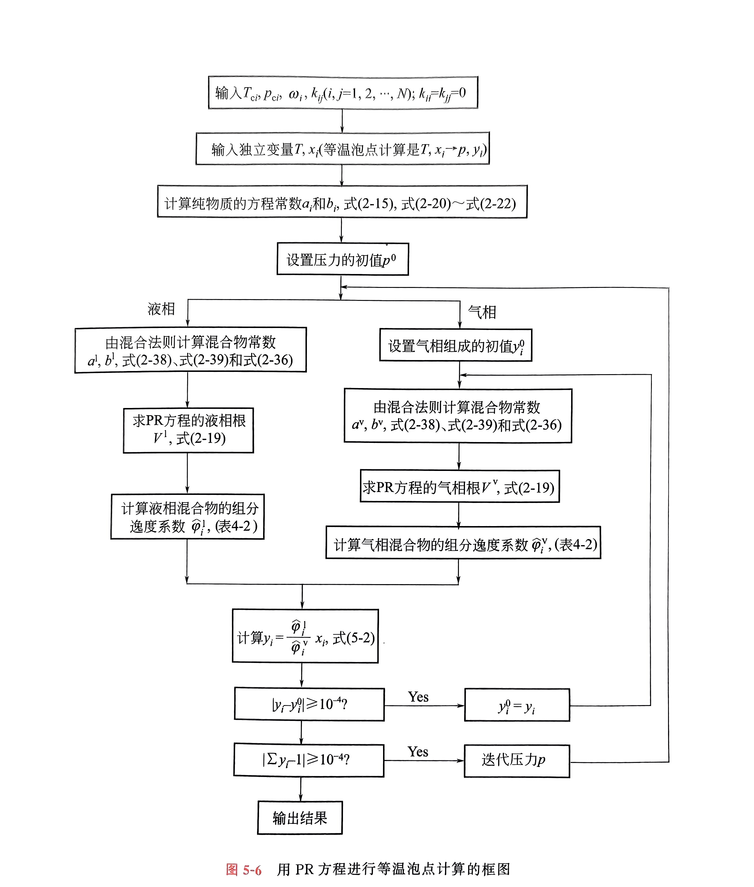
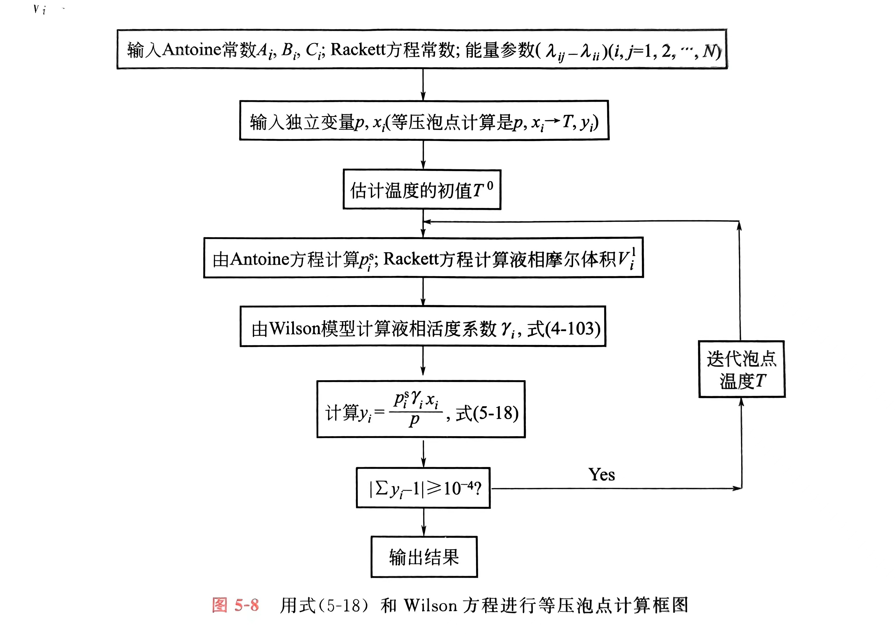
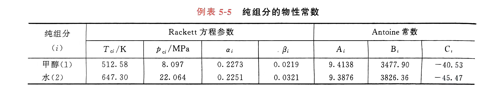

# 4.非均相系统

## 气液平衡的相图

### 气液平衡的自由度

一个由$N$个组分组成的两相系统,在一定的温度和压力下达到气液平衡,所以,该系统的基本强度性质是温度和压力 $T,p$ ,以及液相组成 $x_1,x_2, \ldots x _{N-1}$ 和气相组成 $y_1,y_2, \ldots y_{N-1}$ (两个组成会有两个约束,所以各少一个自由度),故强度性质的总个数为 $2N$ 个.

根据相律:

$$
F=C-P+2=N
$$

系统总共有N个自由度,所以我们只需要给定N个独立变量就能确定这个系统,但是强度性质的个数是$2N$个,所以剩下的N个自由度会由气液平衡来确定.

### 二组分相图

如果需要一个图,可以描述二组分气液混合的所有结果,根据相律,系统的自由度为$f=2-P+2=4-P$,系统的最小相数为1,所以系统最多需要三个独立变量就能确定这个系统的状态,这无疑需要在三维空间中绘图,但是这样比较麻烦.

我们知道,所有的独立变量为$(T,p,x_1,y_1)$,我们固定其中一个量,通常是固定$T,p$中的一个,然后采用双横坐标,就能够在二维坐标系当中绘制出气液相图.

{width=300px}

横坐标是双横坐标,分别为气相摩尔分数$y_1$和液相摩尔分数$x_1$,但是他们分别只能对应图中的两条线,如图所示上面的是露点线.下面的是泡点线.

#### 露点线

对于任意的摩尔分数,随着温度的下降或者压力的增大出现第一个小液滴的线.

#### 泡点线

对于任意的摩尔分数,随着温度的上升出现第一个小气泡的线.


#### 相图分析

当坐标$(T,y)$位于露点线上方的时候,体系全为气相,横坐标$y$代表1组分的总摩尔分数

当温度继续下降,点$(T,y)$位于露点线上,此时的y恰好就是$y_1$,1组分中全为饱和气相

当点$(T,y)$位于两条线之间,y的意义依旧是总摩尔分数,只不过,这里是气液平衡区,做一条水平直线交露点线和泡点线于两点,对应的横坐标分别是此时气液平衡时的饱和气相摩尔分数$y_1$,以及饱和液相摩尔分数$x_2$,可以根据杠杆原理确定

随着温度的进一步下降,$(T,y)$落到了泡点线上,此时的y恰好就是饱和液相摩尔分数,1组分全为饱和液相.当温度继续下降,1组分变成纯液相.

不难发现,只要给定1的总摩尔分数和温度,根据这张图,我们总能确定$(T,y_1,x_1)$,从而确定整个体系,完成对体系的刻画.

与$T-x-y$图相对的,还有$p-x-y$图,此时的泡点线和露点线在图上的位置要反一下

{width=400}


## 气液平衡计算方法

根据前面的自由度分析,我们知道,系统的总强度性质是$2N$个,而自由度是$N$个,所以给定N个独立变量就可以根据气液平衡关系推算出另外N个,这就是气液平衡计算的任务

常见的气液平衡计算类型有如下几种:

等温泡点计算:$(T,x_1,x_2, \ldots x_{N-1}) \to (p,y_1,y_2, \ldots y_{N-1})$

等压泡点计算:$(p,x_1,x_2, \ldots x_{N-1}) \to (T,y_1,y_2, \ldots y_{N-1})$

等温露点计算:$(T,y_1,y_2, \ldots y_{N-1})\to (p,x_1,x_2, \ldots x_{N-1})$

等压露点计算:$(p,y_1,y_2, \ldots y_{N-1})\to (T,x_1,x_2, \ldots x_{N-1})$

闪蒸计算:$(T,p,z_1,z_2, \ldots z_{N-1})\to (x_1,x_2, \ldots x_{N-1},y_1,y_2, \ldots y_{N-1},\eta)$

### 闪蒸

这个词语来源于,液体流过阀门的时候压力会突然降低从而引起的急剧蒸发,产生部分的气化,进一步形成气液平衡的两相,闪蒸计算的目的就是在给定的温度和压力条件下,根据混合物的初始组成计算气化后形成的气液平衡两相中的气相摩尔分数和液相摩尔分数.

闪蒸计算输入的是$N+1$个独立变量$(T,p,z_1,z_2, \ldots z_{N-1})$,按照我们上面的分析,他只能通过气液平衡计算的N个方程得到N-1个另外的独立变量,所以闪蒸计算额外引进了一个独立变量:气相分数,即气相中的总摩尔数占总的总摩尔数的比例:

$$\eta=\frac{V}{V+L}$$

并且额外引进$N-1$个方程:

$$
z_{i}=x_{i}(1-\eta)+y_{i}\eta
$$

这样,我们总共有$2N-1$个方程($N$个气液平衡方程和$N-1$个$z-x-y$方程),刚好等于未知变量的个数,体系由此被确定下来.

##### 闪蒸计算的简化

当液相的几个组成分子极性比较接近,气相的压力又不是很高的时候,可以把液相近似当做理想溶液,气相近似当做理想气体,于是有:

$$
\begin{aligned}
\hat{f_{i}^v}=py_{i} \\
\hat{f_{i}^l}=p_{i}^sx_{i}
\end{aligned}
$$

两者相等,所以得到气液平衡常数:

$$
K_i=\frac{y_{i}}{x_{i}}=\frac{p_{i}^s}{p}
$$

将$y_{i}=K_{i}x_{i}$代入气液平衡方程得到:

$$
y_{i}=\frac{z_{i}K_{i}}{1+\eta(K_{i}-1)}
$$

然后再根据归一化方程:

$$
\sum_{i=1}^{N}y_{i}=1
$$

得到:

$$
\sum_{i=1}^{N}\frac{z_{i}K_{i}}{1+\eta(K_{i}-1)}=1
$$

进而计算出$\eta$,然后计算出每个$y_{i}$


### EOS法

#### 等温泡点计算

首先,我们要获得一个在气液两相都适用的状态方程,然后输入所有混合物的独立临界参数以及相互作用参数,得到纯物质的方程常数

再者根据这些独立的方程常数结合相互作用参数,我们计算出液相体系的方程常数,现在,我们不知道气液平衡的饱和蒸气压,所以要猜测一个初值,这个初值的猜测可以假定体系是理想溶液进行(但是这里似乎要获取每个纯组分的蒸气压数据?,应该也可以通过计算完成):

$$
p^{0}=\sum_{i=1}^Nx_ip_{i}^s
$$

有了饱和蒸气压,液相体系总的方程常数,某一液相组分的方程常数,就可以根据组分逸度系数的公式计算出液相该组分的逸度系数.

下一步,需要获得气相该组分的逸度系数,这该怎么办呢,同样,也要先估计一个初值$y_{i}^0$,然后根据$a_i,b_{i}$和$y_{i}$计算出气相的总的方程常数,用刚刚估计的蒸气压求气相体积根,最后计算出气相的组分逸度系数.

$y_{i}^0$的初值估计按照理想气体进行,理想气体的分压刚好等于液相理想溶液的分压:

$$
y_{i}^0=\frac{x_{i}p_{i}^s}{\sum_{j=1}^Nx_{j}p_{j}^s}
$$

计算出两个组分逸度系数后,根据相平衡准则去更新气相摩尔分数:

$$
y_{i}=\frac{\hat{\varphi_i^l}}{\hat{\varphi_{i}^v}}x_i
$$

同时也需要更新饱和蒸气压:

$$
p_{(n+1)}=p_n\sum_{i=1}^Ny_{i(n+1)}
$$

终止条件显然为:

$$
\begin{aligned}
|y_{i(n+1)}-y_{in}|<\varepsilon \\
|\sum_{i=1}^Ny_{i(n+1)}-1|<\varepsilon
\end{aligned}
$$

具体的流程图如下:



下面就是程序实现,由于流程比较复杂,所以要分好几个文件进行

第一个是主文件,参数输入和迭代在主文件中进行:

```python
#这个是主文件

#首先,参数输入在主文件中进行

import numpy as np
import sympy as sp
from math import sqrt

from equation_constant import independent_constant,total_constant
from pressure import pressure
from volume_root import volume_root
from yidu_coefficient import yidu_c


T=float(input('请输入温度'))

#定义一个参数数组
T_c=[]
p_c=[]
w=[]


n=int(input('请输入组分个数'))
print('请分别依次输入所有组分的临界温度,临界压力,偏心因子')


for i in range(n):
    t=list(map(float,input().split()))
    T_c.append(t[0])
    p_c.append(t[1])
    w.append(t[2])

'''
T=273.15
n=2
T_c=[304.19,425.18]
p_c=[7.398,3.797]
w=[0.228,0.193]
'''#测试数据,二氧化碳和正丁烷


#输入摩尔分数

x=list(map(float,input('请输入所有组分的液相摩尔分数').split()))

# 获得纯组分的方程常数数组

a,b=independent_constant(T_c,p_c,w,n,T)

# 计算各个组分的饱和蒸气压

p_s=[]

for i in range(n):
    p_s.append(pressure(a[i],b[i],T))

#设定初始的饱和蒸气压

p=sum([x[i]*p_s[i] for i in range(n)])

#设定气相的初始y

y=[x[i]*p_s[i]/p for i in range(n)]


#计算混合物常数

#先给出相互作用参数
k=[]


for i in range(n):
    k.append([])
    for j in range(n):
        k[i].append(float(input('按照顺序输入相互作用参数')))

#测试数据,二氧化碳和正丁烷
#k=[[0,0.12],[0.12,0]]
        
a_l,b_l=total_constant(a,b,x,k,n)

while True:

    V_l=volume_root(p,T,a_l,b_l)[0]

    #计算液相组分逸度系数
    phi_l=[]
    
    

    for i in range(n):
        t_0=0
        for j in range(n):
            a_ij=sqrt(a[i]*a[j])*(1-k[i][j])
            t_0 =t_0+x[j]*a_ij
        phi_l.append(yidu_c(b[i],a_l,b_l,p,V_l,T,t_0))

    
    a_v,b_v=total_constant(a,b,y,k,n)

    #求气相体积根
    V_v=volume_root(p,T,a_v,b_v)[1]

    #求气相组分逸度系数

    phi_v=[]

    for i in range(n):
        t_1=0
        for j in range(n):
            a_ij=sqrt(a[i]*a[j])*(1-k[i][j])
            t_1 =t_1+x[j]*a_ij
        phi_v.append(yidu_c(b[i],a_v,b_v,p,V_v,T,t_1))
    
    #存储一个中间变量
    t=y[:]
    y=[phi_l[i]/phi_v[i]*x[i] for i in range(n)]

    #求两个向量之间的距离

    e_1=sqrt(sum([(y[i]-t[i])**2 for i in range(n)]))

    e_2=abs(sum(y)-1)

    if e_1<1e-6 and e_2<1e-6:
        break
    else:
        p=p*(sum(y))


print('气相组成:')
print(y)

print('系统压力')
print(p)


```

以下是几个函数文件:

```python
#这个文件用来计算方程常数,包括总方程常数和独立的方程参数

def independent_constant(T_c,p_c,w,n,T):


    R=8.314462618
    #定义一个方程常数数组:
    a=[]
    
    b=[]

    for i in range(n):
        t_1=0.457235*(R*T_c[i])**2/p_c[i]
        t_2=0.077796*R*T_c[i]/p_c[i]
        t_3=(1+(1-(T/T_c[i])**0.5)*(0.37646+1.54226*w[i]-0.26992*w[i]**2))**2
        
        a.append(t_1*t_3)

        b.append(t_2)

    #返回方程常数数组
    
    return a,b


def total_constant(a,b,x,k,n):
    b_t=sum([x[i]*b[i] for i in range(n)])

    a_t=0

    for i in range(n):
        for j in range(n):
            a_ij=(a[i]*a[j])**0.5*(1-k[i][j])
            a_t =a_t+ x[i]*x[j]*a_ij
    return a_t,b_t

```


```python

# 书上的算饱和蒸气压的方法太麻烦了,这里还是用基于麦克斯韦等面积规则和二分法来计算

import sympy as sp
from scipy.integrate import quad


def pressure(a,b,T):
    R=8.314462618
    V=sp.symbols('V')

    #定义pr方程
    pr=R*T/(V-b)-a/(V*(V+b)+b*(V-b))
    
    #求一阶导数找极值点
    y1=sp.diff(pr,V)
    root_2=sp.solve(y1,V)
    root_2=[abs(i) for i in root_2 if abs(i)>b]
    t=[pr.subs({V:i}) for i in root_2]

    #最大和最小对应的p
    p_max=max(t)
    p_min=min(t) if min(t)>0 else 0
    
    p_s=(p_max+p_min)/2 #给定一个有解的饱和蒸气压初值


    while True:
        f_v=R*T/(V-b)-a/(V*(V+b)+b*(V-b))-p_s

        root=sp.solve(f_v,V)
        root=[abs(i) for i in root ]
        if not root:
            print('无解,初值设置不对')
            break
        V_1=min(root)
        V_2=max(root)
        
        #计算定积分

        # 定义数值积分函数
        def f_v_numeric(V):
            return R * T / (V - b) - a / (V * (V + b) + b * (V - b)) - p_s

        # 计算定积分
        x, _ = quad(f_v_numeric, V_1, V_2)

        if abs(x)<=1e-6:    
            break
        else:
            if x>0:
                p_min=(p_max+p_min)/2
                p_s=(p_max+p_min)/2
            else:
                p_max=(p_max+p_min)/2
                p_s=(p_max+p_min)/2
    
    return p_s


```

```python
# 这个文件用来计算体积根

import sympy as sp

def volume_root(p,T,a_t,b_t):
    R=8.314462618 
    V=sp.symbols('V')

    #定义pr方程

    pr=R*T/(V-b_t)-a_t/(V*(V+b_t)+b_t*(V-b_t))

    f=pr-p

    root=sp.solve(f,V)

    root=[float(abs(i)) for i in root if abs(i)>b_t]

    V_sl=min(root)

    V_sv=max(root)

    return [V_sl,V_sv]


```

```python
# 这个文件用来计算逸度系数

from math import log,sqrt,exp

def yidu_c(b,a_t,b_t,p,V,T,t):
    
    R=8.314462618
    
    Z=p*V/R/T

    re=b/b_t*(Z-1)-log(p*(V-b_t)/(R*T))+a_t/(2*sqrt(2)*b_t*R*T)*(b/b_t-2/a_t*t)*log((V+(sqrt(2)+1)*b_t)/(V-(sqrt(2)-1)*b_t))
    
    re0=exp(re)

    return re0
```


以书上二氧化碳和正丁烷的例子为例,最后算出来的结果可以在精度范围内成功收敛,但是与书上的结果在第一个小数位就有较大的不同,我暂时还没找到原因.


### EOS+$\gamma$法

有的时候,并不容易找到一个能够同时适用于气液两相的状态方程,状态方程在液相的表现有的时候并不是很好,这个时候,考虑在液相使用活度系数模型,气相使用状态方程模型,会取得更好的效果.

先求逸度,注意到:

$$(\frac{\partial \ln f}{\partial p})_{T}=\frac{V}{RT}$$

所以对于某一纯组分溶液的在任意时刻的逸度,考虑一个由饱和溶液变化到它的过程:

$$
\ln\frac{f_{i}^{l}}{f_{i}^{sl}}=\int_{p_{i}^{s}}^{p_{i}} \frac{V_i^l}{RT}dp=\frac{V_i^l}{RT}(p_i-p_i^s)
$$

当压力不是很高的时候,液相饱和纯组分逸度可以用饱和蒸气压来近似:

$$
f_i^{sl}=p^s 
$$

所以,任意时刻的液相纯组分逸度可以写成:

$$
f_{i}^{l}=p_{s}\exp(\frac{V_i^l}{RT}(p_i-p_i^s))=p_{i}^{s}\Phi_{i}
$$

其中,$\Phi_i$被称之为poynting因子,通常情况下和1比较接近

所以这个时候组分逸度可以表示为:

$$
\hat{f_i^l}=p_{i}^{s}\Phi_{i}\gamma_ix_i
$$

根据相平衡准则,气相用逸度系数和压力来描述,有:

$$
y_{i} \hat{\varphi_{i}^{v}}p=p_{i}^{s}\Phi_{i}\gamma_ix_i
$$

在压力不是很大的时候,可以把poynting因子取做1,当压力比较下的时候,气相甚至可以当做理想气体来处理,得到化简后的相平衡准则:

$$
py_{i}=p_{i}^{s}\gamma_ix_i 
$$

#### 等压泡点计算

前面用EOS法实现了等温泡点计算,虽然EOS法也能进行等压泡点计算,但是略显麻烦,这里采用活度系数法,已知量为$p,x_i$,要求的量为$T,y_i$

首先,给定一个温度初值的估计,先把体系视作纯组分的,那么此刻的压力p就是纯组分的饱和蒸气压,根据前面讲的估计式,会有:

$$
p=p_c 10^{\frac{7(1+\omega)}{3}(1-\frac{T_c}{T})}
$$

于是就可以得到体系温度的估计式:

$$
T=\frac{T_c}{1-\frac{3 \lg \frac{p}{p_c}}{7(1+\omega)}}
$$

那么,这个$p_c$和$T_c$怎么办呢,我们可以大胆的采用线性叠加(我也不知道行不行先试试):

$$
\begin{aligned}
p_c=\sum_{i=1}^Nx_ip_{ic} \\
T_c=\sum_{i=1}^Nx_iT_{ic}
\end{aligned}
$$

初步估计温度之后，根据安托万方程计算各个组分的饱和蒸汽压，Rackett方程计算各个组分的液相摩尔体积，然后再根据液相摩尔体积和能量参数，就能够得到wlison模型的所有参数，进而计算出活度系数。

根据相平衡准则，得到气相组分的迭代式：

$$
y_{i(n+1)}=\frac{p_i^s\gamma_ix_i}{p}
$$

以及温度的经验迭代式：

$$
T-{n+1}=T_{n}+0.1(1-\sum_{i=1}^Ny_i(n))T_n
$$

这个我不是很懂为什么要这样写，感觉和前面那个效果应该是一样，但是换了个形式，也许收敛速度会更快？

流程图如下图所示：



因为能量参数我没有能力查询，所以下面的程序就按照书上的例子编写



```python
#终于不是二氧化碳和正丁烷了，这次上场的是甲醇和水
from math import log10,exp,log

R=8.314

T_c=[512.58,647.3]
p_c=[8.097,22.064]
w=[0.564,0.344]

alpha=[0.2273,0.2251]

beta=[0.0219,0.0321]

A=[9.4138,9.3876]
B=[3477.9,3826.36]
C=[-40.53,-45.47]

x=[0.4,0.6]

p=0.1013

#估计一个总的临界参数来估计温度初值

T_c_t=x[0]*T_c[0]+x[1]*T_c[1]
p_c_t=x[0]*p_c[0]+x[1]*p_c[1]
w_t=x[0]*w[0]+x[1]*w[1]

T=T_c_t/(1-3*log10(p/p_c_t)/(7*(1+w_t)))

while True:
    T_r=[T/T_c[i] for i in range(2)]
    p_s=[exp(A[i]-B[i]/(C[i]+T)) for i in range(2)]
    V_sl=[(R*T_c[i])/(p_c[i])*(alpha[i]+beta[i]*(1-T_r[i]))**(1+(1-T_r[i])**(2/7)) for i in range(2)]

    #定义模型参数
    Lambda=[[0,0],[0,0]]


    #定义能量参数
    lam=[[0,1085.13],[1631.04,0]]


    for i in range(2):
        for j in range(2):
            if(i==j):
                Lambda[i][j]=1
            else:
                Lambda[i][j]=V_sl[j]/V_sl[i]*exp(-(lam[i][j]-lam[i][i])/(R*T))
    
    #根据wilson模型计算活度系数
    gamma=[]
    
    t_1=-log(x[0]+Lambda[0][1]*x[1])+x[1]*(Lambda[0][1]/(x[0]+Lambda[0][1]*x[1])-Lambda[1][0]/(x[1]+Lambda[1][0]*x[0]))

    gamma.append(exp(t_1))

    t_2=-log(x[1]+Lambda[1][0]*x[0])+x[0]*(Lambda[1][0]/(x[1]+Lambda[1][0]*x[0])-Lambda[0][1]/(x[0]+Lambda[0][1]*x[1]))

    gamma.append(exp(t_2))

    y=[p_s[i]*gamma[i]*x[i]/p for i in range(2)]

    T=T+0.1*(1-sum(y))*T

    if abs(sum(y)-1)<1e-4:
        break

print('气相组成')
print(y)
print('温度')
print(T)


```


运行结果为：

```
气相组成
[0.7234477399818035，0.27648570303079284]
温度
349.30132132510147
```

和书上完全一致

