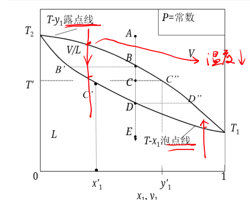
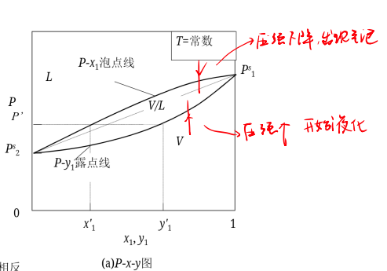

# 非均相系统

## 气液平衡的相图

### 气液平衡的自由度

一个由$N$个组分组成的两相系统,在一定的温度和压力下达到气液平衡,所以,该系统的基本强度性质是温度和压力 $T,p$ ,以及液相组成 $x_1,x_2, \ldots x _{N-1}$ 和气相组成 $y_1,y_2, \ldots y_{N-1}$ (两个组成会有两个约束,所以各少一个自由度),故强度性质的总个数为 $2N$ 个.

根据相律:

$$
F=C-P+2=N
$$

系统总共有N个自由度,所以我们只需要给定N个独立变量就能确定这个系统,但是强度性质的个数是$2N$个,所以剩下的N个自由度会由气液平衡来确定.

### 二组分相图

如果需要一个图,可以描述二组分气液混合的所有结果,根据相律,系统的自由度为$f=2-P+2=4-P$,系统的最小相数为1,所以系统最多需要三个独立变量就能确定这个系统的状态,这无疑需要在三维空间中绘图,但是这样比较麻烦.

我们知道,所有的独立变量为$(T,p,x_1,y_1)$,我们固定其中一个量,通常是固定$T,p$中的一个,然后采用双横坐标,就能够在二维坐标系当中绘制出气液相图.

{width=300px}

横坐标是双横坐标,分别为气相摩尔分数$y_1$和液相摩尔分数$x_1$,但是他们分别只能对应图中的两条线,如图所示上面的是露点线.下面的是泡点线.

#### 露点线

对于任意的摩尔分数,随着温度的下降或者压力的增大出现第一个小液滴的线.

#### 泡点线

对于任意的摩尔分数,随着温度的上升出现第一个小气泡的线.

#### 相图分析

当坐标$(T,y)$位于露点线上方的时候,体系全为气相,横坐标$y$代表1组分的总摩尔分数

当温度继续下降,点$(T,y)$位于露点线上,此时的y恰好就是$y_1$,1组分中全为饱和气相

当点$(T,y)$位于两条线之间,y的意义依旧是总摩尔分数,只不过,这里是气液平衡区,做一条水平直线交露点线和泡点线于两点,对应的横坐标分别是此时气液平衡时的饱和气相摩尔分数$y_1$,以及饱和液相摩尔分数$x_2$,可以根据杠杆原理确定

随着温度的进一步下降,$(T,y)$落到了泡点线上,此时的y恰好就是饱和液相摩尔分数,1组分全为饱和液相.当温度继续下降,1组分变成纯液相.

不难发现,只要给定1的总摩尔分数和温度,根据这张图,我们总能确定$(T,y_1,x_1)$,从而确定整个体系,完成对体系的刻画.

与$T-x-y$图相对的,还有$p-x-y$图,此时的泡点线和露点线在图上的位置要反一下

{width=400}

## 气液平衡计算方法

### EOS法

### EOS+$\gamma$法
