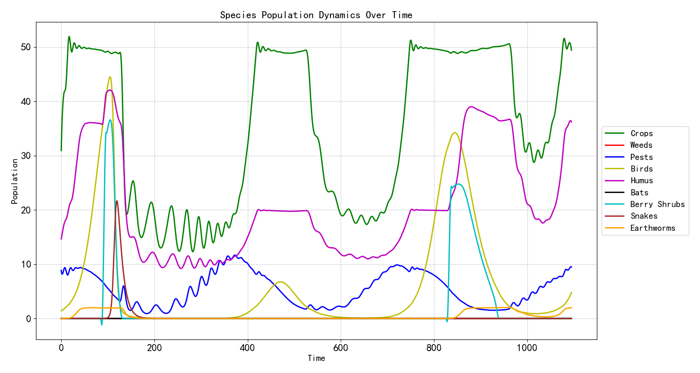
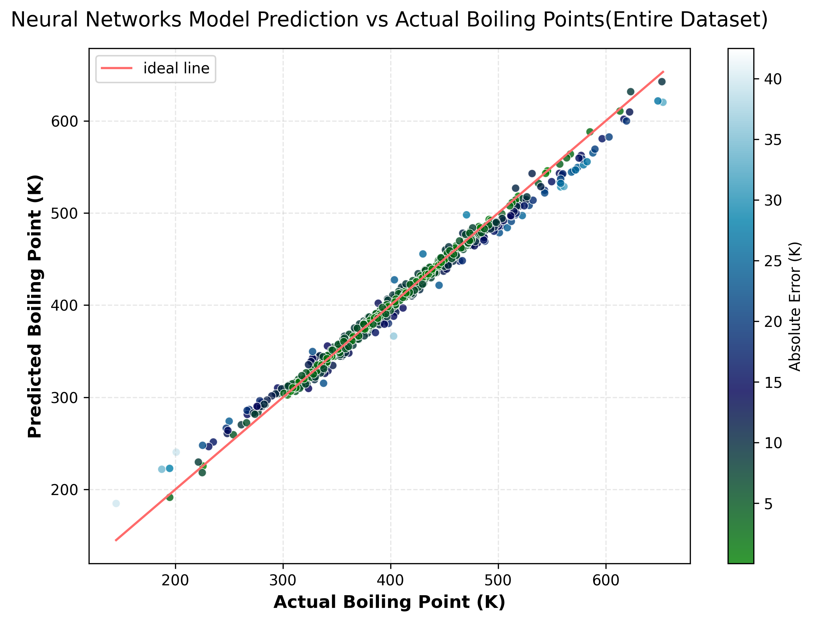
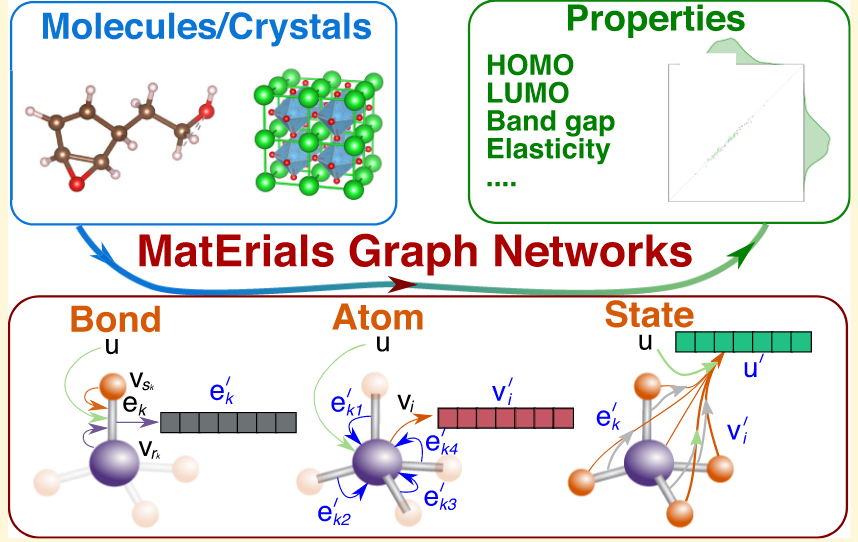
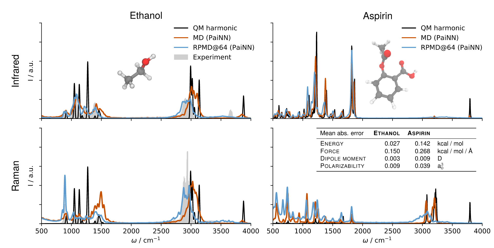
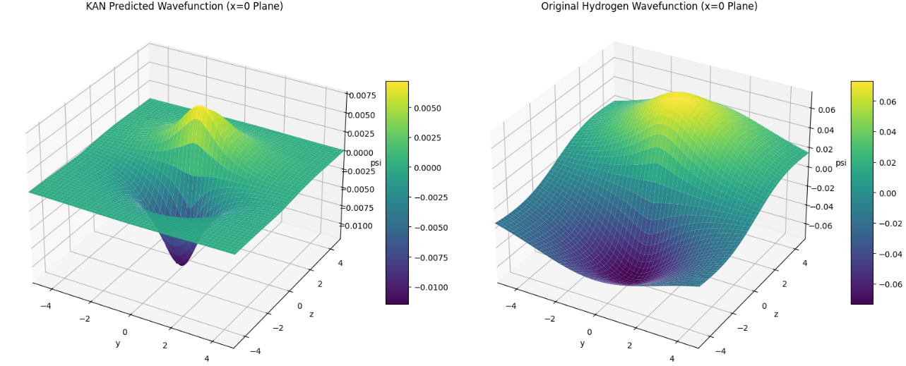
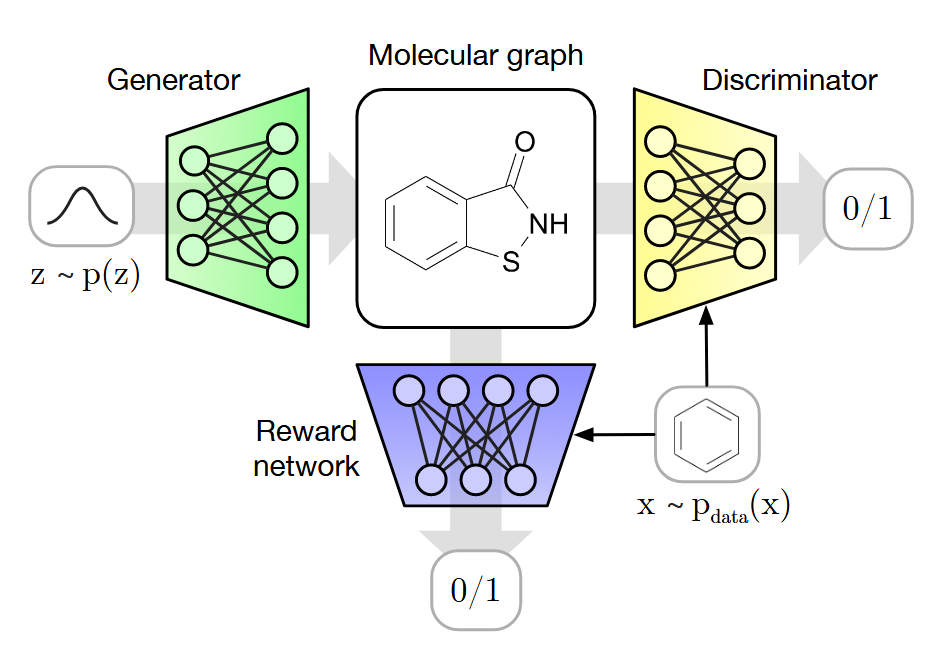
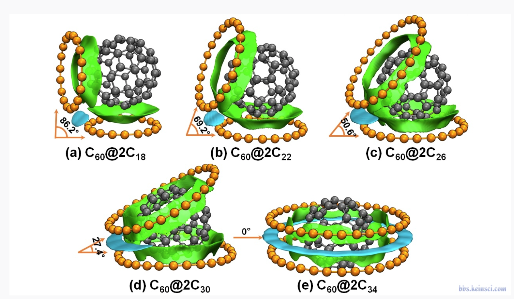
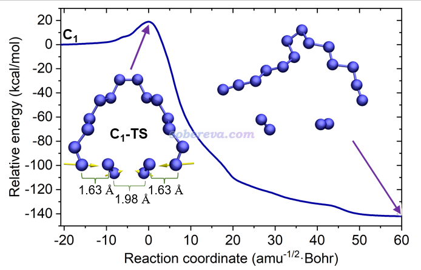
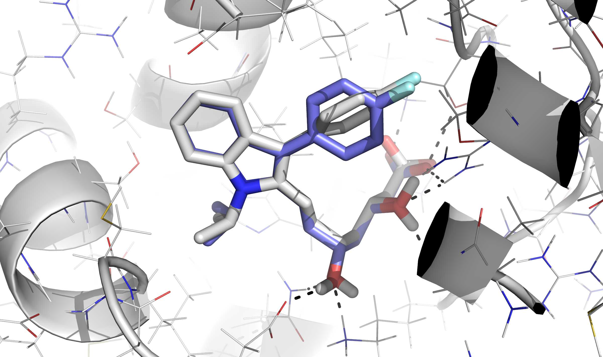

# Welcome to my notebook

欢迎来到我的笔记网站,我是吴健坤,浙江大学化工学院大三在读学生,这个网站是用来记录我平时学习到的大量知识的,其中并不包含化学工程的课程内容,这个网站更多的用来记录我学习的大量跨领域,跨学科的知识内容.

笔记的架构分为三大块:

- 数理知识体系的构建
- AI for Science所需的必备知识
- 理论与计算化学.

## 数理知识体系的构建

我个人没有精力去完整学习成体系的数学知识,所以在数学方面基本上是什么感觉有点用就学什么,未来会增加更多的我觉得能帮得上忙的数学知识.

笔记包含的运筹优化的部分可以允许我们可以很方便的使用多种优化算法去解决很多复杂问题,例如构建一个全国性的仓网优化系统,来帮助企业尽可能的节省成本.

尽管实际问题的情况会更加复杂,但是不可否认的是,这对于我们来说是一个异常强大的工具.

数值方法允许我们求解复杂的微分方程系统而不需要具备任何高深的数学知识,这通常可以使得我们进行肆无忌惮的建模而不用担心求解的问题,当然,如果能得到解析解自然是最好的,可解释性和计算速度永远是解析解的两大优势,但是实际情况往往不遂人愿,应用问题中的大多数微分方程都是没有解析解的.数值方法就允许我们一定程度上掌握这个系统的演化规律,例如,这张图展示了我建立的复杂生态系统的模型的求解结果:

掌握更多的数学知识可以让你更好的面对物理问题以及更好的理解物理世界.虽然掌握数学知识的过程总是那么困难并且枯燥,但是真正应用来解决实际问题的时候又会折服于数学的伟大,这是人类高级逻辑智慧的结晶.

## AI for Science

人工智能的基石即机器学习和深度学习算法,这些算法已经被证明可以在科学领域发挥广泛且深刻的作用,从还原论到涌现论的思想转变不是那么容易的,但是有的时候不得不接受事实,对于某些复杂体系,我们确实没有必要知道发生了什么,而只需要获得一个映射关系,人工智能算法完美符合这个需求,目前已经被广泛应用在化学生物的各个领域.

通过这种几乎无所不能的拟合能力,AI for Science可以让我们更加专注于研究问题本身,而不是被数学所束缚.

我们可以支持灵活构建构效关系,只需要大量的描述符和充足的数据,下图展示了我使用35个分子描述符和583个数据构建的分子沸点预测模型的预测结果:

也可以使用更加先进的特征提取方式从更底层的信息中提取特征,例如基于图的神经网络被证实可以应用于多种数据的有效预测,只不过这种网络往往需要更多数据去训练.

更加先进的不变性或者等变性的几何深度学习网络可以在对分子的电子结构性质实现量子化学水平的预测,这极大的缩短了这些性质的计算成本,例如,我们可以从神经网络水平直接生成分子的拉曼光谱(基于PAINN)

神经网络还被广泛的应用于和物理规律的结合当中,使用神经网络求解PDE也是当下的一个热门的方向,通过在损失函数中加入PDE损失项,我们完全可以让神经网络自主求解偏微分方程而不需要任何数据引导,但是有数据引导的训练过程更容易收敛到正确的解上,这种网络被称为PINN,由于物理规律的融入,我们往往只需要少量的数据就能达到较强的泛化能力,但是训练时间和成本也在一定程度上增加.

||
|:---:|
|利用神经网络拟合氢原子2pz轨道|

基于各种生成模型(GAN,VAEs,Diffsion...)的AI药物研发是当下的一个火热方向,通过适当的奖励机制,算法可以从化学空间中攫取大批量的我们从未见过的分子,并且结合高精度的构效关系,我们可以在初期进行快速的高通量筛选.

下图所示的是一种小分子生成模型--MolGAN

## 理论与计算化学

理论与计算化学是一个交叉学科,它涉及到许多不同的领域,例如分子动力学,量子力学,统计力学,材料科学,化学信息学等等.

无一例外,这些东西都是要算出点什么,然后最终服务于化学的生产实际.得益于数学物理的发展,我们目前已经可以高效,近似的求解多体薛定谔方程,从而给许多化学中的量进行量化的定义.

以量子化学为例,主流的两套方法即post-HartreeFock方法和DFT,前者的上限更高但是计算异常耗时,DFT的出现平衡了计算成本和精度,对一些中小型体系的研究具有非常重要的意义.

基于量子化学方法,我们可以科学的给出反应活性的预测,搜索反应的路径,以及轻松计算大量的物理意义明确的电子结构性质.

||
|:--:|
|富勒烯和十八碳环的弱相互作用分析|

||
|:--:|
|十八氮环的解离过渡态搜索|

更大的体系往往要使用基于分子力场的模拟,力场的参数来源于高精度的量子化学计算,并且通过求解牛顿运动方程获得整个体系随时间的演化,MD在药物研发和生物领域往往具有不可或缺的作用.

||
|:--:|
|分子对接|

