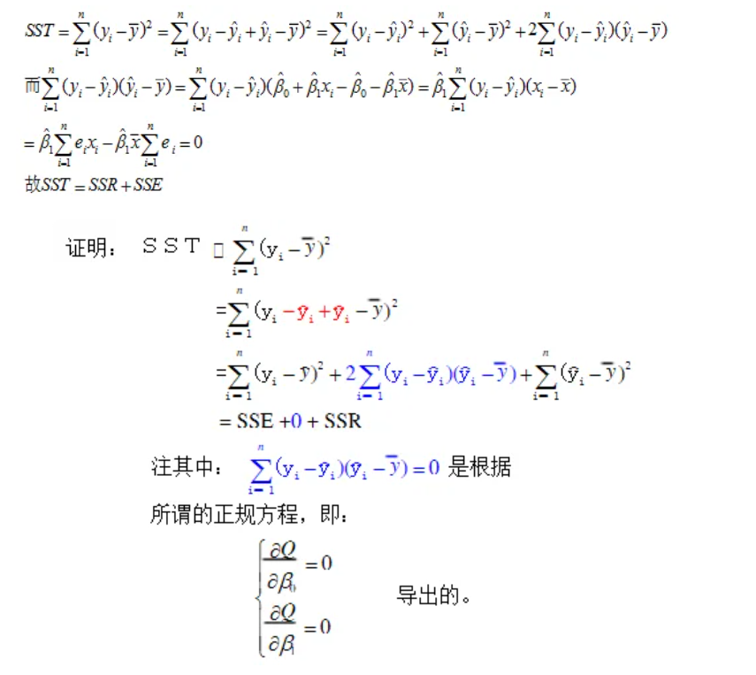

# 回归分析
## 1.1什么是回归分析
回归分析是一种统计分析方式，用于预测一个连续变量与一个或是多个其他变量之间的关系。回归分析通过建立模型来预测因变量（被预测变量）与自变量（预测变量）之间的关系，从而预测被预测变量的值
## 1.2回归分析的多种形式
线性回归、非线性回归、logistics回归等等
## 1.3几种回归的区别
线性回归：假设因变量与自变量之间存在线性关系，即因变量与自变量的关系可以用直线来描述，其通常用于预测数值型变量，如根据房屋面积、房龄等因素预测房价等

非线性回归：假设因变量和自变量之间不存在线性关系，即因变量与自变量的关系需要用更为复杂的函数模型来描述，例如预测某商家的销售额——我们通过分析广告费用、宣传渠道等预测销售额的变化趋势。

logistic回归：常常用于二元分类问题，例如预测某个用户是否会购买某种商品或预测某个患者是否患有某种疾病。该模型往往建立在Sigmoid函数的基础上。该函数可以将任意实数映射到0-1的范围内，表示某事件的概率
## 2.线性回归
### 2.1线性
线性包括了可加性和齐次性
#### 2.1.1可加性
也称作是叠加性，即当函数$f$满足下式

$$
f(x+y)=f(x)+f(y)
$$

则我们称函数f具有可加性
#### 2.1.2齐次性
也称作是均匀性，即当函数$f$满足下式

$$
f(ax)=af(x)
$$

其中a为与x无关的常数，则我们称函数$f$具有齐次性

当函数$f$同时具有可加性与齐次性时，即函数$f$满足

$$f(ax+by)=af(x)+bf(y)
$$

我们称函数$f$为线性函数
### 2.2回归
解决回归问题，实际上就是找到一条线/超平面来拟合这些样本点，使他们之间的误差尽可能的小。我们所构建的不同的线/平面在同一个数据集下对应着不同的误差，我们需要找到使得误差最小的线/超平面，这就是回归的目的。
#### 2.2.1损失函数
如何定量描述我们上面说到的这种误差来确定我们的拟合函数呢？

我们引入损失函数（误差函数）来衡量误差

常用的损失函数有：
* 均方误差MSE：$\frac{1}{m}\displaystyle\sum_{i=1}^m(y_i-\hat{y_i})^2$
* 均方根误差RMSE：$\sqrt{\frac{1}{m}\displaystyle\sum_{i=1}^m(y_i-\hat{y_i})^2}$
* 平均绝对误差MAE：$\frac{1}{m}\displaystyle\sum_{i=1}^m|y_i-\hat{y_i}|$
### 2.2.2回归任务的模型评估方式
R-squared:

$$
R^2(y,\hat{y})=1-\frac{\displaystyle\sum_{i=0}^n(y_i-\hat{y_i})^2}{\displaystyle\sum_{i=0}^n(y_i-\bar{y})^2}
$$

此方式我们可以理解为按照模型预测，比较模型预测和按照平均值预测的比例，此比例越小，那么模型就越精确，即上式越接近1，模型拟合的越好；当该式子出现负数的情况时，说明该模型的预测不如全部按照平均值进行预测（式子值=0）
#### 2.2.3最小化损失函数
我们再一次强调：==回归任务的目的是拟合样本点，使得误差尽可能的小==
#### 2.2.4最小二乘法
##### 2.2.4.1一元线性函数
我们先以一元线性函数为例考虑线性回归，之后再引入多元线性回归
考虑一元线性函数$y=kx+b$，并采用均方误差作为我们的损失函数，则损失函数为关于变量k和b的函数：

$$
L(k,b)=\frac{1}{m}\displaystyle\sum_{i=1}^m((kx_i+b)-y_i)^2
$$

其中，m为样本个数；而我们的回归任务就是找到这个$L(k,b)$函数的最小值。

我们通过求偏导数的方法来求这个函数的最小值。对L函数求b的偏导（过程比较简单不再列出），我们可以求出当偏导为0时有：

$$
k\displaystyle\sum_{i=1}^mx_i+\displaystyle\sum_{i=1}^mb-\displaystyle\sum_{i=1}^my_i=0
$$

即$km\bar{x}+mb-m\bar{y}=0$

即$b=\bar{y}-k\bar{x}$(联系到均值公式)

同样的，我们对L函数求k的偏导，（过程简单省去），则当偏导为0时我们有：

$$
k\displaystyle\sum_{i=1}^mx_i^2+b\displaystyle\sum_{i=1}^mx_i-\displaystyle\sum_{i=1}^mx_iy_i
$$

考虑x均值的情况下此式改写为：

$$
k\displaystyle\sum_{i=1}^mx_i^2+mb\bar{x}-\displaystyle\sum_{i=1}^mx_iy_i=0
$$

结合最小时$b=\bar{y}-k\bar{x}$,我们消去b可以得到：

$$
k(\displaystyle\sum_{i=1}^mx_i^2-m\bar{x}^2)=\displaystyle\sum_{i=1}^mx_iy_i-m\bar{y}\bar{x}
$$

从而我们可也解得

$$
k=\frac{\displaystyle\sum_{i=1}^mx_iy_i-m\bar{x}\bar{y}}{\displaystyle\sum_{i=1}^mx_i^2-m\bar{x}^2}
$$

这样我们就得到了使得该损失函数最小的k，b参数。
##### 2.2.4.2多元线性函数
现在我们将一元变量推广到多元变量，考虑多元函数式为

$$
f(x_1,x_2,\ldots,x_n)=\omega_1x_1+\omega_2x_2+\ldots+\omega_nx_n+b
$$

我们通过线性代数向量概念对该式子进行整理，不妨$\omega_0=b,x_0=1$，那么我们有权重向量$\omega$和特征向量$x$，且

$$
\omega=\begin{pmatrix}\omega_0,&\omega_1,&\omega_2,&\ldots,&\omega_n\end{pmatrix}
$$

$$
x=\begin{pmatrix}x_0,&x_1,&x_2,&\ldots,&x_n\end{pmatrix}
$$

则我们的多元函数可以写成$f(x)=\omega^Tx或f(x)=x^T\omega$
从而我们的损失函数可以写成如下形式:

$$
L(\omega)=\displaystyle\sum_{i=1}^m(y_i-\omega^Tx^{(i)})^2
$$

其中，$y_i$是第i个真实值,$x^{(i)}$第i个样本的特征向量（PS：这里要注意，真实值，标签值和样本值这三个词的意思其实是一样的）

继续，我们希望对式子进行进一步的简化，定义如下：
* 标签向量：将m个样本标签值堆叠成一个标签向量y，$y=(y_1,y_2,\ldots,y_m),
==在线性代数当中，见到一个向量均默认为列向量，转置的才为行向量==
* 样本矩阵X：定义样本矩阵X，形状为(m,n+1)的矩阵，其中有m个样本，n+1个特征（其中第1个特征向量的值均为1）

$$
\begin{pmatrix}1&x_1^{(1)}&x_2^{(1)}&\dots&x_n^{(1)}\\1&x_1^{(2)}&x_2^{(2)}&\dots&x_n^{(2)}\\\vdots&\vdots&\vdots&\ddots&\vdots\\1&x_1^{(m)}&x_2^{(m)}&\dots&x_n^{(m)}\end{pmatrix}
$$

在该矩阵当中，每一行是一个样本，每一列是一个特征(向量)
从而我们可以得到：将样本矩阵与权重向量相乘得到预测值向量$\hat{y}$

即：

$$
\begin{pmatrix}1&x_1^{(1)}&x_2^{(1)}&\dots&x_n^{(1)}\\1&x_1^{(2)}&x_2^{(2)}&\dots&x_n^{(2)}\\\vdots&\vdots&\vdots&\ddots&\vdots\\1&x_1^{(m)}&x_2^{(m)}&\dots&x_n^{(m)}\end{pmatrix}\begin{pmatrix}
\omega_0\\\vdots\\\omega_n    
\end{pmatrix}=\begin{pmatrix}
\hat{y}_0\\\vdots\\\hat{y}_m    
\end{pmatrix}
$$

###### 2.2.4.2.12范数
同时我们还需要借用2范数进行化简，下作介绍：

2范数：向量各个元素的平方和的平方根，即$||x||_2=\sqrt{\displaystyle\sum_{i=1}^nx_i^2}$

其中|| ||是范数符号，下标2表示为2范数，其有以下特性：
$x^Tx=||x||_2^2=\displaystyle\sum_{i=1}^nx_i^2$

又，此时我们的损失函数已经简化为如下形式：$$L(\omega)=||X\omega-y||^2$$

==注意矩阵和向量的形状及大小==

由上我们最新化简的形式：

$$
L(\omega)=||X\omega-y||^2=(X\omega-y)^T(X\omega-y)\\=(\omega^TX^T-y^T)(X\omega-y)\\=\omega^TX^TX\omega-\omega^TX^Ty-y^TX\omega+y^Ty\\=\omega^TX^TX\omega-2\omega^TX^Ty+y^Ty
$$

这里我们运用到了一些矩阵的性质：
* 矩阵乘法的分配率
* $y^TX\omega$的结果是一个实数，且由于一个实数的转置就是其本身，我们有$\omega^TX^Ty=(y^TX\omega)^T=y^TX\omega$
* 转置的运算性质

通过我们化简得到的最终形式，我们对损失函数$L(\omega)$进行求$\omega$的偏导，即：

$$
\frac{\partial{L(\omega)}}{\partial{\omega}}=\frac{\partial{(\omega^TX^TX\omega-2\omega^TX^Ty+y^Ty)}}{\partial{\omega}}\\=\frac{\partial{(\omega^TX^TX\omega)}}{\partial{\omega}}-2\frac{\partial{\omega^TX^Ty}}{\partial{\omega}}+0\\=2X^TX\omega-2X^Ty
$$

此处我们用到了一些矩阵求导的相关公式：
* $\frac{\partial{(X^TAX)}}{\partial{X}}=AX+A^TX$
此处我们将$X^TX$视作一个整体
* $\frac{\partial{(X^Ta)}}{\partial{X}}=\frac{\partial{(a^TX)}}{\partial{X}}=a，其中a为常数向量$
  
最终，我们考虑此损失函数的偏导数为零，我们就可以得到：
$\omega=(X^TX)^{-1}X^Ty$

也就是得到了我们最终要的权重向量结果

## 3.逐步回归
### 3.1什么是逐步回归
逐步回归是回归分析中一种筛选变量的过程，我们可以使用逐步回归从一组候选变量中构建回归模型，让系统自动识别出有影响的变量。

* 逐步回归法的基本思想是将变量逐个引入模型，每引入一个解释变量后都要进行F检验，并对已经选入的解释变量逐个进行t检验，当原来引入的解释变量由于后面解释变量的引入变得不再显著时，则将其删除。以确保每次引入新的变量之前回归方程中只包含显著性变量。
* 逐步回归法可以认为是向前引入法与向后剔除法的综合。逐步回归法克服了向前引入法与向后剔除法的缺点，吸收两种方法的优点。逐步回归法是以向前引入为主，变量可进可出的变量选取方法。它的基本思想是，当被选入的变量在新变量引入后变得不重要时，可以将其剔除，而被剔除的变量当它在新变量引入后变得重要时，又可以重新选入方程。
* 逐步回归分析是多元回归分析中的一种方法。回归分析是用于研究多个变量之间相互依赖的关系，而逐步回归分析往往用于建立最优或合适的回归模型，从而更加深入地研究变量之间的依赖关系。

依据上述思想，可利用逐步回归筛选并剔除引起多重共线性的变量，其具体步骤如下：先用结果变量对每一个所考虑的预测变量做简单回归，然后以对结果变量贡献最大的预测变量所对应的回归方程为基础，再逐步引入其余预测变量。经过逐步回归，使得最后保留在模型中的解释变量既是重要的，又没有严重多重共线性。

对逐步回归，我们有三种实现策略，一般为第三种：
1. 正向选择：从模型中没有预测因素开始，反复添加最有帮助的预测因素，直到没有显著的预测变量选入回归方程 。
2. 向后选择（向后消除）从完整模型（即包含所有可能预测变量的模型）中的所有预测变量开始，以迭代方式删除贡献最小的预测变量，直到没有不显著的预测变量从回归方程删除。
3. 逐步选择（顺序替换）这是向前和向后选择的组合。您从没有预测变量开始，然后顺序添加最有贡献的预测变量（例如正向选择）。添加每个新变量后，删除所有不再改善模型拟合的变量（例如向后选择），直到既没有显著的预测变量选入回归方程，也没有不显著的预测变量从回归方程中剔除为止。

注意：
* 正向选择和逐步选择可以应用在高维数据情况下，即样本数量n小于预测变量p的数量，例如在基因组领域，全基因组数量远大于测试人群。
* 向后选择要求样本数n大于变量p数，以便可以拟合整个模型。

## 4.从普通线性回归到广义线性回归

### 4.1普通的线性回归模型：
* 回归的最初含义——回归到均值，这就是回归模型的本质

往往用于三种场景：
* 描述自变量和因变量的因果关系，即数据产生的某种机制。
* 因变量的因果关系，即数据产生的某种机制。
* 得知自变量和因变量的关系后，应用新数据得到预测结果。

线性回归的模型往往需要满足数据的正态分布假设

### 4.2广义线性模型和狭义线性模型

广义线性模型旨在解决普通线性回归模型无法处理因变量离散，并发展能够解决非正态因变量的回归建模任务的建模方法。

在其框架下：**因变量不再要求连续、正态，当然自变量更加没有特殊的要求。能够对正态分布、二项分布、泊松分布、Gamma分布等随机因变量进行建模**

广义线性模型是普通线性模型的普遍化，如果把前述的普通线性回归模型称为狭义线性模型，那么它就是广义线性模型中因变量服从正态分布的特例

而事实上，对于正态分布、二项分布、泊松分布、Gamma分布等都有一个共同的特点：它们都可以写成一致的指数统计表达式，所以称为指数分布族，其统一的概率分布如下：

$$
p(y|\theta,\phi)=exp(\frac{y\theta-b(\theta)}{\phi}+c(y,\phi))
$$

## 5.非线性回归

实际例子当中变量之间的关系并不会如线性回归当中的那么简单，基本是非线性的，这个时候我们就要考虑非线性的回归方式。

### 5.1可化为线性回归的曲线回归
对于部分非线性回归，如果我们对它进行还原，它就又会变成线性关系，如下：

$$
y=\beta_0+\beta_1e^x+\epsilon
$$

其元素$e^x$是非线性的项，但是我们只需要将其进行$z=e^x$的还原，即可将此非线性模型转换为一个关于$z$的线性模型

但有一个点要注意，非线性回归可不只是自变量非线性，其误差可能也是非线性的。如下方程：

$$
\begin{cases}
y=ae^{bx}e^\epsilon\\
y=ae^{bx}+\epsilon
\end{cases}
$$

上面方程组当中，第一个式子带的误差项我们叫做乘性误差项，第二个式子择交加性误差项。

如果我们不考虑带来误差的$\epsilon$项，那么其实上面的两个式子其实是有的。

而我们的线性模型在处理误差项是，遇到的均是加性误差项。所以当我们想要从一个乘性误差项得到加性误差项时，我们就需要取对数。即对第一个式子，我们有：

$$
lny=lna+bx+\epsilon
$$

而相对应的第二个式子我们只需要进行前述的换元操作

我们需要注意的是，当误差项不同时，如：当我们的误差项是$e^\epsilon$时，我们已经默认了数据$lny$是等方差；当我们的误差项是$\epsilon$时，我们已经默认了数据$y$是等方差的，因此乘性误差项拟合的结果一定程度上会淡化因变量值较大的数据的作用，而会对因变量值较小的数据作用加强。
（这里我们误差项不同对应的条件我们称作G-M条件）

但是在一般情况下，我们是不会写出误差项的——所以除非是特别制定，我们无需考虑误差项，按照正常方法换元即可。

还有一个比较常见的函数——从曲函数，即：

$$
y=\frac{x}{ax+b}
$$

对于此函数，可以通过两边取倒数，得到：

$$
\frac{1}{y}=a+b\frac{1}{x}
$$

类似的，我们还可以将S形曲线$y=\frac{1}{a+be^{-x}}$换元，使其变为线性函数

还有一种比较常见的非线性回归——多项式回归。其回归模型是一个多项式（是允许有交叉项的）。比方说二次项$x^2$，我们换元为$x_2$即可。

要注意的是，在实际情况下，由于三次以上的方程在解释性上就会出现很大的困难，所以我们不会再采用三次以上的多项式回归模型。
### 5.2一般非线性模型
其实非线性模型与线性模型相近：

$$
y_i=f(x_i,\theta)+\epsilon_i，i=1,2,\dots,n
$$

其中的残差满足G-M条件。$\displaystyle\left\{x_i\right\}$并非是随机向量。而其中的$\theta$就是我们要估计的未知参数向量。注意在一般的非线性模型中，参数的书目和自变量的书目没有一定的对应关系

如果我们依旧用最小二乘法进行估计，那么我们需要求解的方程即位：

$$
\frac{\partial{Q(\theta)}}{\partial{\theta_j}}=-2\displaystyle\sum^n_{i=1}[y_i-f(x_i,\theta)]\frac{\partial{f}}{\partial{\theta_j}}=0
$$

但是此表达式并不一定有解析解，所以需要使用一些计算方法的知识

事实上，非线性模型只能做一些概述，因为理论的完备性性和线性模型相比要差很多。比方说：平方和分解式$SST =SSR+SSE$不再成立。但是我们还是定义非线性回归的相关指数（也就是线性回归中的复决定系数）为：

$$
R^2=1-\frac{SSE}{SST}
$$

其中：
* SST表示的是总平方和，为$\displaystyle\sum_{i=0}^n(y_i-\bar{y})^2$
* SSR表示的是回归平方和，为$\displaystyle\sum_{i=0}^n(\hat{y_i}-\bar{y})^2$
* SSE表示的是误差平方和，为$\displaystyle\sum_{i=0}^n(y_i-\hat{y_i})^2$

上述等式的证明如下图：

### 5.3最小二乘法的缺陷
最小二乘法的优化函数一般都是一个二次函数，但是它并不是完美的。最突出的就是它的不稳定性。之前也说过，如果出现了一个异常值，那么回归直线就会发生很大的变化。

不过现代统计中也是有很多其余的替代方案。比方说设置目标函数形式为：

$$
Q(\theta)=\displaystyle\sum_{i=1}^n|y_i-f(x_i,\theta)|
$$

这个函数就没那么容易求极值点了，只能通过数值方法来做。当然了，还可以使用诸如最小绝对值法等更加稳健的方法来做。我们不再涉及更多的细节。

### 5.4计量经济学中常用的三大非线性模型
此处的三大回归函数都是与对数有关的函数。把它们用对数形式拟合之后，回归系数就会有不同的解释含义，很多时候在经济研究中会带来方便。

1. ==线性对数模型==：$Y=\beta_0+\beta_1lnX$

我们考虑其两边各加微元。则：$Y+\Delta Y=\beta_0+\beta_1ln(X+\Delta X)$

此式与上式做减法，并运用常见的估计式$ln(x+1)\approx x$我们就可以得到：$\Delta Y\approx\beta_1\frac{\Delta X}{X}$

我们注意到这里$\frac{\Delta X}{X}$是量的比例变化。从而我们可以得到自变量与因变量的近似变化关系

2. ==对数线性模型==：$lnY=\beta_0+\beta_1X$

同样的给两边进行加微元的处理，我们可以得到同理的估计式：

$$
\frac{\Delta Y}{Y}\approx \beta_1\Delta X
$$

这也同样刻画了自变量和因变量之间的关系
3. 对数对数模型，即：$lnY=\beta_0+\beta_1lnX$。

我们用同样的微元处理可以得到

$$
\frac{\Delta Y}{Y}\approx \beta_1\frac{\Delta X}{X}
$$

从而我们依旧可以得到因变量和自变量之间的变化关系

### 5.5含有定性变量的回归模型
定性变量定义：根据分类取值的变量

#### 5.5.1几个常见的定性变量例子

我们通过各种例子来说明它的处理方法。我们比方说研究粮食产量和施肥量之间的关系，那么气候问题自然是一个影响因素，应该被视为一个自变量。但是气候的这个自变量并不是一个连续变量，它只有两种类别：正常，干旱。那么这个时候如果要数量化，就是定性变量，因为它只有两个值0或1。

这里我们假设$D_1$是此定性变量，并假设$D_1=1$表示气候干旱，$D_1=0$表示气候正常，并且假设粮食产量的回归模型为：

$$
y=\beta_0+\beta_1x_1+\beta_2D_1+\epsilon
$$

这个时候我们只需要对$D_1$进行分类讨论，就可以进行研究，并不需要带入$D_1$进行相应的参数估计，而是在两种情况下分别对两种数据进行回归，然后用这个模型的形式去拟合。

我们不难发现两种情况的差别正好是$\beta_2$因此两种数据得到的两种模型的截距项的差，就可以理解为这个定性变量的量化影响。

这是一个定性变量的问题，如果问题再复杂一些，比方说时尚衣物的销售额一般会受季节影响，那么这个时候肯定在每一个季节对应的影响不一样。那么这个时候对应四个季节，就可以给定四个0-1变量。比方说是夏季，那么你就设置夏季的定性变量值为1，其余的为0就行。数学上来说就是下面的设置。

$$
\begin{cases}
x_1=1&spring\\
x_1=0&others
\end{cases}\\
\begin{cases}
x_2=1&summer\\
x_2=0&others
\end{cases}\\
\begin{cases}
x_3=1&autumn\\
x_3=0&others
\end{cases}\\
\begin{cases}
x_4=1&winter\\
x_4=0&others
\end{cases}
$$

但是这个模型会产生新的问题，就是你不能四个变量都引入模型。因为一年的每一天都必定属于某一个季节，所以一定会有$x_1+x_2+x_3+x_4=1$,这样就会出现完全多重共线性。

所以对于这个例子，你要去掉一个自变量，保留3个。比方说我去掉“春天”这个变量，那么当剩下的三个自变量都是取0的情况下，就代表了春天的情况。

同样的，用上面的一样的方法，你也可以明白每一个回归系数对应的含义，这里不再赘述。

还是上面那个销售量的问题，数据处理中，如果我们发现数据量基本上是一个线性关系，但是在生产量$x=500$时，直线的斜率发生了巨大的变化，那如何拟合模型呢？

直观上，如果斜率发生了变化，应该说明，在$x=500$时，有一种不明的力量使得回归模型发生了变化，因此我们应该用一个0-1定性变量来描述这种“不明的力量”。具体来说，模型应该写成：

$$
y=\beta_0+\beta_1x_1+\beta+2(x_1-500)D1+\epsilon
$$

这个$\beta_2$就相当于是描述了这种不明力量的影响程度

类似的，根据定性变量的定义，我们可以把上面的式子理解为下面这个

$$
\begin{cases}
E(y)=\beta_0+\beta_1x_1(x_1\leq500)\\
E(y)=(\beta_0-500\beta_2)+(\beta_1+\beta_2)x_1(x_1>500)
\end{cases}
$$

然后分两组拟合模型并得出各个系数再进行解释

#### 5.5.2回归系数相等检验（例子说明）
我们引入一个研究家庭年收入和储蓄增加额关系的例子。这个例子中需要有一个定性变量就是学历。学历的高低显然会影响家庭的年收入，进而影响储蓄增加额，就像知乎人均985，知乎人均30W一样。那么这个时候，如果你想检验学历的高低是否会使得单位家庭年收入对储蓄增加额的影响发现显著的变化（直观感觉，高学历的人应该更会理财，因此储蓄量应该会高一些），应该怎么办呢？

我们考虑之前的模型：

$$
y=\beta_0+\beta_1x_1+\beta_2D_1+\epsilon
$$

考虑用$D_1$来表示学历。但是事实上并非是如此的。

在我们的公式当中$D_1$的变化影响的仅仅是截距项而并非是系数，这与实际的学历影响情况是不符的。所以我们需要让$D_1$在家庭年收入$x_1$之前出现——从而引出含有交互效应的回归模型：

$$
y=\beta_0+\beta_1x_1+\beta_2D_1+\beta_3D_1x_1+\epsilon
$$

这个时候$D_1$取1，就可以使得$x_1$的斜率多了一个$\beta_3$，因此如果要观察它对家庭年收入截距的影响，就检测$\beta_3$即可，然后就回到了我们之前的内容。

#### 5.5.3因变量是定性变量的回归模型
考虑如下模型：

$$
y=\beta_0+\beta_1x_1+\epsilon
$$

其中$y$是定性变量。这个时候用这个模型直接做最小二乘回归就会出现巨大的问题。首先右边的变量是连续型的话，左右根本就不可能相等。其次右边这个是一个线性函数，那么在定义域是全体实数域的情况下，这个函数的值域也是实数域，根本就没办法限制在$[0,1]$之内。

我们考虑这个模型的期望：

$$
E(y)=\beta_0+\beta_1x_1
$$

既然$y$是一个定性随机变量，这就说明它服从一个伯努利分布。那么我们设

$$P(y=1)=\pi,P(y=0)=1-\pi
$$

这样我们就得到了$E(y)=\pi$

这就说明了如果$y$衡量了一个伯努利事件，那么这个回归模型的右端实际上就衡量了这个事件成功的概率。因此它的意义就明显了。

虽然回归的意义明显，但是要做回归，需要满足三大假设——但此时的误差项明显不再是连续变量了

而我们注意到：

$$
D(\epsilon_i)=D(y_i)=\pi_i(1-\pi_i)=(\beta_0+\beta_1x_i)(1-\beta_0-\beta_1x_i)
$$

这与$x_i$是有关系的，从而无法满足同方差性

PS回归模型的三大假设：

* 零均值假定：随机扰动的误差项的期望或是均值为0
* 同方差性：随机扰动误差项互不相关且服从正态分布，且其方差应该是一个常数，且不随观测值的变化而变化
* 随机扰动的误差项与解释变量互不相关，且各解释变量之间相互独立 

## 6.logistic回归
为了解决非线性回归当中的部分问题，提出此著名的逻辑斯蒂回归模型，其形式为：

$$
f(x)=\frac{e^x}{1+e^x}=\frac{1}{1+e^{-x}}
$$

事实上这就是Sigmoid函数，其值域是（0,1）。

我们在之前的非线性回归当中说到过$E(y)=\pi$，事实上还有一种理解的方式就是$y_i=1$在总体当中的比例。运用这个思路，我们可以使用$y=1$的比例来代替因变量$y$本身做回归，==这样的话一定程度上就可以解决因变量是离散变量带来的一系列问题。==

### 6.1分组logistic回归
研究一个买房的问题。我们知道买房子的人如果按照年收入分类，其实可以分为很多很多类，如果我们要研究不同类中的买房子的人占来售楼处看房子的人的比例，那么应该如何处理呢？

我们考虑去拟合一个每组都使用的模型：

$$
p_i=\frac{exp(\beta_0+\beta_1x_i)}{1+exp(\beta_0+\beta_1x_i)},\quad i=1,2,\dots,c
$$

其中c为分组数据的组数，$x_i$为对应组的家庭年收入。对此，我们只需设：

$$
p_i^,=ln(\frac{p_i}{1-p_i})
$$

就可以得到：

$$
p_i^,=\beta_0+\beta_1x_1+\epsilon
$$

到此为止，我们算是解决了离散性和值域的问题，但是异方差性还没有解决。

那么此时我们可以考虑加权最小二乘法。相关性告诉我们，当$n_i$较大的时候，$p_i^,$的近似方差为为$\frac{1}{m_i\pi_i(1-\pi_i)}$。因此把$\pi_i$用估计值代入，可以得到我们的权值：

$$
\omega_i=m_ip_i(1-p_i)
$$

其中每一个$n_i,p_i$，分别为对应组的值个数和观测比例。

### 6.2未分组logistic回归
上述情况相当于是在分组情况下的回归。那么我们需要考虑未分组数据的logistic回归模型。

所谓未分组，就是只有一个组，那么就只有一个定性因变量和一系列对应的自变量。上面使用了加权最小二乘估计来拟合模型，但是这个地方只有一个组的$y=1$的比例的数据（因为这里的样本的因变量都是定型变量值，并且没有分组），所以就不能够使用上面的方法拟合参数了。这里我们使用极大似然估计来估计参数。

设$y$的均值为$\pi$，并且我们假设有一组观测值（$x_{i1},\dots,x_{ip};y_i$）。由此假设，我们在一般情况下，结合回归的定义，可以得到一组关系;

$$
E(y_i)=\pi_i=f(\beta_0+\beta_1x_{i1}+\dots+\beta_px{ip})
$$

由于这种模型规定的值域，一般认为这里的$f$是一个一元连续性随机向量的分布函数。不同的分布函数就可以得到不用的模型。logistic的回归模型也算其中一个，但代入后会得到一个比较长的式子

由此，相当于每一个$y_i$服从了一个均值为$\pi_i$的伯努利分布。那么其概率还是可以写成：

$$
P(y_i)=\pi_i^{y_i}(1-\pi_i)^{1-y_i}
$$

那么代入每一个样本，就可以得到其似然函数：

$$
L=\displaystyle\Pi^n_{i=1}\pi_i^{y_i}(1-\pi_i)^{1-y_i}\\ lnL=\displaystyle\sum^n_{i=1}[y_iln\frac{\pi_i}{1-\pi_i}+ln(1-\pi_i)]
$$

我们刚刚说的要把logistic回归的函数形式代入，即：

$$
\pi_i=\frac{exp(\beta_0+\beta_1x_{i1}+\dots+\beta_px_{ip})}{1+exp(\beta_0+\beta_1x_{i1}+\dots+\beta_px_{ip})}
$$

代入上述对数表达式，结合计算数值方法进行估计（使得值最大）
### 6.3多类别logistic回归

此回归类型，有k个类别的因变量，对应的数值记为：$1,2,\dots,k$。类比之前因变量是0-1变量的情形，我们可以考虑对其用回归模型，计算其落在每一组的概率。

给定样本数据$(x_{i1},\dots,x_{ip};y_i),i=1,2,\dots,n$,那么显然要拟合在不同组的概率，我们就需要不同的回归系数，所以多类别logistic回归模型先定义为：

$$
\pi_{ij}=\frac{exp(\beta_{0j}+\beta_{1j}x_{i1}+\dots+\beta_{pj}x_{ip})}{exp(\beta_{01}+\beta_{11}x_{i1}+\dots+\beta_{p1}x_{ip})+\dots +exp(\beta_{0k}+\beta_{1k}x_{i1}+\dots+\beta_{pk}x_{ip})}
$$

这事实上就是类比了sigmoid函数（$e^0=1$）。此处表示第i组样本的因变量$y_i$取第j个类别的概率，注意分母中每一项对应的自变量列表都是给定的那一组自变量。

但是这个模型是有问题的。当我们给每个回归系数增加一个常数时，我们得到的$\pi_{ij}$是不变的。所以为了破坏这种齐次性，我们把分母的第一项的系数全部人工设为0，那么模型就变成了；

$$
\pi_{ij}=\frac{exp(\beta_{0j}+\beta_{1j}x_{i1}+\dots+\beta_{pj}x_{ip})}{1+exp(\beta_{02}+\beta_{12}x_{i1}+\dots+\beta_{p2}x_{ip})+\dots +exp(\beta_{0k}+\beta_{1k}x_{i1}+\dots+\beta_{pk}x_{ip})}
$$

从而形成了与之前sigmoid函数形式相同的情况。事实上，这就是：

$$
ln\frac{P(y_i=j)}{P(y_i=1)}=\beta_{0j}+\beta_{1j}x_{i1}+\dots+\beta_{pj}x_{ip}
$$

当然了，因为它还是属于未分组类型的Logistic回归，所以我们还是要使用极大似然估计和数值方法来解决这些问题。其对应的似然函数为：

$$
L(\beta|y)=\frac{\Pi^n_{i=1}\Pi^q_{j=1}exp\left\{(\beta_{0j}+\beta_{1j}x_{i1}+\dots+\beta_{pj}x_{ip})I_{\left\{y_i=j\right\}}\right\}}{[1+\sum^n_{l=1}exp\left\{\beta_{0l}+x_{i1}\beta_{1l}+\dots+x_{ip}\beta_{pl}\right\}]^n}
$$

其中$I\left\{y_i=j\right\}$是其分布的特征函数，即当大括号内式子成立时函数值为1，不成立时函数值为0

### 6.4因变量是顺序数据的回归模型

顺序变量的意思就是，我们把每一种绩点的情况对应一下，分为几类，60-的为第一类，60-63的为第二类，64-67的为第三类，依次往上。可以看出，给定了一些范围后，“分数”这个连续性的变量就可以通过这样的规定转为了一个离散型的定性变量。这种变量我们叫顺序变量。

用数学的方式来说，就是认为一个连续型随机变量$Y^*$和$p-1$个门限值$\theta_1<\dots<\theta_{p-1},$对应关系为：

$$
Y=l\Leftarrow\ \Rightarrow \theta_{l-1}\leq Y^*<\theta_l
$$

并约定$\theta_0=-\infty,\theta_p=+\infty$

我们这里添加一个线性模型的假设，即连续型随机变量,即连续型随机变量$Y^*$服从一个线性模型，如果有线性性的假设，我们就可以把模型写成$Y^*=x^,\beta+\epsilon$的形式

这里有个地方需要强调一下，我们的残差不一定再符合正态化的条件了。所以这种情况我们需要人为假定它的密度函数，即需要假设：

$$
\epsilon \sim f(\epsilon)
$$

那么这个时候有

$$
\epsilon=Y^*-X\beta\sim f(y-X\beta)
$$

这里的$f$是我们假设的$\epsilon$的密度函数的形式。积分可得：

$$
P(Y=l)=\displaystyle\int^{\theta_l}_{\theta_{l-1}}f(y^*-x\beta)dy^*=F(\theta^l-x^,\beta)-F(\theta^{l-1}-x^,\beta)
$$

因为$x\beta$这一项不是随机变量，所以不会影响$y^*$的分布函数形式，因此还是可以这么积分的

那么如果要对这样的模型做回归，也是一样需要极大似然估计的，对应的似然函数为

$$
L(\theta,\beta)=\Pi_{i=1}^n\left\{F(\theta_{y_i}-x_i^,\beta)-F(\theta_{y_{i-1}}-x_i^,\beta)\right\}
$$

其中$\theta=(\theta_1,\dots,\theta_{k-1})$

$Y^*$本身是一个连续型的随机变量，也可以通过线性模型去拟合。但是我们更多的是希望关注它落到某一类的概率。从而根据上面推导，我们需要$Y^*$的密度函数或者分布函数，不然没有办法做极大似然估计。

但我们已知$\epsilon$的密度函数或者分布函数，所以就可以根据它得到$Y^*$的密度函数，而 $Y^*$的密度函数的要求又正好符合我们之前讨论的Logistic回归的内容，所以这样的话，就有一些显式的表达式代入到上面，可以一定程度上简化问题。

