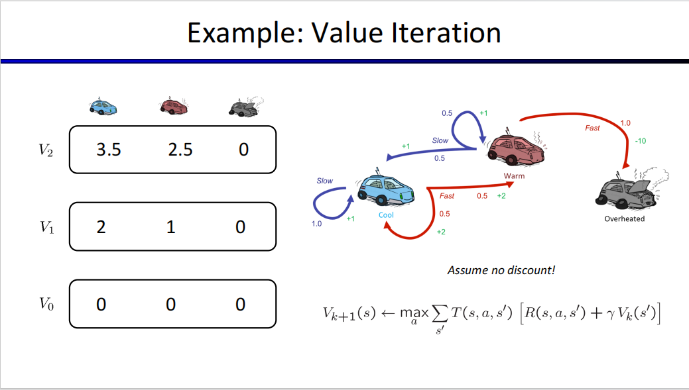

# 马尔科夫模型

## 马尔科夫预测
### 1.1 基本概念
马尔科夫预测法是根据事件的目前状况来预测其将来各个时刻变动状态的方法
### 1.2 状态转移
### 1.2.1状态转移过程
状态是重要术语——某时刻出现的某种结果——如人口的中老年状态。

状态转移：一种状态到一种状态；随时间变化而出现的状态转移，或是两者之间的关系——称为状态转移过程 
### 1.2.2状态转移概率
#### 1.2.2.1状态转移概率
一种状态到另一种状态的概率，及$P_{Ej \rightarrow Ei}$，或根据条件状态的定义，这等价于$P_{Ej/Ei}$
#### 1.2.2.2概率矩阵
$P_{ij}$为从状态Ei到状态Ej的概率，那么对i，j从1到n，可以构成对应的转移概率矩阵如

$$
\begin{bmatrix}P_{11}&P_{12}\\
P_{21}&P_{22}\\\end{bmatrix}
$$

且这些概率满足0-1的取值范围和和为1的性质

当矩阵当中的所有P均>0时，矩阵为标准概率矩阵；当矩阵为标准矩阵时，我们可以证明存在非零向量$\alpha$,可以使得

$$ 
\alpha P=P
$$

我们称这样的向量为平衡向量

计算状态转移概率矩阵即计算其每一个转移概率的情况（往往用频率代替概率）

### 1.3 马尔科夫预测法
为了运用此预测法队事件发展过程中状态出现的概率进行预测，需要再介绍一些
#### 1.3.1 状态转移概率 $\pi_j(k)$
##### 1.3.1.1 定义
状态转移概率$\pi_j(k)$表示时间在初始（k=0）状态为已知条件下，经过k此状态转移后，第k个时刻处于$E_j$的概率
#### 1.3.1.2 表示方法
事实上，我们将经历k次转移考虑未从（k-1）次所在的状态$E_i$再转移到第k次所在的状态$E_j$，（其中i=1,2，3，4$\ldots$），那么显然，我们可以根据马尔科夫过程的无后效性和Bayes公式，可以得到

$$
\pi_j(k)=\displaystyle\sum_{i=1}^n\pi_j(k-1)P_{ij}(j=1,2,\ldots,n)
$$

同样，由状态概率的性质我们不难得到：

$$
\displaystyle\sum_{i=1}^n\pi_j(k)=1
$$

考虑状态概率行向量

$$
\pi(k)=\begin{bmatrix}\pi_1(k),&\pi_2(k),&\ldots,&\pi_n(k)\end{bmatrix}
$$

结合前述公式和状态转移概率矩阵我们可以得到：

$$
\pi(k)=\pi(k-1)P=\ldots=\pi(0)P^k
$$

其中P即为状态转移概率矩阵，$\pi(0)$为初始状态概率向量

所以只要我们知道0时刻的状态和状态转移概率，我们就可以对第k时刻的状态转移概率进行预测，从而知道第k个时刻处于$E_j$状态的概率是多少
#### 1.3.2 终极状态概率预测
##### 1.3.2.1 定义
经过无穷多次状态转移后所得到的状态概率被称为终极状态概率或是平衡状态概率。

事实上这是一个比较普遍的规律，当转移概率确定时，不断地递归会导致状态转移概率$\pi\rightarrow$一个稳定的值。
##### 1.3.2.2性质
我们考虑此平衡状态概率向量

$$
\pi=\begin{bmatrix}\pi_1,&\pi_2,&\ldots,&\pi_n\end{bmatrix}$$

则我们可以有

$$
\pi_i=\displaystyle\lim_{k\rightarrow\infty}\pi_i(k)
$$

这对$k\rightarrow\infty$时都是适用的

而我们注意到：

$$
\pi(k+1)=\pi(k)P
$$

那么对于$k\rightarrow\infty$的情况，我们有：

$$
\pi(k+1)=\pi(k)
$$

那么在P已知的情况下我们可以解出平衡状态转移概率$\pi$（前面定义的向量）

OK了老铁们这markov的学习先到这里，有个大致概念即可，个人认为重要的在于模型的转化而不是模型的计算

## 2.马尔科夫选择优化
本块内容来自于《人工智能与物联网》英文课件，由陈家申本人粗鄙的认识改写

本块内容主要针对一个公式，通过一个实例进行阐述

我们先给出这一块内容的主要公式：

$$
V_{k+1}(s)=\displaystyle \max_a\sum_{s^,}T(s,a,s^,)[R(s,a,s^,)+\gamma V_k(s^,)]
$$

在这个公式当中，我们需要明确几个量的定义：
* $V_{k+1}(s)$表示的是，转移到第k+1次时所处在的s状态对应的值（其中V表示的是value）
* a表示的是进行转移的操作，而$\displaystyle\max_a$则是表示对所有的转移操作当中找出使得值最大的操作a
* $s^,$表示的是第k次转移，即前一次转移时的状态
* $T(s,a,s^,)$表示的是，从s’通过a操作转移到s的概率
* $R(s,a,s^,)$ 表示的通过这一次转移所能够获得的值
*  $\gamma$表示的是对上一个状态值的削减——即discounting——相当于是打折，也表示着上一状态对下一转移状态的影响

下面我们再通过一个实例进一步了解马尔科夫模型对决策操作选择的优化：

针对此例，我们将上述的定义带入：
* 箭头表示可能得状态转移
* 箭头处的数字表示相应的转移概率和转移所能够获得的值
* 此例当中我们定义$\gamma$为0，即不存在相应的discount

则我们对此例按照上述定义进行计算，即可通过上述公式的选择，选择最优的操作，从而的到下一步转移所能具备的最大值

其实这一块的目的，就是通过马尔科夫模型来对进行的操作做筛选， 选出一个能使得下一个转移到的状态最大的值
