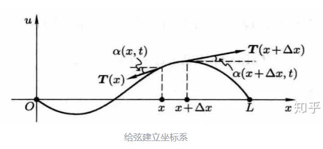

# 偏微分方程

## 经典数理方程

### 波动方程

考虑一根柔软的,拉紧的,具有弹性的一维细绳,在外力的作用下在平衡位置附近做微小振动,试研究绳子上各个点的振动规律

我们做出以下合理假设:

- 绳子是均匀的,密度在震动过程中是恒定值$\rho$
- 绳子在平衡位置附近做微小振动,绳子上各个点的位移很小且没有沿绳方向的速度
- 绳子是柔软的,不会因为弯曲而产生抗弯曲的张力
- 绳子内部张力处处相等,且不随时间变化
  

考察$[x,x+dx]$范围内的一段绳子,由于震动是微小振动,张力在y方向上的分量为:

$$
T \sin \alpha(x+dx)-T \sin \alpha (x)\approx T \tan \alpha(x+dx)-T\tan \alpha (x)=T \frac{\partial \tan \alpha(x)}{\partial x} dx
$$

对于切线与水平方向的夹角,有:

$$
\frac{\partial u}{\partial x}=\tan \alpha(x)
$$

所以法向上张力的分量写为:

$$
F=T \frac{\partial^2 u }{\partial x^2}dx
$$

根据动量定理:

$$
Fdt=mdv
$$

所以:

$$
T \frac{\partial ^2 u}{\partial x^2}dxdt=\rho ds \frac{\partial^2 u}{\partial t^2}dt
$$

注意到:

$$
ds=\sqrt{1+(\frac{\partial u}{\partial x})^2}dx\approx dx
$$

所以就得到:

$$
\left(T \frac{\partial^2 u}{\partial x^2}-\rho \frac{\partial^2   u}{\partial t^2}\right)dxdt=0
$$

于是就得到波动方程的普遍形式:

$$
\frac{\partial^2u}{\partial t^2}-a \frac{\partial^2 u}{\partial x^2}=0
$$

其中,$a=\frac{T}{\rho}$被称作张力密度,对于其他不同形式的波动,a有不同的物理意义.

如果细绳是在外力的作用下作强迫振动,那么动量定理需要做一定的修改,不妨设外力密度在振动方向的形式为$f_0(x,t)$

所以动量定理为:

$$
(F+f_0(x,t)dx)dt=mdv
$$

于是

$$
\left(T \frac{\partial^2 u}{\partial x^2}-\rho \frac{\partial^2   u}{\partial t^2}+f_0(x,t)\right)dxdt=0
$$

所以波动方程为:

$$
\frac{\partial^2u}{\partial t^2}-a \frac{\partial^2 u}{\partial x^2}=f(x,t)
$$

### 热传导方程

考虑一个均匀的各向同性的物体$G$,其内部有一个点热源,并且持续与周围的介质做热交换,试探究温度的分布以及其随时间的变化规律.

在导出热传导方程前,我们要先给出傅里叶定律,它是热传导常用的经验定律:

!!! info "傅里叶定律"

    单位时间内流过某一曲面的热量与这个曲面附近的温度梯度成正比:

    $$
    dQ=-\lambda \nabla T(x,y,z,t) dS dt
    $$

在物体内部取一个闭合曲面$S$,其内部所包围的区域记做$D$,那么,对于$D$内的任意一个小微元,在时间$[t_1,t_2]$内,其热量变化为

$$
dQ=C\rho (T(x,y,z,t_2)-T(x,y,z,t_1))dxdydz 
$$

其中$C$为物体的比热容,现在让这个时间间隔缩短:

$$
dQ=C\rho \frac{\partial T}{\partial t}dxdydzdt
$$

现在对整个$D$区域进行积分,那么经过曲面$S$的净热流量为:

$$
q_1=\frac{dQ_1}{dt}=\iiint_D C \frac{\partial T}{\partial t} \rho dxdydz
$$

这部分热流量由两个部分提供,一是物体内部的热源对这个区域的持续供热,另一个则是温度梯度带来的热传导:

温度梯度带来的热传导:

$$
q_2=\frac{dQ_2}{dt}=\iint_S \lambda \nabla T dS
$$

热源产生的热量,不妨设热源在坐标$(x,y,z,t)$产生的单位时间的热量强度为$F(x,y,z,t)$

$$
q_3=\frac{dQ_3}{dt}=\iiint_D F(x,y,z,t) dxdydz
$$

所以就有方程:

$$
q_2+q_3=q_1
$$

现在的目标就是$q_2$不好处理,要进行一定程度的化简,根据高斯散度公式:

$$
\int_S \vec{F}\cdot d\vec{S}=\int_V \vec{\nabla}\cdot \vec{F}dV
$$

注意到,我们这里的

$$
\mathbf{F}=\lambda \vec{\nabla}T
$$

所以$q_2$的表达式为:

$$
q_2=\iiint_D \lambda \nabla^2 T dV
$$

故会有:

$$
\iiint_D C \frac{\partial T}{\partial t} \rho-F(x,y,z,t)-\lambda \nabla^2T dV=0
$$

根据曲面的任意性,我们得到热传导偏微分方程:

$$
C \frac{\partial T}{\partial t} \rho-F(x,y,z,t)-\lambda \nabla^2T=0
$$

化简一下得到一般形式:

$$
\frac{\partial T}{\partial t}-a^2\nabla^2T=f(x,y,z,t)
$$

其中$f>0$代表有热源,反之就是有个冷源或者说叫热汇.

## 分离变量法

如果说,线性偏微分方程可以分离变量,那就能把偏微分方程转化成为常微分方程进行求解,所谓分离变量,是指:

$$
u(x,t)=X(x)T(t)
$$

以一维波动方程为例:

$$
u_{tt}-a^2u_{xx}=0
$$

其边界条件和初值条件为:

$$
\begin{aligned}
&u(0,t)=u(l,t) \\
&u(x,0)=\phi(x),u_t(x,0)=\psi(x)
\end{aligned}
$$

将分离变量的式子代入到偏微分方程:

$$
\frac{X''(x)}{X(x)}=\frac{1}{a^2}\frac{T''(t)}{T(t)}=\lambda
$$

因为左右变量不同,所以都是一个常数,记做$\lambda$

根据边界条件得到:

$$
\begin{aligned}
X(0)=0 \\
X(l)=0
\end{aligned}
$$

所以就能转化为常微分方程问题:

$$
\begin{cases}
X''(x)+\lambda X(x)=0 \\
X(0)=X(l)=0
\end{cases}
$$
