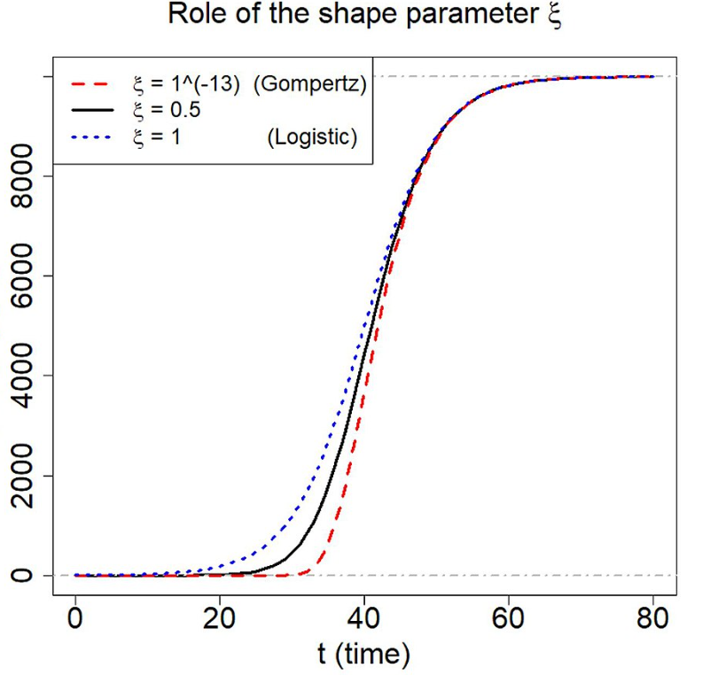
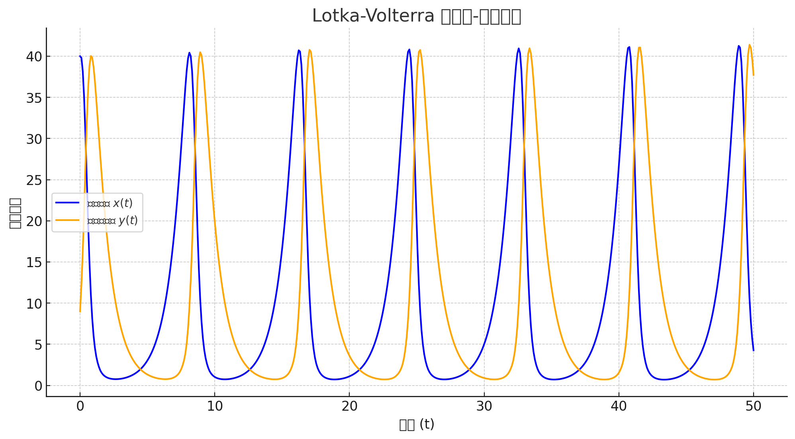

# 常微分方程

## 常见的微分方程

### 一阶线性微分方程:

其一般形式为:

$$
\frac{d y}{dx}+p(x)y=f(x)
$$

根据常数变易法得到的通解为:

$$
y=e^{-\int p(x) dx}\left[\int f(x)e^{\int p(x) dx}dx+C\right]
$$

### 伯努利方程

是上面的方程的变种:

$$
\frac{dy}{dx}+p(x)y=f(x)y^\alpha
$$

两边同除以$y^{\alpha}$次方得到:

$$
\frac{d y^{1-\alpha}}{dx} +(1-\alpha)p(x) y^{1-\alpha}=f(x)(1-\alpha)
$$

又变成了第一种形式

### 可降阶的微分方程

$$
y''=f(y,y')
$$

做变换$y'=p(y)$

$$
y''=\frac{dp}{dx}=\frac{dp}{dy}\frac{dy}{dx}=p\frac{dp}{dy}
$$

于是原方程变为:

$$
p \frac{dp}{dy}=f(y,p)
$$

### n阶常系数齐次线性微分方程

$$
y^{(n)}+p_1y^{(n-1)}+ \cdots +p_{n-1} y'+p_n y=0
$$

那么其特征方程为:

$$
r^n+p_1r^{n-1}+ \cdots +p_{n-1}r+p_n=0
$$

对特征方程解的情况进行分类讨论:

如果说特征方程有某个实数根$r$,那么这个实数根对应一个特解:

$$
y=e^{rx}
$$

如果说特征方程有某对共轭虚根$\alpha\pm i\beta$,那么就会对应两个特解:

$$
y=e^{\alpha x}\cos{\beta x},y=e^{\alpha x}\sin{\beta x}
$$

如果特征根$r$是$l$重实根,那么对应的原方程有$l$个特解:

$$
\begin{aligned}
y_1=e^{rx} \\
y_2=xe^{rx}\\
y_l=x^{l-1}e^{rx}
\end{aligned}
$$

同理,如果共轭虚根是$m$重的,那么会有2m个特解:

$$
\begin{aligned}
y_{2k-1}=x^{k-1}e^{\alpha x}\cos \beta x \\
y_{2k}=x^{k-1}e^{\alpha x} \sin \beta x
\end{aligned}
$$

最后,方程的总的通解就是所有特解的线性叠加

对于等式右侧不为0的非齐次常系数线性方程,可以采用所谓的通解特解法,即非齐次方程的通解为$y$,特解为$y^*$,而齐次方程的通解为$\bar{y}$,于是就有关系:

$$
y=y^*+\bar{y}
$$

关键就在于寻找非齐次方程的特解.

### 欧拉方程

形如

$$
x^n y^{(n)}+p_1x^{n-1}y^{(n-1)}+ \cdots +p_{n-1}x y' +p_n y =Q(x)
$$

的微分方程

对$p_{n-i} x^{i} y^{(i)} $

令$x=e^t,t=\ln x$,于是就得到:

$$
y^{(i)}=\frac{d y^{(i-1)}}{dx}=\frac{dy^{(i-1)}}{dt}\frac{1}{x}
$$

根据数学归纳法可以得到递推关系:

记

$$
D^k=\frac{d^k}{dt^k}
$$

所以:

$$
x^k y^{(k)}=D(D-1)\cdots(D-k+1)y
$$

再代入到原方程就得到一个以t为变量的常系数线性方程,这个方程的通解容易求,再代回x就得到原方程的通解.

### 积分变换法

面对一些非齐次或者非线性的微分方程,特征方程法就不太适用了,虽然有其他一些技巧性的方法,但是往往想不到,这个时候就可以采取对微分方程组两边取积分变换的办法,通常,积分变换后的象函数的表达式是好求的,剩下的工作就只需要对其进行反演得到原函数

#### 傅里叶变换

需要函数定义在实数域上,并且满足绝对可积条件:

$$
F(\omega)=\int_{-\infty}^{+\infty} f(x) e^{-i\omega x} dx
$$

#### 拉普拉斯变换

通常需要求的函数的自变量是时间:

$$
F(p)=\int_0^\infty f(t)e^{-pt} dt
$$

## 微分方程的稳定性

### 一阶方程 

$$
\frac{dx(t)}{dt} =f(x)
$$

$f(x)=0$的零点$x=x_0$显然是上述方程的解,它被称作方程的平衡点(奇点),也叫做方程的奇解.

!!! info "稳定性"

    从任意一个可能的初始条件出发,一阶微分方程的解都满足:

    $$
    \lim_{t \to \infty}x(t)=x_0
    $$

    那么就称平衡点$x_0$是稳定的

如何判别稳定性?主要分为直接法和间接法

直接法:

求解微分方程,然后求极限

间接法:

不直接求解微分方程,将函数$f(x)$在$x=x_0$处展开,于是得到近似线性方程:

$$
\frac{dx}{dt}=f'(x_0)(x-x_0)
$$

有以下结论:

!!! info "结论"

    $f'(x_0)<0$,平衡点对于两个方程都是稳定的

    $f'(x_0)>0$,平衡点对于两个方程都是不稳定的

### 二阶方程

$$
\begin{cases} \displaystyle \frac{dx}{dt}=f(x,y), &  \\ \displaystyle \frac{dy}{dt}=g(x,y) , &  \end{cases}
$$

那么,仿照上面的定义

$$
\begin{cases} f(x,y)=0, &  \\ g(x,y)=0, &  \end{cases}
$$

的解$(x_0,y_0)$为稳定点的定义是:

$$
\lim_{t\to \infty}x(t)=x_0,\quad \lim_{t \to \infty}y(t)=y_0
$$

如何判定上述系统的稳定性?直接求解微分方程似乎显得会比较的困难,先考虑如下的线性方程组:

$$
\begin{cases} \displaystyle \frac{dx}{dt}=a_{11}x+a_{12}y, &  \\ \displaystyle \frac{dy}{dt}=a_{21}x+a_{22}y, &  \end{cases}
$$

记它的系数矩阵为:

$$
A=
\begin{pmatrix}
    a_{11},a_{12}\\
    a_{21},a_{22}
\end{pmatrix}
$$

则特征方程为:

$$
\lambda^2-(a_{11}+a_{22})\lambda+a_{11}a_{22}-a_{12}a_{21}=0
$$

记$T=-(a_{11}+a_{22})$,$D=a_{11}a_{22}-a_{12}a_{21}$

关于其平衡稳定性有以下结论:

!!! tip

    $T>0,D>0$则平衡点稳定

    $T<0,D<0$则平衡点不稳定

对于非线性体系,首先做一个坐标变换,把奇点$(x_0,y_0)$平移到$(0,0)$

$$
\begin{aligned}
x'=x-x_0 \\
y'=y-y_0
\end{aligned}
$$

在(0,0)处做泰勒展开,得到常系数线性项和非齐次余项

$$
\begin{cases} \displaystyle \frac{dx'}{dt}=a_{11}x'+a_{12}y'+\phi(x',y'), &  \\\displaystyle \frac{dy'}{dt}=a_{21}x'+a_{22}y'+\psi(x',y') , &  \end{cases}
$$

可以略去后面的高次非线性余项,用前面的线性系数来近似判别平衡点的稳定性.

## 建模实例

### 猪的最佳销售时机

养猪的人希望自己养猪的利益能够得到最大化,随着猪年龄的增长,猪的体重增长逐渐变得缓慢,但是高体重的猪对饲料的需求一直处在高水平的状态,养殖者获得的利益可能反倒会下降,所以要考虑一个最佳售出时机,在猪体重到达一定程度后就要把猪卖掉,而不是越重越好.

当然,在现实生活中存在着一些限制条件,例如,售出的猪存在一定的体重限制,如果售出的猪体重过轻,收购站无利可图,就会拒绝收购.

- 参数设定:

    定义$x(t)$为一头猪在t时刻的体重,$y(t)$为猪在t时刻累计消耗的饲养费用,$x_s$为猪售出的最小体重,$C(x)$为单位重量的猪的售价.

- 模型假设:
  
  猪的相关性质可以视作静态参数,对决策不参与影响

  猪的体重会随着时间的增长而增长缓慢,反应猪增长速度的参数设为$p$,猪会存在最大生长体重,记做$X$

  饲养费用会随着体重的增长而提高,反应饲养费用随体重变化的参数记做$q$,存在最大饲养费用,记做$r$

  猪肉的单价随猪的年龄和体重变化不大,所以$C(x)$可以视作常数$C$

于是可以尝试建立微分方程组,通过添加校正因子的方式来体现生长速度的减慢:

$$
\begin{cases} 
\displaystyle \frac{dx}{dt}=p(1-\frac{x}{X}), &  \\ \displaystyle \frac{dy}{dt}=r-q(1-\frac{x}{X}), & \\
x(0)=x_0,\\
y(0)=0
\end{cases}
$$

先求解第一个微分方程,然后将结果代入第二个微分方程,这样就能得到$x(t)$和$y(t)$:

$$
\begin{aligned}
&x(t)=X-(X-x_0)e^{-\frac{p}{X}t} \\
&y(t)=rt-\frac{q}{p}(X-x_0)(1-e^{-\frac{p}{X}t})
\end{aligned}
$$

可行性分析:养猪能否获利:

$$
Cx_s-Cx_0\ge y(t_s)
$$

即养猪获得的利益累计要大于成本,不然养猪这个活动其实是亏本的,生小猪才是赚钱的.

最佳售出时机:即利益增长的速度恰好等于成本增长的速度,考虑下一时刻,利益增长的速度会降低,而成本增长的速度会持续增高,这个时候的净利益就会比上一时刻低,所以,当两者速度相同时,售出是最好的:

$$
\begin{cases} \displaystyle \frac{dx}{dt}=pe^{-\frac{p}{X}t}(1-\frac{x_0}{X}), &  \\\displaystyle \frac{dy}{dt}=r-qe^{-\frac{p}{X}t}(1-\frac{x_0}{X}) , &  \end{cases}
$$

平衡条件为:

$$
\frac{dx}{dt}=\frac{dy}{dt}
$$

得到最佳售出时机:

$$
t_0=\frac{X}{p}\ln \frac{(Cp+q)(X-x_0)}{rX}
$$

同时注意到售出时间要满足$t\ge t_s$这个要求

如果$t_0<t_s$,那么至少要在$t_s$时刻售出,因为利益速率和成本速率会随着时间增长进一步扩大差距,所以及时止损才是最重要的.

### 人口增长模型

这是一个非常经典的模型,最早的事马尔萨斯人口增长模型,他认为,单位时间内人口的增长量是和当下的人口数是成正比的:

$$
N(t+\Delta t)-N(t)=rN(t)\Delta t
$$

所以可以列出微分方程:

$$
\begin{cases} \displaystyle \frac{dN}{dt}=rN, &  \\ N(t_0)=N_0, &  \end{cases}
$$

这样解出来的是一个指数增长的函数:

$$
N(t)=N_0e^{r(t-t_0)}
$$

这实际上是反映了资源无限时候的人口增长模型,但是实际生活中,资源是有限的,并不能支撑起无限制的人口增长,人口增长的速率会逐渐降低,直到人数到了环境最大承载量$K$,所以就会有所谓的logistic增长,他在马尔萨斯的人口增长模型上进行了增长速率修正:

$$
\begin{cases} \displaystyle \frac{dN}{dt}=rN(1-\frac{N}{K}), &  \\ N(t_0)=N_0, &  \end{cases}
$$

解该微分方程得到:

$$
N(t)=\frac{K}{1+(\frac{K}{N_0}-1)e^{-r(t-t_0)}}
$$

可以绘制出所谓的S形增长曲线:

### 传染病模型

在一个封闭区域内存在着M只老鼠,其中N只患上了传染病,他们可以通过接触进行传染,问任意时刻内该区域有多少病老鼠?

定义t时刻健康老鼠和病老鼠的数量分别为$x,y$

$$
x+y=M 
$$

注意到,病老鼠数目增长的概率正比于病老鼠和正常老鼠碰面的概率,即我在鼠群中任意选择两只老鼠,两只老鼠恰好是一个生病一个没生病的概率:

$$
P=\frac{C_u^1C_v^1}{C_M^2}=\frac{2}{M(M-1)}uv
$$

所以建立微分方程:

$$
\begin{cases} \displaystyle \frac{d y}{dt}=\beta y(M-y), &  \\ y(0)=N, &  \end{cases}
$$

解此微分方程得到:

$$
y(t)=\frac{M}{1+(\frac{M}{N}-1)\exp(-\beta M t)}
$$

也是一个S形增长曲线.

现如今的传染病模型远比上述模型要来的复杂,因为要考虑易感人群,要考虑康复以及康复后的再感染,越是复杂的模型就越能够准确预测感染的人数.

### 耦合的微分方程

#### 远距离输电问题

当电流进行远距离输电的时候,由于电线存在电阻和电漏,各处的电流和电压都不尽相同,电阻即为单位电流上的电压降,电漏即为单位电压上的电流降.

我们把单位长度的电阻记做$R$,电漏记做$G$

所以可以列出小量分析:

$$
\begin{aligned}
v-(v+\Delta v)=R\Delta x i \\
i-(i+\Delta i)=R\Delta x v
\end{aligned}
$$

所以有耦合的微分方程组:

$$
\begin{cases} \displaystyle \frac{\partial i}{\partial x}+Gv=0, &  \\ \displaystyle \frac{\partial v}{\partial x}+Ri=0 , &  \end{cases}
$$

对其中一个微分方程求导然后代入另一个方程就可以得到纯的微分方程:

$$
\begin{cases} \displaystyle \frac{\partial^2 i}{\partial x^2}-RGi=0, &  \\ \displaystyle \frac{\partial^2 v}{\partial x^2}-RGv=0 , &  \end{cases}
$$

这个的解是显然的.

#### 山猫与山兔捕食问题

在一处山沟沟里生活着一群野兔和野猫,猫会捕食兔子,兔子多猫就多,猫一多吃的兔子多兔子又少了,兔子一少猫就少了.

从中进行分析,我们发现兔子的死亡率取决于猫的数量,而猫的出生率取决于兔子的数量,如果没有猫,兔子将会实现净增长,如果没有兔子,猫会实现净死亡.所以可以列出微分方程组:

$$
\begin{cases} \displaystyle \frac{dx}{dt}=k_1x-\mu xy, &  \\ \displaystyle \frac{dy}{dt}=vxy-k_2y, &  \end{cases}
$$

我们用交叉项来代表兔和猫碰面的概率,以此来刻画兔的死亡率以及猫的出生率,如果没有交叉项,猫和兔子将分别独立实现净死亡和净增长.

这里处理这个耦合微分方程的办法是引入稳态解$(x_0,y_0)$

其平衡点满足方程:

$$
\begin{cases} k_1x_0-\mu x_0y_0=0, &  \\vx_0y_0-k_2y_0=0 , &  \end{cases}
$$

解得:

$$
\begin{cases} x_0=\frac{k_2}{v}, &  \\y_0=\frac{k_1}{\mu} , &  \end{cases}
$$

下面考察这个平衡点的稳定性:

$$
\begin{cases} \displaystyle \frac{dx'}{dt}=k_1(x'+x_0)-\mu (x'+x_0)(y'+y_0), &  \\ \displaystyle \frac{dy'}{dt}=v(x'+x_0)(y'+y_0)-k_2(y'+y_0), &  \end{cases}
$$

将微分方程的右侧函数进行泰勒展开,并且只保留一阶项:

$$
\begin{cases} \displaystyle \frac{dx'}{dt}=(k_1-\mu y_0)x'-\mu x_0 y', &  \\ \displaystyle \frac{dy'}{dt}=vy_0x'+(vx_0-k_2)y', &  \end{cases}
$$

得到其系数矩阵为:

$$
A=
\begin{bmatrix}
    0,-\mu x_0\\
    vy_0,0
\end{bmatrix}
$$

求得其特征根为:

$$
\lambda_{1,2}=\pm \sqrt{k_1k_2}i
$$

得到(0,0)是不稳定中心,也就是说$(x_0,y_0)$不是一个稳定点,山猫和山兔的数量永远都不会达到平衡:

考虑他们在平衡点附近上下波动,不难猜测,这个波动应该是比较微小的:

$$
\begin{aligned}
x=x_0+\xi \\
y=y_0+\eta
\end{aligned}
$$

所以我们的原微分方程化简为:

$$
\begin{cases} \displaystyle \frac{d\xi}{dt}=-k_2 \frac{\mu}{v}\eta &  \\ \displaystyle \frac{d \eta}{dt}=k_1\frac{v}{\mu}\xi, &  \end{cases}
$$

再进行一次求导就可以解耦:

$$
\begin{cases} \displaystyle \frac{d^2 \xi}{dt^2}+k_1k_2\xi=0, &  \\\displaystyle \frac{d^2\eta}{dt^2}+k_1k_2\eta=0 , &  \end{cases}
$$

这个微分方程是容易求解的.

