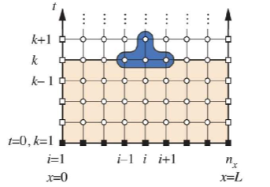
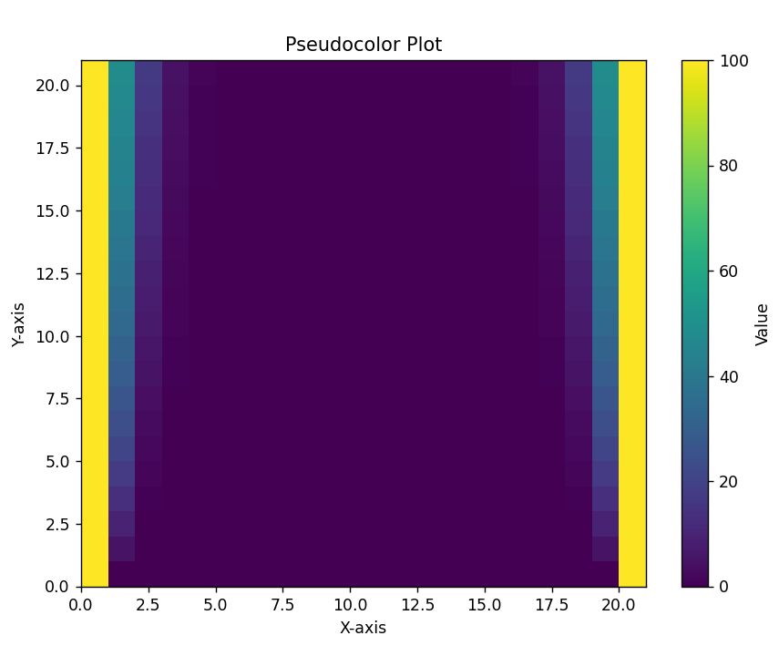
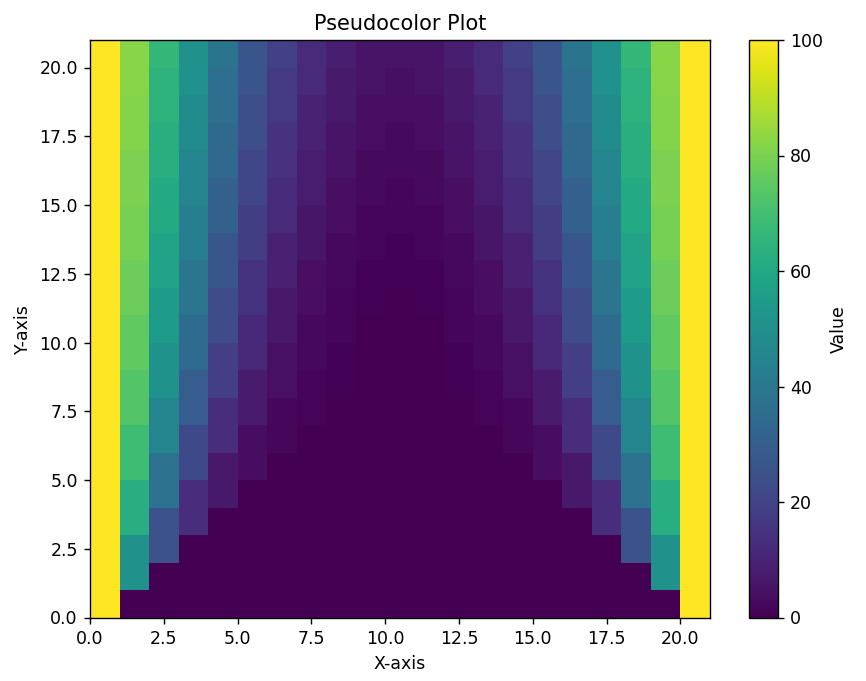

# 微分方程数值解

在之前的讨论中,我们已经知道常系数线性微分方程是比较容易求解的,但是,一旦需要求解非线性的微分方程,我们很多时候都是无能为力,要么是这个微分方程及其难以求解,要么就是这个微分方程干脆没有通解,所以,数值方法就成为我们分析微分方程的一个重要的手段,它不追求求出一个通解,而是采用迭代的手段求出某个值的近似数值解,即我输入一个自变量的值,可以返回给我一个对因变量值的估计值.

## 欧拉方法

考虑一个初值问题的常微分方程:

$$
\begin{cases} \displaystyle \frac{dy}{dx}=f(x,y), &  \\ y(a)=y_0, &  \end{cases}
$$

我们的想法是,采用差分的办法代替微分,不妨设我们要研究的自变量区域为$[a,b]$,把这个区域划分为$N$个部分:

$$
a=x_0\le x_1\le \cdots\le x_N=b
$$

步长为:

$$
h=x_{i+1}-x_i=\frac{b-a}{N}
$$

然后我们用向前差商估计某个点处的导数值:

$$
\frac{y(x_{n+1})-y(x_n)}{h}\approx y'(x_n)=f(x_n,y(x_n))
$$

于是就得到:

$$
y(x_{n+1})\approx y(x_{n})+hf(x_n,y(x_n))
$$

我们知道$y(a)=y_0$,根据这个初值条件迭代可以得到所有的估计值,将$y(x_n)$的估计值写做$y_{n}$,所以就得到近似后的结果:

$$
\begin{cases} y_{n+1}=y_n+hf(x_n,y_n), &  \\ y_0=y(a), &  \end{cases}
$$

这样就完成了对微分方程的近似,接下来,一个是可以尝试去求解上述差分方程,另一个则是我们采用迭代的策略得到一系列的离散点,可以直接使用这一系列点,也可以尝试去进行插值和拟合.

如果说采用向后差分,那么近似公式就为:

$$
\begin{cases} y_{n+1}=y_n+hf(x_{n+1},y_{n+1}), &  \\y_0=y(a) , &  \end{cases}
$$

这个时候我们发现,递推公式不能直接使用了,通常采用所谓试差的方式去计算$y_{n+1}$,假如已知的是$(x_n,y_n)$,我们先用$y_n$估计一下$y_{n+1}$:

$$
y_{n+1}^{(0)}=y_n+hf(x_n,y_n)
$$

然后把这个估计值继续往递推公式里面去代入,直到结果没有太大的改变

$$
\begin{aligned}
&y_{n+1}^{(1)}=y_n+hf(x_n,y_{n+1}^{(0)}) \\
&\vdots\\
&y_{n+1}^{(k)}=y_n+hf(x_n,y_{n+1}^{(k-1)})
\end{aligned}
$$

### 误差估计

显然,上述的每一步近似都会带有一定的误差,如何对上面的误差进行一定的估计?

假设点$(x_n,y_n)$是没有误差的,那么:

$$
y_{n+1}=y(x_{n})+hf(x_n,y_n)
$$

定义局部截断误差为:

$$
y(x_{n+1})-y_{n+1}
$$

在$x=x_n$处进行泰勒展开:

$$
y(x_{n+1})=y(x_n)+y'(x_n)h+\frac{h^2}{2}y''(x_n)+O(h^2)
$$

所以:

$$
y(x_{n+1})-y_{n+1}=\frac{h^2}{2}y''(x_n)+O(h^2) \propto h^2
$$

所以说,欧拉方法有所谓的二阶截断误差

### 改进的欧拉方法

注意到:

$$
y(x_{n+1})-y(x_{n})=\int_{x_n}^{x_{n+1}} y'(x) dx=\int_{x_n}^{x_{n+1}} f(x,y) dx
$$

如果使用矩形进行数值积分,就是我们之前使用的欧拉方法,为了减少误差,这次使用梯形进行数值积分,与此同时,估计值的记号和之前一致:

$$
y_{n+1}-y_n=\frac{h}{2}(f(x_{n+1},y_{n+1})+f(x_n,y_n))
$$

注意到这里的$y_n$也不是显式的,所以也要进行迭代试差:

$$
\begin{cases} 
y_{n+1}^{(0)}=y_n+\frac{h}{2}(f(x_{n+1},y_{n})+f(x_n,y_n)), &  \\
y_{n+1}^{(1)}=y_n+\frac{h}{2}(f(x^{(0)}_{n+1},y_{n+1}^{(0)})+f(x_n,y_n)), &\\
\vdots  \\
y_{n+1}^{(k)}=y_n+\frac{h}{2}(f(x^{(k-1)}_{n+1},y_{n+1}^{(k-1)})+f(x_n,y_n)),
\end{cases}
$$

## 龙格-库塔方法

根据拉格朗日中值定理:

$$
\frac{y(x_{n+1})-y(x_n)}{h}=y'(x_n+\theta h)=f(x_n+\theta h,y(x_n+\theta h))
$$

不难看出,所谓的近似就是对平均斜率$y'(\theta h+x_n)$的估计,普通的欧拉方法使用的是左端点的斜率来估计他,改进了之后的方法就是使用两个端点斜率的平均值来估计他.

所以,龙格-库塔方法的思想就是,在区间内尽可能多取几个点,然后用这几个点的斜率来估计总的平均斜率.

### 二阶龙格-库塔方法

二阶就是取两个点去估计,其中一个点是左端点,另一个就是区间内取的一个点:

$$
\begin{cases}
y_{n+1} = y_n + h (\lambda_1 k_1 + \lambda_2 k_2) \\
k_1 = f(x_n, y_n) \\
k_2 = f(x_n + \alpha h, y_n + \beta h k_1), \quad 0 < \alpha, \beta < 1
\end{cases}
$$

其中,可以证明,当这些参数满足下列关系的时候,其阶段误差最小:

\[
\lambda_1 + \lambda_2 = 1, \quad \lambda_2 \alpha = \frac{1}{2}, \quad \frac{\beta}{\alpha} = 1
\]

### 4阶龙格-库塔方法

4阶龙格库塔方法又称RK方法,比起二阶他多取了两个点,显然精度会更高:

$$
\begin{align*}
\begin{cases}
y_{n+1} = y_n + h (\lambda_1 k_1 + \lambda_2 k_2 + \lambda_3 k_3 + \lambda_4 k_4) \\
k_1 = f(x_n, y_n) \\
k_2 = f(x_n + \alpha_1 h, y_n + \beta_1 h k_1) \\
k_3 = f(x_n + \alpha_2 h, y_n + \beta_2 h k_1 + \beta_3 h k_2) \\
k_4 = f(x_n + \alpha_3 h, y_n + \beta_4 h k_1 + \beta_5 h k_2 + \beta_6 h k_3)
\end{cases}
\end{align*}
$$

可以调整这些参数使得截断误差尽可能的小,所以这些参数会有限制关系,同理,我们也能够给出一组比较简单的参数满足这个关系,其具体形式如下:

$$
\begin{align*}
\begin{cases}
y_{n+1} = y_n + \frac{h}{6} (k_1 + 2k_2 + 2k_3 + k_4) \\
k_1 = f(x_n, y_n) \\
k_2 = f\left(x_n + \frac{h}{2}, y_n + \frac{h k_1}{2}\right) \\
k_3 = f\left(x_n + \frac{h}{2}, y_n + \frac{h k_2}{2}\right) \\
k_4 = f(x_n + h, y_n + h k_3)
\end{cases}
\end{align*}
$$


## 一阶微分方程组:

$$
\begin{cases}
    y'_i=f_i(x,y_1,y_2, \ldots ,y_m)\\
    y_{i}(a)=y_{i0},\quad i=1,2,\cdots,m
\end{cases}
$$

可以通过建立向量关系吧一阶微分方程组的初值问题转化成一阶微分方程的初值问题:

$$
\mathbf{y}=
\begin{pmatrix}
    y_1\\
    y_2\\
    \vdots\\
    y_m
\end{pmatrix}
$$

$$
f(x,\mathbf{y})=
\begin{pmatrix}
    f_1\\
    f_2\\
    \vdots\\
    f_m
\end{pmatrix}
$$

$$
\mathbf{y_0}=
\begin{pmatrix}
    y_{10}\\
    y_{20}\\
    \vdots\\
    y_{m0}
\end{pmatrix}
$$

所以一阶微分方程组就转变为:

$$
\begin{cases}
    \displaystyle \frac{d\mathbf{y}}{dx}=f(x,\mathbf{y})\\
    \mathbf{y_0}=\mathbf{y}(a)
\end{cases}
$$

由于自变量只有x,所以依旧可以采用之前的数值解的方法

## 高阶微分方程

$$
\begin{align*}
\begin{cases}
y^{(m)} = f(x, y, y', \ldots, y^{(m-1)})  \quad a \leq x \leq b \\
y(a) = y_0, \quad y'(a) = y_0^{(1)}, \quad \ldots, \quad y^{(m-1)}(a) = y_0^{(m-1)}
\end{cases}
\end{align*}
$$

做一个变量代换,把它转变成为一阶微分方程组,令$y_1=y$:

得到微分方程组:

$$
\begin{cases}
y'_1 = y_2 \\
y'_2 = y_3 \\
\vdots \\
y'_{m-1} = y_m \\
y'_m = f(x, y_1, \cdots, y_m)
\end{cases}
$$

其初值条件为:

$$
\begin{cases}
y_1(a) = y_0 \\
y_2(a) = y_0^{(1)} \\
\vdots \\
y_{m-1}(a) = y_0^{(m-2)} \\
y_m(a) = y_0^{(m-1)}
\end{cases}
$$

## python实现

以单摆的运动方程为例,当单摆不满足小角度近似的时候,其方程为:

$$
\ddot{\theta}=-\frac{g}{l} \sin \theta
$$

这是一个非线性的微分方程,我目前只能猜他的解,其解肯定为周期性,但是其周期应该与摆角有关且不初等,所以我们比较难处理,所以采用数值解法,定义角速度:

$$
\omega=\dot{\theta}
$$

所以我们就得到微分方程组:

$$
\begin{cases} \dot{\theta}=\omega, &  \\ \displaystyle \dot{\omega}=-\frac{g}{l} \sin \theta , &  \end{cases}
$$

求解器传递给函数的是一个因变量向量和自变量t,函数返回的是一个向量,也就是等式右侧的函数值向量

可以调用库求解:

```python
from scipy.integrate import solve_ivp
```

总的python代码如下

```python
import numpy as np
from scipy.integrate import solve_ivp
import matplotlib.pyplot as plt

from math import radians
# 常数:
g=9.81
l=1

# 定义微分方程

def F(t,Y):# 注意这里传递参数的时候一定是自变量在前
    theta=Y[0]
    omega=Y[1]

    dth_dt=omega
    dom_dt=-g/l*np.sin(theta)

    return [dth_dt,dom_dt]

y0 = [0, radians(10)]

# 时间区间
t_span = [0, 10]  # 根据实际时间区间设置
t_eval = np.linspace(t_span[0], t_span[1], 1000)

# 求解微分方程
sol = solve_ivp(F, t_span, y0, t_eval=t_eval)

# 绘图
plt.plot(sol.t, sol.y[0], label='theta(t)')
plt.plot(sol.t, sol.y[1], label='omega(t)')
plt.xlabel('Time t')
plt.ylabel('Solution')
plt.legend()
plt.show()
```

求解结果:


## 偏微分方程数值解

与常微分方程的有限差分法不同的是,偏微分方程存在许多个微分变量,所以不仅仅要在一维数轴上做划分,而是要在二维甚至高维空间上做划分,并且迭代的变量也会增多.

不妨设我们要求的微分方程的解为$u(x,t)$

在x轴上做划分,在$x_j$处进行泰勒展开:

$$
u(x_{j+1})=u(x_j)+(\frac{\partial u}{\partial x})_j\Delta x+\frac{1}{2}(\frac{\partial^2 u}{\partial x^2})_j\Delta x^2+O(\Delta x^2)
$$

略去截断误差,并且将函数值改为估计值,就得到向前差分的近似表达式:

$$
(\frac{\partial u}{\partial x})_j=\frac{u_{j+1}-u_j}{\Delta x}
$$

以此类推,还有向后差分形式:

$$
(\frac{\partial u}{\partial x})_j=\frac{u_{j}-u_{j-1}}{\Delta x}
$$

以及一阶中心差分:

$$
(\frac{\partial u}{\partial x})_j=\frac{u_{j+1}-u_{j-1}}{2\Delta x}
$$

### 一维对流方程

以一维对流方程为例:

$$
\frac{\partial \phi}{\partial t}+\alpha \frac{\partial \phi}{\partial x}=0
$$

初值条件为:

$$
\phi(x,0)=\varphi(x)
$$

首先要将空间进行离散化,以便于我们的有限差分的进行:



对x方向和t方向我们采用不同的差分手段,在x方向上采用一阶中心差分,在t方向上采用向前差分:

首先要在区域上进行网格划分:

$$
\begin{aligned}
x_i=x_0+i\Delta x \\
t_n=n\Delta t
\end{aligned}
$$

所以相应的差分形式为:

$$
(\frac{\partial \phi}{\partial t})^n_i=\frac{\phi_i^{n+1}-\phi^n_i}{\Delta t}
$$

$$
(\frac{\partial \phi}{\partial x})_i^n=\frac{\phi^n_{i+1}-\phi^n_{i-1}}{2\Delta x}
$$

带入到偏微分方程中得到差分方程:

$$
\begin{cases}
    \displaystyle \frac{\phi_i^{n+1}-\phi^n_i}{\Delta t}+\alpha \frac{\phi^n_{i+1}-\phi^n_{i-1}}{2\Delta x}=0\\
    \phi^0_j=\varphi(x_j),\quad i,j,n=1,2, \ldots ,N
\end{cases}
$$

### 一维热传导

考虑一根一维的铁棒,两端温度维持100℃,在t=0时刻开始向中间进行热传导,试求不同时间下铁棒的温度分布:

一维热传导方程为:

$$
\frac{\partial T}{\partial t}-\beta\frac{\partial^2 T}{\partial x^2}=0
$$

初值条件:

$$
\begin{aligned}
T(x,0)=0 \\
T(0,t)=100\\
T(l,T)=100
\end{aligned}
$$

对于二阶导数,我们考虑一阶向后差分为:

$$
\left(\frac{\partial T}{\partial x}\right)^n_i=\frac{T^n_i-T^n_{i-1}}{\Delta x}
$$

所以二阶中心差分为:

$$
\left(\frac{\partial^2 T}{\partial x^2}\right)^n_i=\frac{\left(\frac{\partial T}{\partial x}\right)^n_{i+1}-\left(\frac{\partial T}{\partial x}\right)^n_i}{\Delta x}=\frac{T^n_{i+1}+T^n_{i-1}-2T_{i}^n}{\Delta x^2}
$$

对时间维度,采用一阶向前差分:

$$
\left(\frac{\partial T}{\partial t}\right)_i^n=\frac{T^{n+1}_i-T^n_i}{\Delta t}
$$

所以得到递推关系:

$$
\frac{T^{n+1}_i-T^n_i}{\Delta t}-\beta \frac{T^n_{i+1}+T^n_{i-1}-2T_{i}^n}{\Delta x^2}=0
$$

整理一下就是:

$$
\begin{cases}
    T_i^{n+1}=T^n_i+\beta \frac{\Delta t}{\Delta x^2}(T^n_{i+1}+T^n_{i-1}-2T_{i}^n)\\
    T^0_j=0\\
    T^n_0=100\\
    T^n_N=100
\end{cases}
$$

编写程序来实现这个问题,首先把x和y的取值抽象成为一个个整数,简化问题,例如,t的范围是[0,2.5],x的范围是[0,10],那么就取一个矩阵,大小是25×100.下面我们简化问题,采用20×20的矩阵,并且可以观察不同的导热参数下热传导的变化情况:

```python
import numpy as np
import matplotlib.pyplot as plt


#热传导参数

b=0.5

# 确定步长:

N=20


# 定义一个二维数组,代表函数值

data=np.zeros((N+1,N+1))

for i in range(N+1):
    data[i][N]=100
    data[i][0]=100

for j in range(1,N):
    data[0][j]=0


for n in range(1,N+1):
    for i in range(1,N):
        data[n][i]=data[n-1][i]+b*(data[n-1][i+1]+data[n-1][i-1]-2*data[n-1][i])


# 创建伪彩色图
plt.figure(figsize=(8, 6))
plt.pcolormesh(data, cmap='viridis',shading='auto')
plt.colorbar(label='Value')
plt.title('Pseudocolor Plot')
plt.xlabel('X-axis')
plt.ylabel('Y-axis')
plt.show()

```



$$图1.\beta=0.05$$


$$图2.\beta=0.3$$



$$图3.\beta=0.5$$

从这几个图可以清晰看到β越大,传热越快,温度梯度的形成更加明显.